# 분류모형
- `데이터 분석`
    - 예측 prediction
        - 회귀분석
        - 분류
    - 클러스터링 clustering
        - 군집화
    - 모사 approximate
- `분류 classification` : 어떤 독립변수가 주어졌을 때 그 값과 가장 연관성이 큰 종속변수값(클래스, 카테고리, 범주형값)을 예측하는 문제
    - 어떤 표본 데이터가 주어졌을 때 그 표본이 어떤 카테고리, 어떤 클래스에 속하는지를 알아내는 것    
- `분류 모형의 종류`
- 확률적 모형
    - 확률론적 생성모형
        - LDA/QDA
        - 나이브베이즈
    - 확률론적 판별모형
        - 로지스틱 회귀
        - 의사결정 나무
- 판별함수 모형
    - 퍼셉트론
    - 서포트벡터머신
    - 인공지능

## 1. 분류모형의 종류

### 1-1. 확률적 모형
- `확률적 모형 Probabilistic Model` : 주어진 데이터(conditionally)에 대해 각 카테고리 또는 클래스가 정답일 조건부확률(conditional probability)를 계산하는 방법
- `확률적 모형의 종류` : 조건부확률을 계산하는 방법 2가지
    - **확률적 판별모형 (Probabilistic Discriminative Model)**
        - **직접 조건부확률 함수의 모양을 추정한다.**
        - LDA/QDA(Quadratic Discriminant Analysis)
        - 나이브베이즈(Naive Bayese)
    - **확률적 생성모형 (Probabilistic Generative Model)**
        - **베이즈정리를 사용하여 간접적으로 조건부확률을 구한다.**
        - 로지스틱 회귀(Logistic Regression)
        - 의사결정나무 (Decision Tree)
- `확률적 모형의 클래스 예측 과정`
    - 1) 출력변수 y가 K개의 클래스를 갖는다고 가정한다.
    - 2) 입력변수 x가 주어졌을 때 y가 클래스 k가 될 조건부 확률을 모두 계산한다.(K번 계산)
        - $P_1 = P(y=1 | x),\; P_2 = P(y=2 | x),\cdots,\; P_K = P(y=k | x)$
    - 3) K계의 조건부확률 중에서 가장 확률이 큰 클래스를 선택한다.
        - $\hat{y} = \arg \underset{k}{max} P(y=k | x)$
- `scikit-learn 패키지` : 조건부확률을 사용하는 분류모형은 모두 두 메서드를 지원한다.
    - predict_proba() : 조건부확률 계산
    - predict_log_proba() : 조건부확률의 로그값 계산 (미세한 차이를 크게 확대해주는 효과)


### 1-2. 판별함수 모형
- `판별함수 모형 Discriminant Function Model` : 주어진 데이터를 카테고리에 따라 서로 다른 영역으로 나누는 경계면(decision boundary, boundary plane)을 찾고, 이 경계면으로부터 주어진 데이터가 어느 위치에 있는지를 계산하는 판별함수를 이용하는 방법
    - 경계면을 찾고, 판별함수를 사용하여 데이터의 위치를 계산한다.
    - 동일한 클래스가 모여 있는 영역과 그 영역을 나누는 경계면을 정의하는 것
- `판별함수의 종류`
    - **퍼셉트론(Perceptron)**
    - **서포트벡터머신(Suport Vector Machine, SVM)**
    - **인공지능(Artificial Intelligence, AI)**
- `판별함수 모형의 원리`
    - 경계면 정의 : 경계면으로부터 데이터의 거리를 계산하는 함수 f(x)인 **판별함수(discriminant function)** 로 정의 된다.
    - 판별함수의 값의 부호에 따라서 클래스가 나뉘어진다.
        - 판별 경계선 : $f(x) = 0$
        - 클래스 1 : f(x) > 0
        - 클래스 0 : f(x) < 0 
        
### 1-3. 다중 클래스 분류
- **확률적 모형**은 클래스가 3개 이상인 다중 클래스 문제도 풀 수 있다.
    - 여러개의 클래스에 대한 조건부확률을 계산하고 가장 큰 확률의 클래스를 선택 
- 그러나 **판별함수 모형**은 종속변수의 클래스가 2개인 이진(Binary class)분류 문제만 풀 수 있다.
    - 이러한 경우 OvO(One-Vs-One)방법이나 OvR(One-vs-the-Rest)방법 등을 이용하여 여러개의 이진클래스 분류 문제로 변환해서 풀 수 있다. 
    
### 1-4. OvO 방법
- `OvO one-vs-one` : K개의 클래스가 존재하는 경우 이 중에서 2개의 클래스 조합을 선택하여 이진분류 문제를 풀고, 여러개의 예측 클래스 중에서 가장 많이 나온 클래스를 선택하는 방식.
    - K(K-1) / 2 개의 이진 클래스 조합이 생긴다.
    - K=5이면 5(4) / 2 = 10번의 조합
    - K=50이면 50(49) / 2 = 1225번의 조합
- 선택받은 횟수로 선택하면 같은 횟수의 경우도 생길 수 있다.
- 따라서 각 클래스가 얻은 조건부확률값을 모두 더한 값을 비교하여 가장 큰 조건부 확률 총합을 가진 클래스를 선택한다.
- **클래스의 갯수가 많아지면 실행해야할 이진분류문제가 너무 많아진다.**

### 1-5. OvR 방법
- `OvR one-vs-the-rest` : K개의 클래스가 존재하는 경우 각각의 클래스에 대해 표본이 속하는지 속하지 않는지에 대한 이진분류문제를 계산한다.
    - OvO와 달리 클래스의 갯수만큼 이진분류문제를 풀면 된다.
    - 판별 결과의 수가 동일한 경우가 발생하므로, 각 클래스별 조건부확률값의 총합을 비교하여 가장 큰 확률값을 가진 클래스를 선택한다.
- x가 클래스 1에 속할 조건부 확률 : $P(y=1|x)$
- x가 클래스 1에 속하지 않을 조건부 확률 : $1 - P(y=1|x)$
    - k의 갯수 만큼 계산하면 된다. 반대인 경우는 1에서 빼면 되므로.

## 2. 확률론적 생성모형과 판별모형

### 2-1. 생성모형
- `생성모형의 조건부확률 계산방식` : 베이즈정리를 사용한 조건부확률기반 모형
- 1) 각 클래스 별 특징 데이터의 확률분포 P(x | y=k)를 추정한다.
    - 가능도(likelihood)를 구하는 것
    - y=k가 사실일 때, x일 확률
    - 베이즈정리의 가능도가 된다.
- 2) 베이즈정리를 사용하여 P(y=k | x)를 계산한다.
    - $P(y=k | x) = \dfrac{P(x|y=k)P(y=k)}{P(x)}$
    - 가능도는 1)에서 추정함.
    - 정규화 상수인 P(x)는 전체확률의 법칙을 사용하여 계산한다.
- 3) 전체확률의 법칙을 사용하여 P(x)를 계산한다.
    - $P(x) = \sum_{k=1}^{K} P(x|y=k)P(y=k)$
    - 모든 k에 대하여 계산한다.
- `장점`
    - 새로운 특징 데이터만으로도 아웃라이어를 판단할 수 있다.
    - 아웃라이어 : 잔차가 큰 데이터
- `단점`
    - 클래스가 많을 경우 모든 클래스에 대한 P(x|y=k) 조건부확률을 추정해야한다.
    - 최종적으로 사용하지 않을 확률분포를 계산하는 양이 너무 많다. 
    
### 2-2. 판별모형_
- `판별모형 probabilistic discriminative model` : 조건부 확률분포의 모양을 추정하는 방식
    - 조건부확률(x 데이터가 주어진 경우 클래스가 정답일 확률)이 x에 대한 함수로 표시될 수 있다고 가정하고 이 함수를 직접 찾아내는 방식
    - $p(y=k | x) = f(x)$
    - $0 \leq f(x) \leq1$

## 2-3. 확률론적 생성모형 : QDA
- `QDA Quadratic Discriminant Analysis` : 조건부확률 기반 생성모형(generative model)의 한 방법
- `scikit-learn`
    - **from sklearn.discriminant_analysis import QuadraticDiscriminantAnalysis**

### 1) 학습데이터 생성 및 산점도 그리기
- 클래스가 2개
    - y=0
    - y=1
- 3개씩 이루어진 두 클래스가 서로 대칭을 이루고 있는 분포    

```python
X = np.array([[-1, -1], [-2, -1], [-3, -2], [1, 1], [2, 1], [3, 2]])
X

>>> print

array([[-1, -1],
       [-2, -1],
       [-3, -2],
       [ 1,  1],
       [ 2,  1],
       [ 3,  2]])

y = np.array([0, 0, 0, 1, 1, 1])
y

>>> print

array([0, 0, 0, 1, 1, 1])
```

- 산점도

```python
%matplotlib inline

plt.figure(figsize=(8, 6))
plt.scatter(X[:3, 0], X[:3, 1], c="k", s=100,
            edgecolor="k", linewidth=2, label="y=0")
plt.scatter(X[3:, 0], X[3:, 1], c="w", s=100,
           edgecolor="k", linewidth=2, label="y=1")
plt.title("학습용 데이터")
plt.xlabel("x1")
plt.ylabel("x2")
plt.legend()
plt.show() ;
```
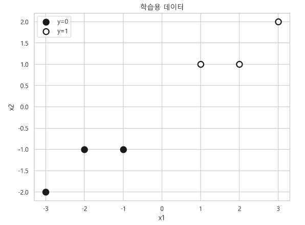

- 배열 인덱싱 모양

```python
X[:3], X[:3, 0]

>>> print

(array([[-1, -1],
        [-2, -1],
        [-3, -2]]),
 array([-1, -2, -3]))
```

### 2) QDA model 생성
- scikit-learn의 QDA 패키지 임포트
- 모수추정 : fitting

```python
from sklearn.discriminant_analysis import QuadraticDiscriminantAnalysis

qda_model = QuadraticDiscriminantAnalysis().fit(X, y)
qda_model

>>> print

QuadraticDiscriminantAnalysis()
```

### 3) QDA model로 조건부확률 계산
- 새로운 데이터 x가 추가된 후 y=0의 조건부확률
    - $P(y=0 | x_{new})$
- 새로운 데이터 x가 추가된 후 y=1의 조건부확률
    - $P(y=1 | x_{new})$
- 새로운 데이터가 두 데이터 클래스의 정중앙에 있다면 조건부확률은 각각 0.5가 된다.
    - **데이터가 어느 클래스에 속할지 알 수 없다는 의미**

- 새로운 데이터

```python
x_new = [[0, 0]]
x_new

>>> print

[[0, 0]]
```

- 조건부 확률값 추정

```python
p = qda_model.predict_proba(x_new)[0]

>>> print

array([0.5, 0.5])
```

#### 모형에 사용된 클래스 확인

```python
qda_model.classes_

>>> print

array([0, 1])
```

### 4) 새로운 데이터가 정중앙인 경우의 조건부 확률분포 그래프

```python
plt.figure(figsize=(8, 7))
plt.subplot(211)
plt.scatter(X[:3, 0], X[:3, 1], c="k", s=100, edgecolor="k", linewidth=2)
plt.scatter(X[3:, 0], X[3:, 1], c="w", s=100, edgecolor="k", linewidth=2)
plt.scatter(x_new[0][0], x_new[0][1], c="r", s=100,
            edgecolor="k", marker="x", linewidth=3)
plt.title("테스트 데이터")
plt.xlabel("x1")
plt.ylabel("x2")

plt.subplot(212)
plt.bar(qda_model.classes_, p)
plt.grid(False, axis="x")
#plt.gca().xaxis.grid(False)
plt.ylim(0, 0.6)
plt.title("조건부 확률분포")
plt.xticks(qda_model.classes_, ["$P(y=0|x_{new})$", "$P(y=1|x_{new})$"])
plt.yticks([0.0, 0.3, 0.5])
plt.ylabel("확률값")

plt.tight_layout()
plt.show() ;
```
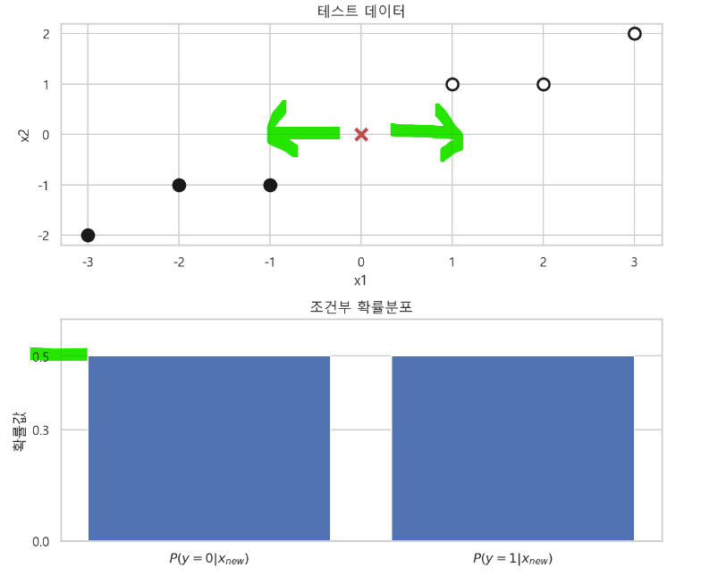


### 4) 새로운 데이터가 y=0에 가까운 경우 조건부 확률 분포
- $x= (-0.2, -0.1)$
    - $P(y=0 | x_{new})=0.69$
    - $P(y=1 | x_{new})=0.31$

```python
x_new = [[-0.2, -0.1]]
p = qda_model.predict_proba(x_new)[0]

plt.figure(figsize=(8, 6))
plt.subplot(211)
plt.scatter(X[:3, 0], X[:3, 1], c="k", s=100, edgecolor="k", linewidth=2)
plt.scatter(X[3:, 0], X[3:, 1], c="w", s=100, edgecolor="k", linewidth=2)
plt.scatter(x_new[0][0], x_new[0][1], c="r", marker="x", s=100, edgecolor="r")
plt.title("테스트 데이터")
plt.xlabel("x1")
plt.ylabel("x2")

plt.subplot(212)
plt.bar(qda_model.classes_, p)
plt.grid(False, axis="x")
plt.xticks(qda_model.classes_, ["$P(y=0 | x_{new})$", "$P(y=1 | x_{new})$"])
plt.yticks([0.0, 0.5, p[0], p[1]])
plt.ylabel("확률값")

plt.tight_layout()
plt.show() ;
```
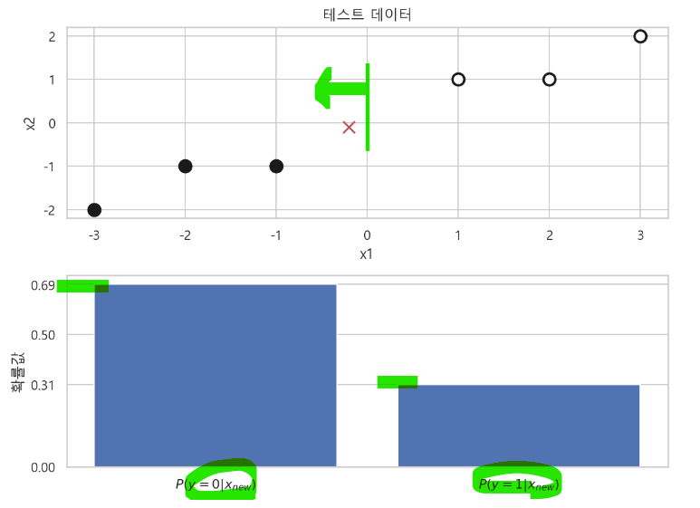

### 5) 새로운 데이터가 y=1 클래스에 더 가까운 경우 조건부 확률분포
- $x= (0.3, 0.2)$
    - $P(y=0 | x_{new})=0.832$
    - $P(y=1 | x_{new})=0.168$

```python
x_new = [[0.3, 0.2]]
p = qda_model.predict_proba(x_new)[0]

plt.figure(figsize=(8, 6))
plt.subplot(211)
plt.scatter(X[:3, 0], X[:3, 1], c="k", s=100, edgecolor="k", linewidth=2)
plt.scatter(X[3:, 0], X[3:, 1], c="w", s=100, edgecolor="k", linewidth=2)
plt.scatter(x_new[0][0], x_new[0][1], c="r", marker="x", s=100, edgecolor="r")
plt.title("테스트 데이터")
plt.xlabel("x1")
plt.ylabel("x2")

plt.subplot(212)
plt.bar(qda_model.classes_, p)
plt.grid(False, axis="x")
plt.title("조건부 확률분포")
plt.xticks(qda_model.classes_, ["$P(y=0 | x_{new})$", "$P(y=1 | x_{new})$"])
plt.yticks([0.0, 0.5, p[0], p[1]])

plt.tight_layout()
plt.show() ;
```
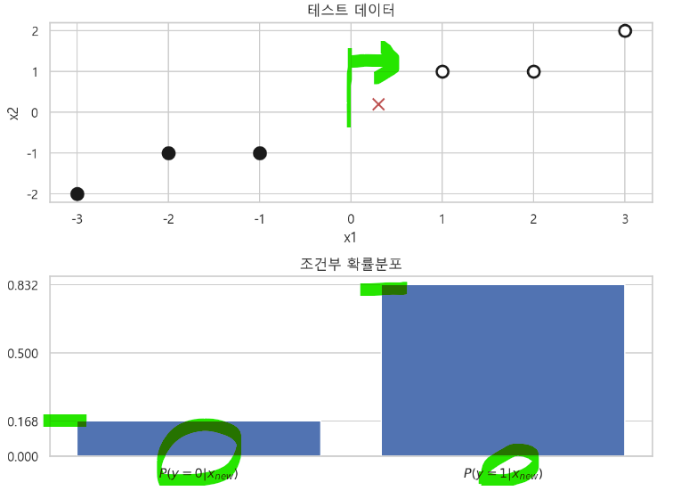

## 2-4. 확률론적 생성모형 : 나이브 베이지안 모형
- `나이브 베이지안 모형 Naive Bayesian model` : 확률적 생성모형(generative model)은 조건부확률을 기반으로 하는 확률적 모형의 하나이다.
    - **확률적 생성모형은 클래스가 3개 이상인 경우에도 바로 예측을 적용할 수 있다.**
- `scikit-learn`
    - **from sklearn.feature_extraction.text import TfidfVectorizer**
        - 전처리기
        - 텍스트 데이터를 정해진 크기의 실수 벡터로 변환해준다. 
        - 문서별 단어의 포함 갯수로 이루어진 벡터
    - **from sklearn.naive_bayes import MultinomialNB**
        - 나이브 베이즈 방법으로 분류문제를 예측한다.
    - **from sklearn.pipeline import Pipeline**
        - TfidfVectorizer와 MultinomialNB 객체를 합쳐주는 역할
        - 각 객체의 메서드 사용가능

### 1) 20뉴스 그룹 데이터 임포트

```python
from sklearn.datasets import fetch_20newsgroups

news = fetch_20newsgroups(subset="all")
print(news.DESCR)
```
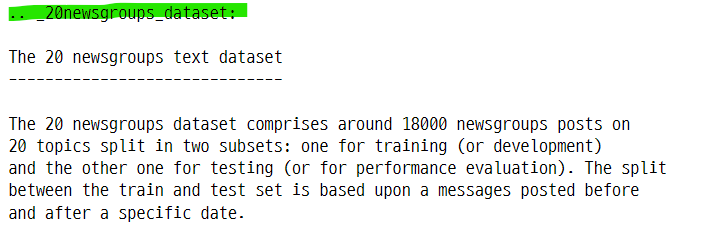

### 2) Pipeline 모델 생성

```python
from sklearn.naive_bayes import MultinomialNB
from sklearn.feature_extraction.text import TfidfVectorizer
from sklearn.pipeline import Pipeline

model = Pipeline([
    ("vect", TfidfVectorizer(stop_words="english")),
    ("nb", MultinomialNB())
])
model

>>> print

Pipeline(steps=[('vect', TfidfVectorizer(stop_words='english')),
                ('nb', MultinomialNB())])
```

### 3) 모수 추정
- fitting

```python
model.fit(news.data, news.target)

>>> print

Pipeline(steps=[('vect', TfidfVectorizer(stop_words='english')),
                ('nb', MultinomialNB())])
```

### 4) 예측 확인

```python
n = 1
x = news.data[n : n + 1]
x
```
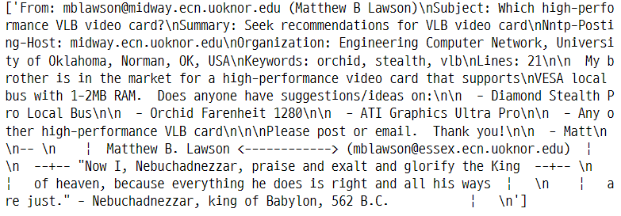

### 5) 모형이 예측한 클래스

```python
y = model.predict(x)[0]
y

>>> print

3
```

- 표본 데이터와 실제값, 예측값 확인

```python
print(x[0])
print("=" * 80)
print("실제 클래스 : ", news.target_names[news.target[n]])
print("예측 클래스 : ", news.target_names[y])
```


### 6) x텍스트가 20개의 클래스에 속할 조건부 확률분포
- 위 그래프 확률값
- 아래 그래프 로그변환값
    - **로그를 적용하면 작은 값을 크게 확대 해주는 장점이 있다.**
    - 3번 클래스의 확률값이 가장 크다.

#### 클래스의 갯수

```python
len(news.target_names)

>>> print

20
```

#### 모형에 사용된 클래스 확인

```python
model.classes_

>>> print

array([ 0,  1,  2,  3,  4,  5,  6,  7,  8,  9, 10, 11, 12, 13, 14, 15, 16,
       17, 18, 19])
```

### 7) x 텍스트가 클래스에 속할 확률
- model.predict_proba() : 조건부 확률
- model.predict_log_proba() : 로그를 적용한 조건부 확률
    - np.log()로 변환해준 것과 같은 값이다.

```python
proba = model.predict_proba(x)[0]
proba

>>> print

array([0.00311503, 0.04591611, 0.11607491, 0.66577532, 0.03642009,
       0.00721959, 0.02396944, 0.02538381, 0.00490874, 0.00849241,
       0.00698366, 0.00641387, 0.01245264, 0.00432959, 0.00626311,
       0.0073892 , 0.00613335, 0.00365252, 0.00622057, 0.00288605])
```

- 로그를 적용한 조건부 확률

```python
log_proba = model.predict_log_proba(x)[0]
log_proba

>>> print

array([-5.7715173 , -3.08093918, -2.15351956, -0.40680303, -3.31263482,
       -4.93095684, -3.73097555, -3.67364377, -5.31673723, -4.76858302,
       -4.96418265, -5.04929276, -4.38582224, -5.44228264, -5.07307868,
```

### 8) 조건부확률 분포
- 로그를 적용한 조건부 확률은 클래스별 차이가 크게 보인다.

```python
plt.figure(figsize=(8, 6))
plt.subplot(211)
plt.bar(model.classes_, model.predict_proba(x)[0])
plt.grid(False, axis="x")
plt.title("조건부 확률분포")
plt.xticks(model.classes_)
plt.ylabel("확률값")

plt.subplot(212)
plt.bar(model.classes_, model.predict_log_proba(x)[0])
plt.grid(False, axis="x")
plt.xticks(model.classes_)
plt.xlabel("카테고리(클래스)")
plt.ylabel("확률의 로그값")

plt.tight_layout()
plt.show() ;
```
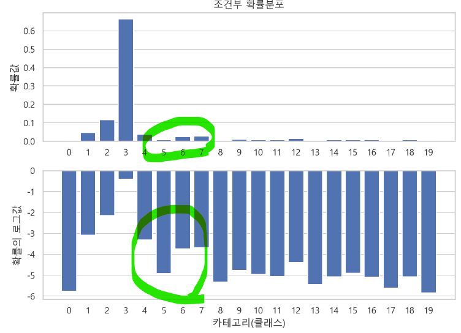


## 3. 확률론적 판별모형 : 로지스틱 회귀 모형
- 로지스틱 회귀 모형은 확률론적 판별 모형에 속한다.
- `scikit-learn` 
    - **form sklearn.linear_model import LogisticRegression**

### 1) 분류용 샘플 데이터 생성

```python
from sklearn.datasets import make_classification

x0, y = make_classification(n_features=1, n_redundant=0, n_informative=1,
                           n_clusters_per_class=1, random_state=4)
```

- X, y 의 모양과 종속값 확인

```python
x0.shape

>>> print

(100, 1)

y.shape

>>> print

(100,)

y

>>> print

array([0, 1, 0, 1, 0, 0, 1, 0, 1, 0, 0, 1, 0, 0, 1, 0, 1, 1, 1, 1, 0, 0,
       1, 0, 1, 1, 1, 1, 1, 0, 1, 1, 1, 0, 0, 0, 0, 0, 0, 1, 1, 1, 0, 0,
       0, 0, 1, 1, 1, 0, 1, 1, 1, 0, 1, 0, 0, 1, 1, 0, 0, 0, 1, 1, 1, 0,
       1, 0, 1, 1, 0, 0, 1, 0, 1, 0, 0, 1, 1, 1, 1, 0, 0, 0, 1, 0, 0, 1,
       1, 1, 1, 1, 0, 1, 1, 0, 0, 0, 0, 0])
```

- 산점도

```python
plt.figure(figsize=(7, 3))
plt.scatter(x0, y, c=y, s=100, marker="o", edgecolor="k", linewidth=1)
plt.ylim(-0.1, 1.1)
plt.show() ;
```
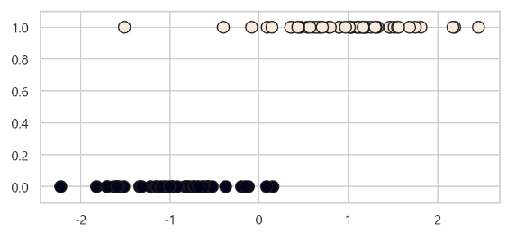

- 분포도

```python
plt.figure(figsize=(7, 5))
sns.distplot(x0[y==0], label="y=0")
sns.distplot(x0[y==1], label="y=1")
plt.legend()
plt.show() ;
```
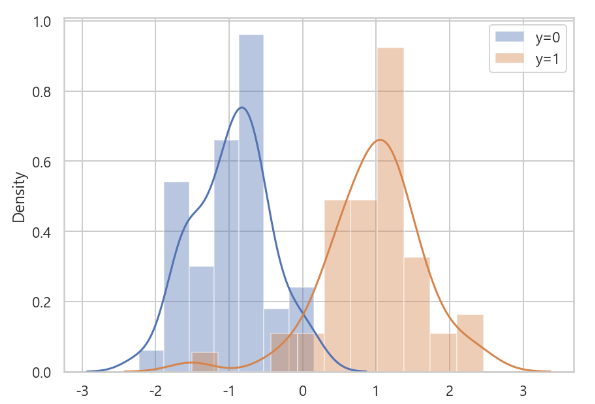

### 2) 로지스틱 회귀 모형 생성

```python
from sklearn.linear_model import LogisticRegression

model = LogisticRegression().fit(x0, y)
model

>>> print

LogisticRegression()
```

### 3) 로지스틱 함수 그래프 생성
- XX 생성
- model.predict_prob(XX) 로 yy 값 계산

```python
xx = np.linspace(-3, 3, 100)
xx.shape

>>> print

(100,)
```

- xx를 2차원 배열로 변환

```python
XX = xx[:, np.newaxis]
XX.shape

>>> print

(100, 1)
```

- 예측 조건부확률

```python
model.predict_proba(XX)

>>> print

array([[9.99810713e-01, 1.89286617e-04],
       [9.99774338e-01, 2.25661759e-04],
       [9.99730975e-01, 2.69025219e-04],
       [9.99679281e-01, 3.20718785e-04],
       [9.99617658e-01, 3.82341542e-04],
       [9.99544201e-01, 4.55799069e-04],
       [9.99456638e-01, 5.43361982e-04],
       [9.99352264e-01, 6.47735580e-04],
       [9.99227857e-01, 7.72142660e-04],
       [9.99079578e-01, 9.20421930e-04],
       [9.98902855e-01, 1.09714491e-03],
       [9.98692245e-01, 1.30775466e-03],
       [9.98441270e-01, 1.55873032e-03],
       ...])
```

- 조건부 확률에 해당하는 것은 2번째 컬럼의 데이터이다.

```python
prob = model.predict_proba(XX)[:, 1]
prob

>>> print

array([1.89286617e-04, 2.25661759e-04, 2.69025219e-04, 3.20718785e-04,
       3.82341542e-04, 4.55799069e-04, 5.43361982e-04, 6.47735580e-04,
       7.72142660e-04, 9.20421930e-04, 1.09714491e-03, 1.30775466e-03,
       1.55873032e-03, 1.85778198e-03, 2.21408125e-03, 2.63853360e-03,
       3.14409956e-03, 3.74617249e-03, 4.46302197e-03, 5.31631232e-03,
       6.33170663e-03, 7.53956717e-03, 8.97576247e-03, 1.06825907e-02,
       1.27098262e-02, 1.51158923e-02, 1.79691548e-02, 2.13493218e-02,
       ...])
```

### 4) 로지스틱 함수 계산식으로 직접 계산
- XX에 대한 yy값 계산
    - 로지스틱 그래프를 그리기 위함

#### 모수, 가중치

```python
model.coef_

>>> print

array([[2.90088584]])
```

#### 상수항, 오차(disturbance)

```python
model.intercept_

>>> print

array([0.13059863])
```

- 함수 공식으로 직접 조건부확률 계산

```python
calc_prob = 1.0 / (1 + np.exp(-model.coef_[0][0]*xx - model.intercept_[0]))
calc_prob

>>> print

array([1.89286617e-04, 2.25661759e-04, 2.69025219e-04, 3.20718785e-04,
       3.82341542e-04, 4.55799069e-04, 5.43361982e-04, 6.47735580e-04,
       7.72142660e-04, 9.20421930e-04, 1.09714491e-03, 1.30775466e-03,
       1.55873032e-03, 1.85778198e-03, 2.21408125e-03, 2.63853360e-03,
       3.14409956e-03, 3.74617249e-03, 4.46302197e-03, 5.31631232e-03,
       6.33170663e-03, 7.53956717e-03, 8.97576247e-03, 1.06825907e-02,
       ...)]
```

- 패키지로 구한 값과 직접 계산하여 구한 값 비교

```python
prob - calc_prob

>>> print

array([0., 0., 0., 0., 0., 0., 0., 0., 0., 0., 0., 0., 0., 0., 0., 0., 0.,
       0., 0., 0., 0., 0., 0., 0., 0., 0., 0., 0., 0., 0., 0., 0., 0., 0.,
       0., 0., 0., 0., 0., 0., 0., 0., 0., 0., 0., 0., 0., 0., 0., 0., 0.,
       0., 0., 0., 0., 0., 0., 0., 0., 0., 0., 0., 0., 0., 0., 0., 0., 0.,
       0., 0., 0., 0., 0., 0., 0., 0., 0., 0., 0., 0., 0., 0., 0., 0., 0.,
       0., 0., 0., 0., 0., 0., 0., 0., 0., 0., 0., 0., 0., 0., 0.])
```

### 5) 테스트 데이터 생성
- 새로운 표본 데이터 x
- 추가 된 데이터 x

```python
x_test = [[-0.2]]
x_test

>>> print

[[-0.2]]
```

### 6) 독립변수와 로지스틱 함수, 조건부 확률분포

```python
plt.figure(figsize=(8, 6))

plt.subplot(211)
plt.plot(XX, prob)
plt.scatter(x0, y, c=y, s=100, marker="o", edgecolor="k", linewidth=1.4)
plt.scatter(x_test[0], model.predict_proba(x_test)[0][1:], c="r", s=500,
           marker="x", lw=5)
plt.xlim(-3, 3)
plt.ylim(-.2, 1.2)
plt.xlabel("x")
plt.ylabel("y=0 또는 y=1일 확률")
plt.legend(["$P(y=1 | x_{test})$"])

## 새로운 표본 데이터 x에 대한 조건부확률 계산
p = model.predict_proba(x_test)[0]

plt.subplot(212)
plt.bar(model.classes_, p)
plt.xticks(model.classes_, ["$P(y=0 | x_{test})$", "$P(y=1 | x_{test})$"])
plt.yticks([0.0, p[0], p[1], 0.7])
plt.grid(False, axis="x")
plt.xlim(-1, 2)
plt.title("조건부 확률분포")
plt.xlabel("카테고리(클래스)")
plt.ylabel("확률값")

plt.tight_layout()
plt.show() ;
```

### 7) 새로운 표본 데이터에 대한 조건부 확률값
- model.predict_proba(x_test)
    - 클래스값별로 조건부확률이 반환된다.

```python
model.predict_proba(x_test)

>>> print

array([[0.61053902, 0.38946098]])
```

## 4. 판별함수 모형 : 퍼셉트론
- `퍼셉트론 perceptron` : 가장 단순한 형태의 판별함수 모형
    - 경계선이 직선이고 데이터 영역을 나눈다.

### 1) 붓꽃 데이터 임포트

```python
from sklearn.datasets import load_iris

iris = load_iris()
```

### 2) 클래스 0과 2만 선택 후 학습데이터 인덱싱
- np.in1d(ar1, ar2)
    - ar1과 같은 크기의 배열을 반환한다.
    - ar1 중에서 ar2에 있는(in) 것은 True, 없는 것은 False를 반환한다.

```python
idx = np.in1d(iris.target, [0, 2])
idx
```
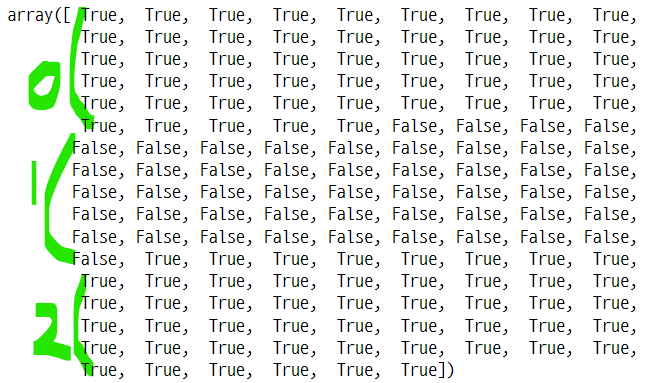

- 독립변수 중 꽃잎의 폭과 길이만 선택

```python
X = iris.data[idx, 0:2]
X

>>> print

array([[5.1, 3.5],
       [4.9, 3. ],
       [4.7, 3.2],
       [4.6, 3.1],
       [5. , 3.6],
       [5.4, 3.9],
       [4.6, 3.4],
       [5. , 3.4],
       [4.4, 2.9],
       ...])
```

- 종속변수 중 0과 2만 선택

```python
y = iris.target[idx]
y

>>> print

array([0, 0, 0, 0, 0, 0, 0, 0, 0, 0, 0, 0, 0, 0, 0, 0, 0, 0, 0, 0, 0, 0,
       0, 0, 0, 0, 0, 0, 0, 0, 0, 0, 0, 0, 0, 0, 0, 0, 0, 0, 0, 0, 0, 0,
       0, 0, 0, 0, 0, 0, 2, 2, 2, 2, 2, 2, 2, 2, 2, 2, 2, 2, 2, 2, 2, 2,
       2, 2, 2, 2, 2, 2, 2, 2, 2, 2, 2, 2, 2, 2, 2, 2, 2, 2, 2, 2, 2, 2,
       2, 2, 2, 2, 2, 2, 2, 2, 2, 2, 2, 2])
```

### 3) 퍼셉트론 모형 생성

```python
from sklearn.linear_model import Perceptron

model = Perceptron(max_iter=100, eta0=0.1, random_state=1).fit(X, y)
model

>>> print

Perceptron(eta0=0.1, max_iter=100, random_state=1)
```

### 4) 컨투어 플롯을 위한 3차원 데이터 생성

### 5) 독립변수 각각의 min, max 값을 각각 변수에 저장
- X축 데이터

```python
XX_min, XX_max = X[:, 0].min() - 1, X[:, 0].max() + 1
XX_min, XX_max

>>> print

(3.3, 8.9)
```

- y축 데이터

```python
YY_min, YY_max = X[:, 1].min() - 1, X[:, 1].max() + 1
YY_min, YY_max

>>> print

(1.2000000000000002, 5.4)
```

### 6) np.meshgrid() 사용하여 x, y 공간을 구성하는 행렬 생성
- 각각의 min, max를 범위로 하는 샘플 데이터 생성
- 1000X1000 크기의 행렬
    - XX 는 같은 행 반복 : 열 별로 데이터 값이 같다.
    - YY 는 같은 열 반복 : 행 별로 데이터 값이 같다.

```python
XX, YY = np.meshgrid(np.linspace(XX_min, XX_max, 1000),
                    np.linspace(YY_min, YY_max, 1000))

XX

>>> print

array([[3.3       , 3.30560561, 3.31121121, ..., 8.88878879, 8.89439439,
        8.9       ],
       [3.3       , 3.30560561, 3.31121121, ..., 8.88878879, 8.89439439,
        8.9       ],
	...])

YY

>>> print

array([[1.2       , 1.2       , 1.2       , ..., 1.2       , 1.2       ,
        1.2       ],
       [1.2042042 , 1.2042042 , 1.2042042 , ..., 1.2042042 , 1.2042042 ,
        1.2042042 ],
       [1.20840841, 1.20840841, 1.20840841, ..., 1.20840841, 1.20840841,
        1.20840841],
```

### 7) XX, YY를 하나의 벡터로 만들기
- ravel() : 모든 행, 열을 하나의 열벡터로 만들어 준다.
    - XX는 [1, 2, 3, 4, 1, 2, 3, 4]
    - YY는 [5, 5, 6, 6, 7, 7, 8, 8]
- `np.c_[x1, x2]` : x1과 x2를 하나의 배열로 합친다.
    - XX, YY가 각각 열벡터가 된다.

```python
XX.ravel()

>>> print

array([3.3       , 3.30560561, 3.31121121, ..., 8.88878879, 8.89439439,
       8.9       ])

YY.ravel()

>>> print

array([1.2, 1.2, 1.2, ..., 5.4, 5.4, 5.4])
```

- 두 벡터를 열로 갖는 행렬 만들기

```python
np.c_[XX.ravel(), YY.ravel()]

>>> print

array([[3.3       , 1.2       ],
       [3.30560561, 1.2       ],
       [3.31121121, 1.2       ],
       ...,
       [8.88878879, 5.4       ],
       [8.89439439, 5.4       ],
       [8.9       , 5.4       ]])
```

- `np.c_[a, b]` 테스트

```python
test_x = np.array([1, 2, 3, 4])
test_y = np.array([5, 6, 7, 8])
test_z = np.c_[test_x, test_y]
test_z

>>> print

array([[1, 5],
       [2, 6],
       [3, 7],
       [4, 8]])
```

### 8) 2개의 특징벡터를 넣고 예측
- 1개의 예측값 벡터를 반환해준다.
    - 붓꽃데이터의 종속값과 유사한 값
    - 즉 데이터가 어떤 클래스 인지 예측해서 반환한 것

- 반환된 예측값의 모양

```python
model.predict(np.c_[XX.ravel(), YY.ravel()]).shape

>>> print

(1000000,)
```

- 예측값 벡터를 XX의 모양으로 변환

```python
ZZ = model.predict(np.c_[XX.ravel(), YY.ravel()]).reshape(XX.shape)
ZZ

>>> print

array([[2, 2, 2, ..., 2, 2, 2],
       [2, 2, 2, ..., 2, 2, 2],
       [2, 2, 2, ..., 2, 2, 2],
       ...,
       [0, 0, 0, ..., 0, 0, 0],
       [0, 0, 0, ..., 0, 0, 0],
       [0, 0, 0, ..., 0, 0, 0]])
```

- ZZ의 모양

```python
ZZ.shape

>>> print

(1000, 1000)
```

### 9) 퍼셉트론의 판별영역 그래프

```python
plt.figure(figsize=(8, 6))
plt.contour(XX, YY, ZZ, color="k")
plt.scatter(X[:, 0], X[:, 1], c=y, s=30, edgecolor="k", lw=1)

## 새로운 표본 데이터
idx = [22, 36, 70, 80]
plt.scatter(X[idx, 0], X[idx, 1], c="r", s=100, alpha=0.5)
for i in idx :
    plt.annotate(i, xy=(X[i, 0], X[i, 1] + 0.1))

plt.grid(False)
plt.title("퍼셉트론의 판별영역")
plt.xlabel("x1")
plt.ylabel("x2")

plt.show() ;
```

### 10) 각 데이터의 판별함수 값 분포

```python
plt.figure(figsize=(8, 6))
plt.bar(range(len(idx)), model.decision_function(X[idx]))
plt.gca().xaxis.grid(False)
plt.title("각 데이터의 판별함수 값")
plt.xlabel("표본 번호")
plt.ylabel("판별함수값 f(x)")

plt.show() ;
```
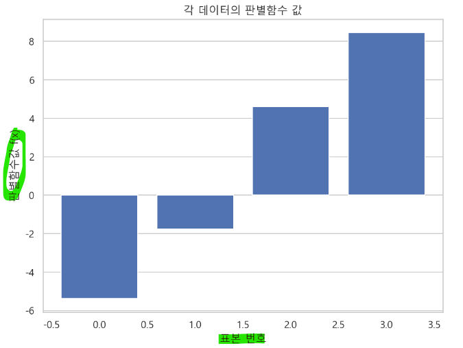

### 11) 판별함수 값을 출력하는 메서드

```python
model.decision_function(X[idx])

>>> print

array([-5.374, -1.77 ,  4.609,  8.454])
```

### 12) 3차원 데이터인 경우의 경계면
- `의사결정 하이퍼플레인(decision hyperplane)`

```python
from mpl_toolkits.mplot3d import Axes3D

iris = load_iris()
idx = np.logical_or(iris.target==1, iris.target==0)
X = iris.data[idx, :3]
y = iris.target[idx]

fig = plt.figure(figsize=(8, 6))

ax = Axes3D(fig, elev=17, azim=16)
ax.scatter(X[:, 0], X[:, 1], X[:, 2], c=y, s=100, marker="o", cmap=mpl.cm.jet)
ax.plot_surface(np.array([[4, 4], [7, 7]]), np.array([[2, 4.5], [2, 4.5]]),
               np.array([[2, 4], [2, 4]]), color="g", alpha=.3)

plt.title("3차원 특징데이터의 판별경계", y=1)
plt.xlabel("x")
plt.ylabel("y")
ax.set_zlabel("z")

plt.show() ;
```
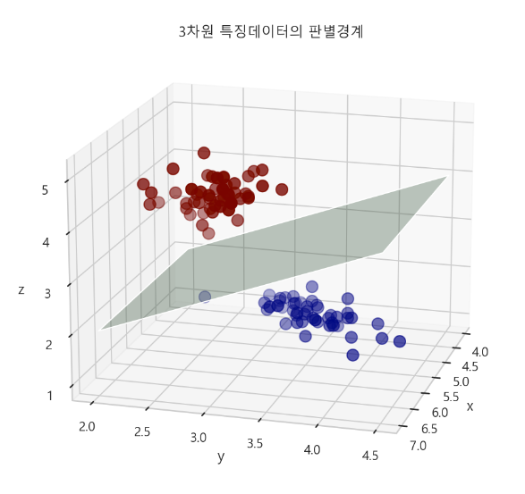

#### np.logical_or()
- 넘파이 배열의 데이터를 인덱싱하는 기능
   - 조건을 설정하고 조건에 해당하는 것들을 불리언 값으로 반환
   - 배열의 모양 그대로 인덱스에 불리언 값이 들어가 있다.
- np.in1d(x, [a, b]) 와 비슷한 기능이다.

```python
test = np.array(range(10))
test

>>> print

array([0, 1, 2, 3, 4, 5, 6, 7, 8, 9])

np.logical_or(test > 5, test < 3)

>>> print

array([ True,  True,  True, False, False, False,  True,  True,  True,
        True])
```

## 5. 판별함수 모형 : 커널 SVM
- `커널 SVM Kernel Support Vector Machine`
    - 복잡한 형태의 경계선을 생성할 수 있다.

### 1) 가상 데이터 생성

```python
xx, yy = np.meshgrid(np.linspace(-3, 3, 500),
                     np.linspace(-3, 3, 500))
```

### 2) 학습 데이터 생성
- 독립변수 데이터 생성

```python
np.random.seed(0)
X = np.random.randn(300, 2)
X.shape

>>> print

(300, 2)
```

- 종속변수 데이터 생성

```python
Y = np.logical_xor(X[:, 0] > 0, X[:, 1] > 0)
Y.shape

>>> print

(300,)
```

### 3) kernel SVM 모형 생성, 모수 추정

```python
from sklearn import svm

model = svm.NuSVC().fit(X, Y)
model

>>> print

NuSVC()
```

### 4) 판별함수로 가상 데이터(새로운 표본)의 판별함수값 계산

```python
Z = model.decision_function(np.c_[xx.ravel(), yy.ravel()])
Z = Z.reshape(xx.shape)
Z.shape

>>> print

(500, 500)
```

### 5) 컨투어 플롯으로 나타내기
- xx, yy의 min, max를 범위로 하는 영역

```python
%matplotlib inline

plt.figure(figsize=(8, 6))
plt.imshow(Z, interpolation="nearest",
           extent=(xx.min(), xx.max(), yy.min(), yy.max()), aspect="auto",
          origin="lower", cmap=plt.cm.PuOr_r)

plt.show() ;
```
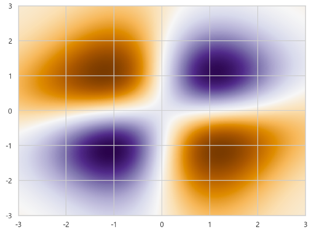

#### 영역위에 표본 데이터와 svm의 판별 경계선 나타내기

```python
plt.figure(figsize=(8, 6))

## x, y, z 영역 나타내기
plt.imshow(Z, interpolation="nearest",
          extent=(xx.min(), xx.max(), yy.min(), yy.max()), aspect="auto",
          origin="lower", cmap=plt.cm.PuOr_r)

## 등고선 그리기
contours = plt.contour(xx, yy, Z, levels=[0], linewidths=3)

## 학습데이터(기존데이터) 산점도
plt.scatter(X[:, 0], X[:, 1], c=Y, s=30, cmap=plt.cm.Paired)

## 검증데이터(새로운데이터) 생성
idx = [0, 20, 40, 60]
plt.scatter(X[idx, 0], X[idx, 1], c=Y[idx], s=200, alpha=0.6)
for i in idx :
    plt.annotate(i, xy=(X[i, 0], X[i, 1]+0.15), color="white")

## x, y 구간을 한번에 설정 해준다. : [xmin, xmax, ymin, ymax]
plt.axis([-3, 3, -3, 3])
plt.grid(False)
plt.xlabel("x1")
plt.ylabel("x2")
plt.title("커널 SVM의 판별영역")

plt.show() ;
```
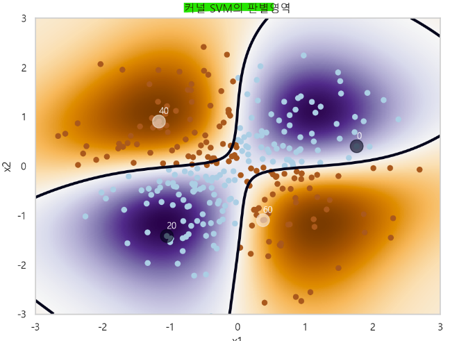

### 6) 검증 데이터의 판별함수 값 분포

```python
plt.figure(figsize=(8, 6))
plt.bar(range(len(idx)), model.decision_function(X[idx]))
plt.xticks(range(len(idx)), idx)
plt.grid(False, axis="x")
plt.title("각 데이터의 판별함수 값")
plt.xlabel("표본번호")
plt.ylabel("판별함수값 f(x)")
plt.show() ;
```
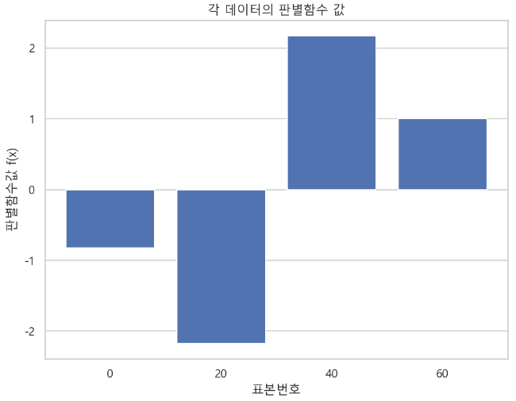


- 판별함수 값

```python
model.decision_function(X[idx])

>>> print

array([-0.82439517, -2.17194054,  2.172843  ,  0.99997993])
```
