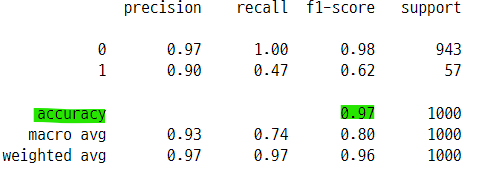

# 분류 성능평가
- 분류문제는 회귀분석과 다르게 다양한 성능평가 기준이 필요함

## 1. 사이킷런 성능평가 지표
- confusion_matrix(y_true, y_pred)
- accuracy_score(y_true, y_pred)
- precision_score(y_true, y_pred)
- recall_score(y_true, y_pred)
- fbeta_score(y_true, y_pred, beta)
- f1_score(y_true, y_pred)
- clssification_report(y_true, y_pred)
- roc_curve()
- auc

## 2. 분류결과표
- `분류결과표 Confusion Matrix` : target(종속값, 실제값, 목표값)의 원래 클래스와 모형으로 예측한 클래스가 일치하는 경우의 갯수를 계산하여 표로 나타내준다.
    - 행(row) : 정답인 클래스
    - 열(column) : 예측한 글래스

```
array([[2, 0, 0],
       [0, 1, 0],
       [1, 1, 1]], dtype=int64)
```
- 1 행 = 실제값이 0 : 예측값이 0인 것 2개, 예측값이 1인 것 0개, 예측값이 2인 것 0개
- 2 행 = 실제값이 1 : 예측값이 0인 것 0개, 예측값이 1인 것 1개, 예측값이 2인 것 0개
- 3 행 = 실제값이 2 : 예측값이 0인 것 1개, 예측값이 1인 것 1개, 예측값이 1인 것 1개

## 3. 이진 분류결과표
- `이진 분류결과표 Binary Confusion Matrix` : 클래스가 0과 1인 경우의 분류결과표
    - **0 = 양성 = Positive = 불량품 = 사기거래 = 암에 걸림**
    - **1 = 음성 = Negative = 정상품 = 정상거래 = 암에 안걸림**
    - positive와 negative 단어의 뜻과 무관하다. 0과 1을 구분하기 위한 명칭
- 종속값과 예측값(분류결과값)이 같으면 True, 다르면 Fasle    
- `실제 양성(0)`
    - 예측 양성(0) : True Positive : **TP**
    - 예측 음성(1) : False Negative : **FN**
- `실제 음성(1)`
    - 예측 양성(0) : False Positive : **FP**
    - 예측 음성(1) : True Negative : **TN**

### 3-1. 이진분류 시스템
- 이진 분류결과표를 기반으로 여러가지 예측 문제를 구성할 수 있다.
- 제품 제조공장에서 불량품과 정상품을 예측하는 문제
    - 불량품 = 양성 = Positive = 0
    - 정상품 = 음성 = Negative = 1
- 암에 걸린 환자를 예측하는 문제
    - 암에 걸린 환자 = 양성 = Positive = 0
    - 암에 걸리지 않은 환자 = 음성 = Negative = 1
- FDS(Fraud Detection System) : 정상거래와 사기거래를 예측하는 문제
    - 사기거래 = 양성 = Positive = 0
    - 정상거래 = 음성 = Negative = 1
- 스펨메일 필터링 : 정상메일과 스펨메일을 예측하는 문제
    - 스펨메일 = 양성 = Positive = 0
    - 정상메일 = 음성 = Negative = 1
- **사이킷런 패키지 등에서 성능지표의 표시기준이 Positive이므로 상황에 따라서 클래스 1을 Positive로 설정할 수도 있다.**


## 4. 평가점수
- 이진 분류평가표를 기반으로 하나의 평가점수를 계산하고 분류모형의 성능을 평가하는 지표로 사용할 수 있다.
- 갯수를 기반으로한 비율

### 4-1. 정확도
- `정확도 Accuracy` : 전체 샘플 중 맞게 예측한 샘플의 수의 비율
    - $accuracy = \dfrac{TP + TN}{TP + TN + FP + FN}$
    - 전체 예측값 중에서 실제 P를 P로, 실제 N을 N으로 예측한 것의 비율
- **정확도값이 높을 수록 좋은 모형이다.**
- 최적화의 목적함수로 사용된다.

### 4-2. 정밀도
- `정밀도 Precision` : 양성 클래스라고 예측한 샘플(표본 데이터) 중에서 실제 값이 양성 클래스인 것의 비율
    - $precision = \dfrac{TP}{TP + FP}$
    - 분류모형이 양성이라고 예측한 것의 갯수 중에서 실제값이 양성인 것의 비율
- **정밀도값이 높을 수록 좋은 모형이다.**    
- FDS 시스템에서 사기거래로 예측한 것 중에서 실제 사기 거래인 비율
- F-score의 계산에 사용된다.

### 4-3. 재현율
- `재현율 Recall` : 실제 양성 클래스인 표본 중에서 양성에 속한다고 출력한 표본의 수의 비율
    - $recall = \dfrac{TP}{TP + FN}$
    - 실제값이 양성인 것들 중에서 분류모형이 양성이라고 예측한 것의 비율
    
- **재현율값이 높을 수록 좋은 모형이다.**
- 실제 사기거래 중에서 사기 거래로 예측한 비율
- TPR(True Positive Rate), 민감도(sensitivity)라고도 함.
- ROC 커브에 사용 된다.

### 4-4. 위양성률
- `위양성률 Fall-Out` : 실제 음성인 클래스에 속하는 표본중에서 양성에 속한다고 출력한 표본의 비율
    - $fallout = \dfrac{FP}{FP + TN}$
    - 실제값이 1, 음성인 것들 중에서 분류모형이 0, 양성으로 예측한 것의 비율
- **위양성률값이 작을 수록 좋은 모형이다.**
- FDS 시스템에서 실제로는 정상 거래인데 사기 거래라고 예측한 것의 비율
- FPR(False Positive Rate), 1-위양성률=특이도(specificity)라고도 함.
- ROC 커브에 사용 된다.

### 4-5. F점수
- `F점수 F-score` : 정밀도(precision)와 재현율(recall)의 가중조화평균(weight harmonic average)값 이다.
    - $F_{\beta} = (1 + \beta^2)(precision \times recall) / (\beta^2 \cdot precision + recall)$
    - $\beta$ : 정밀도(precision)의 가중치
- `F-1 score`
    - $F_1 = 2 \cdot (precision \times recall) / (1 \cdot precision + recall)$
    - recall과 fallout이 어느 한쪽에 치우치지 않고 둘다 높은 값을 가질 수록 f1 score의 값도 커진다.
    
## 5. 다중 클래스 문제
- 클래스가 3개 이상인 경우
    - classification_report()로 정밀도, 재현율, F1score 값을 구할 수 있다.
- **각각의 클래스에 대해서 자신을 양성으로 다른 클래스를 음성으로 가정한 OvR 문제를 푸는 방식이다.**
    - OvR : 다중 클래스 문제에서 표본이 각 클래스에 속하는지 속하지 않는지 조건부확률을 구하는 방식
- 클래스별로 다른 평가점수가 나오게 되는데 macro, weighted, accuracy 등의 기준을 사용하여 하나로 합해준다.

## 6. ROC 커브
- `ROC 커브 Receiver Operator Characteristic` : 클래스별 판별 기준값(판별함수값 또는 예측값 등)의 변화에 따른 위양성률(fall-out)과 재현율(recall)의 변화를 시각화 한 것
    - fpr(위양성률)이 변할 때 tpr(재현율)의 변화를 그린 그래프
    - x축 : fpr
    - y축 : tpr
    - **직선에 가까울 수록 모형의 성능이 떨어진다고 볼 수 있다.**

### 6-1. 재현율과 위양성률의 관계
- 재현율(recall)과 위양성률(fall-out)은 양의 상관관계이다.
- **재현율을 높이기 위해서 기준값(threshold)을 낮추어 양성으로 판단 기준을 넓힌다.**
    - 이러한 경우 결과적으로 음성을 양성으로 판단되는 표본이 같이 증가한다.
    - 즉 TP와 FP 전체가 커지므로 재현율과 위양성률 값이 함께 커진다.
- **위양성률을 낮추기 위해 기준값(threshold)을 높여서 양성 판단 기준을 좁힌다.**
    - 이러한 경우 음성 판단을 받는 표본수가 늘어나게 된다.
    - 즉 FN과 TN 전체가 커지므로 위양성률과 재현율 값이 함께 작아진다.
    
### 6-2. 판별함수와 ROC 커브
- 모든 이진 분류모형은 판별 평면(decision boundary, boundary line, boundary plane)으로부터 표본 데이터의 거리를 계산하는 **판별함수(discriminant function) f(x)를 갖는다.**
- 이 판별함수 값이 음수이면 클래스를 0으로 예측하고, 양수이면 클래스를 1로 예측한다.
    - **f(x) < 0 : 클래스 = 0 (양성, 불량, 사기거래, 스펨메일)**
    - **f(x) > 0 : 클래스 = 1 (음성, 정상, 정상거래, 정상메일)**
- 즉 이진 분류모형의 판별함수의 값의 부호에 따라서 예측 클래스의 값이 결정된다.
- 판별함수 값 0이 클래스 판단 기준값(threshold)이 된다.
    - ROC 커브는 이 클래스 판별 기준값이 바뀔 때 판별 결과가 달라지는 모습을 나타낸 것이다.
- **사이킷런 패키지에서 만든 모델은 대부분 정확도(accuracy)를 최대화하는 모형이다.** 
    - 정확도, 정밀도, 재현율이 같은 모형이라고 해도 roc_curve에서는 성능이 달라진다.
    - thresholds가 변하는 것에 따라서 이진분류결과표가 달라지기 때문

#### 모형이 완벽하게 분류한 경우


#### 모형이 적당히 잘 분류한 경우


#### 모형이 분류를 잘 못한 경우


### 6-3. 판별함수값 반환 모델
- model.decision_function(X)
    - LogisgicRegression() : 로지스틱 회귀 모델
    - SVC() : 커널 서포트벡터머신
- model.predict_proba(X)[:, 1]
    - GaussianNB() : 가우시안 나이브베이즈 모델
    - DecsionTreeClassifier() : 의사결정나무 모델

### 6-4. Precision Recall Curve
- `정밀도와 재현율 커브 Precision Recall Curve` : 정밀도와 재현을 함께 나타낸 그래프
- `from sklearn.metrics import precision_recall_curve`
    - precision_recall_curve(y_test, y_pred_test)


## 7. AUC
- `AUC Area Under the Curve` : ROC Curve의 면적
    - 위양성률이 같을 경우 재현율이 클 수록 면적이 1에 가깝고 좋은 모형
    - 재현율이 같고 위양성률이 작을 수록 면적이 1에 가깝고 좋은 모형
    - roc curve의 아래 면적
    - 기울기가 1인 직선 아래의 면적이 0.5이므로 이 직선보다 위로 올라온 roc curve의 면적은 0.5보다 크다.
- 다중 클래스는 정밀도, 재현율, ROC Curve를 그릴 수 없다.
    - 다중 클래스는 OvR 문제를 가정하고 각각의 OvR 문제에 대해서 ROC Curve를 그린다.
 

## 8. scikit learn 패키지

### 8-1. 분류결과표(confusion matrix)
- from sklearn.metrics import confusion_matrix
- confusion_matrix(y_true, y_pred)

```python
from sklearn.metrics import confusion_matrix

y_true = [2, 0, 2, 2, 0, 1]
y_pred = [0, 0, 1, 2, 0, 1]

confusion_matrix(y_true, y_pred)

>>> print

array([[2, 0, 0],
       [0, 1, 0],
       [1, 1, 1]], dtype=int64)
```

### 8-2. classification_report()
- 정밀도(precision), 재현율(recall), F1score를 나타내는 표
    - 각각의 클래스를 양성 클래스를 보았을 때의 값이다.
    - 즉 class1이 양성 클래스 일 때의 지표, class2가 양성 클래스 일 때의 지표
- from sklearn.metrics import classification_report
- classification_report(y_true, y_pred, target_naes=[name1, name2])

```
                precision    recall  f1-score   support

     class_0       0.75      0.60      0.67         5
     class_1       0.33      0.50      0.40         2

    accuracy                           0.57         7
   macro avg       0.54      0.55      0.53         7
weighted avg       0.63      0.57      0.59         7

```

- `class_0`
    - precision : class_0이라고 예측한 것들 중에서 실제 class_0인 것이 75% 이다.
    - recall : 실제 class_0인 것들 중에서 class_0이라고 예측한 것이 60% 이다.
- `class_1` (class_1을 양성으로 설정하고 계산 한 것)
    - precision : class_1이라고 예측한 것들 중에서 실제 class_1인 것이 33% 이다.
    - recall : 실제 class_1인 것들 중에서 class_1이라고 예측한 것이 50% 이다.
- 각 지표별로 클래스 값을 하나로 합한 값
    - 즉 모형 성능을 평가하는 지표의 대표값에 해당한다.
    - `macro` : 단순평균 (precision의 모든 값을 더한 후 평균낸 값)
    - `weighted` : 각 클래스에 속하는 표본의 갯수로 가중평균
    - `accuracy` : 정확도. 전체 학습데이터의 갯수에서 각 클래스에서 자신의 클래스를 정확하게 맞추 갯수의 비율    
- `accuracy` : 이 모형의 정확도는 57% 이다. 전체 샘플 중 실제값과 예측값이 같은 비율
- `macro avg` : 이 모형의 평균 정밀도는 54%이다. 즉 양성이라고 예측한 것 중에서 실제 양성인 것의 비율
    - 평균 재현율은 55%, 평균 f1-score는 53% 이다.
- `weighted avg` : 이 모형의 가중평균 정밀도는 63%이다. 즉 양성이라고 예측한 것 중에서 각 클래스별로 표본의 가중치를 적용했을 때 실제 양성인 것의 비율    

```python
from sklearn.metrics import classification_report

y_true = [0, 0, 0, 1, 1, 0, 0]
y_pred = [0, 0, 0, 0, 1, 1, 1]

print(classification_report(y_true, y_pred, target_names=["class_0", "class_1"]))

>>> print

              precision    recall  f1-score   support

     class_0       0.75      0.60      0.67         5
     class_1       0.33      0.50      0.40         2

    accuracy                           0.57         7
   macro avg       0.54      0.55      0.53         7
weighted avg       0.63      0.57      0.59         7
```

### 8-3. 다중 클래스의 classification_report
- precision macro avg : (1 + 0.50 + 0.67) / 3 = 0.7233333
    - 단순평균

```python
y_true = [0, 0, 1, 1, 2, 2, 2]
y_pred = [0, 0, 1, 2, 2, 2, 1]
target_names = ["class_0", "class_1", "class_2"]

print(classification_report(y_true, y_pred, target_names=target_names))    

>>> print

             precision    recall  f1-score   support

     class_0       1.00      1.00      1.00         2
     class_1       0.50      0.50      0.50         2
     class_2       0.67      0.67      0.67         3

    accuracy                           0.71         7
   macro avg       0.72      0.72      0.72         7
weighted avg       0.71      0.71      0.71         7
```
### 8-4. decision_function()
- 이진분류 모형의 판별함수값을 계산해주는 함수
- make_classification() : 
    - n_features : 독립변수의 갯수
    - n_informative : 종속변수에 영향을 미치는 독립변수의 갯수
    - n_redundant : 다른 독립변수의 영향을 받는 독립변수의 갯수

```python
from sklearn.datasets import make_classification
from sklearn.linear_model import LogisticRegression

X, y = make_classification(n_samples=16, n_features=2, n_informative=2,
                          n_redundant=0, random_state=0)			  
```

#### lr 모델 생성하고 모수추정

```python
model = LogisticRegression().fit(X, y)
model

>>> print

LogisticRegression()
```

#### 예측값

```python
y_hat = model.predict(X)
y_hat

>>> print

array([1, 1, 0, 1, 1, 0, 0, 0, 1, 0, 0, 0, 1, 1, 0, 1])
```

#### 판별함수값

```python
f_value = model.decision_function(X)
f_value

>>> print

array([ 0.37829565,  1.6336573 , -1.42938156,  1.21967832,  2.06504666,
       -4.11896895, -1.04677034, -1.21469968,  1.62496692, -0.43866584,
       -0.92693183, -0.76588836,  0.09428499,  1.62617134, -2.08158634,
        2.36316277])
```

#### np.vstack([])과 np.hstack([])의 차이
- np.vstack([])은 여러배열을 각각의 행으로 합해준다.
- np.hstack([])은 여러배열을 하나의 열로 합해준다.
- **따라서 여러 벡터를 합쳐서 데이터 프레임으로 만들려면 np.vstack([]).T를 사용하면 좋다.**

```python
test_v = np.vstack([y, y_hat, f_value])
test_v
```


- 전치연산을 하면 종속값, 예측값, 판별함수값을 갖는 행이 여러개 생긴다.

```python
test_v.T
```


- np.hstack()은 하나의 벡터로 연결한다.

```python
test_h = np.hstack([y, y_hat, f_value])
test_h
```


#### 종속값, 예측값, 판별함수값을 데이터 프레임으로 나타내기

```python
df = pd.DataFrame(np.vstack([f_value, y_hat, y]).T, columns=["f", "y_hat", "y"])
df.sort_values("f", ascending=False).reset_index(drop=True)
df
```


### 8-5. 이진 분류결과표
- labels=[] : 이진 분류결과표의 양성(positive)을 어떤 클래스로 할 것인지 설정할 수 있다.
    - 디폴트는 0 클래스가 양성이다.
- 판별함수의 기준값이 0 이다.
    - 0보다 작으면 클래스 0 값 반환
    - 0보다 크면 클래스 1 값 반환

```python
from sklearn.metrics import confusion_matrix

confusion_matrix(y, y_hat, labels=[1, 0])

>>> print

array([[7, 1],
       [1, 7]], dtype=int64)
```

- recall 점수와 fallout 점수 직접 계산

```python
recall = 7 / (7 + 1)
fallout = 1 / (1 + 7)

print("recall = ", recall)
print("fallout = ", fallout)

>>> print

recall =  0.875
fallout =  0.125
```

### 8-6. ROC 커브
- `from sklearn.metrics import roc_curve`
    - roc_curve(y, model.decision_function(X))
    - 종속값과 판별함수값을 인수로 넣어준다.
- 판별함수가 없는 모델인 경우 추정확률값을 사용해도 된다.
    - model.predict_proba(X)[:, 1]
- 위양성률(FPR), 재현율(TPR), 기준값(thresholds)을 순서데로 반환한다.
    - 기준값을 여러가지로 변화시키면서 이에 해당하는 위양성률과 재현율을 반환한다.
- thresholds 값이 커질 수록 위양성률과 재현율 값이 작아진다.
    - 양성 판단 기준이 엄격해 지므로, TP, FP 값이 작아진다.
- thresholds 값이 작아질 수록 위양성률과 재현율 값이 커진다.
    - 양성 판단 기준이 낮아지므로, TP, FP 값이 커진다.
- x축 : 위양성률 : FPR
- y축 : 재현율 : TPR

#### roc curve 반환값
- thresholds 값은 판별함수값 중에서 선택된 값이다.
    - model.decision_function(X) 의 결과는 각 샘플별 판별함수값이다.
    - thresholds 값은 이 값들 중에서 선택된다.

```python
from sklearn.metrics import roc_curve

fpr, tpr, thresholds = roc_curve(y, model.decision_function(X))
fpr, tpr, thresholds

>>> print

(array([0.   , 0.   , 0.   , 0.125, 0.125, 0.375, 0.375, 1.   ]),
 array([0.   , 0.125, 0.75 , 0.75 , 0.875, 0.875, 1.   , 1.   ]),
 array([ 3.36316277,  2.36316277,  1.21967832,  0.37829565,  0.09428499,
        -0.76588836, -0.92693183, -4.11896895]))
```

#### 판별함수값이 아닌 예측 확률값을 사용해도 된다.
- model.predict_proba() : P(y=k|x)
    - 새로운 표본을 얻었을때 y는 k일 조건부확률의 값
- model.decision_function()의 thr 값과는 다르지만 fpr, tpr의 값은 같다.    

```python
fpr, tpr, thresholds = roc_curve(y, model.predict_proba(X)[:, 1])
fpr, tpr, thresholds

>>> print

(array([0.   , 0.   , 0.   , 0.125, 0.125, 0.375, 0.375, 1.   ]),
 array([0.   , 0.125, 0.75 , 0.75 , 0.875, 0.875, 1.   , 1.   ]),
 array([1.9139748 , 0.9139748 , 0.77200693, 0.59346197, 0.5235538 ,
        0.31736921, 0.28354759, 0.01600107]))
```

#### roc curve
- 직접구한 recall과 fallout은 roc_curve의 반환 된 tpr, fpr의 값에 해당한다.
    - 재현율(tpr)이 가장 크고, 위양성률(fpr)이 가장 작은 지점의 값과 같다.
    - roc_curve는 thresholds를 여러가지로 바꿔가면서 fpr과 tpr을 계산한 것.

```python
%matplotlib inline

plt.figure(figsize=(8, 6))
plt.plot(fpr, tpr, "o-", label="Logistic Regression")
plt.plot([0, 1], [0, 1], "k--", label="random guess")
plt.plot([fallout], [recall], "ro", ms=10)
plt.xlabel("위양성률(fallout)")
plt.ylabel("재현율(recall)")
plt.title("Receiver operationg characteristic example")

plt.legend(loc="lower right")
plt.show() ;
```


### 8-7. 서로 다른 모형과의 비교
- lr과 svm 모형을 비교
- 이진 분류결과표의 성능지표가 같지만 roc_curve에서는 모형의 성능이 다르다.

#### 가상 데이터 생성
- weights는 클래스의 비중

```python
from sklearn.datasets import make_classification
from sklearn.linear_model import LogisticRegression
from sklearn.svm import SVC

X, y = make_classification(n_samples=1000, weights=[0.95, 0.05], random_state=5)
X.shape

>>> print

(1000, 20)

y.shape

>>> print

(1000, )
```

#### 로지스틱회귀 모델 생성 및 예측

```python
model1 = LogisticRegression().fit(X, y)
y_hat1 = model1.predict(X)
y_hat1.shape

>>> print

(1000,)
```

#### 서포트벡터머신 모델 생성 및 예측

```python
model2 = SVC(gamma=0.0001, C=3000, probability=True).fit(X, y)
y_hat2 = model2.predict(X)
y_hat2.shape

>>> print

(1000,)
```

#### 로지스틱 회귀 모형의 분류결과표

```python
print(confusion_matrix(y, y_hat1))

>>> print

[[940   3]
 [ 30  27]]
```

#### 로지스틱 회귀 모형의 이진 분류결과표

```python
from sklearn.metrics import classification_report

print(classification_report(y, model1.predict(X)))
```


#### 서포트벡터머신 모형의 분류결과표
- 로지스틱 회귀 모형의 결과와 같다.

```python
print(confusion_matrix(y, y_hat2))

>>> print

[[940   3]
 [ 30  27]]
```

#### 서포트벡터머신 모형의 이진 분류결과표

```python
print(classification_report(y, model2.predict(X)))
```


#### roc curve 비교
- 두 모형의 이진 분류결과표의 성능지표값들은 동일하지만 roc curve의 형태는 다르다.
    - thresholds 값이 변화하면서 fpr, tpr 의 값이 달라지기 때문이다.

```python
fpr1, tpr1, thresholds1 = roc_curve(y, model1.decision_function(X))
fpr2, tpr2, thresholds2 = roc_curve(y, model2.decision_function(X))

plt.figure(figsize=(8, 6))
plt.plot(fpr1, tpr1, "o-", ms=2, label="Logistic Regression")
plt.plot(fpr2, tpr2, "o-", ms=2, label="Kenel SVM")
plt.plot([0, 1], [0, 1], "k--")
plt.xlabel("위양성률(fpr)")
plt.ylabel("재현율(tpr)")
plt.title("ROC Curve")

plt.legend()
plt.show() ;
```


#### model1과 model2의 auc 비교
- 어떤 모형의 roc curve 면적이 더 클까?

```python
from sklearn.metrics import auc

auc(fpr1, tpr1), auc(fpr2, tpr2)

>>> print

(0.9112202563673234, 0.9037227214377407)
```

- model1이 model2 보다 더 성능이 좋다.
    - 로지스틱회귀 모형

```python
"model1 > model2" if auc(fpr1, tpr1) > auc(fpr2, tpr2) else "model2 > model1"

>>> print

'model1 > model2'
```

### 8-8. 다중 클래스의 ROC Curve
- 가우시안 나이브베이즈 모형을 사용한 다중 클래스 분류
- 붓꽃 데이터 임포트
    - label_binarize() : 3가지의 클래스값을 2진 클래스 형태로 바꿔준다.
    - OvR 문제 형태로 변환한 것 : 각각의 클래스에 대해서 양성을 설정하는 방식, 다른 클래스는 음    

```python
from sklearn.naive_bayes import GaussianNB성
from sklearn.datasets import load_iris
from sklearn.preprocessing import label_binarize

iris = load_iris()
X = iris.data
y = label_binarize(y=iris.target, classes=[0, 1, 2])
y

>>> print

array([[1, 0, 0],
       [1, 0, 0],
       [1, 0, 0],
       [1, 0, 0],
       ...
       [0, 1, 0],
       [0, 1, 0],
       [0, 1, 0],
       [0, 1, 0],
       ...
       [0, 0, 1],
       [0, 0, 1],
       [0, 0, 1],
       [0, 0, 1]])
```

#### 다중 클래스의 roc curve

```python
fpr = [None] * 3
tpr = [None] * 3
thr = [None] * 3

plt.figure(figsize=(8, 6))

for i in range(3) :
    model = GaussianNB().fit(X, y[:, i])
    fpr[i], tpr[i], thr[i] = roc_curve(y[:, i], model.predict_proba(X)[:, 1])
    auc_val = auc(fpr[i], tpr[i])
    plt.plot(fpr[i], tpr[i], label="c:{0}, auc:{1:.2f}".format(i, auc_val))

plt.xlabel("위양성률(fallout)")
plt.ylabel("재현율(recall)")
plt.legend()
plt.show() ;
```


## 9. Precision Recall Curve
- 와인 데이터를 사용하여 분류 모형 만들고 Precision Recall Curve 나타내기

### 9-1. 와인 데이터 임포트

```python
## 레드, 화이트 와인 데이터 임포트
red_wine = pd.read_csv("../../all_data/wine_data/winequality-red.csv", sep=";")
white_wine = pd.read_csv("../../all_data/wine_data/winequality-white.csv", sep=";")

## 레드와 화이트 와인 데이터에 라벨링
red_wine["color"] = 1.0
white_wine["color"] = 0.0

## 레드와 화이트 와인 데이터 합치기
wine = pd.concat([red_wine, white_wine], axis=0)

## 와인 데이터 맛 컬럼 생성
wine["taste"] = [1. if grade > 5 else 0. for grade in wine["quality"]]
wine.head()
```


### 9-2. 독립변수와 종속변수 생성
- 독립변수에서 정답에 해당하는 컬럼을 제거해 준다.

```python
X = wine.drop(["taste", "quality"], axis=1)
y = wine["taste"]
```

### 9-3. 훈련, 검증 데이터 나누고 의사결정나무 분류 모델 생성

```python
from sklearn.tree import DecisionTreeClassifier
from sklearn.model_selection import train_test_split
from sklearn.metrics import accuracy_score

X_train, X_test, y_train, y_test = train_test_split(X, y, test_size=0.2,
                                                   random_state=13)
wine_tree = DecisionTreeClassifier(max_depth=2, random_state=13)
wine_tree

>>> print

DecisionTreeClassifier(max_depth=2, random_state=13)
```

### 9-4. 의사결정나무 분류 모델 학습
- 모수추정

```python
wine_tree.fit(X_train, y_train)

>>> print

DecisionTreeClassifier(max_depth=2, random_state=13)
```

### 9-5. 학습, 검증 데이터 예측 정확도값 계산

```python
y_pred_tr = wine_tree.predict(X_train)
y_pred_test = wine_tree.predict(X_test)

print("train acc : {}".format(accuracy_score(y_train, y_pred_tr)))
print("test acc : {}".format(accuracy_score(y_test, y_pred_test)))

>>> print

train acc : 0.7294593034442948
test acc : 0.7161538461538461
```

### 9-6. 이진 분류결과표 확인
- 학습 데이터의 예측값에 대한 이진 분류결과표

```python
print(classification_report(y_train, y_pred_tr))
```


- 검증 데이터의 예측값에 대한 이진 분류결과표

```python
print(classification_report(y_test, y_pred_test))
```


### 9-7. 모델 성능 평가 항목 계산
- 평가 항목
    - 정확도 : accuracy_score
    - 정밀도 : precision_score
    - 재현율 : recall_score
    - f1점수 : f1_score
    - roc 점수 : roc_auc_score

```python
from sklearn.metrics import (accuracy_score, precision_score, recall_score,
                            f1_score, roc_auc_score, roc_curve)

print("{0:<12}: {1:<9f}".format("Accuracy", accuracy_score(y_test, y_pred_test)))
print("{0:<12}: {1:<9f}".format("Precision", precision_score(y_test, y_pred_test)))
print("{0:<12}: {1:<9f}".format("Recall", recall_score(y_test, y_pred_test)))
print("{0:<12}: {1:<9f}".format("F1 Score", f1_score(y_test, y_pred_test)))
print("{0:<12}: {1:<9f}".format("AUC Score", roc_auc_score(y_test, y_pred_test)))

>>> print

Accuracy    : 0.716154
Precision   : 0.802667
Recall      : 0.731470
F1 Score    : 0.765416
AUC Score   : 0.710599
```

### 9-8. ROC 커브 그리기
- 검증 데이터에 대한 예측 조건부 확률 계산

```python
pred_proba = wine_tree.predict_proba(X_test)[:, 1]
fpr, tpr, thr = roc_curve(y_test, pred_proba)

plt.figure(figsize=(8, 6))
plt.plot(fpr, tpr)
plt.plot([0, 1], [0, 1], "k--", linewidth=0.6)
plt.xlabel("위양성률(fallout)")
plt.ylabel("재현율(recall)")
plt.title("ROC Curve : Wine data with DecisionTreeClassifier")

plt.grid(False)
plt.show() ;
```


#### thr 변화에 따른 fpr과 tpr의 변화

```python
plt.figure(figsize=(8, 6))
plt.plot(thr, fpr, label="위양성률(fallout)")
plt.plot(thr, tpr, label="재현율(recall)")

plt.xlim(0, 1.3)

plt.xlabel("thr")
plt.ylabel("score")
plt.title("fpr, tpr graph")
plt.grid(False) ; plt.legend() ; plt.show() ;
```


### 9-9. precision_recall curve
- 정밀도와 재현율을 사용한 커브
- 정밀도(precision)
    - TP / TP + FP
    - P라고 예측한 것 중에서 실제로 P인 것
    - 사기거래라고 예측한 것 중에서 실제로 사기거래인 것
- 재현율(recall)
    - TP / TP + FN
    - 실제 P인 것 중에서 P라고 예측한 것
    - 실제 사기거래 인 것 중에서 사기거래라고 예측한 것

#### 로지스틱회귀 모형으로 예측

```python
lr = LogisticRegression(solver="liblinear", random_state=13)
lr.fit(X_train, y_train)

>>> print

LogisticRegression(random_state=13, solver='liblinear')
```

#### Precision Recall Curve
- thresholds 값이 커질 수록 recall(재현율)은 점차 작아진다.
- thresholds 값이 커질 수록 precision(정밀도)은 커졌다가 뚝 떨어진다.

```python
from sklearn.metrics import precision_recall_curve

pred = lr.predict_proba(X_test)[:, 1]
precisions, recalls, thresholds = precision_recall_curve(y_test, pred)

plt.figure(figsize=(8, 6))
plt.plot(thresholds, precisions[:len(thresholds)], label="precision")
plt.plot(thresholds, recalls[:len(thresholds)], label="recall")

plt.xlabel("threshold")
plt.ylabel("score")
plt.title("precision_recall_curve")
plt.grid(False) ; plt.legend() ; plt.show() ;
```


### 9-10. threshold 변화에 따른 precision, recall 값 변화

#### 예측 조건부 확률 확인

```python
pred_proba = logistic_R.predict_proba(X_test)
pred_proba[:3]

>>> print

array([[0.40526708, 0.59473292],
       [0.50953523, 0.49046477],
       [0.10219354, 0.89780646]])
```

#### 예측 클래스값과 예측 조건부확률 값 확인
- y_pred_test는 1차원 배열, 이것을 reshape(-1, 1)로 모양을 변환한다.
    - 2차원 배열의 모양으로 바뀐다.
    - 각 데이터가 하나의 행의 데이터가 된다.

```python
np.concatenate([pred_proba, y_pred_test.reshape(-1, 1)], axis=1)

>>> print

array([[0.40526708, 0.59473292, 1.        ],
       [0.50953523, 0.49046477, 0.        ],
       [0.10219354, 0.89780646, 1.        ],
       ...,
       [0.22548569, 0.77451431, 1.        ],
       [0.67364086, 0.32635914, 0.        ],
       [0.31451818, 0.68548182, 1.        ]])
```

#### thr 바꿔서 조건부 확률 확인하기
- `from sklearn.preprocessing import Binarizer`
    - Binarizer(threshold=0.6).fit()
- 즉 판별함수값이라고 할 때 기준값을 바꿔보는 것
    - 0.5 -> 0.6 -> 0.7

```python
from sklearn.preprocessing import Binarizer

binarizer = Binarizer(threshold=0.6).fit(pred_proba)
binarizer

>>> print

Binarizer(threshold=0.6)

pred_bin = binarizer.transform(pred_proba)[:, 1]
pred_bin

>>> print

array([0., 0., 1., ..., 1., 0., 1.])
```

#### classification_report에서 평균값만 가져오기

```python
temp = classification_report(y_test, pred_bin)

avg_precision = float(temp.split("  ")[65:72][0].replace(" ", ""))
avg_recall = float(temp.split("  ")[65:72][3])
avg_f1 = float(temp.split("  ")[65:72][6])

avg_precision, avg_recall, avg_f1

>>> print

(0.72, 0.73, 0.72)
```

#### thr 값을 변화시켜가면서 값 확인 하기

```python
n = 0.1

for i in range(1, 11) :
    x = round(n * i, 1)
    binarizer = Binarizer(threshold=x).fit(pred_proba)
    pred_bin = binarizer.transform(pred_proba)[:, 1]
    clf_report = classification_report(y_test, pred_bin)

    avg_precision = float(clf_report.split("  ")[65:72][0].replace(" ", ""))
    avg_recall = float(clf_report.split("  ")[65:72][3])
    avg_f1 = float(clf_report.split("  ")[65:72][6])

    print("thr : {0}, precision : {1:<5}, recall : {2:<5}, f1 : {3}"\
          .format(x, avg_precision, avg_recall, avg_f1))

>>> print

thr : 0.1, precision : 0.78 , recall : 0.51 , f1 : 0.41
thr : 0.2, precision : 0.73 , recall : 0.55 , f1 : 0.49
thr : 0.3, precision : 0.74 , recall : 0.6  , f1 : 0.59
thr : 0.4, precision : 0.73 , recall : 0.66 , f1 : 0.67
thr : 0.5, precision : 0.73 , recall : 0.71 , f1 : 0.71
thr : 0.6, precision : 0.72 , recall : 0.73 , f1 : 0.72
thr : 0.7, precision : 0.7  , recall : 0.71 , f1 : 0.68
thr : 0.8, precision : 0.69 , recall : 0.68 , f1 : 0.61
thr : 0.9, precision : 0.69 , recall : 0.6  , f1 : 0.47
thr : 1.0, precision : 0.18 , recall : 0.5  , f1 : 0.27
```


