# 로지스틱 회귀분석
- 로지스틱 회귀모형의 기본 가정
    - 종속변수 y가 이항분포를 따른다고 가정
- 회귀분석과 분류예측문제에 사용할 수 있다.
    - 회귀분석에 사용하는 경우 : y가 0~N일 때
    - 분류예측문에 사용하는 경우 : y가 0~N이고, N이 1이면 베르누이분포를 따를 때
- `python`
- statsmodels
    - sm.Logit(y, X) : 상수항 추가 해야함
    - sm.Logit.from_formula("y ~ x1 + x2", data=df) : 데이터프레임으로 입력
- scikitlearn
    - from sklearn.linear_model import LogisticRegression

## 1. 로지스틱 회귀분석
- `로지스틱 회귀분석 Logistic Regression Analysis` : 로지스틱 함수를 사용한 회귀분석 방법
    - **회귀분석과 분류문제에 사용할 수 있다.**
- 기본가정 : 종속변수 y가 이항분포를 따르고, 이 분포의 모수 $\mu$가 독립변수 x에 의존한다.
    - $p(y|x) = Bin(y;\mu(x), N)$
    - 이항분포 binomial distribution : 베르누이 시행을 N번 반복한 경우의 분포
- `회귀분석에 사용할 경우`
    - 종속변수 y가 0~N의 값을 갖는다. : 동전을 N번 던지는 행위를 반복했을 때 앞면이 나온 횟수
    - $\hat{y} = \mu(x)$ : y의 예측값은 확률값 $\mu(x)$를 직접 사용
- `분류문제에 사용할 경우`    
    - y가 베르누이 분포를 따르는 경우 : N=1인 이항분포 (0과 1의 값만 갖는다.)
    - $p(y|x) = Bern(y; \mu(x)$
    - x 값으로 $\mu(x)$를 예측한 후 기준에 따라서 y 예측값을 결정한다.
    - $\hat{y} = \begin{cases}
                 1 \;\; if \mu(x) \geq 0.5 \\
                 0 \;\; if \mu(x) < 0.5
                 \end{cases}$
                 
## 2. 시그모이드 함수
- `시그모이드 함수 sigmoid function` : 0부터 1사이의 값만 출력하는 함수
    - $a < f(x) < b$ : 모든 실수값에 대해 유한한 구간사이의 한정된 값을 갖는다.
    - $a > b \rightarrow f(a) > f(b)$ : 단조증가 한다. (양의 기울기)
- 로지스틱 회귀모형의 x값에 의존하는 $\mu(x)$ 함수는 시그모이드 함수를 변형한 것

### 2-1. 시그모이드 함수의 종류
- `로지스틱 함수 Logistic Function`
    - $\text{logistic}(z) = \sigma(z) = \dfrac{1}{1 + \text{exp}(-z)}$
- `하이퍼볼릭탄젠트 함수 Hyperbolic tangent fucntion`
    - $\text{tanh}(z)=\dfrac{sinh z}{cosh z}=\dfrac{(e^{z} - e^{-z})/2}{(e^{z} + e^{-z})/2}=2\sigma(2z)-1$
    - 로지스틱 함수를 상하로 2배, 좌우로 1/2배 축소한 것과 같다.
- `오차 함수 Error function` 
    - $\text{erf}(z)=\dfrac{2}{\sqrt{\pi}} \int_{0}^{z} e^{-t^{2}}dt$
    
## 3.  로지스틱 함수
- 로지스틱 함수는 음의 무한대에서 양의 무한대까지의 실수값을 0부터 1사이의 실수값으로 1대 1 대응 시키는 시그모이드 함수와 같다.
    - 시그모이드 함수의 대표적인 것이 로지스틱 함수이다.

### 3-1. 로지스틱 함수의 정의
- 베르누이 시행에서 1이 나올 확률 : $\mu$
    - $0 \leq \mu \leq 1$
- 베르누이 시행에서 0이 나올 확률 : $1-\mu$
- `승산비 odds ratio` : 1이 나올 확률과 0이 나올 확률의 비율
    - $\text{odds ratio} = \dfrac{\mu}{1 - \mu}$
    - 승산비는 0부터 양의 무한대까지의 값을 갖는다.
    - 0~1 사이의 값을 갖는 mu를 넣어서 0부터 양의 무한대의 값으로 변환할 수 있다.
- `로지트 함수 Logit function` : 승산비를 로그변환한 함수
    - $z = \text{logit(odds ratio)} = \log \left( \dfrac{\mu}{1 - \mu} \right)$
    - 로그 변환했으므로 음의 무한대에서 양의 무한대까지의 값을 갖는다.
- `로지스틱 함수는 로지트 함수의 역함수`
    - 음의 무한대에서 양의 무한대의 값을 가지는 입력변수를 0~1사이의 출력변수로 변환한다.
    - $\text{logistic}(z) = \sigma(z) = \dfrac{1}{1 + \text{exp}(-z)}$
    
### 3-2. 선형 판별함수
- z와 $\mu$의 관계
    - $z = 0 \rightarrow \mu = 0.5$
    - $z > 0 \rightarrow \mu > 0.5 \rightarrow \hat{y} = 1$
    - $z > 0 \leftarrow \mu < 0.5 \rightarrow \hat{y} = 0$
- z값이 분류모형의 판별함수의 역할을 한다.
    - $z=w^Tx$
    - 판별 경계면도 선형이 된다.
- 결과 보고서에서 coef 값으로 z 선형함수를 구할 수 있다.
    - 여기에서 z=0이 되는 x값이 mu(x)=0.5가 되는 z의 기준값인지
    - z=0.5가 되는 x값이 z의 기준값인지 헷갈림.
    - z=0이 되는 x값을 찾는 것이 맞는 것 같음.

### 3-3. 로지스틱 회귀분석 모형의 모수 추정
- 로지스틱 회귀분석 모형의 모수 w를 최대가능도 방법으로 추정한다.
    - 최대가능도 방법 maximum likelihood estimation, MLE
    - $\text{arg} \underset{\theta}{max} L(\theta ; x)$
- 1) 로지스틱 모형의 확률밀도 함수 (표본이 베르누이 분포를 따를때)
    - $p(y|x) = Bern(y ; \mu(x ; w)) = \mu(x;w)^y (1 - \mu(x ; w))^{1-y}$
    - 원래 베르누이 분포의 모수 mu는 0~1사이의 실수값인데 로지스틱 모형에서는 x에 의존하는 함수이다.
- 2) mu(x;w) : w^Tx에 로지스틱 함수를 적용한 값
    - $\mu(x;w) = \dfrac{1}{1 + exp(-w^Tx)}$
    - 로지스틱 함수의 입력변수가 선형조합이 된다.
- 3) mu를 pdf식에 대입
     
     - $\begin{aligned}
p(y|x)
&= \left(\dfrac{1}{1+\text{exp}(-w^Tx)}\right)^{y} \left(1 - \dfrac{1}{1+\text{exp}(-w^Tx)}\right)^{1-y} \\
&= \left(\dfrac{1}{1+\text{exp}(-w^Tx)}\right)^{y} \left(\dfrac{\text{exp}(-w^Tx)}{1+\text{exp}(-w^Tx)}\right)^{1-y}
\end{aligned}$

- 4) 데이터 표본이 여러개 있으므로, 가능도의 결합pdf는 주변pdf의 곱과 같다. 가능도를 로그 변환하여 계산을 쉽게 한다.
    
    - $\begin{aligned}
LL
&= \log \prod_{i=1}^{N} \mu(x_i ; w)^{y_i}(1 - \mu(x_i ; w))^{1-y_i} \\
&= \sum_{i=1}^{N} (y_i \log \mu(x_i ; w) + (1-y_i) \log (1 - \mu(x_i ; w)) \\
&= \sum_{i=1}^{N} \left( y_i \log \left( \dfrac{1}{1+\text{exp}(-w^Tx)} \right) + (1-y_i) \log \left( \dfrac{\text{exp}(-w^Tx)}{1+\text{exp}(-w^Tx)} \right) \right)
\end{aligned}$

- 5) 로그가능도를 최대화하는 w값을 구하기 위해서 모수로 미분
    - $\dfrac{\partial LL}{\partial w} = \sum_{i=1}^{N} \dfrac{\partial LL}{\partial \mu(x_i ; w)} \dfrac{\partial \mu(x_i ; w)}{\partial w}$
    - 사슬 법칙을 사용하여 mu로 편미분, w로 편미분한 것을 곱해준다.
    - 각각 미분한 결과를 곱하여 식을 정리한다.
- 6) 미분하여 그레디언트 벡터를 구한다.
    - $\dfrac{\partial LL}{\partial w} = \sum_{i=1}^{N} (y_i - \mu(x_i ; w))x_i$
    - 그레디언트 벡터는 스칼라를 벡터로 미분한 형태.
- 7) 로그가능도를 모수로 미분하면 그레디언트 벡터가 된다. 이 그레디언트 벡터가 영벡터가 되는 모수의 값이 로그가능도를 최대화하는 값이다.
    - 그레디언트 벡터가 모수에 대해 선형이면 이 값을 0으로 만드는 값을 찾을 수 있다.
    - 그레디언트 벡터가 모수에 대해 비선이므로 간단하게 구할 수 없다.
    - **수치적 최적화(numerical optimization)을 통해서 구해야한다.**


### 3-4. 수치적 최적화
- 로그가능도 LL을 최대화하는 것은 목적함수를 최소화 하는 것과 같다.
    - $J = - LL$
- 수치적 최적화를 하기 위해서 최대경사도(steepest gradient decent) 방법을 사용
- 그레디언트 벡터
    - $g_k = \dfrac{d}{dw} (-LL)$
- 그레디언트 벡터 방향으로 스텝사이즈 만큼 이동하면서 모수 w의 값을 찾는다.
    - w의 다음 위치를 가장 그레디언트 벡터의 값이 가장 작은 위치를 찾기 위한 방법
    - $\begin{aligned}
w_{k+1} 
&= w_k - \eta_k g_k\\
&= w_k + \eta_k \sum_{i=1}^{N} (y_i - \mu(x_i ; w_k))x_i
\end{aligned}$
    
## 4. 로지스틱 회귀 성능 측정
- `맥파든 의사결정계수 McFadden pseudo R square` : 로지스틱 회귀 모형의 성능을 측정하는 방법
    - 회귀분석 모형의 성능값이 의사결정계수 R square (R2)의 일종
    - $R_{\text{pseudo}}^2 = 1 - \dfrac{G^2}{G_0^2}$
- $G^2$ : `현재 이탈도(deviance)`
    - $G^2 = 2 \sum_{i=1}^{N} \left( y_i \log \dfrac{y_i}{\hat{y_i}} + (1 - y_i) \log \dfrac{1-y_i}{1 - \hat{y_i}}  \right)$
    - \hat{y}는 y=1이 될 확률 \mu와 같다.
    - $\hat{y_i} = \mu(x_i)$
    - **이탈도는 모형이 100% 예측했을 경우 값이 0이고, 성능이 나빠질 수록 값이 커진다.**
- $G_0^2$ : `귀무모형(null model)로 측정한 이탈도`
    - $\mu_{null} = \dfrac{\text{number of Y = 1 data}}{\text{number of all data}} = \dfrac{\text{sum of Y}}{\text{length of Y}}$
    - y를 예측하는데 x가 도움이 안되는 모형
    - x가 y(종속변수)에 전혀 영향을 미치지 않는 모형
    - 성능이 가장 나쁜 모형
- 맥파든 의사결정계수의 의미
    - 1 : 성능이 가장 좋은 경우 : $G^2$가 0이 된다.
    - 0 : 성능이 가장 나쁜 경우
- `python`
    - from sklearn.metrics import log_loss
    - log_loss(y, y_hat, normalize=False) : normalize값을 False로 설정하면 이탈도를 계산한다.
- `Logit 예측 보고서`
    - summary 보고서에서 **Pseudo R-squ** 값과 같다.
    - summary 보고서에서 Log-Likelihood를 LL-Null 값으로 나눈 것과 같다.

## scikitlear Logistic regression docs

### 1. concept
- 로지스틱 회귀 모형은 이름과 다르게 회귀분석보다는 분류모형에 더 잘 쓰인다.
- logit 회귀라고도 한다.
    - 로지스틱 함수는 로짓함수의 역함수
    - 로짓함수는 승산비의 로그변환
    - 승산비는 1이 나올 확률과 0이 나올 확률의 비율
- 최대 엔트로피 분류(MaxEnt) 또는 로그 선형 분류기로도 알려져 있다.
- 로지스틱 회귀 모델은 단일 시행의 가능한 결과를 설명하는 확률을 로지스틱 함수를 사용하여 모델링 한다.
    - 즉 베르누이 시행의 모수를 로지스틱 함수로 보는 것
    - mu(x;w) = sigma(z)
- 이러한 방식은 선택적 l1, l2 또는 Elastic-Net 정규화를 사용하여 Binary(이진분류), One-vs-Rest(OvR방법), 로지스틱 회귀에 적합하다.
    - Elastic-Net : 선형회귀모형의 정규화 방법 중 하나(릿지와 랏소 모형을 합쳐놓은 형태)
    - OvR 방법 : 분류 모형 중 판별함수 모형을 다중 클래스를 가진 분류 문제에 적용할 때 사용하는 방식

### 2. Logistic Regression의 Regularization 기능
- 정규화는 머신러닝에서는 일반적으로 기본적용 되지만 통계에서는 그렇지 않다.
- 정규화의 장점은 수치 안정성을 향상시킨다.
    - 선형회귀모형에서 가중치가 크게 변하는 것을 줄여주는 효과
- 정규화가 없으면 C를 높은 값으로 설정하는 것과 같다.
    - 정규화는 C를 낮춘다.
    - C ?

### 3. GLM과 Logistic Regression
- `GLM` : Generalized Linear Models : 일반화된 선형 모델
- 로지스틱 회귀 모형은 이항분포, 베르누이 조건 분포와 로짓 링크(logit function)가 있는 GLM의 특수한 경우이다.
    - 로지스틱 회귀 모형의 기본 가정은 종속변수가 이항분포를 따른다는 것.
    - 이항분포의 모수인 N이 1이면 베르누이 분포와 같다.
- 예측 확률값인 로지스틱 회귀의 출력값은 임계값(기준값, 기본값, 0.5)를 적용하여 분류기로 사용할 수 있다.
    - 베르누이 분포의 확률인 mu(x)가 0.5 이상이면 예측 클래스는 1, 작으면 0
- 이것이 로지스틱 회귀 모형을 분류기로써 범주형 데이터를 예측할 수 있는 원리이다.

### 4. Binary Case
- 종속변수 y(목표값, 종속값, 실제값)가 0과 1의 데이터를 갖는다고 가정한다.
    - 즉 이러한 데이터에 대해서 적용할 수 있다.
- 모형이 피팅되면(모수 추정을 하면, 학습하면) 예측 확률값 predict_proba 메서드는 조건부 확률을 예측한다.
    - $\hat{p}(X_i) = \text{expit}(X_iw + w_0) = \dfrac{1}{1+\text{exp}(-X_iw-w_0)}$
    - 로지스틱 함수의 입력변수 z가 w^Tx(x^Tw) 라는 것과 같은 식
- 이 값을 최소화하는 w를 구하기 위한 최적화 문제로서 이진 클래스 로지스틱 회귀는 다음의 비용함수를 최소화 한다.
    - $\underset{w}{min}C \sum_{i=1}^{n} (-y_i \log (\hat{p}(X_i)) - (1-y_i) \log (1-\hat{p}(X_i))) + r(w)$
    - 로그 가능도 식과 같음, 이 식을 최소화하는 w를 구하기 위해 w로 미분함, 그레디언트 벡터의 최소값을 구하기 위해 최대 경사법을 사용한 수치적 최적화를 실행하게 됨.
    - C 상수와 r(w)가 추가 되어 있음
    - $\hat{p}(X_i) = \mu(x;w)$
- r(w)는 페널티 인수값인 정규화 항이며 이를 위해 4개의 선택사항이 가능하다.
    - None = 0
    - $l_1 = {\Vert w \Vert}_1$
    - $l_2 = \dfrac{1}{2} {\Vert w \Vert}_2^{2} = \dfrac{1}{2} w^Tw$
    - $\text{ElastiNet}$
    - 최적화 과정에서 발생하는 가중치(추정 계수)의 수치적 안정을 위해서 페널티 값을 주기 위한 옵션인 것 같다.
- ElasticNet은 l1과 l2의 정규화의 강도를 제어하는 역할을 한다.

### 5. Multinomial Case
- 이진 분류 케이스는 K개의 클래스를 다루는 다항 로지스틱 회귀 모형으로 확장할 수 있다.
    - 로그 선형 모델 log-linear model 참조
- 다중 클래스의 경우 모든 확률의 합이 1이므로, 이 것을 사용하여 다른 클래스의 확률로 결정된 한 클래스의 확률을 남겨두고 K-1개의 가중치 벡터만 사용하여 K클래스 분류모델을 매개 변수화 한다.
    - 모형을 과도하게 매개변수화하여 K개의 클래스의 순서를 보존한다.
    - 정규화 할때 중요한 방법이다.
    - 과매개변수화는 정규화 페널티가 없는 모델에 적합하지 않을 수 있다.
- 예측 확률값 predict_proba은 조건부 확률 P(yi=k|xi) 을 의미한다.
    - $\hat{p}(X_i) = \dfrac{\text{exp}(X_iW_k + W_{0,k})}{\sum_{l=0}^{K-1} \text{exp} (X_iW_l + W_{0,l})}$
- 최적화의 목적함수
    - $\underset{W}{min} -C \sum_{i=1}^{n} \sum_{k=0}^{K-1} [y_i=k]\log (\hat{p_k}(X_i)) + r(W)$
- 정규화 페널티인 r(W) 는 네 개의 선택지가 가능하다.
    - None, l1, l2, ElasticNet

### 6. solvers
- solver : LogisticRegression 클래스의 인수
- solver로 설정가능한 값
    - ibfgs, liblinear, newton-cg, newton-cholesky, sag, saga
- `liblinear` : 좌표강하(CD) 알고리즘 사용
    - C++의 라이브러리에 의존한다.
    - 다항식모델을 학습할 수 없다.
    - OvR 방식이 사용되는 최적화 문제에서는 모든 클래스마다 이진 분류기가 훈련된다.
    - 최적화는 가능도를 기반으로 발생하므로 이 solver를 사용하면 로지스틱 회귀분석 인스턴스는 다중 클래스 분류자로 작동한다.
- `ibfgs, newton-cg, sag`
    - l2 정규화만 지원하거나 정규화를 지원하지 않는다.
    - 일부 고차원 데이터에서 빠르게 수렴한다.(정규화의 효과가 있다는 의미?)
    - multi_class="multinomial"로 설정하면 다항 로지스틱 회귀 모델을 학습한다.
    - 확률 추정치가 OvR 방법보다 더 잘 보정 된다.
- `sag`
    - stochastic average gradient descent를 사용한다.
    - 대용량 데이터셋의 경우 다른 솔버보다 빠르다.
- `saga`
    - sag 솔버의 변형
    - penalty="l1" 도 지원한다.
    - 희소한 다항 로지스틱 회귀에 사용할 수 있다.
    - penalty="elasticnet"을 지원하는 유일한 솔버이다.
- `ibfgs`
    - Broyden–Fletcher–Goldfarb–Shanno algorithm 을 최적화하는 솔버이다.
    - 준뉴턴 방법에 속한다.
    - 광범위한 학습 데이터를 처리할 수 있다.
    - 스케일이 안된 데이터나 원핫 인코딩 데이터에서는 성능이 저하된다.
- `newton-cholesky`
    - 헤시안 행렬을 빠르게 계산하여 선형 문제를 푸는 뉴턴 솔버 중 하나이다.
    - 특징벡터(독립변수)보다 데이터(샘플)가 많은 경우 좋은 성능이 나온다.
    - 반면 l2 정규화만 지원한다.
    - 다중 클래스에 대한 OvR 방식을 지원한다.
- 기본적으로 모형의 견고성을 위해서 ibfgs 가 디폴트 값이다.
- 대규모 데이터셋의 처리는 saga 가 빠르다.
    - 대규모 데이터셋을 처리할 때 SGDClassifier를 사용하고, loss="log_loss"(로그손실함수)를 사용하기도 한다.

#### solver별 페널티와 기능

### 7. 기타사항
- LogisticRegressionCV는 내장된 교차검증 방법에 따라서 점수에 따라서 최적의 C와 l1_ratio를 찾는다.
- 페널티 없이 회귀분석 방법의 경우 p-value 값과 신뢰구간을 얻을 수 있으며 statsmodels의 패키지에서 지원한다.
    - 확률론적 선형회귀모형을 사용하기 때문에 부트스트래핑 방법을 사용하지 않고 빠르게 계산할 수 있다.
    - scikitlear 패키지는 부트스트래핑으로 신뢰구간을 추정할 수 있다.
    - 부트스트래핑 : 샘플 데이터를 무작위로 재샘플링한 데이터로 반복적으로 추정값을 얻어 정확도를 높이는 방법
    - 계산량이 많아짐.
- 읽어볼 만한 논문
    - Thomas P. Minka “A comparison of numerical optimizers for logistic regression”
    - "로지스틱 회귀에 대한 수치 최적화 프로그램 비교"

## 5. Python

### 5-1. 시그모이드 함수의 종류
- 로지스틱 함수 : 대표적인 시그모이드 함수
- 하이퍼볼릭탄젠트 함수 : 로지스틱 함수를 위아래로 2배 늘이고 좌우로 1/2배 축소한 모양
- 오차 함수 : 하이퍼볼릭탄젠트 함수와 유사하다.

```python
%matplotlib inline

xx = np.linspace(-5, 5, 1000)
plt.figure(figsize=(8, 6))
plt.plot(xx, 1 / (1+np.exp(-xx)), "r-", label="로지스틱함수")
plt.plot(xx, sp.special.erf(0.5 * np.sqrt(np.pi) * xx), "g:", label="오차함수")
plt.plot(xx, np.tanh(xx), "b--", label="하이퍼볼릭탄젠트함수")
plt.ylim([-1.1, 1.1])
plt.xlabel("x")
plt.legend(loc=2)
plt.show() ;
```
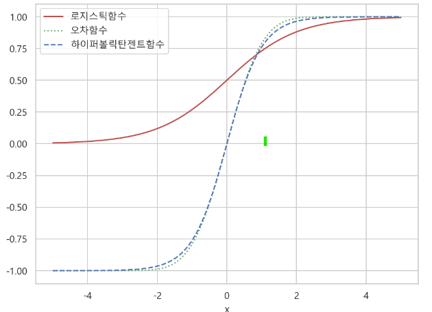

```python
z = np.arange(-10, 10, 0.1)
g = 1 / (1 + np.exp(-z))

plt.figure(figsize=(8, 6))
ax = plt.gca()
ax.plot(z, g)
ax.spines["left"].set_position("zero")
ax.spines["right"].set_color("none")
ax.spines["bottom"].set_position("center")
ax.spines["top"].set_color("none")

plt.show() ;
```
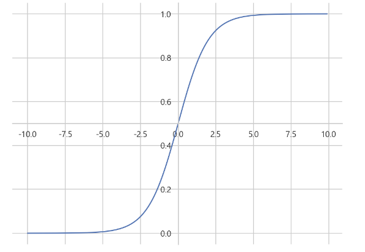

### 4-2. statsmodels 패키지의 로지스틱 회귀
- 베르누이 분포를 따르는 표본 데이터 생성
- 1) statsmodels의 로지스틱 회귀분석 패키지 sm.Logit()를 사용
    - OLS 분석과 같은 방식
    - 상수항 추가 : X = sm.add_constant(X0)
    - 모형 생성 : logit_model = sm.Logit(y, X) 또는 sm.Logit.from_formula("y ~ x1 + x2", data=df)
    - 모수 추정 : logit_ressult = logit_model.fit(disp=0)
    - 분석 레포트 : print(logti_residual.summary())
- 2) 레포트의 계수(coefficient)의 값은 각각 판별함수 u(x;w)에서 선형함수 w^Tx의 w 벡터(계수)가 된다.
    - 로지스틱 회귀모형의 베르누이 분포의 모수는 함수이다.
    - $\mu(x) = \sigma(z) = \sigma(w^Tx) = \sigma(w_1x + w_0)$
    - **sigma(z)가 로지스틱 함수(시그모이드 함수)이고 이 함수의 입력변수가 z이고, z가 선형함수 w^Tx 이다.**
    - const의 coef : w_0 : 상수항에 대한 계수
    - w1의 coef : w_1 : 로지스틱 함수의 입력변수 선형함수의 계수
- 3) z와 mu의 관계에서, z값의 부호를 나누는 기준값
    - $w_1x + w_0 = 0.5$ 에서 $x = (0.5 - w_0) / w_1$
    - 즉 x 표본데이터의 이 값이 mu(x)의 기준값인 0.5를 만드는 값이 된다.
- 4) 상수항의 추정 계수값 w_0에 대한 유의확률이 유의수준보다 크므로 귀무가설이 기각된다. 따라서 w_0는 0이 된다.
    - $x = 0.5 / w_1$
    - **각각의 coef에 대한 유의확률을 확인 한 후 변수선택에 사용할 수 있다.**
- 5) 이 기준값보다 크면 클래스 1로 예측하고, 이 기준값보다 작으면 클래스 0으로 예측한다.

#### 분류용 샘플 데이터 생성

```python
%matplotlib inline

from sklearn.datasets import make_classification

X0, y = make_classification(n_features=1, n_redundant=0, n_informative=1,
                            n_clusters_per_class=1, random_state=4)

plt.figure(figsize=(8, 6))
plt.scatter(X0, y, c=y, s=100, edgecolor="k", linewidth=2)
sns.distplot(X0[y==0, :], label="y=0", hist=False)
sns.distplot(X0[y==1, :], label="y=1", hist=False)
plt.ylim(-0.2, 1.2)
plt.legend()
plt.show() ;
```
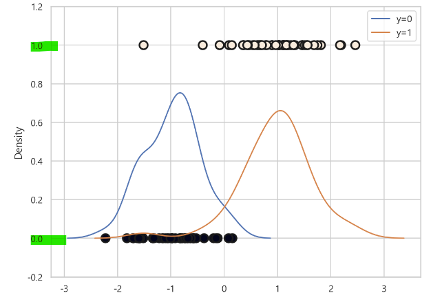

#### 표본 데이터에 상수항 추가
- 분류 문제이지만 모형 자체가 회귀분석 방법을 따르므로 상수항을 추가해준다.

```python
X = sm.add_constant(X0)
X[:10]

>>> print

array([[ 1.        , -0.56511345],
       [ 1.        ,  1.81256131],
       [ 1.        , -1.33619806],
       [ 1.        ,  1.74890611],
       [ 1.        , -0.19702637],
       [ 1.        , -0.97174619],
       [ 1.        ,  0.09145142],
       [ 1.        , -0.81781175],
       [ 1.        ,  1.02115611],
       [ 1.        , -0.37608967]])
       ...
```

#### 로지스틱 회귀모형 생성

```python
logit_mod = sm.Logit(y, X)
logit_mod

>>> print

<statsmodels.discrete.discrete_model.Logit at 0x249994be108>
```

#### 모수 추정
- 최적화에 관한 설명문이 나옴
- fit(disp=0) : 실행 결과 문구 안나옴
- fit(disp=1) : 실행 결과 문구 나옴

```python
logit_res = logit_mod.fit()
logit_res

>>> print

Optimization terminated successfully.
         Current function value: 0.160844
         Iterations 8
<statsmodels.discrete.discrete_model.BinaryResultsWrapper at 0x2499b75a548>
```

#### 분석 레포트 확인
- Pseudo R-squ : 맥파튼 의사결정계수
    - 1 - (Log-Likelihood / LL-Null)
    - 1 - (log_loss(y, y_hat) / log_loss(y, y_null))
- Log-Likelihood : LL : 현재 이탈도
- LL-Null : 귀무모형 이탈도
- coef : 선형함수(z, 로지스틱함수의 입력값, 베르누이분포의 모수함수의 입력변수)의 계수 벡터
    - 상수항에 대한 계수, 독립변수에 대한 계수
    - 회귀분석 레포트와 같은 구조
- P>|z| : 유의확률
    - 이 값이 유의수준 1, 5, 10 보다 크면 귀무가설 채택, 대립가설 기각
    - H0 : mu = 0
    - 즉 0.598이면 59%로 유의확률이 크므로 귀무가설을 채택하여 계수는 0으로 보고 변수선택에서 제외해도 된다.

```python
print(logit_res.summary())
```
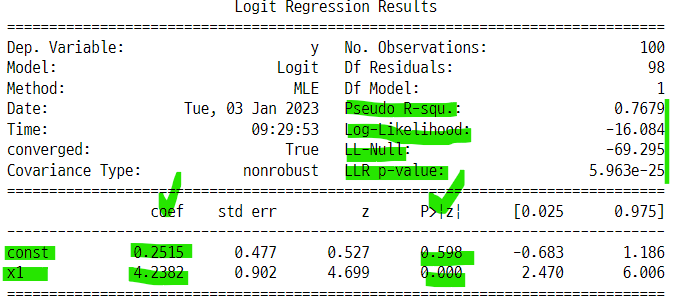

#### 로지스틱 함수의 판별함수의 계수들

```python
logit_res.params

>>> print

array([0.25146938, 4.23823801])
```

#### 로지스틱 모형의 판별함수 기준값
- params[0]은 상수항의 추정 계수값인데 유의확률이 크므로 이 값은 기각된다. 귀무가설이 채택 된다.
    - 0이된다.
- 이 값보다 크면 1로 예측하고, 이 기준보다 작으면 0으로 예측한다.
    - 이 식의 의미는 표본 x가 0.118을 기준으로 u(x;w)가 0.5 보다 큰지 아닌지를 판별한다는 것이다.

```python
0.5 / logit_res.params[1]

>>> print

0.11797355394946862
```

#### 로지스틱 모형의 예측값
- predict(X)의 값은 로지스틱 함수에서 계산 된 값이다.
    - 클래스 0, 1을 결정하기 위한 값이다.
    - 이 값들의 기준값은 0.5
- 위에서 구한 판별함수의 기준값 0.118은 로지스틱 함수의 입력변수인 선형함수값의 기준값이다.

```python
logit_res.predict(X).tolist()

>>> print

[0.10492929902392775,
 0.9996416118863805,
 0.004444400230656911,
 0.9995306769247857,
 0.3581103425493717,
 0.020491870822048664,
 0.654541452690386,
 0.038619555144648966,
 0.9898428873815828,
 0.2071011814961312,
 ...]
```

#### 표본 데이터, 예측 데이터, 로지스틱 함수 그래프

```python
xx = np.linspace(-3, 3, 100)
mu = logit_res.predict(sm.add_constant(xx))

plt.figure(figsize=(8, 6))
plt.plot(xx, mu, lw=3)
plt.scatter(X0, y, c=y, s=100, edgecolor="k", lw=2)
plt.scatter(X0, logit_res.predict(X), c=y, s=100, marker="s", edgecolor="k", lw=1,
            label=r"$\hat{y}$")
plt.hlines(0.5, xmin=-3, xmax=3, colors="g", linestyle="--",
          label="decision func value")
plt.xlabel("x")
plt.ylabel(r"$\mu$")
plt.xlim(-3, 3)
plt.title(r"$\hat{y}=\mu(x)$")
plt.legend()
plt.show() ;
```
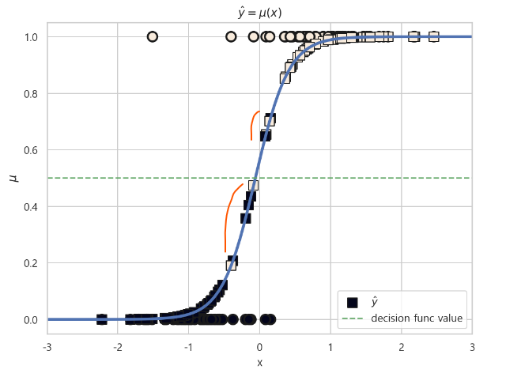

### 4-3. 판별함수
- 로지스틱 함수의 입력변수로 사용되는 $z = w^Tx$의 값들
- 판별함수 값을 사용하여 분류 예측을 할 수도 있다.
    - 이 값들을 만드는 표본 x의 기준값은 0.5 / logit_res.params[1] = 0.118이다.

```python
np.sort(logit_res.fittedvalues)

>>> print

array([-9.17428498, -7.47267348, -6.98075116, -6.95104091, -6.64632864,
       -6.5316439 , -6.51109769, -6.50300634, -6.43483944, -6.41893836,
       -6.17766453, -6.14924787, -5.41939762, -5.41165604, -5.32185743,
       -4.9069884 , -4.6532578 , -4.59438724, -4.41958775, -4.27430522,
       -4.18033071, -4.00735988, -3.88527519, -3.88115989, -3.87553814,
       -3.86702227, -3.63502083, -3.25585317, -3.25584632, -3.21461146,
       ...])
```

#### 모형의 params를 사용하여 판별함수를 직접 계산
- 위의 fittedvalues의 값과 같다.
- 이 값이 로지스틱 함수의 입력변수로 사용된다.

```python
np.sort(np.hstack(X0 * logit_res.params[1] + logit_res.params[0]))

>>> print

array([-9.17428498, -7.47267348, -6.98075116, -6.95104091, -6.64632864,
       -6.5316439 , -6.51109769, -6.50300634, -6.43483944, -6.41893836,
       -6.17766453, -6.14924787, -5.41939762, -5.41165604, -5.32185743,
       -4.9069884 , -4.6532578 , -4.59438724, -4.41958775, -4.27430522,
       -4.18033071, -4.00735988, -3.88527519, -3.88115989, -3.87553814,
       -3.86702227, -3.63502083, -3.25585317, -3.25584632, -3.21461146,
       ...])
```

#### 판별함수, 로지스틱 함수, 표본 데이터, 예측 데이터 그래프

```python
xx = np.linspace(-3, 3, 100)
mu = logit_res.predict(sm.add_constant(xx))

plt.figure(figsize=(8, 6))
plt.scatter(X0, y, c=y, s=100, edgecolor="k", lw=2, label="데이터")
plt.scatter(X0, logit_res.predict(X), c="g", s=15, marker="o", label="로지스틱 함수의 값")
plt.plot(X0, logit_res.fittedvalues * 0.1, label="판별함수값")
plt.plot(xx, logit_res.predict(sm.add_constant(xx)), "r--", lw=1, label="로지스틱 함수")
plt.legend()
plt.show() ;
```
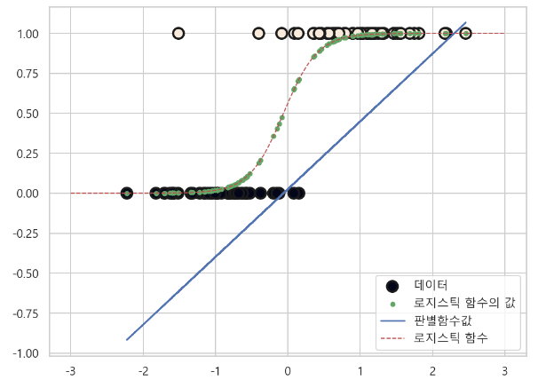

### 5-4. 로지스틱 회귀의 성능 측정
- log_loss 함수를 사용하여 이탈도를 계산할 수 있다.
    - 예측값에 대한 log_loss 값과 귀무 모형의 모수값에 대한 log_loss 값 사용
    - 1 - (log_loss(y, y_hat) / log_loss(y, y_null))

#### predict(X)
- u(x) 값을 반환한다.
    - 로지스틱 함수의 결과값
- 이 값이 기준값 0.5 보다 크면 1, 기준값 보다 작으면 0으로 예측한다.

```python
y_hat = logit_res.predict(X)
y_hat

>>> print

array([1.04929299e-01, 9.99641612e-01, 4.44440023e-03, 9.99530677e-01,
       3.58110343e-01, 2.04918708e-02, 6.54541453e-01, 3.86195551e-02,
       9.89842887e-01, 2.07101181e-01, 7.86433474e-02, 9.92499043e-01,
       1.50630826e-02, 5.68083738e-04, 9.56058664e-01, 4.41027755e-03,
       9.90604578e-01, 9.90156041e-01, 9.98459875e-01, 9.95363005e-01,
       ...])
```

#### y_hat을 tolist()로 정렬

```python
y_hat.tolist()

>>> print

[0.10492929902392775,
 0.9996416118863805,
 0.004444400230656911,
 0.9995306769247857,
 0.3581103425493717,
 0.020491870822048664,
 0.654541452690386,
 0.038619555144648966,
 ...]
```

#### log_loss()
- 현재 이탈도

```python
from sklearn.metrics import log_loss

log_loss(y, y_hat, normalize=False)

>>> print

16.084355200413036
```

#### 귀무모형의 모수값

```python
mu_null = np.sum(y) / len(y)
mu_null

>>> print

0.51

y_null = np.ones_like(y) * mu_null
y_null

>>> print

array([0.51, 0.51, 0.51, 0.51, 0.51, 0.51, 0.51, 0.51, 0.51, 0.51, 0.51,
       0.51, 0.51, 0.51, 0.51, 0.51, 0.51, 0.51, 0.51, 0.51, 0.51, 0.51,
       0.51, 0.51, 0.51, 0.51, 0.51, 0.51, 0.51, 0.51, 0.51, 0.51, 0.51,
       0.51, 0.51, 0.51, 0.51, 0.51, 0.51, 0.51, 0.51, 0.51, 0.51, 0.51,
       0.51, 0.51, 0.51, 0.51, 0.51, 0.51, 0.51, 0.51, 0.51, 0.51, 0.51,
       0.51, 0.51, 0.51, 0.51, 0.51, 0.51, 0.51, 0.51, 0.51, 0.51, 0.51,
       0.51, 0.51, 0.51, 0.51, 0.51, 0.51, 0.51, 0.51, 0.51, 0.51, 0.51,
       0.51, 0.51, 0.51, 0.51, 0.51, 0.51, 0.51, 0.51, 0.51, 0.51, 0.51,
       0.51, 0.51, 0.51, 0.51, 0.51, 0.51, 0.51, 0.51, 0.51, 0.51, 0.51,
       0.51])
```

#### 귀무 이탈도

```python
log_loss(y, y_null, normalize=False)

>>> print

69.29471672244784
```

#### 이탈도와 귀무 이탈도를 사용하여 맥파든 의사결정계수를 구할 수 있다.

```python
1 - (log_loss(y, y_hat) / log_loss(y, y_null))

>>> print

0.7678848264170398
```

### 5-5. scikit-learn 패키지의 로지스틱 회귀
- LogisticRegression().fit(X0, y)
    - 상수항 결합을 하지 않은 표본을 넣는다.
- sm.Logit(y, X0) 에서는 종속변수 y를 먼저 입력한 후 상수항 결합을 한 표본 X를 입력한다.

```python
from sklearn.linear_model import LogisticRegression

model_sk = LogisticRegression().fit(X0, y)
model_sk

>>> print

LogisticRegression()
```

#### 선형함수의 w 벡터
- 독립변수 X0의 계수

```python
model_sk.coef_

>>> print

array([[2.90088584]])
```

#### 선형함수의 상수항 계수

```python
model_sk.intercept_

>>> print

array([0.13059863])
```

#### 베르누이 분포의 모수 벡터

```python
xx = np.linspace(-3, 3, 100)
mu = 1.0 / (1 + np.exp(-model_sk.coef_[0][0] * xx - model_sk.intercept_[0]))
mu

>>> print

array([1.89286617e-04, 2.25661759e-04, 2.69025219e-04, 3.20718785e-04,
       3.82341542e-04, 4.55799069e-04, 5.43361982e-04, 6.47735580e-04,
       7.72142660e-04, 9.20421930e-04, 1.09714491e-03, 1.30775466e-03,
       1.55873032e-03, 1.85778198e-03, 2.21408125e-03, 2.63853360e-03,
       3.14409956e-03, 3.74617249e-03, 4.46302197e-03, 5.31631232e-03,
       6.33170663e-03, 7.53956717e-03, 8.97576247e-03, 1.06825907e-02,
       1.27098262e-02, 1.51158923e-02, 1.79691548e-02, 2.13493218e-02,
       ...])
```

#### sklearn의 로지스틱 모형의 그래프
- predict(X0)의 값은 u(x;w)의 값을 기준값 0.5로 나눈 후 예측한 클래스 값이 반환된다.
    - 0과 1

```python
model_sk.predict(X0)

>>> print

array([0, 1, 0, 1, 0, 0, 1, 0, 1, 0, 0, 1, 0, 0, 1, 0, 1, 1, 1, 1, 0, 0,
       1, 0, 1, 1, 1, 1, 1, 1, 1, 0, 1, 0, 0, 0, 0, 0, 0, 1, 1, 1, 0, 0,
       0, 0, 1, 0, 0, 0, 1, 1, 1, 0, 1, 0, 0, 1, 1, 0, 0, 1, 1, 1, 1, 0,
       1, 0, 1, 1, 0, 0, 1, 0, 1, 0, 0, 1, 1, 1, 1, 0, 0, 0, 1, 0, 0, 1,
       1, 1, 1, 1, 0, 1, 1, 0, 0, 0, 0, 0])
```
```python
plt.figure(figsize=(8, 6))
plt.plot(xx, mu)
plt.scatter(X0, y, c=y, s=100, edgecolor="k", lw=2)
plt.scatter(X0, model_sk.predict(X0), c="g", s=50, edgecolor="k", lw=1,
           marker="s", alpha=0.5, label=r"$\hat{y}$")
plt.hlines(0.5, xmin=-3, xmax=3, colors="r", ls="--", lw=0.7)
plt.xlabel("x")
plt.ylabel(r"$\mu$")
plt.xlim(-3, 3)
plt.title(r"$\hat{y} = sign \; \mu(x)$")
plt.legend()
plt.show() ;
```
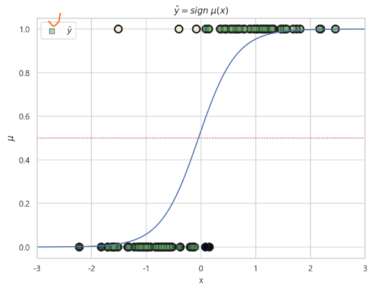

#### 표본 x의 기준값 비교
- sm.Logit()에서 기준값은 0.118 정도가 나왔다.

```python
## sklearn

sk_thr = (0.5 - model_sk.intercept_[0]) / model_sk.coef_[0][0]
sk_thr

>>> print

0.12734088388112408

## statsmodels

sm_thr = 0.5 / logit_res.params[1]
sm_thr

>>> print

0.11797355394946862
```

#### model_sk의 성능측정

#### 이탈도와 귀무 이탈도
- 귀무 이탈도는 데이터의 종속변수의 값이므로 변하지 않는다.

```python
## 이탈도
log_loss(y, y_hat_sk, normalize=False)

>>> print

172.69548116941388

## 맥파든 의사결정계수

1 - (log_loss(y, y_hat_sk) / log_loss(y, y_null))

>>> print

-1.4921882841534098
```

### 5-6. 연습문제
- 붓꽃데이터에 대한 statsmodels의 로지스틱 회귀모형으로 결과를 예측하고 보고서 출력
    - 붓꽃 데이터에서 세토사와 베르시칼라만 사용
    - 독립변수는 꽃받침 길이와 상수항만 사용
    - 보고서의 기준값
- 이 결과를 분류결과표(confusion matrix)와 분류결과보고서(classification report)로 출력
- 이 모형에 대한 ROC 커브와 AUC 계산

#### 붓꽃 데이터 임포트
- 세토사 : 0
- 베르시칼라 : 1

```python
from sklearn.datasets import load_iris

iris = load_iris()
idx = np.in1d(iris.target, [0, 1])
X0 = iris.data[idx, 0]
y = iris.target[idx]

idx

>>> print

array([ True,  True,  True,  True,  True,  True,  True,  True,  True,
        True,  True,  True,  True,  True,  True,  True,  True,  True,
        True,  True,  True,  True,  True,  True,  True,  True,  True,
        True,  True,  True,  True,  True,  True,  True,  True,  True,
        True,  True,  True,  True,  True,  True,  True,  True,  True,
        True,  True,  True,  True,  True,  True,  True,  True,  True,
        True,  True,  True,  True,  True,  True,  True,  True,  True,
        True,  True,  True,  True,  True,  True,  True,  True,  True,
        True,  True,  True,  True,  True,  True,  True,  True,  True,
        True,  True,  True,  True,  True,  True,  True,  True,  True,
        True,  True,  True,  True,  True,  True,  True,  True,  True,
        True, False, False, False, False, False, False, False, False,
       False, False, False, False, False, False, False, False, False,
       False, False, False, False, False, False, False, False, False,
       False, False, False, False, False, False, False, False, False,
       False, False, False, False, False, False, False, False, False,
       False, False, False, False, False, False])
```

#### 상수항 추가

```python
X = sm.add_constant(X0)
X

>>> print

array([[1. , 5.1],
       [1. , 4.9],
       [1. , 4.7],
       [1. , 4.6],
       [1. , 5. ],
       [1. , 5.4],
       [1. , 4.6],
       [1. , 5. ],
       [1. , 4.4],
       ...]])
```

#### statsmodels의 로지스틱 회귀모형 생성
- 상수항 추가 없이 데이터 프레임을 입력변수로 쓰려면 sm.Logit.from_formula("y ~ x1 + x2", data=df)

```python
iris_lgr = sm.Logit(y, X)
iris_lgr

>>> print

<statsmodels.discrete.discrete_model.Logit at 0x2499f4ea208>
```

#### 로지스틱 회귀모형의 모수 추정

```python
iris_lgr_fit = iris_lgr.fit(disp=0)
iris_lgr_fit

>>> print

<statsmodels.discrete.discrete_model.BinaryResultsWrapper at 0x2499f4d25c8>
```

#### 결과 보고서 출력
- pvalue가 둘다 0이므로 귀무가설 기각, 대립가설 채택
- coef 값을 둘다 사용할 수 있다.

```python
print(iris_lgr_fit.summary())
```
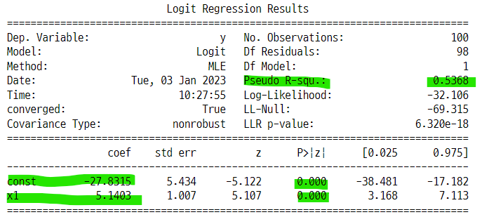


#### 판별함수 z의 w벡터
- w^Tx의 w의 값
- 상수항 계수와 독립변수의 계수

```python
iris_lgr_fit.params[0], iris_lgr_fit.params[1]

>>> print

(-27.831450986853397, 5.1403361378564085)
```

#### 표본 x의 기준값 비교
- mu(x)(로지스틱 함수)가 0.5인 x의 기준값
    - mu(x) = sigma(z) = sigma(w^Tx)
    - mu(x) = 0.5 -> z = 0 -> w^Tx = 0
- z 선형함수 = 0 인지, z 선형함수 = 0.5 인지 확인 필요.

```python
## z = 0.5 일때

z_thr1 = (0.5 - iris_lgr_fit.params[0]) / iris_lgr_fit.params[1]
z_thr1

>>> print

5.5115950060549945

## z = 0 일때

z_thr2 = -(iris_lgr_fit.params[0] / iris_lgr_fit.params[1])
z_thr2

>>> print

5.414325102571891
```

- mu(x) = 0.5 에 더 가까운 경우는? : z = 0 일떄의 값이 더 가깞다.

```python
## z = 0.5 일때
1 / (1 + np.exp(z_thr1))

>>> print

0.004023405774258245

## z = 0 일떄

1 / (1 + np.exp(z_thr2))

>>> print

0.00443260619564816
```

#### 모형의 예측값
- 이 예측값이 0.5보다 크면 클래스 1
- 이 예측값이 0.5보다 작으면 클래스 0

```python
iris_lgr_fit.predict(X)

>>> print

array([0.16579367, 0.06637193, 0.02479825, 0.01498061, 0.1062368 ,
       0.48159935, 0.01498061, 0.1062368 , 0.00541059, 0.06637193,
       0.48159935, 0.04078357, 0.04078357, 0.00324301, 0.87894726,
       0.81282396, 0.48159935, 0.16579367, 0.81282396, 0.16579367,
       0.48159935, 0.16579367, 0.01498061, 0.16579367, 0.04078357,
       0.1062368 , 0.1062368 , 0.24942093, 0.24942093, 0.02479825,
       0.04078357, 0.48159935, 0.24942093, 0.60835381, 0.06637193,
       0.1062368 , 0.60835381, 0.06637193, 0.00541059, 0.16579367,
       ...])
```

#### 그래프로 확인

```python
xx = np.linspace(4, 7, 200)
mu = iris_lgr_fit.predict(sm.add_constant(xx))

plt.figure(figsize=(8, 6))
plt.scatter(X0, y, c=y, s=100, edgecolor="k", lw=2)
plt.scatter(X0, iris_lgr_fit.predict(X), c=y, s=100, marker="s",
           edgecolor="k", lw=1, alpha=0.6, label=r"$\hat{y}$")
plt.plot(xx, mu, lw=2)
plt.vlines(z_thr2, ymin=0, ymax=1, colors="g", linestyle="--", lw=1,
          label="z 판별함수가 0인 지점 {}".format(z_thr2.round(2)))

plt.legend(loc="center right")
plt.show() ;
```
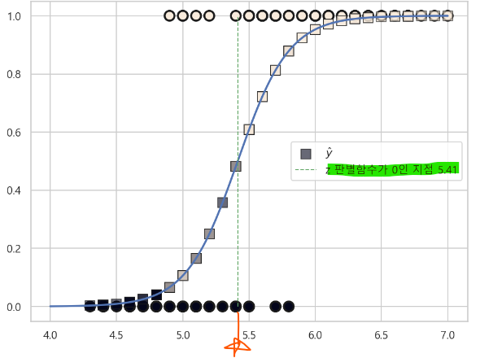

#### 분류결과표
- confusion_matrix
- 예측값이 0.5 보다 큰 것과 아닌 것을 구분

```python
y_pred = iris_lgr_fit.predict(X) >= 0.5
y_pred

>>> print

array([False, False, False, False, False, False, False, False, False,
       False, False, False, False, False,  True,  True, False, False,
        True, False, False, False, False, False, False, False, False,
       False, False, False, False, False, False,  True, False, False,
        True, False, False, False, False, False, False, False, False,
       False, False, False, False, False,  True,  True,  True,  True,
        True,  True,  True, False,  True, False, False,  True,  True,
        True,  True,  True,  True,  True,  True,  True,  True,  True,
        True,  True,  True,  True,  True,  True,  True,  True,  True,
        True,  True,  True, False,  True,  True,  True,  True,  True,
        True,  True,  True, False,  True,  True,  True,  True, False,
        True])
	
```

- 분류결과표 출력
    - 0을 0으로 예측한 것 45개, 0을 1로 잘 못 예측한 것 5
    - 1을 0으로 잘 못 예측한 것 6개, 1을 1로 예측한 것 44

```python
from sklearn.metrics import confusion_matrix

print(confusion_matrix(y, y_pred))

>>> print

[[45  5]
 [ 6 44]]
```

#### 분류결과보고서

```python
from sklearn.metrics import classification_report

print(classification_report(y, y_pred))

>>> print

              precision    recall  f1-score   support

           0       0.88      0.90      0.89        50
           1       0.90      0.88      0.89        50

    accuracy                           0.89       100
   macro avg       0.89      0.89      0.89       100
weighted avg       0.89      0.89      0.89       100
```
	
#### roc 커브

```python
from sklearn.metrics import roc_curve

fpr, tpr, thr = roc_curve(y, iris_lgr_fit.predict(X))
plt.figure(figsize=(8, 6))
plt.plot(fpr, tpr)
plt.show() ;
```
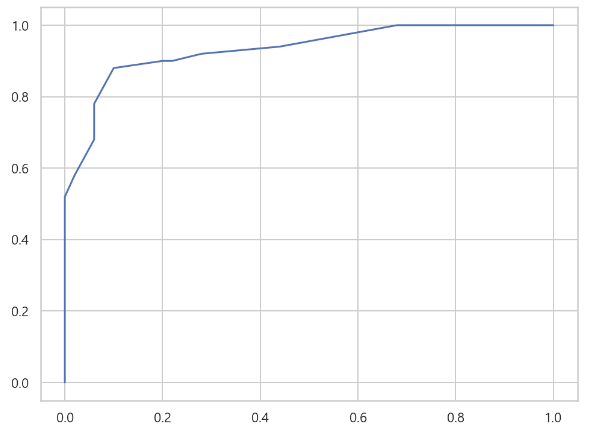

#### auc score

```python
from sklearn.metrics import auc

auc(fpr, tpr)

>>> print

0.9326
```

#### 맥파든 의사결정계수
- 분류 모형의 성능 평가
- 예측값

```python
y_hat = iris_lgr_fit.predict(X)
y_hat

>>> print

array([0.16579367, 0.06637193, 0.02479825, 0.01498061, 0.1062368 ,
       0.48159935, 0.01498061, 0.1062368 , 0.00541059, 0.06637193,
       0.48159935, 0.04078357, 0.04078357, 0.00324301, 0.87894726,
       0.81282396, 0.48159935, 0.16579367, 0.81282396, 0.16579367,
       0.48159935, 0.16579367, 0.01498061, 0.16579367, 0.04078357,
       0.1062368 , 0.1062368 , 0.24942093, 0.24942093, 0.02479825,
       ...)]
```

- 귀무 모수값

```python
iris_mu_null = np.sum(y) / len(y)
iris_mu_null

>>> print

0.5

## 열벡터 형태로 변환

iris_y_null = np.ones_like(y) * iris_mu_null
iris_y_null

>>> print

array([0.5, 0.5, 0.5, 0.5, 0.5, 0.5, 0.5, 0.5, 0.5, 0.5, 0.5, 0.5, 0.5,
       0.5, 0.5, 0.5, 0.5, 0.5, 0.5, 0.5, 0.5, 0.5, 0.5, 0.5, 0.5, 0.5,
       0.5, 0.5, 0.5, 0.5, 0.5, 0.5, 0.5, 0.5, 0.5, 0.5, 0.5, 0.5, 0.5,
       0.5, 0.5, 0.5, 0.5, 0.5, 0.5, 0.5, 0.5, 0.5, 0.5, 0.5, 0.5, 0.5,
       0.5, 0.5, 0.5, 0.5, 0.5, 0.5, 0.5, 0.5, 0.5, 0.5, 0.5, 0.5, 0.5,
       0.5, 0.5, 0.5, 0.5, 0.5, 0.5, 0.5, 0.5, 0.5, 0.5, 0.5, 0.5, 0.5,
       0.5, 0.5, 0.5, 0.5, 0.5, 0.5, 0.5, 0.5, 0.5, 0.5, 0.5, 0.5, 0.5,
       0.5, 0.5, 0.5, 0.5, 0.5, 0.5, 0.5, 0.5, 0.5])
```

#### 결과보고서의 값과 같다.

```python
1 - (log_loss(y, y_hat) / log_loss(y, iris_y_null))

>>> print

0.5368135989940831
```

### 5-7. 로지스틱 회귀를 사용한 이진 분류의 예
- 여러개의 특징벡터와 종속변수가 베르누이 분포를 따를 때 로지스틱 회귀분석의 사용    
- `미국 의대생의 입학관련 데이터`
- columns
    - Acceptance : 0이면 불합격, 1이면 합격
    - BCPM : Bio/Chem/Physics/Math 과목의 학점 평균
    - GPA : 전체과목 학점 평균
    - VR : MCAT Verbal reasoning 과목 점수
    - PS : MCAT Physical science 과목 점수
    - WS : MCAT Writing sample 과목 점수
    - BS : MCAT Biogical sciences 과목 점수
    - MCAT : MCAT 총점
    - Apps : 의대 지원 횟수

#### 데이터 임포트

```python
data_med = sm.datasets.get_rdataset("MedGPA", package="Stat2Data")
data_med

>>> print

<class 'statsmodels.datasets.utils.Dataset'>
```

#### 데이터프레임으로 변환

```python
df_med = data_med.data
df_med.tail()
```
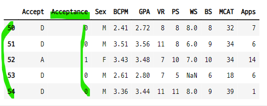

#### GPA와 Acceptance의 관계

```python
plt.figure(figsize=(8, 6))
sns.stripplot(x="GPA", y="Acceptance", data=df_med,
             jitter=True, orient="h", order=[1, 0])
plt.grid(True)
plt.show() ;
```
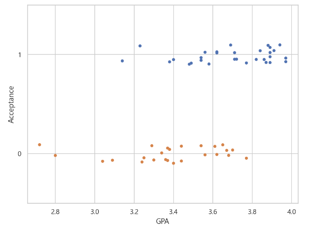

```python
plt.figure(figsize=(8, 6))
plt.scatter(df_med["GPA"], df_med["Acceptance"], c=df_med["Acceptance"],
            s=100, edgecolor="k", lw=1)
plt.ylim(-0.2, 1.2)
plt.show() ;
```
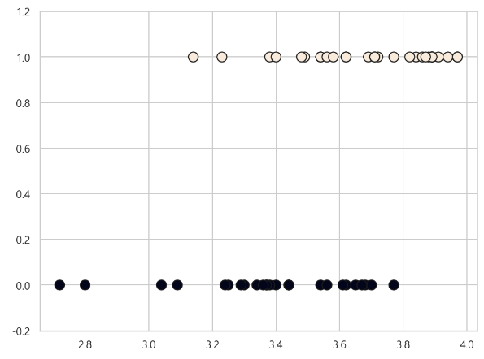


#### BS와 Acceptance의 관계

```python
plt.figure(figsize=(8, 6))
sns.stripplot(x="BS", y="Acceptance", data=df_med,
             jitter=True, orient="h", order=[1, 0])
plt.grid(True)
plt.show() ;
```
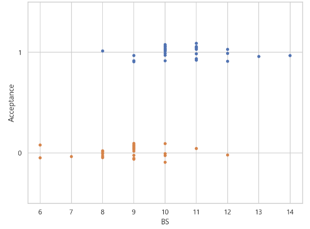

#### PS와 Acceptance의 관계

```python
plt.figure(figsize=(8, 6))
sns.stripplot(x="PS", y="Acceptance", data=df_med,
             jitter=True, orient="h", order=[1, 0])
plt.grid(True)
plt.show() ;
```
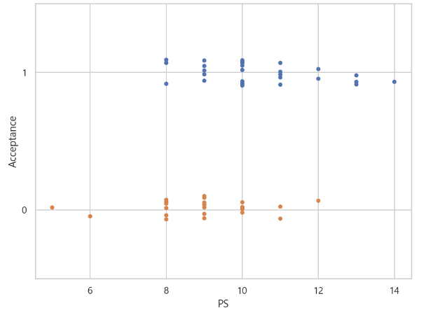


#### 로지스틱 회귀분석

```python
model_med = sm.Logit.from_formula("Acceptance ~ " + " + ".join(list(set([col for col in df_med.columns])\
.difference(["Acceptance", "Accept", "MCAT"]))), data=df_med)

result_med = model_med.fit(disp=0)
print(result_med.summary())
```
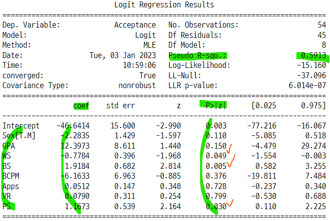

#### 맥파든 의사결정계수
- 보고서의 Pseudo R-squ
- 보고서의 Log-Likelihood 값과 LL-Null 값으로 계산할 수 있다.

```python
1 - (-15.160 / -37.096)

>>> print

0.591330601682122
```

#### 예측결과 실제결과 비교
- 박스 플롯으로 확인

```python
df_med["Pred"] = result_med.predict(df_med)

plt.figure(figsize=(8, 6))
sns.boxplot(x="Acceptance", y="Pred", data=df_med)
plt.show() ;
```
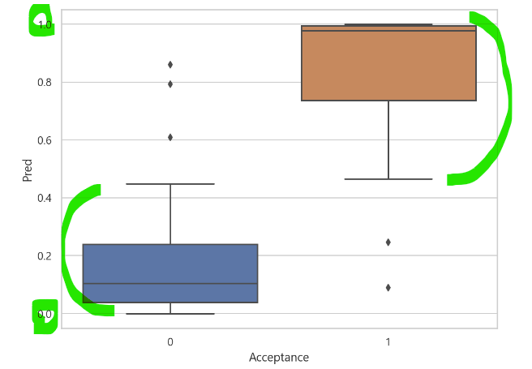

#### 유의미한 특징 벡터만 사용하여 다시 회귀분석
- BS + PS

```python
model_med = sm.Logit.from_formula("Acceptance ~ PS + BS", data=df_med)
result_med = model_med.fit(disp=0)
print(result_med.summary())
```
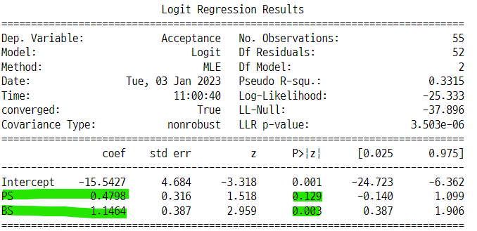

#### 분류결과표

```python
print(confusion_matrix(df_med["Acceptance"], y_pred))

>>> print

[[17  8]
 [ 5 25]]
```

#### 분류결과보고서

```python
print(classification_report(df_med["Acceptance"], y_pred))

>>> print

              precision    recall  f1-score   support

           0       0.77      0.68      0.72        25
           1       0.76      0.83      0.79        30

    accuracy                           0.76        55
   macro avg       0.77      0.76      0.76        55
weighted avg       0.76      0.76      0.76        55
```

#### roc curve

```python
fpr, tpr, thr = roc_curve(df_med["Acceptance"], y_pred)
plt.figure(figsize=(8, 6))
plt.plot(fpr, tpr)
plt.show() ;
```
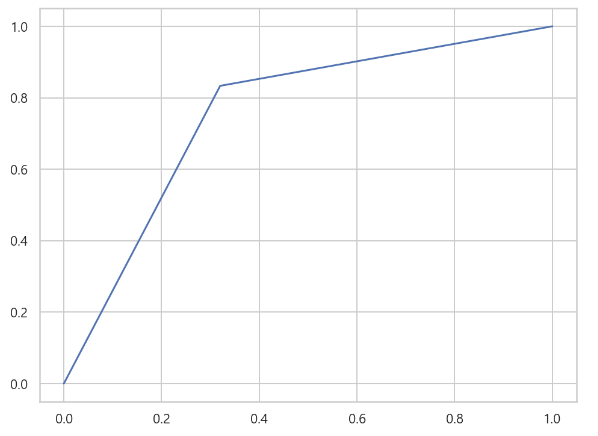

#### auc score

```python
auc(fpr, tpr)

>>> print

0.7566666666666666
```

#### WS 변수 추가하여 다시 모델링
- model2 : BS+PS+WS
- model1 : BS+PS

```python
model_med2 = sm.Logit.from_formula("Acceptance ~ BS + PS + WS", data=df_med)
result_med2 = model_med2.fit(disp=0)
print(result_med2.summary())
```
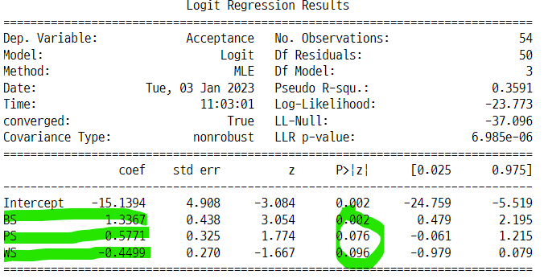

#### model1과 model2 분류결과표 비교
- model2 가 더 분류를 잘 한 것으로 보인다.

```python
y_pred2 = result_med2.predict(df_med[["BS", "PS", "WS"]]) >= 0.5

print("===model2===")
print(confusion_matrix(df_med["Acceptance"], y_pred2))
print("===model1===")
print(confusion_matrix(df_med["Acceptance"], y_pred))

>>> print

===model2===
[[19  6]
 [ 4 26]]
===model1===
[[17  8]
 [ 5 25]]
```

#### 분류결과 보고서 비교
- model2의 accuracy 값이 더 높다.

```python
print("===model2===")
print(classification_report(df_med["Acceptance"], y_pred2))
print("===model1===")
print(classification_report(df_med["Acceptance"], y_pred))

>>> print

===model2===
              precision    recall  f1-score   support

           0       0.83      0.76      0.79        25
           1       0.81      0.87      0.84        30

    accuracy                           0.82        55
   macro avg       0.82      0.81      0.82        55
weighted avg       0.82      0.82      0.82        55

===model1===
              precision    recall  f1-score   support

           0       0.77      0.68      0.72        25
           1       0.76      0.83      0.79        30

    accuracy                           0.76        55
   macro avg       0.77      0.76      0.76        55
weighted avg       0.76      0.76      0.76        55
```

#### roc curve 비교

```python
fpr1, tpr1, thr1 = roc_curve(df_med["Acceptance"], y_pred)
fpr2, tpr2, thr2 = roc_curve(df_med["Acceptance"], y_pred2)

plt.figure(figsize=(8, 6))
plt.plot(fpr1, tpr1, label="BS+PS")
plt.plot(fpr2, tpr2, label="BS+PS+WS")

plt.legend()
plt.show();
```
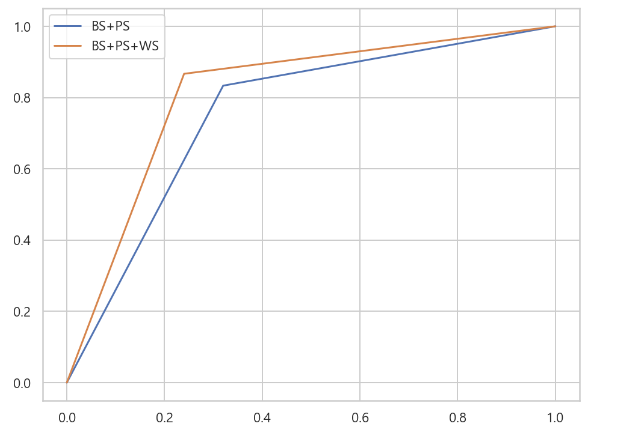


#### auc score 비교

```python
print("model1 auc : {0:.3f}, model2 auc : {1:.3f}".format(
auc(fpr1, tpr1), auc(fpr2, tpr2)))

>>> print

model1 auc : 0.757, model2 auc : 0.813
```

#### 로지스틱 함수 예측값과 예측 클래스
- model2 의 예측값과 이에 따른 예측 클래스 확인

```python
plt.figure(figsize=(8, 6))
plt.plot(result_med2.fittedvalues, "ro-")
plt.plot(y_pred2, "bs-")
```
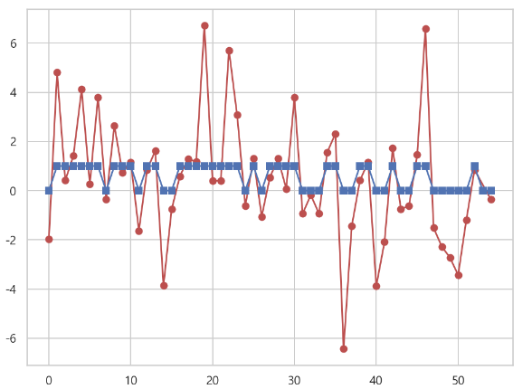


### 5-8. 연습문제
- 붓꽃 데이터를 로지스틱 회귀분석 모형을 사용하여 분석하기
    - 베르시칼라와 버지니카 데이터 사용
    - 독립변수 모두 사용 : 4개
    - 예측 보고서 출력하라
    - 보고서에서 버지니카와 베르시칼라를 구분하는 경계면의 방정식을 찾아라
- 분류결과표와 분류결과보고서로 나타내라
- ROC 커브와 AUC 계산

#### 데이터 임포트, 전처리

```python
from sklearn.datasets import load_iris
from sklearn.metrics import (confusion_matrix, classification_report, roc_curve, auc)

iris = load_iris()
dfX0 = pd.DataFrame(iris.data, columns=iris.feature_names)
dfy = pd.DataFrame(iris.target, columns=["species"])
idx = np.in1d(iris.target, [1, 2])
dfX = dfX0.iloc[idx]
dfY = dfy.iloc[idx]

df = pd.concat([dfX, dfY], axis=1)
df.head()
```
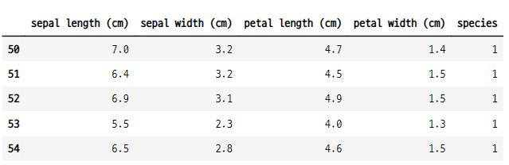

#### sm.Logit() 에 사용하기 위해 컬럼명 변경
- 컬럼명에 띄어쓰기가 있으면 에러가 난다.

```python
cols = df.columns
new_col = [col[:-4].replace(" ", "_")[:-1] for col in df.columns[:4]]
df.rename(columns={cols[0] : new_col[0], cols[1] : new_col[1],
                  cols[2] : new_col[2], cols[3] : new_col[3]}, inplace=True)
df.head()
```
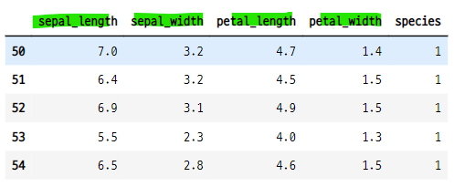

#### 종속변수의 값을 0과 1로 변경
- 베르시칼라 : 1 -> 0
- 버지니카 : 2 -> 1

```python
df["species"] -= 1
df.head()
```
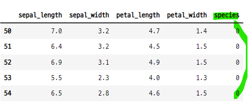

#### statsmodels 로지스틱 회귀분석 모형 생성

```python
model_iris = sm.Logit.from_formula("species ~ " + " + ".join([col for col in df.columns[:4]]), data=df)
result = model_iris.fit(disp=0)
print(result.summary())
```
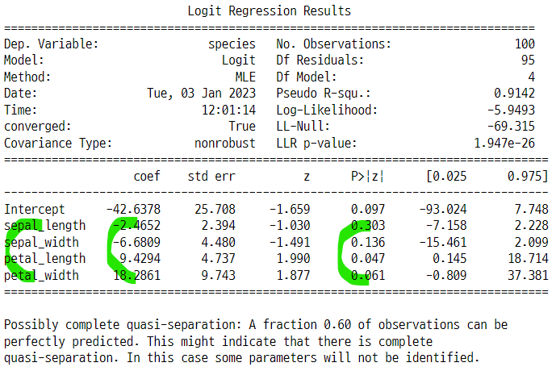

#### 경계면의 방정식
- z=0 or z=0.5 확인 필요

```
-2.4652 * spal_length + -6.6809 * sepal_width + 9.4294 * petal_length + 18.2861 * petal_width + 42.6378 = 0.5
```

#### 분류결과표, 분류결과보고서

```python
y_pred = result.predict(df) >= 0.5

## 분류결과표
print(confusion_matrix(df["species"], y_pred))

>>> print

[[49  1]
 [ 1 49]]

## 분류결과 보고서
print(classification_report(df["species"], y_pred))

>>> print

              precision    recall  f1-score   support

           0       0.98      0.98      0.98        50
           1       0.98      0.98      0.98        50

    accuracy                           0.98       100
   macro avg       0.98      0.98      0.98       100
weighted avg       0.98      0.98      0.98       100
```

#### roc curve, auc

```python
fpr, tpr, thr = roc_curve(df["species"], result.predict(df))
plt.figure(figsize=(8, 6))
plt.plot(fpr, tpr)
plt.show() ;
```
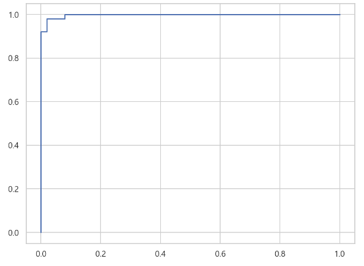

- auc

```python
auc(fpr, tpr)

>>> print

0.9972000000000001
```

#### 판별함수값과 예측 클래스
- 각 데이터별 판별함수값 : ro-
- 각 데이터별 예측 클래스 : bs-
    - 0인 것 중에서 1이라고 예측한 것이 하나 있다.
    - 1인 것 중에서 0이라고 예측한 것이 하나 있다.

```python
plt.figure(figsize=(8, 6))
plt.plot(result.fittedvalues, "ro-")
plt.plot(y_pred, "bs-")
plt.show() ;
```
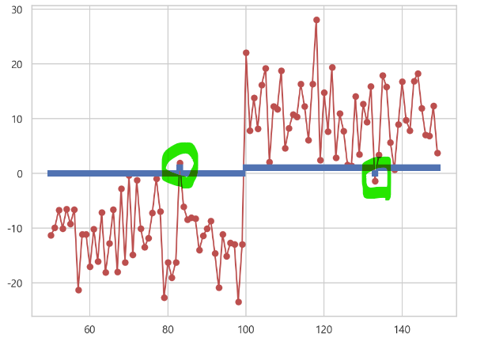

### 5-9. 로지스틱 회귀모형을 사용한 회귀분석
- y가 0~1 사이의 실수값으로 이루어진 경우면 회귀분석 문제로 풀 수 있다.
    - $\hat{y} = \mu(x)$
- `1974년 남여 역할에 대한 여론조사 데이터`
    - education : 교육기간
    - sex : 성별
    - agree : 찬성인원
    - disagree : 반대인원
    - ratio : 찬성비율
- agree와 disagree 컬럼을 사용해 ratio 컬럼을 만들어 회귀분석 문제로 사용할 수 있다.
    - 전체 인원중 찬성인원의 비율과 같이 비율을 만들면 0~1사이의 실수값을 가진 종속변수를 만들 수 있다.

#### 데이터 임포트

```python
data = sm.datasets.get_rdataset("womensrole", package="HSAUR")
df = data.data
df
```


#### 찬성비율 컬럼 생성
- 찬성, 반대 컬럼으로부터 찬성의 비율을 나타내는 컬럼을 생성
    - 0과 1사이의 실수값으로 이루어져 있다.

```python
df["ratio"] = df.agree / (df.agree + df.disagree)
df.head()
```
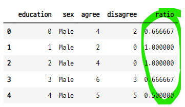

#### 교육기간과 찬성비율의 관계
- 교육기간은 0년~20년 까지 있다.

```python
df["education"].unique()

>>> print

array([ 0,  1,  2,  3,  4,  5,  6,  7,  8,  9, 10, 11, 12, 13, 14, 15, 16,
       17, 18, 19, 20], dtype=int64)
```

- 산점도
    - 교육기간이 작을 수록 찬성 비율이 높다.

```python
plt.figure(figsize=(8, 6))
sns.scatterplot(x="education", y="ratio", style="sex", data=df)
plt.grid(True)
plt.show() ;
```
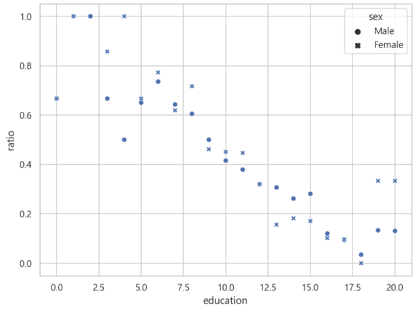

#### 로지스틱 회귀 분석

```python
model_wrole = sm.Logit.from_formula("ratio ~ education + sex", data=df)
result_wrole = model_wrole.fit(disp=1)
print(result_wrole.summary())
```
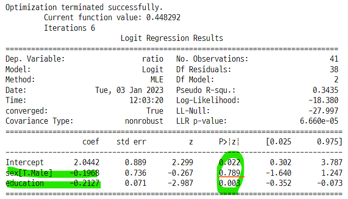

#### 독립변수 선택
- sex의 계수는 유의확률에 따라서 기각할 수 있다.

```python
model_wrole_2 = sm.Logit.from_formula("ratio ~ education", data=df)
result_wrole_2 = model_wrole_2.fit(disp=1)
print(result_wrole_2.summary())
```
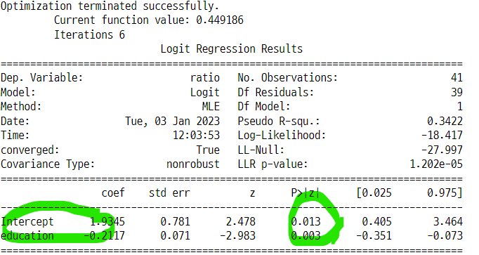

#### 판별함수의 기준값
- z=0 or z=0.5 확인 필요

```python
(0.5 - result_wrole_2.params[0]) / result_wrole_2.params[1]

>>> print

6.775659932156046
```

#### 예측값과 종속값의 비교
- 회귀분석이므로 예측값의 형태가 로지스틱 함수의 형태가 아닌 선형적인 형태이다.

```python
plt.figure(figsize=(8, 6))
sns.scatterplot(x="education", y="ratio", data=df)
xx = np.linspace(0, 20, 100)
df_pred = pd.DataFrame({"education" : xx})
plt.plot(xx, result_wrole_2.predict(df_pred), "r-", lw=3, label="예측")
plt.legend()
plt.show() ;
```
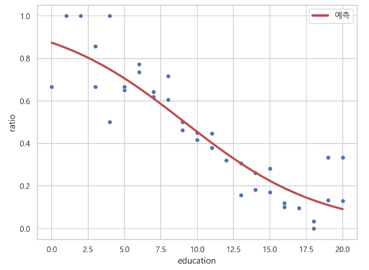

## 로지스틱 회귀분석의 분류문제 사용

### 1. 와인데이터의 로지스틱 회귀 모형 분류

#### 데이터 임포트와 전처리
- taste 컬럼 생성 : quality 값이 5이상이면 1.0, quality 값이 5미만이면 0.0

```python
red = pd.read_csv("../../all_data/wine_data/winequality-red.csv", sep=";")
white = pd.read_csv("../../all_data/wine_data/winequality-white.csv", sep=";")

red["color"] = 1.0
white["color"] = 0.0
wine = pd.concat([red, white], axis=0)
wine.head()
```
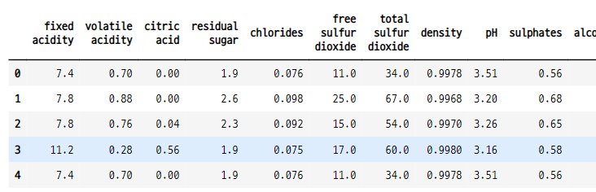

- 화이트와인과 레드와인 데이터의 갯수

```python
np.unique(wine["color"], return_counts=True)

>>> print

(array([0., 1.]), array([4898, 1599], dtype=int64))
```

- taste 컬럼 생성 : quality 컬럼의 값이 5보다 크면 1, 작으면 0
    - taste 컬럼으로 베르누이분포를 따르는 분류모형을 사용할 수 있다.

```python
wine["taste"] = [1.0 if grade > 5 else 0.0 for grade in wine["quality"]]
wine["taste"].unique()

>>> print

array([0., 1.])
```

- 특징변수와 종속변수 생성

```python
X = wine.drop(["taste", "quality"], axis=1)
y = wine["taste"]
```

#### sklearn의 로지스틱 회귀모형 패키지 임포트
- 학습-검증을 위한 데이터 분리
- 모형 생성 및 모수 추정
- 학습, 검증 데이터에 대한 예측값 accuracy_score() 계산

```python
from sklearn.model_selection import train_test_split
from sklearn.linear_model import LogisticRegression
from sklearn.metrics import accuracy_score

X_train, X_test, y_train, y_test = train_test_split(X, y, test_size=0.2,
                                                   random_state=13)

X_train.shape, X_test.shape, y_train.shape, y_test.shape

>>> print

((5197, 12), (1300, 12), (5197,), (1300,))
```

- 로지스틱 모형 생성 및 모수 추정

```python
model_logit = LogisticRegression(solver="liblinear", random_state=13)
result_logit = model_logit.fit(X_train, y_train)
```

- 학습, 검증 데이터의 예측값으로 acc score 계산

```python
y_pred_tr = result_logit.predict(X_train)
y_pred_test = result_logit.predict(X_test)

print("train acc : {}".format(accuracy_score(y_train, y_pred_tr)))
print("test acc : {}".format(accuracy_score(y_test, y_pred_test)))

>>> print

train acc : 0.7427361939580527
test acc : 0.7438461538461538
```

### 2. pipeline 모형 생성
- SS 스케일링 적용
- 로지스틱 회귀 모형 생성

```python
from sklearn.pipeline import Pipeline
from sklearn.preprocessing import StandardScaler

estimators = [
    ("scaler", StandardScaler()),
    ("clf", LogisticRegression(solver="liblinear", random_state=13))]

pipe = Pipeline(estimators)
pipe.fit(X_train, y_train)

>>> print

Pipeline(steps=[('scaler', StandardScaler()),
                ('clf',
                 LogisticRegression(random_state=13, solver='liblinear'))])
```
#### pipeline 모델 acc 점수 확인

```python
pp_pred_tr = pipe.predict(X_train)
pp_pred_test = pipe.predict(X_test)

print("logit train acc : {}".format(accuracy_score(y_train, pp_pred_tr)))
print("logit test acc : {}".format(accuracy_score(y_test, pp_pred_test)))

>>> print

logit train acc : 0.7444679622859341
logit test acc : 0.7469230769230769
```

#### 의사결정나무 모형과 로지스틱 회귀모형의 성능비교
- 의사결정나무의 학습, 검증 데이터의 성능

```python
from sklearn.tree import DecisionTreeClassifier

model_tree = DecisionTreeClassifier(max_depth=2, random_state=13)
result_tree = model_tree.fit(X_train, y_train)

dt_pred_tr = result_tree.predict(X_train)
dt_pred_test = result_tree.predict(X_test)

print("dt train acc : {}".format(accuracy_score(y_train, dt_pred_tr)))
print("dt test acc : {}".format(accuracy_score(y_test, dt_pred_test)))

>>> print

dt train acc : 0.7294593034442948
dt test acc : 0.7161538461538461
```

- roc curve 비교
    - 로지스틱 회귀모형은 그레디언트 벡터를 최적화하기 위해 최대경사법을 사용한다.
    - 따라서 시도 횟수가 많다.
    - 의사결정나무의 성능보다 더 좋다.

```python
## 반복문의 순회객체로 사용
models = {"logit" : pipe, "dtree" : result_tree}

plt.figure(figsize=(8, 6))
plt.plot([0, 1], [0, 1], "k--", lw=1)

## 두 모델에서 계산된 fpr, tpr 값을 저장
fpr = {"logit" : 0, "dtree" : 0}
tpr = {"logit" : 0, "dtree" : 0}

for model_name, model in models.items() :
    pred = model.predict_proba(X_test)[:, 1]
    fpr[model_name], tpr[model_name], thr = roc_curve(y_test, pred)
    plt.plot(fpr[model_name], tpr[model_name], label=model_name)

plt.legend()
plt.show() ;
```
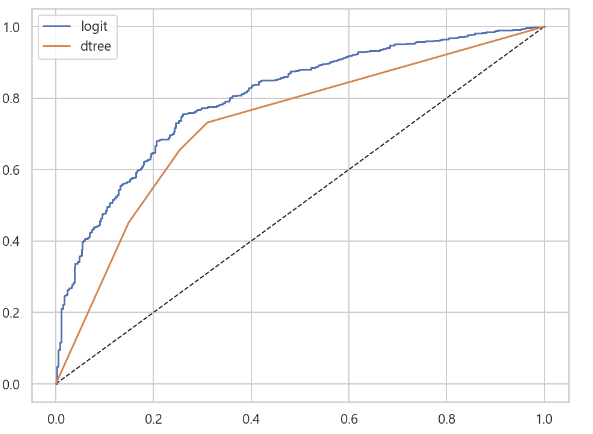


#### auc score 비교

```python
fpr["logit"][:10]

>>> print

array([0.        , 0.00209644, 0.00209644, 0.00209644, 0.00209644,
       0.00209644, 0.00209644, 0.00419287, 0.00419287, 0.00628931])


fpr["dtree"]

>>> print

array([0.        , 0.14884696, 0.25366876, 0.31027254, 1.        ])

print("logit auc : {}".format(auc(fpr["logit"], tpr["logit"])))
print("dtree auc : {}".format(auc(fpr["dtree"], tpr["dtree"])))

>>> print

logit auc : 0.8029069900731333
dtree auc : 0.727859419060501
```

#### 분류결과표 비교

```python
## 로지스틱 회귀 모형
print(confusion_matrix(y_test, pp_pred_test))

>>> print

[[281 196]
 [133 690]]

## 의사결정 나무 모형
print(confusion_matrix(y_test, dt_pred_test))

>>> print

[[329 148]
 [221 602]]
```

#### 분류결과보고서 비교

```python
print("===logistic regression===")
print(classification_report(y_test, pp_pred_test))
print("===decision tree===")
print(classification_report(y_test, dt_pred_test))
```
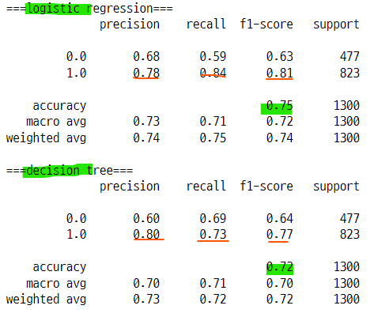

#### statsmodels의 로지스틱 회귀 모형으로 분류
- 특징변수 스케일링
- 컬럼명 변경 : 포뮬러 식에 사용하기 위함

```python
## 스케일링
ss = StandardScaler().fit(X)
X_ss = ss.transform(X)
X_ss_pd = pd.DataFrame(X_ss, columns=X.columns)
y_pd = pd.DataFrame(y, columns=["taste"]).reset_index(drop=True)

## 스케일링 한 특징변수와 종속변수를 합하여 새로운 df 생성
new_wine = pd.concat([X_ss_pd, y_pd], axis=1)

## 컬럼명 변경
new_wine.columns = [col.replace(" ", "_") for col in new_wine.columns]

## 로지스틱 회귀모형
model_sm_logit = sm.Logit.from_formula(
    "taste ~ " + " + ".join([col for col in new_wine.columns[:-1]]), data=new_wine)
result_sm_logit = model_sm_logit.fit()
print(result_sm_logit.summary())
```
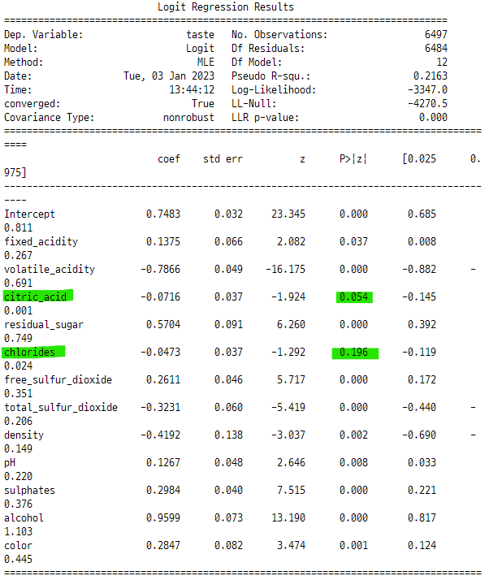

#### 유의확률이 큰 coef 제외 후 다시 분석
- citric_acid, chlorides 컬럼 제외

```python
new_col = list(set(new_wine.columns).difference(["taste", "citric_acid", "chlorides"]))
model_sm_logit_2 = sm.Logit.from_formula("taste ~ " + " + ".join(new_col), data=new_wine)
result_sm_logit_2 = model_sm_logit_2.fit(disp=0)
print(result_sm_logit_2.summary())
```
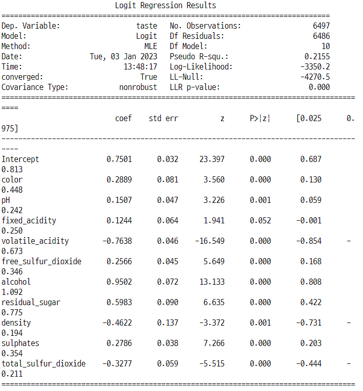

#### roc curve, auc score

```python
sm_y_pred = result_sm_logit_2.predict(new_wine.iloc[:, 0:-1])

plt.figure(figsize=(8, 6))
fpr, tpr, thr = roc_curve(new_wine["taste"], sm_y_pred)
plt.plot(fpr, tpr)
plt.show() ;
```


#### auc score
- sklearn의 로지스틱 모형과 의사결정나무 모형과 비교했을 때 보다 auc score 가 약간 높다.
- 변수를 제거한 것이 반영 됨

```python
auc(fpr, tpr)

>>> print

0.8035506382610711
```

## 3. 인디언 당뇨병 데이터로 로지스틱 회귀분석

#### 데이터 임포트

```python
pima = pd.read_csv("../../04_machine_learning/ML_tutorial-master/ML_tutorial-master/dataset/diabetes.csv")
pima.head()
```
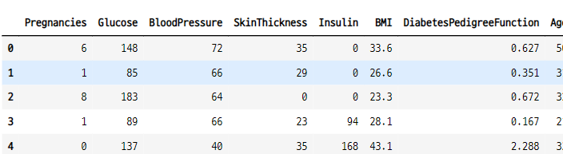

#### 데이터 타입 변환

```python
pima = pima.astype("float")
pima.info()
```
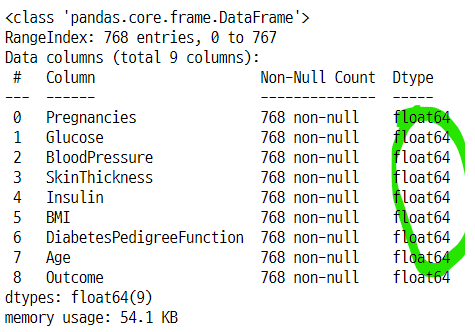

#### 0 값 확인
- astype(int)로하면 True=1, False=0으로 바뀐다.
- 이것을 합하면 각 컬럼별 0값의 갯수가 나온다.

```python
(pima==0).astype(int).sum()
```
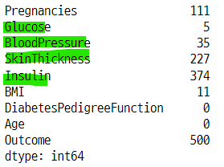

#### 특징벡터 별 평균값으로 0 값 대체
- replace() 함수를 사용하여 간편하게 변경할 수 있다.

```python
zero_col = ["Glucose", "BloodPressure", "SkinThickness", "BMI"]
zero_col

>>> print

['Glucose', 'BloodPressure', 'SkinThickness', 'BMI']

pima[zero_col] = pima[zero_col].replace(0, pima[zero_col].mean())
```

- 평균값으로 대체 후 다시 0 값 확인

```python
(pima==0).astype(int).sum()
```
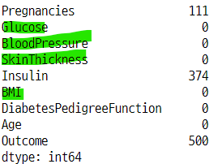

#### 0값을 제거한 후 컬럼별 상관관계 확인

```python
sns.set(rc={"figure.figsize" : (10, 8)})
sns.heatmap(pima.corr().round(1), annot=True, cmap="YlGn")
plt.show() ;
```

#### 종속변수인 outcome 과 상관관계가 높은 특징벡터의 regplot

```python
sns.set_style("darkgrid")
sns.set(rc={"figure.figsize" : (8, 6)})
fig, ax = plt.subplots(ncols=2)
sns.regplot(x="Glucose", y="Outcome", data=pima, ax=ax[0])
sns.regplot(x="BMI", y="Outcome", data=pima, ax=ax[1])
plt.show() ;
```
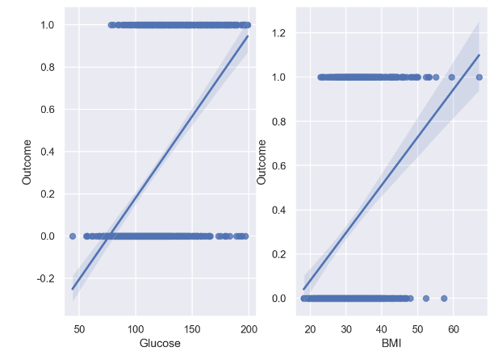

#### 학습-검증 데이터 분리

```python
X = pima.drop(["Outcome"], axis=1)
y = pima["Outcome"]

X_train, X_test, y_train, y_test = train_test_split(X, y, test_size=0.2,
                                                    random_state=13, stratify=y)

X_train.shape, X_test.shape, y_train.shape, y_test.shape

>>> print

((614, 8), (154, 8), (614,), (154,))
```
- 검증 데이터의 클래스 갯수 확인

```python
np.unique(y_test, return_counts=True)

>>> print

(array([0., 1.]), array([100,  54], dtype=int64))
```

#### pipeline 모델 생성

```python
from sklearn.pipeline import Pipeline
from sklearn.preprocessing import StandardScaler

estimators = [("scaler", StandardScaler()),
             ("clf", LogisticRegression(solver="liblinear", random_state=13))]
pima_pipe = Pipeline(estimators)
pima_pipe.fit(X_train, y_train)

>>> print

Pipeline(steps=[('scaler', StandardScaler()),
                ('clf',
                 LogisticRegression(random_state=13, solver='liblinear'))])
```

#### 모형의 성능 지표

```python
from sklearn.metrics import (accuracy_score, precision_score, recall_score,
                            f1_score, roc_curve, roc_auc_score)

pima_pred_test = pima_pipe.predict(X_test)

print("acc : {}".format(accuracy_score(y_test, pima_pred_test)))
print("precision : {}".format(precision_score(y_test, pima_pred_test)))
print("recall : {}".format(recall_score(y_test, pima_pred_test)))
print("f1 : {}".format(f1_score(y_test, pima_pred_test)))
print("auc : {}".format(roc_auc_score(y_test, pima_pred_test)))

>>> print

acc : 0.7727272727272727
precision : 0.7021276595744681
recall : 0.6111111111111112
f1 : 0.6534653465346535
auc : 0.7355555555555556
```

#### 로지스틱 회귀 모형의 계수값 크기 확인
- 계수값은 독립변수가 종속변수에 영향을 미치는 정도를 의미한다.
- 어떤 계수값이 큰지 확인하기 위해 컬럼명과 계수값을 하나의 데이터 프레임으로 합한다.

```python
coef = list(pima_pipe["clf"].coef_[0])
coef

>>> print

[0.3542658884412649,
 1.201424442503758,
 -0.15840135536286706,
 0.033946577129299514,
 -0.16286471953988127,
 0.6204045219895111,
 0.3666935579557874,
 0.17195965447035097]
```

- 현재 데이터의 컬럼명을 라벨 변수에 저장

```python
labels = list(X_train.columns)
labels

>>> print

['Pregnancies',
 'Glucose',
 'BloodPressure',
 'SkinThickness',
 'Insulin',
 'BMI',
 'DiabetesPedigreeFunction',
 'Age']
```

- 컬럼명과 계수값을 하나의 데이터 프레임으로 더하기

```python
features = pd.DataFrame({"features" : labels, "importance" : coef})
features.sort_values("importance", ascending=False, inplace=True)
features
```
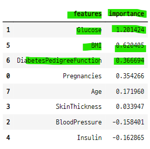

- 새로운 컬럼 생성 : 0을 기준으로 계수값 크기 비교 

```
features["positive"] = features["importance"] > 0
features.set_index("features", inplace=True)
features
```
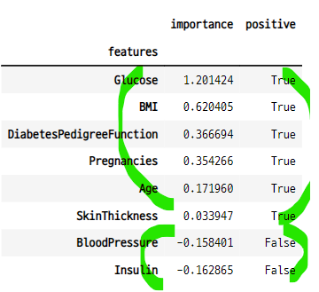

#### 계수값 크기를 막대그래프로 나타내기

```python
features["importance"].plot(kind="barh", figsize=(11, 6),
                           color=features["positive"]\
                            .map({True:"blue", False:"red"}))
plt.xlabel("Importance coef")
plt.show() ;
```
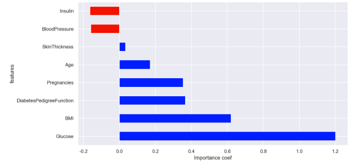


