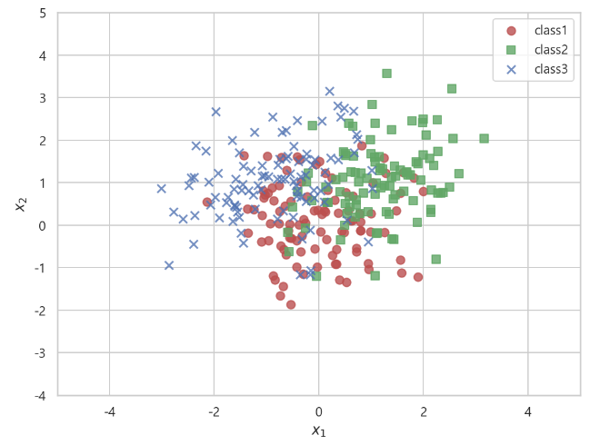
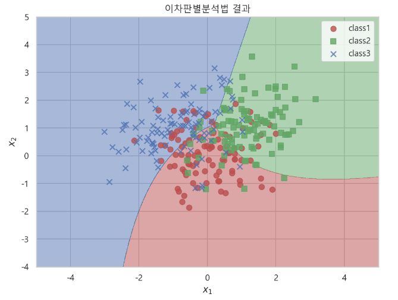
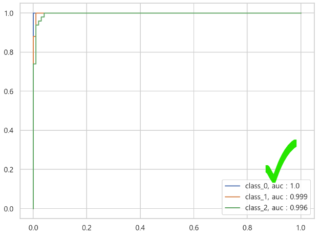
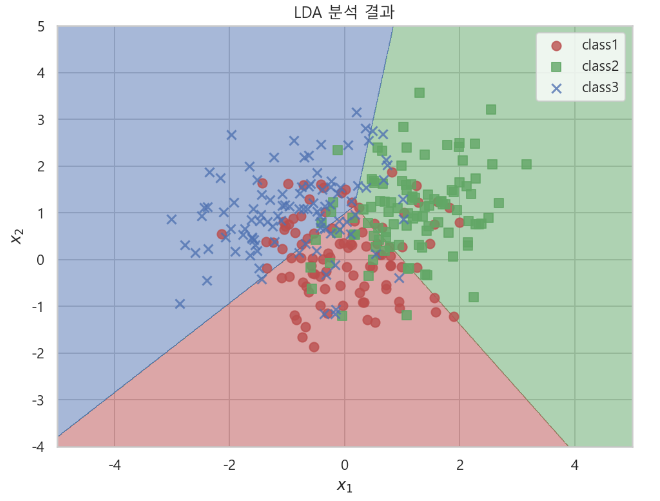
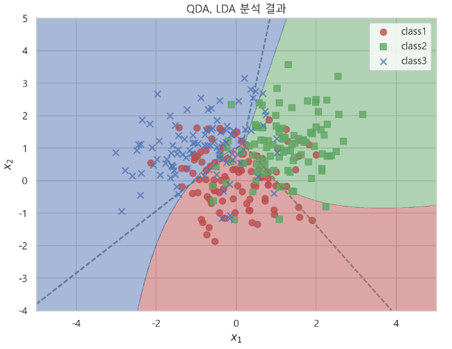
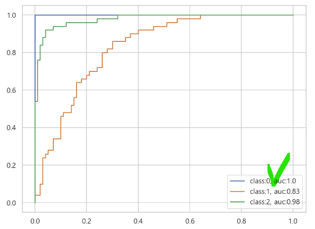
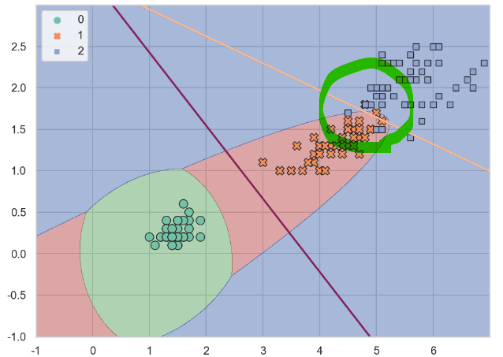
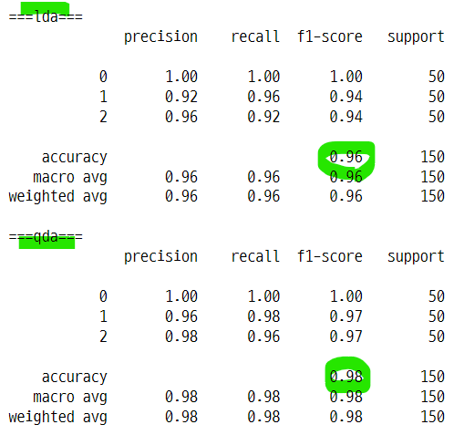
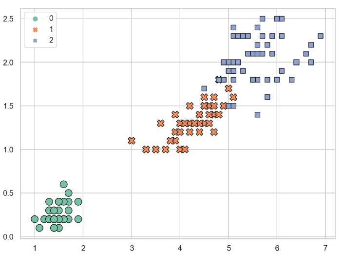

# 선형판별분석법과 이차판별분석법
- `LDA와 QDA는 분류문제의 확률론적 생성모형(genaritive model)에 속한다.`
- 예측
    - 회귀분석
    - 분류문제
        - 확률론적 모형
            - **생성모형 : LDA/QDA, 나이브베이즈 모형**
            - 판별모형 : 로지스틱 회귀모형, 의사결정나무
        - 판별함수 모형
            - 퍼셉트론, 서포트벡터머신, 딥러닝
- 조건부 확률을 베이즈 정리를 사용하여 계산하고 가장 큰 값을 선택하는 방식이다.
    - 베이즈 정리의 가능도를 먼저 계산하고 조건부 확률을 계산한다.

## 1. 생성모형
- `생성모형 generative model` : 생성모형은 조건부 확률 p(y=k|x)를 베이즈 정리를 사용하여 계산한다.
    - $P(y=k|x) = \dfrac{P(x|y=k)P(y=k)}{p(x)}$
- 각각의 클래스별로 조건부 확률을 계산하고 가장 큰 확률값을 선택한다.
    - 클래스를 예측한다.
- 조건부 확률의 크기만 필요하므로 베이즈 정리의 분자인 정규화 상수 P(x)는 계산하지 않아도 된다.
    - 분자만 계산해도 크기 비교를 할 수 있기 때문

### 1-1. 베이즈 정리의 계산
- `베이즈 정리의 구성`
    - 사후확률 : $P(y=k|x)$, 구하고자 하는 조건부 확률
    - 사전확률 : $P(y=k)$, 종속변수 y가 k일 확률
    - 가능도   : $P(x|y=k)$, 모수를 변수로 표본 데이터를 상수로 입력받는 함수
- `사전확률의 계산`
    - $P(y=k) \approx \dfrac{\text{length of y=k}}{\text{length of y}}$
    - 클래스 k가 될 확률은 k의 갯수와 전체 데이터의 비율로 계산
    - 또는 다른 정보에 의한 확률값이 있다면 그것을 사용해도 된다.
- `가능도의 계산`
    - 최대가능도 방법을 따른다.
    - 조건부 확률이 어떤 분포를 따른다고 가정한다. : pdf를 가정한다.
    - pdf를 가능도함수로 바꾼다. : 식은 그대로 두고, 모수와 표본 데이터의 위치를 바꾼다.
    - L은 pdf의 곱 : $L=\prod (pdf)$ : 여러개의 표본일 경우 각 표본이 독립인 확률변수에서 나온 것으로 볼 수 있다. 독립인 경우 결합 pdf는 주변 pdf의 곱으로 나타낼 수 있다.
    - 로그가능도 : 가능도를 로그변환하여 식을 정리한다. : $LL = \sum(\log(pdf) + \log(pdf))$
    - 모수로 로그가능도를 미분한다. : $\dfrac{\partial LL}{\partial w}$
    - 그레디언트 벡터가 0이 되도록 하는 모수를 구한다. : $\dfrac{\partial LL}{\partial w}=0$
    - 선형이면 조건을 따져서 w 값을 쉽게 구할 수 있다.
    - 선형이 아니면 최적화를 통해 w값을 구한다. : 수치적 최적화, 최대경사법 등

## 2. 선형판별분석법
- `선형판별분석법 Linear Discriminant Analysis, LDA` : 가능도, 즉 각 Y클래스에 대한 X의 조건부확률분포 p(x|y=k)가 하나의 공분산 행렬을 가지는 다변수 정규분포라고 가정한다.
    - 다변수 정규분포 multivariate Gaussian normal distribution
    - $\sum_{k} = \sum \text{for all k}$
    - 각 가능도의 확률분포가 동일하다고 가정

- `로그가능도`
    - 

- `가능도`
    - $p(x|y=k) = C'(x) \exp(w_k^{T}x + w_0)$
    - $C'(x) = \exp C(x)$
    - 로그 변환하면 덧셈으로 분리되면서 로그가능도 식과 같아진다.
    - 자세한 계산방법은 알아 볼 것

- `조건부 확률` : 가능도를 베이즈 정리에 대입하여 식을 정리
    - 

- 이 조건부 확률식을 로그변환
    - $\log P(y=k|x) = \log P(y=k) + w_{k}^T x + w_{k0} - \log P(x) = w_{k}^T x + C_k^{''}$

- 모든 클래스 k에 대해서 동일한 확률분포를 갖는다고 가정하였으므로 이 로그 조건부 확률식이 k1일 때와 k2일 때 같다.
    - $w_{k_1}^T x + C_{k_1}^{''} = w_{k_2}^T x + C_{k_2}^{''}$
    - $(w_{k_1} - w_{k_1})^T x + (C_{k_1}^{''} - C_{k_2}^{''}) = 0 $
    - $w^Tx + C = 0$
    
### 2-1. python
- `클래스 임포트`
    - **from sklearn.discriminant_analysis import LinearDiscriminantAnalysis**
- `모델 생성`
    - **qda = LinearDiscriminantAnalysis(n_components=3, solver="svd", store_covariance=True).fit(X, y)**
    - n_components : 차원의 갯수 (?)
    - solver : 최적화 방법 설정 (?)
    - store_covariance=True : 입력변수의 공분산행렬 예측값을 반환한다.
- `속성`
    - **qda.priors_** : 각 클래스 k의 사전확률 : P(y=k)
    - **qda.means_** : 각 클래스 k에서 기댓값 벡터 mu_k를 추정한 벡터
    - **qda.covariance_** : 각 클래스 k에서 x의 공분산 행렬 sum_k를 추정한 행렬
        - 공분산 행렬이 1개가 반환된다.
- **판별함수의 경계면이 직선 형태이다.**
    - 분류 경계

## 3. 이차판별분석법
- `이차판별분석법 Quadratic Discriminant Analysis, QDA` : 가능도를 독립변수 x가 실수, 확률분포가 다변수 정규분포라고 가정한다.
    - $p(x|y=k) = \dfrac{1}{(2\pi)^{D/2} {\vert\sum_{k}\vert}^{1/2}} \text{exp} \left( - \dfrac{1}{2}(x-\mu_k)^T {\sum_{k}}^{-1} (x-\mu_k) \right)$
- 이 분포를 알고 있으면 조건부 확률분포는 베이즈 정리와 전체확률의 법칙으로 구할 수 있다.
    - $P(y=k|x) = \dfrac{p(x|y=k)P(y=k)}{p(x)} = \dfrac{p(x|y=k)P(y=k)}{\sum_{l} p(x|y=k)P(y=l)}$
    - 사전확률과 가능도를 구한다.
    - 분모는 전체확률의 법칙을 사용하여 계산한다.
    - 식을 정리하면 분자의 가능도 부분과 분모의 일부가 소거된다.
    
### 3-1. python
- `클래스 임포트`
    - **from sklearn.discriminant_analysis import QuadraticDiscriminantAnalysis**
- `모델 생성`
    - **qda = QuadraticDiscriminantAnalysis(store_covariance=True).fit(X, y)**
    - store_covariance=True : 입력변수의 공분산행렬 예측값을 반환한다.
- `속성`
    - **qda.priors_** : 각 클래스 k의 사전확률 : P(y=k)
    - **qda.means_** : 각 클래스 k에서 기댓값 벡터 mu_k를 추정한 벡터
    - **qda.covariance_** : 각 클래스 k에서 x의 공분산 행렬 sum_k를 추정한 행렬
        - 입력변수의 갯수데로 공분산행렬이 반환된다.
- **판별함수의 경계면이 곡선 형태이다.**
    - 분류 경계

## 4. Python

### 4-1. 이차판별분석법 : QDA

#### 샘플 데이터 생성
- sp.stats.multivariate_normal(기대값 벡터, 공분한 행렬)
- rv1 샘플 데이터
    - 기댓값 : [0, 0]
    - 공분산 행렬 : [[0.7, 0.0], [0.0, 0.7]]
- rv2 샘플 데이터
    - 기댓값 : [1, 1] 
    - 공분산 행렬 : [[0.8, 0.2], [0.2, 0.8]]
- rv3 샘플 데이터
    - 기댓값 : [-1, 1] 
    - 공분산 행렬 : [[0.8, 0.2], [0.2, 0.8]]    

- 다변수 정규분포 모형 생성

```python
N = 100
rv1 = sp.stats.multivariate_normal([0, 0], [[0.7, 0.0], [0.0, 0.7]])
rv2 = sp.stats.multivariate_normal([1, 1], [[0.8, 0.2], [0.2, 0.8]])
rv3 = sp.stats.multivariate_normal([-1, 1], [[0.8, 0.2], [0.2, 0.8]])
```

- 각 모형에서 표본 데이터 생성

```python
np.random.seed(0)
X1 = rv1.rvs(N)
X2 = rv2.rvs(N)
X3 = rv3.rvs(N)

X1

>>> print

array([[ 1.47591208,  0.33479554],
       [ 0.81887095,  1.87486576],
       [ 1.56251112, -0.81764934],
       [ 0.794901  , -0.12663453],
       [-0.08635909,  0.34353135],
       [ 0.1205155 ,  1.21673251],
       [ 0.63672984,  0.10180062],
       [ 0.37136262,  0.27917197],
       ...
```

- 종속변수 표본 데이터 생성
    - 0, 1, 2 각각 100개씩 생성

```python
y1 = np.zeros(N)
y2 = np.ones(N)
y3 = 2 * np.ones(N)
```

#### 변수 합하기
- 독립변수 X1, X2, X3 를 np.vstack() 함수로 합친다.
    - vstack은 열의 갯수가 같을때 배열을 아래로 합해준다.
    - 2열로 이루어진 배열이 된다.
- 종속변수 y1, y2, y3 를 np.hstack() 함수로 합친다.
    - hstack은 배열을 하나의 열로 하하여 준다.
    - 0 100개, 1 100개, 2 100개 인 열벡터가 된다.

```python
X = np.vstack([X1, X2, X3])
X

>>> print

array([[ 1.47591208,  0.33479554],
       [ 0.81887095,  1.87486576],
       [ 1.56251112, -0.81764934],
       [ 0.794901  , -0.12663453],
       [-0.08635909,  0.34353135],
       [ 0.1205155 ,  1.21673251],
       ...
```

- X의 모양

```python
X.shape

>>> print

(300, 2)
```

- 종속변수 y 합하기

```python
y = np.hstack([y1, y2, y3])
y

>>> print

array([0., 0., 0., 0., 0., 0., 0., 0., 0., 0., 0., 0., 0., 0., 0., 0., 0.,
       0., 0., 0., 0., 0., 0., 0., 0., 0., 0., 0., 0., 0., 0., 0., 0., 0.,
       0., 0., 0., 0., 0., 0., 0., 0., 0., 0., 0., 0., 0., 0., 0., 0., 0.,
       0., 0., 0., 0., 0., 0., 0., 0., 0., 0., 0., 0., 0., 0., 0., 0., 0.,
       0., 0., 0., 0., 0., 0., 0., 0., 0., 0., 0., 0., 0., 0., 0., 0., 0.,
       0., 0., 0., 0., 0., 0., 0., 0., 0., 0., 0., 0., 0., 0., 0., 1., 1.,
       1., 1., 1., 1., 1., 1., 1., 1., 1., 1., 1., 1., 1., 1., 1., 1., 1.,
       1., 1., 1., 1., 1., 1., 1., 1., 1., 1., 1., 1., 1., 1., 1., 1., 1.,
       1., 1., 1., 1., 1., 1., 1., 1., 1., 1., 1., 1., 1., 1., 1., 1., 1.,
       1., 1., 1., 1., 1., 1., 1., 1., 1., 1., 1., 1., 1., 1., 1., 1., 1.,
       1., 1., 1., 1., 1., 1., 1., 1., 1., 1., 1., 1., 1., 1., 1., 1., 1.,
       1., 1., 1., 1., 1., 1., 1., 1., 1., 1., 1., 1., 1., 2., 2., 2., 2.,
       2., 2., 2., 2., 2., 2., 2., 2., 2., 2., 2., 2., 2., 2., 2., 2., 2.,
       2., 2., 2., 2., 2., 2., 2., 2., 2., 2., 2., 2., 2., 2., 2., 2., 2.,
       2., 2., 2., 2., 2., 2., 2., 2., 2., 2., 2., 2., 2., 2., 2., 2., 2.,
       2., 2., 2., 2., 2., 2., 2., 2., 2., 2., 2., 2., 2., 2., 2., 2., 2.,
       2., 2., 2., 2., 2., 2., 2., 2., 2., 2., 2., 2., 2., 2., 2., 2., 2.,
       2., 2., 2., 2., 2., 2., 2., 2., 2., 2., 2.])
```

#### 데이터 샘플의 분포도
- 각 데이터 군집의 가운데는 기댓값과 같다.

```python
plt.figure(figsize=(8, 6))
plt.scatter(X1[:, 0], X1[:, 1], s=50, marker="o", color="r", alpha=0.8,
            label="class1")
plt.scatter(X2[:, 0], X2[:, 1], s=50, marker="s", color="g", alpha=0.8,
            label="class2")
plt.scatter(X3[:, 0], X3[:, 1], s=50, marker="x", color="b", alpha=0.8,
            label="class3")
plt.xlabel("$x_1$")
plt.ylabel("$x_2$")
plt.xlim(-5, 5)
plt.ylim(-4, 5)
plt.legend()
plt.show() ;
```


#### QDA 모델 생성

```python
from sklearn.discriminant_analysis import QuadraticDiscriminantAnalysis

qda = QuadraticDiscriminantAnalysis(store_covariance=True).fit(X, y)
qda

>>> print

QuadraticDiscriminantAnalysis(store_covariance=True)
```

#### QDA 속성 : 클래스별 사전확률
- 0, 1, 2 의 갯수가 동일하므로 1/3이 나온다.

```python
qda.priors_

>>> print

array([0.33333333, 0.33333333, 0.33333333])
```

#### QDA 속성 : 클래스별 x의 기대값 벡터 mu_k의 추정치 벡터
- 기댓값과 거의 유사한 값을 반환한다.

```python
qda.means_

>>> print

array([[-8.01254084e-04,  1.19457204e-01],
       [ 1.16303727e+00,  1.03930605e+00],
       [-8.64060404e-01,  1.02295794e+00]])

np.round(qda.means_, 0)

>>> print

array([[-0.,  0.],
       [ 1.,  1.],
       [-1.,  1.]])
```

#### QDA 속성 : 클래스별 x의 공분산 행렬 Sigma_k의 추정치 행렬
- store_covariance=True 일때만 반환됨

```python
qda.covariance_[0]

>>> print

array([[ 0.73846319, -0.01762041],
       [-0.01762041,  0.72961278]])

qda.covariance_[1]

>>> print

array([[0.66534246, 0.21132313],
       [0.21132313, 0.78806006]])

qda.covariance_[2]

>>> print

array([[0.9351386 , 0.22880955],
       [0.22880955, 0.79142383]])
```

### 4-2. 이차판별분석법의 판별 경계면
- 분류결과
- XX1(x축 범위), XX2(y축 범위)의 표본을 입력받아 qda 모형이 클래스를 예측한다.
    - 0, 1, 2
- 예측 클래스가 같은 것 끼리 같은 색의 분포에 해당한다. 
- 이러한 곡선의 분류 경계면이 나오는 이유는 qda 모형이 기댓값 벡터와 공분산 행렬을 가진 3가지의 샘플 데이터를 합친 X와 0, 1, 2의 클래스를 합친 y를 학습하였기 때문이다. 

```python
x1min, x1max = -5, 5
x2min, x2max = -4, 5

XX1, XX2 = np.meshgrid(np.arange(x1min, x1max, (x1max-x1min)/1000),
                      np.arange(x2min, x2max, (x2max-x2min)/1000))
YY = np.reshape(qda.predict(np.array([XX1.ravel(), XX2.ravel()]).T), XX1.shape)


plt.figure(figsize=(8, 6))
cmap = mpl.colors.ListedColormap(sns.color_palette(["r", "g", "b"]).as_hex())
plt.contourf(XX1, XX2, YY, cmap=cmap, alpha=0.5)
plt.scatter(X1[:, 0], X1[:, 1], s=50, color="r", marker="o", alpha=0.8,
            label="class1")
plt.scatter(X2[:, 0], X2[:, 1], s=50, color="g", marker="s", alpha=0.8,
           label="class2")
plt.scatter(X3[:, 0], X3[:, 1], s=50, color="b", marker="x", alpha=0.8,
           label="class3")

plt.xlabel("$x_1$")
plt.ylabel("$x_2$")
plt.xlim(x1min, x1max)
plt.ylim(x2min, x2max)
plt.title("이차판별분석법 결과")
plt.legend()
plt.show() ;
```


#### YY 의 형태
- XX1과 XX2를 하나의 열로 만든 후 np.array()로 하나의 배열로 만든다.
- 이것을 qda 모형으로 예측하면 클래스 값이 1001000 개 만들어 진다.
- 이것을 다시 XX1의 모양인 (1001, 1000)으로 재배열한다.

```python
YY = np.reshape(qda.predict(np.array([XX1.ravel(), XX2.ravel()]).T), XX1.shape)
YY

>>> print

array([[2., 2., 2., ..., 0., 0., 0.],
       [2., 2., 2., ..., 0., 0., 0.],
       [2., 2., 2., ..., 0., 0., 0.],
       ...,
       [2., 2., 2., ..., 1., 1., 1.],
       [2., 2., 2., ..., 1., 1., 1.],
       [2., 2., 2., ..., 1., 1., 1.]])
```

### 4-3. 연습문제
- 이차판별분석법을 사용하여 붓꽃 분류문제를 풀어라.
- 성능을 분류결과표와 분류보고서로 출력하라.
- 각 클래스에 대한 ROC 커브를 그려라.

#### 데이터 임포트, qda 모형 생성

```python
from sklearn.datasets import load_iris

iris = load_iris()
X_iris = iris.data
y_iris = iris.target
qda_iris = QuadraticDiscriminantAnalysis(store_covariance=True).fit(X_iris, y_iris)
qda_iris

>>> print

QuadraticDiscriminantAnalysis(store_covariance=True)
```

#### 이차판별분석법 예측값

```python
qda_y_pred = qda_iris.predict(X_iris)
qda_y_pred

>>> print

array([0, 0, 0, 0, 0, 0, 0, 0, 0, 0, 0, 0, 0, 0, 0, 0, 0, 0, 0, 0, 0, 0,
       0, 0, 0, 0, 0, 0, 0, 0, 0, 0, 0, 0, 0, 0, 0, 0, 0, 0, 0, 0, 0, 0,
       0, 0, 0, 0, 0, 0, 1, 1, 1, 1, 1, 1, 1, 1, 1, 1, 1, 1, 1, 1, 1, 1,
       1, 1, 1, 1, 2, 1, 1, 1, 1, 1, 1, 1, 1, 1, 1, 1, 1, 2, 1, 1, 1, 1,
       1, 1, 1, 1, 1, 1, 1, 1, 1, 1, 1, 1, 2, 2, 2, 2, 2, 2, 2, 2, 2, 2,
       2, 2, 2, 2, 2, 2, 2, 2, 2, 2, 2, 2, 2, 2, 2, 2, 2, 2, 2, 2, 2, 2,
       2, 1, 2, 2, 2, 2, 2, 2, 2, 2, 2, 2, 2, 2, 2, 2, 2, 2])
```

#### 분류결과표와 분류결과 보고서
- 패키지 임포트

```python
from sklearn.metrics import (confusion_matrix, classification_report)
```

- 분류결과표

```python
print(confusion_matrix(y_iris, qda_y_pred))

>>> print

[[50  0  0]
 [ 0 48  2]
 [ 0  1 49]]
```

- 분류결과보고서

```python
print(classification_report(y_iris, qda_y_pred))

>>> print

              precision    recall  f1-score   support

           0       1.00      1.00      1.00        50
           1       0.98      0.96      0.97        50
           2       0.96      0.98      0.97        50

    accuracy                           0.98       150
   macro avg       0.98      0.98      0.98       150
weighted avg       0.98      0.98      0.98       150

```

#### 각 클래스별 roc curve 그리기
- 클래스별로 roc curve를 그리려면 종속변수 y를 원핫인코딩 형태의 벡터로 바꿔주어야 한다.
    - 0이면 (1, 0, 0), 1이면 (0, 1, 0), 2이면 (0, 0, 1)
- **roc_curve는 예측값으로 판별함수값 decision_function() 이나, 확률값 predict_proba()을 입력해주어야 한다.**
- label_binarize 패키지 임포트

```python
from sklearn.preprocessing import label_binarize
```

- 종속변수를 label_binarize로 변형한다.
    - bow 데이터 형태가 된다.
    - 0이면 (1, 0, 0)
    - 1이면 (0, 1, 0)
    - 0이면 (0, 0, 1)

```python
y_vec = label_binarize(y=y_iris, classes=[0, 1, 2])
y_vec

>>> print

array([[1, 0, 0],
       [1, 0, 0],
       [1, 0, 0],
       [1, 0, 0],
       [1, 0, 0],
       [1, 0, 0],
       [1, 0, 0],
       ...
```

- roc curve
    - 클래스 0, 1, 2 별로 성능을 구하기 위해서 label_binarize로 만든 종속변수를 순차적으로 사용한다.

```python
from sklearn.metrics import roc_curve

plt.figure(figsize=(8, 6))

for i in range(3) :
    model = QuadraticDiscriminantAnalysis().fit(X_iris, y_vec[:, i])
    fpr, tpr, thr = roc_curve(y_vec[:, i], model.predict_proba(X_iris)[:, 1])

    from sklearn.metrics import auc
    auc_score = auc(fpr, tpr)

    plt.plot(fpr, tpr, label="class_{}, auc : {}".format(i, round(auc_score, 3)))

plt.legend()
plt.show() ;
```


### 4-3. 선형판별분석법 : LDA

#### LDA 패키지 임포트

```python
from sklearn.discriminant_analysis import LinearDiscriminantAnalysis
```

#### LDA 모형 생성 및 학습
- 모형을 만드는데 필요한 인수들을 설정해준다.

```python
lda = LinearDiscriminantAnalysis(n_components=2, solver="svd",
                                 store_covariance=True).fit(X, y)
lda

>>> print

LinearDiscriminantAnalysis(n_components=2, store_covariance=True)
```

#### LDA 속성 : 예측 기대값
- 예측 기댓값은 실제 표본 데이터를 생성할 적용한 기댓값과 거의 같다.

```python
lda.means_

>>> print

array([[-8.01254084e-04,  1.19457204e-01],
       [ 1.16303727e+00,  1.03930605e+00],
       [-8.64060404e-01,  1.02295794e+00]])

np.round(lda.means_, 2)

>>> print

array([[-0.  ,  0.12],
       [ 1.16,  1.04],
       [-0.86,  1.02]])
```

#### LDA 속성 : 예측 공분산 행렬
- LDA의 특성상 모든 클래스별 공분산 행렬이 같다고 가정한다.
- 반환되는 공분산 행렬도 한개이다.

```python
lda.covariance_

>>> print

array([[0.7718516 , 0.13942905],
       [0.13942905, 0.7620019 ]])
```

### 4-4. LDA의 분류 결과
- 판별함수의 경계면이 직선 형태이다.

```python
x1min, x1max = -5, 5
x2min, x2max = -4, 5

XX1, XX2 = np.meshgrid(np.arange(x1min, x1max, (x1max-x1min)/1000),
                      np.arange(x2min, x2max, (x2max-x2min)/1000))
YY_lda = np.reshape(lda.predict(np.array([XX1.ravel(), XX2.ravel()]).T), XX1.shape)

plt.figure(figsize=(8, 6))
cmap = mpl.colors.ListedColormap(sns.color_palette(["r", "g", "b"]).as_hex())
plt.contourf(XX1, XX2, YY_lda, cmap=cmap, alpha=0.5)
plt.scatter(X1[:, 0], X1[:, 1], s=50, color="r", marker="o", alpha=0.8,
           label="class1")
plt.scatter(X2[:, 0], X2[:, 1], s=50, color="g", marker="s", alpha=0.8,
           label="class2")
plt.scatter(X3[:, 0], X3[:, 1], s=50, color="b", marker="x", alpha=0.8,
           label="class3")

plt.xlabel("$x_1$")
plt.ylabel("$x_2$")
plt.xlim(x1min, x1max)
plt.ylim(x2min, x2max)
plt.title("LDA 분석 결과")
plt.legend()
plt.show() ;
```



### 4-5. QDA와 LDA의 분류 결과 비교
- 경계면에 따라서 예측 클래스가 다르다.
    - QDA : 곡선 경계면
    - LDA : 직선 경계면

```python
x1min, x1max = -5, 5
x2min, x2max = -4, 5

XX1, XX2 = np.meshgrid(np.arange(x1min, x1max, (x1max-x1min)/1000),
                      np.arange(x2min, x2max, (x2max-x2min)/1000))
YY_lda = np.reshape(lda.predict(np.array([XX1.ravel(), XX2.ravel()]).T), XX1.shape)
YY_qda = np.reshape(qda.predict(np.array([XX1.ravel(), XX2.ravel()]).T), XX1.shape)

plt.figure(figsize=(8, 6))
cmap = mpl.colors.ListedColormap(sns.color_palette(["r", "g", "b"]).as_hex())
plt.contourf(XX1, XX2, YY_qda, cmap=cmap, alpha=0.5)
plt.contour(XX1, XX2, YY_lda, cmap=cmap, alpha=0.5, linestyles="dashed")
plt.scatter(X1[:, 0], X1[:, 1], s=50, color="r", marker="o", alpha=0.8,
           label="class1")
plt.scatter(X2[:, 0], X2[:, 1], s=50, color="g", marker="s", alpha=0.8,
           label="class2")
plt.scatter(X3[:, 0], X3[:, 1], s=50, color="b", marker="x", alpha=0.8,
           label="class3")

plt.xlabel("$x_1$")
plt.ylabel("$x_2$")
plt.xlim(x1min, x1max)
plt.ylim(x2min, x2max)
plt.title("QDA, LDA 분석 결과")
plt.legend()
plt.show() ; 
```


### 4-6. 연습문제 2
- 선형판별분석법을 사용하여 붓꽃 분류문제를 풀어라.
- 성능을 분류결과표와 분류보고서로 출력하라.
- 각 클래스에 대한 ROC 커브를 그려라.

#### 붓꽃 데이터 임포트

```python
from sklearn.datasets import load_iris

iris = load_iris()
X2 = iris.data
y2 = iris.target
```

#### LDA 모형 생성

```python
from sklearn.discriminant_analysis import LinearDiscriminantAnalysis

model_lda = LinearDiscriminantAnalysis().fit(X2, y2)
model_lda

>>> print

LinearDiscriminantAnalysis()
```

#### 예측

```python
lda_y_pred = model_lda.predict(X2)
lda_y_pred

>>> print

array([0, 0, 0, 0, 0, 0, 0, 0, 0, 0, 0, 0, 0, 0, 0, 0, 0, 0, 0, 0, 0, 0,
       0, 0, 0, 0, 0, 0, 0, 0, 0, 0, 0, 0, 0, 0, 0, 0, 0, 0, 0, 0, 0, 0,
       0, 0, 0, 0, 0, 0, 1, 1, 1, 1, 1, 1, 1, 1, 1, 1, 1, 1, 1, 1, 1, 1,
       1, 1, 1, 1, 2, 1, 1, 1, 1, 1, 1, 1, 1, 1, 1, 1, 1, 2, 1, 1, 1, 1,
       1, 1, 1, 1, 1, 1, 1, 1, 1, 1, 1, 1, 2, 2, 2, 2, 2, 2, 2, 2, 2, 2,
       2, 2, 2, 2, 2, 2, 2, 2, 2, 2, 2, 2, 2, 2, 2, 2, 2, 2, 2, 2, 2, 2,
       2, 1, 2, 2, 2, 2, 2, 2, 2, 2, 2, 2, 2, 2, 2, 2, 2, 2])
```

#### 분류결과표

```python
from sklearn.metrics import confusion_matrix

print(confusion_matrix(y2, lda_y_pred))

>>> print

[[50  0  0]
 [ 0 48  2]
 [ 0  1 49]]
```

#### 분류결과 보고서

```python
from sklearn.metrics import classification_report

print(classification_report(y2, lda_y_pred))

>>> print

              precision    recall  f1-score   support

           0       1.00      1.00      1.00        50
           1       0.98      0.96      0.97        50
           2       0.96      0.98      0.97        50

    accuracy                           0.98       150
   macro avg       0.98      0.98      0.98       150
weighted avg       0.98      0.98      0.98       150
```

#### 각 클래스별로 roc curve 그리기

```python
from sklearn.preprocessing import label_binarize

y_vector = label_binarize(y=y2, classes=[0, 1, 2])

plt.figure(figsize=(8, 6))

for i in range(3) :
    model = LinearDiscriminantAnalysis().fit(X2, y_vector[:, i])
    fpr, tpr, thr = roc_curve(y_vector[:, i], model.predict_proba(X2)[:, 1])
    from sklearn.metrics import auc
    auc_score = auc(fpr, tpr)
    plt.plot(fpr, tpr, label="class:{}, auc:{}".format(i, round(auc_score, 2)))

plt.legend()
plt.show() ;
```


## 5 QDA, LDA 모형을사용하여 petal length와 petal width 데이터를 분류한 후 경계면 그리기
- y=1과 y=2를 어떻게 분류하는지에 따라서 성능이 달라짐

```python
qda = QuadraticDiscriminantAnalysis().fit(X2[:, 2:], y2)
lda = LinearDiscriminantAnalysis().fit(X2[:, 2:], y2)

x1min, x1max = -1, 7
x2min, x2max = -1, 3

plt.figure(figsize=(8, 6))
XX1, XX2 = np.meshgrid(np.arange(x1min, x1max, 0.001),
                      np.arange(x2min, x2max, 0.001))
YY_lda = np.reshape(lda.predict(np.array([XX1.ravel(), XX2.ravel()]).T), XX1.shape)
YY_qda = np.reshape(qda.predict(np.array([XX1.ravel(), XX2.ravel()]).T), XX1.shape)
cmap = mpl.colors.ListedColormap(sns.color_palette(["g", "r", "b"]).as_hex())
plt.contour(XX1, XX2, YY_lda)
plt.contourf(XX1, XX2, YY_qda, cmap=cmap, alpha=0.5)
sns.scatterplot(X2[:, 2], X2[:, 3], s=70, palette="Set2",
                edgecolor="k", lw=3, hue=y2, style=y2)

plt.show() ;
```


### 5-1. 분류결과표 비교

#### lda, qda 모형의 예측값
- qda 모형이 좀더 정확하게 예측했다.

```python
y_pred_lda = lda.predict(X2[:, 2:])
y_pred_qda = qda.predict(X2[:, 2:])
```

#### 분류결과표

```python
print("===lda===")
print(confusion_matrix(y2, y_pred_lda))
print("===qda===")
print(confusion_matrix(y2, y_pred_qda))

>>> print

===lda===
[[50  0  0]
 [ 0 48  2]
 [ 0  4 46]]
===qda===
[[50  0  0]
 [ 0 49  1]
 [ 0  2 48]]
```

#### 분류결과보고서
- qda의 성능이 좀더 좋다.

```python
print("===lda===")
print(classification_report(y2, y_pred_lda))
print("===qda===")
print(classification_report(y2, y_pred_qda))
```



## 6. sns.scatterplot 사용

```python
sns.set(rc={"figure.figsize" : (8, 6)})
sns.set_style("whitegrid")
sns.scatterplot(X2[:, 2], X2[:, 3], hue=y2, palette="Set2", style=y2, s=100, edgecolor="k", lw=3)
```



