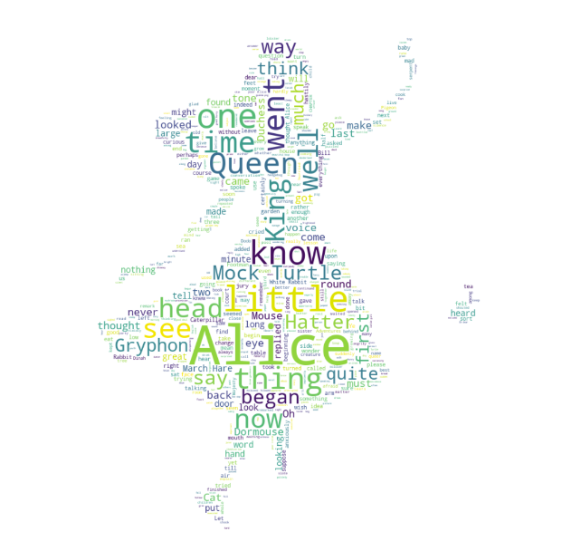
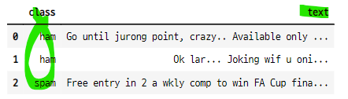
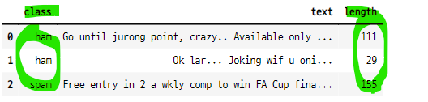
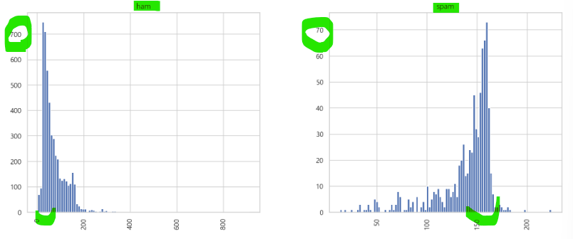
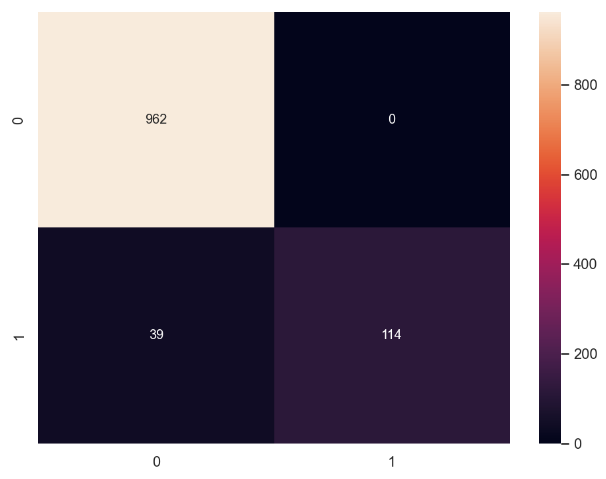
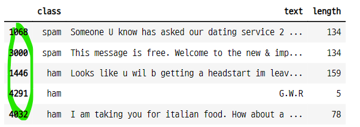

# 나이브베이즈 모형
- `모형 클래스의 종류`
    - **GaussianNB()** : 독립변수의 값이 실수값, 정규분포일 때 사용
    - **BernoulliNB()** : 독립변수의 값이 0 또는 1일때 사용
    - **MultinomialNB()** : 독립변수의 값이 0부터 N일때 사용
- `속성값들`
    - **model.classes_** : 클래스의 종류
    - **model.class_count_** : 클래스별 데이터의 갯수
    - **model.class_prior_** : 클래스별 사전확률
    - **model.class_log_prior_** : 클래스별 사전확률의 로그변환(다항분포, 베르누이분포만)
    - **model.theta_** : 정규분포의 기댓값 mu
    - **model.sigma_** : 정규분포의 분산 simga^2
    - **model.alpha** : 모형의 스무딩 가중치
    - **model.predict_proba([x_new])** : 클래스별 조건부 확률
- `모형의 사용 확장`
    - 1) 다항분포 데이터를 베르누이 나이브베이즈 모형으로 분류한는 경우, 데이터를 이진화(binairze) 하면 성능이 더 높아진다. 픽셀값이 기준값을 기준으로 0과 1로 변환되어 이미지가 더 뚜렷하게 나타난다.(MNIST 숫자데이터 예시)
    - 2) 실수형 독립변수, 이진 독립변수가 혼합되어 있는 데이터의 경우 각각 분리하여 분포에 따라 모형을 혼합하여 분류에 사용할 수 있다. 단 클래스 예측값을 구하기 위해서 모형 각각의 가능도를 구한 후 전체 가능도를 직접 계산해 주어야 한다. (연습문제)
    - 3) 베르누이 분포인 독립변수를 가우시안 나이브베이즈 모형으로 분류하면 성능이 떨어진다.
    - 4) 나이브베이즈 모형의 예측값은 계산과정에서 스무딩 값을 적용한 결과이다.


## 1. 베이즈 추정
- `베이즈 추정법` : 모숫값이 가질 수 있는 모든 가능성의 분포를 계산하는 작업
    - 베이즈 추정법에서는 모수를 확률변수로 본다. 따라서 확률밀도함수를 갖는다.
    - 어떤 값이 가능성이 높고 낮은지 알 수 있다.
- `조건부 확률분포를 구하기 위해 베이즈 정리를 사용한다.`
    - 정규화 상수
    - 가능도
    - 사전분포
    - 사후분포
- `모수 계산 방법`
    - 모수적 방법 : 모수 분포를 표현하는 확률분포함수의 하이퍼모수를 계산한다.(하이퍼파라미터의 갱신)
    - 비모수적 방법 : 모수의 분포와 같은 분포를 갖는 표본집합을 생성하여 모수를 계산한다.
- `켤레 사전확률분포 conjugate prior` : 사전분포와 사후분포가 모숫값만 다르고 함수 형태가 같은 확률밀도함수로 만들어 주는 사전분포
    - 베르누이 분포의 모수의 베이즈 추정시 사전분포를 베타분포를 사용하는데 이때 베타분포는 사후분포와 형태가 갖고 모수가 다르다.
    - 사후분포의 모수는 베타분포의 모수인 하이퍼파라미터의 갱신된 형태.

## 2. 조건부독립
- `조건부독립 conditional independence` : 조건인 C에 대해 A,B의 결합조건부확률이 C에 대한 A와 B 각각의 조건부확률의 곱과 같다.
    - $P(A, B | C) = P(A|C) P(B|C)$
- A, B가 C에 대해 조건부독립인 경우
    - $P(A|B, C) = P(A|C)$ 성립
    - $P(B|A, C) = P(B|C)$ 성립
- 일반적인독립 : 무조건부독립이라고 부른다.
    - $P(A, B) = P(A)P(B)$
- 조건부독립과 무조건부독립은 관계가 없다.
    - 조건부독립이라고해서 무조건부독립이 성립하지 않는다. 역도 성립한다.
    - $P(A, B | C) = P(A|C) P(B|C) \bcancel\rightarrow P(A|B, C) = P(A|C)$
- C가 정해진 경우, C라는 새로운 값이 들어온 경우, C가 알려진 경우의 A,B의 결합밀도확률

## 3. 나이브 가정
- `나이브 가정 naive assumption` : 모든 차원의 개별 독립변수가 서로 조건부독립이라는 가정
- 독립변수 x가 D차원이라고 가정
    - $x = (x_1, \cdots, x_D)$
- 조건부확률에 대한 가능도 함수 : 표본이 x1~xD 가 주어졌을 때 y=k일 조건부확률중 큰 값
    - $P(x|y=k) = P(x_1, \cdots, x_D|y=k)$
- y=k 인 데이터만 모아도 이 가능도함수의 분포 모양을 추정할 수 있다.
    - 붓꽃데이터에서 세토사인 데이터만 모아서 세토사의 확률분포 모양을 추정할 수 있다.
- 그런데 독립변수의 차원 D가 커지면 이러한 방식으로 확률분포를 추정하기 어려워진다.
- `따라서 나이브베이즈 모형에서는 나이브 가정을 사용한다.`
    - 표본 x1도 어떤 독립변수에서 나왔고, x2도 어떤 독립변수에서 나왔다고 본다.
    - 이러한 개별 독립변수들이 일반적인독립(무조건부독립)이 아니라 조건부독립이라고 가정한다.
- 나이브 가정에 따라서 각각의 개별 스칼라 원소 xd의 확률분포의 곱이 된다.    
    - $P(x_1, \cdots, x_d | y=k) = \prod_{d=1}^{D} P(x_d | y=k)$
    - 스칼라 원소의 확률분포함수는 결합확률분포함수보다 추정하기 쉽다.
    - 원래 가능도에서는 결합확률밀도함수를 구한다. Px1,x2,xd(x1,x2,xd)
- 즉 가능도를 나이브 베이즈 가정을 사용한 식을 바꿀 수 있다.
- `구하고자 하는 조건부 확률은 다음과 같아진다.`
    - $\begin{aligned}
P(y=k|x)
&= \dfrac{P(x_1, \cdots, x_D | y=k) P(y=k)}{p(x)} \\
&= \dfrac{(\prod_{d=1}^{D} P(x_d| y=k)) P(y=k)}{p(x)}
\end{aligned}$
    
- `가능도함수를 추정한 후 베이즈 정리로 조건부확률을 계산한다.`

## 4. 여러가지 가능도 모형

### 4-1. 정규분포 가능도 모형
- 가능도의 분포가 정규분포인 모형을 의미한다.
    - x벡터의 원소가 모두 실수이고, 클래스가 특정값 주변에서 발생하는 경우
- 독립변수 xd 마다, 클래스 k 마다 정규분포의 기댓값 mu, sigma가 달라진다.
    - $\mu_{d,k}, \sigma_{d,k}$
    - $P(x_d | y=k) = \dfrac{1}{\sqrt{2\pi\sigma_{d,k}^2}} \exp \left( -\dfrac{(x_d - \mu_{d,k})^2}{2\sigma_{d,k}^2} \right)$
- 각각의 스칼라마다 k 마다 모수값이 다 다르다.

#### python
- `from sklearn.naive_bayes import GaussianNB` : 가우시안 정규분포 나이브베이즈 모형
    - model_gnb = GaussianNB()
- 가능도의 분포에 따라서 3가지 나이브베이즈 모형 클래스가 있다.
    - **GaussianNB** : 정규분포 나이브베이즈 모형
    - **BernoulliNB** : 베르누이분포 나이브베이즈 모형
    - **MultinomialNB** : 다항분포 나이브베이즈 모형
- 사전확률과 관련된 속성들
    - **model.classes_** : 종속변수 Y의 클래스(라벨값)
    - **model.class_count_** : 종속변수 Y의 값이 특정한 클래스인 **표본 데이터의 수**
    - **model.class_prior_** : 종속변수 Y의 무조건부 확률분포 P(Y) (정규분포의 경우)
        - 일반적인 독립관계의 조건부 확률분포
    - **model.class_log_prior_** : 종속변수 Y의 무조건부 확률분포의 로그 log P(Y) (베르누이분포나 다항분포의 경우)    
- 가능도 추정과 관련된 속성값
    - **model.theta_** : 정규분포의 기댓값 mu
    - **model.sigma_** : 정규분포의 분산 simga^2
- 모형의 클래스별 예측 확률
    - **model.predict_proba([x_new])** : y=0일 확률과 y=1일 확률

### 4-2. 베르누이분포 가능도 모형
- 가능도의 분포가 베루누이 분포인 모형을 의미한다.
- 베루누이 분포에서는 xd가 0 또는 1이다.
    - 따라서 이 모형에서는 D개의 독립변수, 즉 D개의 동전으로 구성 된 동전세트가 있다고 볼 수 있다.
    - 동전들의 모수는 동전마다 다 다르다.
- 여기에 k개의 클래스마다 xd의 모수가 다르다.
    - 따라서 각각의 동전마다 클래스 k마다 모수가 다르다.
    - 모수=1이 나올 확률
- 전체 D X K의 동전이 있다고 볼 수 있다.
    - 각각의 클래스 k 마다 D개의 동전 세트가 있다고 볼 수 있다.
    - $P(x_d | y=k) = \mu_{d,k}^{x_d} (1-\mu_{d,k})^{1-x_d}$
    - $P(x_1, \cdots, x_d | y=k) = \prod_{d=1}^{D} \mu_{d,k}^{x_d} (1-\mu_{d,k})^{1-x_d}$
    - 베르누이분포의 확률질량함수가 D번 곱해진다.
    - 모수가 각각의 스칼라와 클래스 마다 다르다.
- 이러한 모형은 D개의 동전 세트마다 확률의 특성이 다르다. 
    - **따라서 동전 D개의 한 세트를 N번 던지 결과를 보고, 어떤 클래스 k의 동전 세트를 던진 것인지 찾아내는 것과 같다.**
    - 5개의 동전 한 세트를 10번 던져서 나온 0, 1 표본을 보고 어떤 클래스 k의 분포와 같은지 찾는 것과 같다.
    
#### python
- `from sklearn.naive_bayes import BernoulliNB` : 베르누이 나이브베이즈 모형
- 특정 문서내에 단어가 포함되어 있는지의 여부 분석시 베르누이 확률변수로 모형화 가능
    - 독립변수가 0 또는 1의 값는 경우 나이브베이즈 모형을 사용
- 클래스 관련 값
    - **model.classes_** : 클래스 종류
    - **model.class_count_** : 클래스별 샘플 데이터의 갯수
    - **model.class_log_prior_** : 클래스별 사전확률
- 가능도 추정의 속성값
    - **feature_count** : 각 클래스 k에 대해 d번째 동전이 앞면이 나온 횟수 N_{d,k}
    - **feature_log_prob** : 베르누이분포 추정 모수의 로그변환값
        - mu는 0~1 사이의 확률값이므로 로그변환하면 크기비교할 때 도움이 된다.
        - $\log \mu_k = (\log \mu_{1, k}, \cdots, \log \mu_{D,k}) = \left( \log \dfrac{N_{1,k}}{N_k}, \cdots, \log \dfrac{N_{D, k}}{N_k} \right)$
        - N_k는 클래스 k에 대해서 동전을 던진 총 횟수
- 스무딩 가중치
    - **model.alpha** : 모형은 스무딩 가중치를 1로 계산한다.
- 클래스 예측 조건부 확률
    - **model.predict_proba([x_new])** : 0, 1에 대한 조건부 확률값

#### smoothing
- `라플라스 스무딩 Laplace smoothing, 애드원 스무딩 Add-One smoothing` : 표본 데이터수가 작은 경우 추정된 모수에 스무딩(smoothing) 적용 가능한 방법
    - $\hat{\mu_{d,k}} = \dfrac{N_{d,k} + \alpha}{N_k + 2 \alpha}$
    - 표본 수가 작으면 베르누이 분포의 모수가 0또는 1의 극단적 확률값이 나올 수 있다.
    - 현실의 실제 데이터에서는 이런 극단적 모수값이 나올 가능성이 적다.
    - **따라서 모수값이 0이나 1이 나온 경우 두개의 가상 표본 데이터를 추가해준다.**
    - 이렇게 하면 0이나 1이라는 극단적 모수 추정값이 0.5에 가까운 값이 된다.
- 가중치 alpha 값으로 스무딩의 정도를 조절할 수 있다.
    - alpha는 실수
- alpha가 1이면 무정보 사전확률을 사용한 베이즈 모수추정의 결과와 같다.
    - 베이즈 모수추정에서는 베타분포를 무정보 사전확률로 사용한다.
    - 베타분포의 하이퍼파라미터 : alpha, beta
    - 베이즈 모수추정에서는 이 하이퍼파라미터의 값이 갱신되어 계산된다.
- BernoulliNB 모형은 내부적으로 모수값에 스무디을 적용한 결과를 반환한다.
- 베르누이 분포의 모수 직접 계산
    - 클래스별, d별(독립변수 별) 모수값 계산
    - model_bern.feature_count_ / np.repeat(model_bern.class_count_[:, np.newaxis], 4, axis=1)

    
### 4-3. 다항분포 가능도 모형
- 가능도가 다항분포인 경우를 의미한다.
- x벡터가 다항분포의 표본이라고 가정한다. 
    - 앞의 베르누이 분포 가능도 모형에서는 x벡터가 0, 1로 이루어진 표본이라고 가정함.
    - 다항분포는 다면체 주사위를 N번 던졌을 때의 표본과 같다.
    - 주사위 3번 던지면, 1~6까지 각각 나온 횟수가 다항분포의 표본이 된다.
- x = (1, 4, 0, 5)
    - N : 시행 횟수 : 1 + 4 + 0 + 5 = 10
    - x1 : 1이 나온 횟수 : 1
    - x2 : 2가 나온 횟수 : 4
    - x3 : 3이 나온 횟수 : 0
    - x4 : 4가 나온 횟수 : 5
    - 각각의 표본의 범위 0~N
- 이러한 모형에서는 각 클래스 마다 주사위가 다르다고 가정한다.
    - 따라서 D개의 면을 가진 주사위가 K개 있다는 것과 같다.
    - $P(x_1, \cdots, x_D | y=k) \propto \prod_{d=1}^{D} \mu_{d,k}^{x_{d,k}}$
    - $\sum_{d=1}^{D} u_{d,k} = 1$ : 전체 확률은 1이다.
- **다항분포를 가능도로 갖는 나이브베이즈 모형은 주사위를 던진 결과로부터 어떤 클래스의 주사위를 던졌는지 찾아내는 것과 같다.**

#### python
- `from sklearn.naive_bayes import MultinomialNB` : 다항분포 나이브베이즈 모형
- 추정값 관련 속성
    - **feature_count_** : 각 클래스 k에서 d번째 면이 나온 횟수, N_{d, k}
    - **feature_log_prob_** : 다항분포의 모수이 로그
    - $\log \mu_k = (\log \mu_{1,k}, \cdots, \log \mu_{D, k}) = \left( \log \dfrac{N_{1, k}}{N_{k}}, \cdots, \log \dfrac{N_{D,k}}{N_k} \right)$
    - N_k는 클래스 k에 대해 주사위를 던진 총 횟수

#### smoothing
- $\hat{\mu}_{d,k} = \dfrac{N_{d,k} + \alpha}{N_k + D \alpha}$

## 6. Python

### 6-1. 조건부 독립의 의미
- 어미 동물과 새끼 동물의 몸무게 상관관계
- 어미 동물의 몸무게 C가 고정되느냐 고정 되지 않느냐에 따라서 새끼의 몸무게 A와 B가 서로 상관관계 또는 독립관계를 갖는다.
    - 조건부 독립의 의미
- np.random.normal(mu, sigma, size)

#### 어미 동물의 몸무게 샘플 데이터 생성

```python
np.random.seed(0)
C = np.random.normal(100, 15, 2000)
C

>>> print

array([126.46078519, 106.00235813, 114.68106976, ..., 102.3765077 ,
        82.87147871,  80.33544444])
```

- 샘플 데이터의 평균과 표준편차

```python
np.mean(C), np.std(C)

>>> print

(99.76270174619476, 14.671277796336252)
```

- 자식 동물의 몸무게 샘플 생성
```python
A = C + np.random.normal(0, 5, 2000)
B = C + np.random.normal(0, 5, 2000)
```

- A, B의 평균과 표준편차

```python
np.mean(A), np.mean(B)

>>> print

(99.59902401094448, 99.78357888734895)

np.std(A), np.std(B)

>>> print

(15.557196600002849, 15.420042179971002)
```

#### 스캐터플롯
- C가 고정이 아닌 경우, A와 B는 상관관계를 갖는다.
- C가 고정이면, A와 B는 독립이다.
    - 조건부독립의 의미

```python
plt.figure(figsize=(8, 4))
plt.subplot(121)
plt.scatter(A, B)
plt.xlabel("A")
plt.ylabel("B")
plt.xlim(30, 180)
plt.ylim(30, 180)


plt.subplot(122)
idx1 = (118 < C) & (C < 122)
idx2 = (78 < C) & (C < 82)
plt.scatter(A[idx1], B[idx1], label="C=120")
plt.scatter(A[idx2], B[idx2], label="C=80")
plt.xlabel("A")
plt.ylabel("B")
plt.xlim(30, 180)
plt.ylim(30, 180)
plt.legend()

plt.suptitle("C가 고정값이 아닌경우와 고정값인 경우의 A,B의 관계")
plt.tight_layout()
plt.show();
```


#### C가 고정일 때 표본의 평균

```python
np.mean(C[idx1]), np.mean(C[idx2])

>>> print

(120.05448204326498, 79.93727898632457)
```

#### A와 C, B와 C의 관계
- C가 고정되어 있지 않으면 A, B 모두 C와 상관관계를 갖는다.

```python
plt.figure(figsize=(8, 4))
plt.subplot(121)
plt.scatter(A, C)
plt.xlabel("A")
plt.ylabel("C")
plt.xlim(30, 180)
plt.ylim(30, 180)

plt.subplot(122)
plt.scatter(B, C)
plt.xlabel("B")
plt.ylabel("C")
plt.xlim(30, 180)
plt.ylim(30, 180)

plt.tight_layout()
plt.show() ;
```


#### C의 기대값이 고정 된 경우 
- C의 값이 고정되면 C와 A, B는 각각 독립이 된다.
    - A가 변화해도 C의 값은 그대로이다.
    - B가 변화해도 C의 값은 그대로이다.

```python
plt.figure(figsize=(8, 8))
plt.subplot(221)
plt.scatter(A[idx1], C[idx1])
plt.xlabel("A")
plt.ylabel("C=120")
plt.xlim(50, 150)
plt.ylim(50, 150)

plt.subplot(222)
plt.scatter(B[idx1], C[idx1])
plt.xlabel("B")
plt.ylabel("C=120")
plt.xlim(50, 150)
plt.ylim(50, 150)

plt.subplot(223)
plt.scatter(A[idx2], C[idx2])
plt.xlabel("A")
plt.ylabel("C=80")
plt.xlim(50, 150)
plt.ylim(50, 150)

plt.subplot(224)
plt.scatter(B[idx2], C[idx2])
plt.xlabel("B")
plt.ylabel("C=80")
plt.xlim(50, 150)
plt.ylim(50, 150)

plt.tight_layout()
plt.show() ; 
```


#### C의 범위 설정

```python
idx1 = (181 < C) & (C < 122)
idx2 = (78 < C) & (C < 82)

idx1

>>> print

array([False, False, False, ..., False, False, False])

idx2

>>> print

array([False, False, False, ..., False, False,  True])
```

### 6-2. Scikitlearn의 나이브베이즈 모형
- 가능도의 분포에 따라서 3가지 나이브베이즈 모형 클래스가 있다.
    - **GaussianNB** : 정규분포 나이브베이즈 모형
    - **BernoulliNB** : 베르누이분포 나이브베이즈 모형
    - **MultinomialNB** : 다항분포 나이브베이즈 모형
- 사전확률과 관련된 속성들
    - **model.classes_** : 종속변수 Y의 클래스(라벨값)
    - **model.class_count_** : 종속변수 Y의 값이 특정한 클래스인 **표본 데이터의 수**
    - **model.class_prior_** : 종속변수 Y의 무조건부 확률분포 P(Y) (정규분포의 경우)
        - 일반적인 독립관계의 조건부 확률분포
    - **model.class_log_prior_** : 종속변수 Y의 무조건부 확률분포의 로그 log P(Y) (베르누이분포나 다항분포의 경우)

### 6-3. 정규분포 나이브베이즈 모형
- 다음과 같은 분류문제가 있다.
    - 실수인 두 개의 독립변수 x1, x2
    - 두 종류의 클래스 y=0,1
- 두 독립변수가 정규분포이고 y의 클래스에 따라서 모수가 달라진다.
    - y=0
        - mu_0 = [-2, -2]
        - sigma_0 = [[1, 0.9], [0.9, 2]]
    - y=1
        - mu_1 = [2, 2]
        - sigma_1 = [[1.2, -0.8], [-0.8, 2]]
- y=0인 표본 40개
- y=1인 표본 60개

#### 샘플 데이터 생성

```python
np.random.seed(0)
rv0 = sp.stats.multivariate_normal([-2, -2], [[1, 0.9], [0.9, 2]])
rv1 = sp.stats.multivariate_normal([2, 2], [[1.2, -0.8], [-0.8, 2]])
X0 = rv0.rvs(40)
X1 = rv1.rvs(60)
```

#### 두 독립변수 표본을 합치기
- 두 독립변수의 평균 확인
- 다변수 정규분포 객체를 생성할때 입력한 기댓값과 유사한 값이 나온다.

```python
X = np.vstack([X0, X1])
X[:40].mean(), X[40:].mean()

>>> print

(-1.9839777329960722, 2.158787085780212)
```

#### 종속변수 생성
- np.hstack() 은 여러 베열을 하나의 배열로 만들어준다.
    - 하나의 열벡터가 된다.

```python
y = np.hstack([np.zeros(40), np.ones(60)])
y[:10]

>>> print

array([0., 0., 0., 0., 0., 0., 0., 0., 0., 0.])
```

- 종속변수 데이터 확인

```python
np.unique(y, return_counts=True)

>>> print

(array([0., 1.]), array([40, 60], dtype=int64))
```

#### 데이터의 확률분포 나타내기
- X0와 X1을 x, y축으로 한다.
- 클래스를 기준으로 색을 구분한다.

```python
xx1 = np.linspace(-5, 5, 100)
xx2 = np.linspace(-5, 5, 100)
XX1, XX2 = np.meshgrid(xx1, xx2)

plt.figure(figsize=(8, 6))
plt.contour(XX1, XX2, rv0.pdf(np.dstack([XX1, XX2])), cmap=mpl.cm.cool)
plt.contour(XX1, XX2, rv1.pdf(np.dstack([XX1, XX2])), cmap=mpl.cm.hot)
plt.scatter(X0[:, 0], X0[:, 1], marker="o", c="b", label="y=0")
plt.scatter(X1[:, 0], X1[:, 1], marker="s", c="r", label="y=1")
plt.title("데이터의 확률분포")
plt.axis("equal")
plt.grid(False) ; plt.legend() ; plt.show() ;
```


#### 가우시안 나이브베이즈 모형으로 분류하기

- 나이브베이즈 모형 생성 및 학습

```python
from sklearn.naive_bayes import GaussianNB

model_norm = GaussianNB().fit(X, y)
model_norm

>>> print

GaussianNB()
```

#### 속성값 확인 : 클래스

```python
model_norm.classes_

>>> print

array([0., 1.])
```

#### 속성값 확인 : 클래스별 데이터 수

```python
model_norm.class_count_

>>> print

array([40., 60.])
```

#### 속성값 확인 : 종속변수의 무조건부 확률분포 P(Y)
- p(y=k)
    - 40/100
    - 60/100

```python
model_norm.class_prior_

>>> print

array([0.4, 0.6])
```

#### 독립변수의 모수 계산

```python
model_norm.theta_[0], model_norm.sigma_[0]

>>> print

(array([-1.96197643, -2.00597903]), array([1.02398854, 2.31390497]))

model_norm.theta_[1], model_norm.sigma_[1]

>>> print

(array([2.19130701, 2.12626716]), array([1.25429371, 1.93742544]))
```

#### X0, X1의 상관관계
- 상관관계 없음

```python
sp.stats.pearsonr(X0[:, 0], X1[:40, 0])[0]

>>> print

-0.0391414266057652
```

```python
sp.stats.pearsonr(X0[:, 1], X1[:40, 1])[0]

>>> print

-0.07192505149440258
```

#### 나이브베이즈 모형으로 구한 데이터의 확률분포
- 새로운 표본 데이터는 y=0, y=1 중 어느쪽에 가까울까?

```python
rv0 = sp.stats.multivariate_normal(model_norm.theta_[0], model_norm.sigma_[0])
rv1 = sp.stats.multivariate_normal(model_norm.theta_[1], model_norm.sigma_[1])

xx1 = np.linspace(-5, 5, 100)
xx2 = np.linspace(-5, 5, 100)
XX1, XX2 = np.meshgrid(xx1, xx2)

plt.figure(figsize=(8, 6))
plt.contour(XX1, XX2, rv0.pdf(np.dstack([XX1, XX2])), cmap=mpl.cm.cool)
plt.contour(XX1, XX2, rv1.pdf(np.dstack([XX1, XX2])), cmap=mpl.cm.hot)
plt.scatter(X0[:, 0], X0[:, 1], marker="o", c="b", label="y=0")
plt.scatter(X1[:, 0], X1[:, 1], marker="s", c="r", label="y=1")

x_new = [0, 0]
plt.scatter(x_new[0], x_new[1], c="g", marker="x", s=150, linewidth=5)
plt.title("나이브베이즈로 추정한 데이터의 확률분포")
plt.axis("equal")
plt.grid(False) ; plt.legend() ; plt.show()
```


#### 새로운 표본의 클래스 예측
- 새로운 표본은 y=1 일 확률이 더 높다.
    - y=0일 확률 : 0.48475244
    - y=1일 확률 : 0.51524756

```python
model_norm.predict_proba([x_new])

>>> print

array([[0.48475244, 0.51524756]])
```

#### 클래스 예측과정
- 1) 독립변수의 모수와 정규분포의 확률밀도 함수를 사용하여 가능도를 계산한다.
- 2) 가능도에 사전확률을 곱한다.
    - 사후 확률에 비례하는 값이 나온다.
- 3) y=0, y=1일 때의 값의 크기 비교가 가능하다.
    - 정규화 상수 p(x)로 나누어 주지 않았으므로 확률값은 아니다.
    - 두 값을 합하면 1이 아니다.
    - 그러나 값의 크기 비교는 가능하다.
- 4) 정규화 해주면 모형이 예측한 클래스 조건부확률과 같다.    

```python
likelihood = [
    (sp.stats.norm(model_norm.theta_[0][0],
                  np.sqrt(model_norm.sigma_[0][0])).pdf(x_new[0]) *\
    sp.stats.norm(model_norm.theta_[0][1],
                  np.sqrt(model_norm.sigma_[0][1])).pdf(x_new[0])),
    (sp.stats.norm(model_norm.theta_[1][0],
                  np.sqrt(model_norm.sigma_[1][0])).pdf(x_new[1]) *\
    sp.stats.norm(model_norm.theta_[1][1],
                  np.sqrt(model_norm.sigma_[1][1])).pdf(x_new[1]))
]
likelihood

>>> print

[0.006615760017637307, 0.004687965595148289]
```

#### 클래스별 예측 기대값
- y=0
- y=1

```python
model_norm.theta_

>>> print

array([[-1.96197643, -2.00597903],
       [ 2.19130701,  2.12626716]])
```

#### 가능도와 사전확률의 곱
- y=0보다 y=1일 때의 값이 더 크다.
- 정규화 상수로 나누어 주지 않았으므로 확률값은 아니다.

```python
posterior = likelihood * model_norm.class_prior_
posterior

>>> print

array([0.0026463 , 0.00281278])
```

#### 정규화
- 정규화를 해주면(정규화 상수로 나누어주면) 조건부 확률값이 되고 모형의 예측 확률과 이치한다.

```python
posterior / posterior.sum()

>>> print

array([0.48475244, 0.51524756])
```

- 모형에서 예측한 조건부 확률값

```python
model_norm.predict_proba([x_new])

>>> print

array([[0.48475244, 0.51524756]])
```

### 6-4. 연습문제1
- 붓꽃 데이터를 가우시안 나이브베이즈 모형으로 분석하라.
- 각각의 종이 선택될 사전확률을 구하라.
- 각각의 종에 대해 특징벡터의 평균과 분산을 구하라.
- 학습용 데이터를 사용하여 분류결과표와 분류보고서를 출력하라.

#### 데이터 임포트

```python
from sklearn.datasets import load_iris

iris = load_iris()
X = iris.data
y = iris.target
```

#### 가우시안 나이브베이즈 모형 생성 및 학습

```python
gnb_iris = GaussianNB().fit(X, y)
gnb_iris

>>> print

GaussianNB()
```

#### 속성값 확인 : 클래스의 종류

```python
gnb_iris.classes_

>>> print

array([0, 1, 2])
```

#### 속성값 확인 : 클래스별 사전확률

```python
gnb_iris.class_prior_

>>> print

array([0.33333333, 0.33333333, 0.33333333])
```

#### 속성값 확인 : 특징벡터별 평균과 분산

```python
# 데이터 표본의 특징벡터별 평균

X.mean(axis=0)

>>> print

array([5.84333333, 3.05733333, 3.758     , 1.19933333])
```

- 모형이 예흑한 기댓값

```python
gnb_iris.theta_

>>> print

array([[5.006, 3.428, 1.462, 0.246],
       [5.936, 2.77 , 4.26 , 1.326],
       [6.588, 2.974, 5.552, 2.026]])
```

- 모형이 예측한 공분산 행렬

```python
gnb_iris.sigma_

>>> print

array([[0.121764, 0.140816, 0.029556, 0.010884],
       [0.261104, 0.0965  , 0.2164  , 0.038324],
       [0.396256, 0.101924, 0.298496, 0.073924]])
```

#### 분류결과표와 분류결과보고서
- 클래스 임포트

```python
from sklearn.metrics import (confusion_matrix, classification_report)
```

- 예측 클래스값 계싼

```python
gnb_y_pred = gnb_iris.predict(X)
gnb_y_pred

>>> print

array([0, 0, 0, 0, 0, 0, 0, 0, 0, 0, 0, 0, 0, 0, 0, 0, 0, 0, 0, 0, 0, 0,
       0, 0, 0, 0, 0, 0, 0, 0, 0, 0, 0, 0, 0, 0, 0, 0, 0, 0, 0, 0, 0, 0,
       0, 0, 0, 0, 0, 0, 1, 1, 2, 1, 1, 1, 1, 1, 1, 1, 1, 1, 1, 1, 1, 1,
       1, 1, 1, 1, 2, 1, 1, 1, 1, 1, 1, 2, 1, 1, 1, 1, 1, 1, 1, 1, 1, 1,
       1, 1, 1, 1, 1, 1, 1, 1, 1, 1, 1, 1, 2, 2, 2, 2, 2, 2, 1, 2, 2, 2,
       2, 2, 2, 2, 2, 2, 2, 2, 2, 1, 2, 2, 2, 2, 2, 2, 2, 2, 2, 2, 2, 2,
       2, 1, 2, 2, 2, 2, 2, 2, 2, 2, 2, 2, 2, 2, 2, 2, 2, 2])
```
			
- 분류결과표

```python
print(confusion_matrix(y, gnb_y_pred))

>>> print

[[50  0  0]
 [ 0 47  3]
 [ 0  3 47]]
```

- 분류결과보고서

```python
print(classification_report(y, gnb_y_pred))

>>> print

              precision    recall  f1-score   support

           0       1.00      1.00      1.00        50
           1       0.94      0.94      0.94        50
           2       0.94      0.94      0.94        50

    accuracy                           0.96       150
   macro avg       0.96      0.96      0.96       150
weighted avg       0.96      0.96      0.96       150
```

### 6-5. 베르누이 분포 나이브베이즈 모형
- X : 4개의 키워드에 대한 BOW 인코딩 행렬
    - 키워드가 없으면 0
    - 키워드가 있으면 1
- y :
    - y=0 이면 정상메일
    - y=1 이면 스펨메일

```python
X = np.array([
    [0, 1, 1, 0],
    [1, 1, 1, 1],
    [1, 1, 1, 0],
    [0, 1, 0, 0],
    [0, 0, 0, 1],
    [0, 1, 1, 0],
    [0, 1, 1, 1],
    [1, 0, 1, 0],
    [1, 0, 1, 1],
    [0, 1, 1, 0]
])
y = np.array([0, 0, 0, 0, 1, 1, 1, 1, 1, 1])
```

#### 베르누이 나이브베이즈 모형으로 예측

```python
from sklearn.naive_bayes import BernoulliNB

model_bern = BernoulliNB().fit(X, y)
model_bern

>>> print

BernoulliNB()
```

#### 속성값 : y 클래스 종류 확인

```python
model_bern.classes_

>>> print

array([0, 1])
```

#### 속성값 : y 클래스별 표본의 수

```python
model_bern.class_count_

>>> print

array([4., 6.])
```

#### 속성값 : 사전확률값
- np.exp()로 로그변환

```python
model_bern.class_log_prior_

>>> print

array([-0.91629073, -0.51082562])

np.exp(model_bern.class_log_prior_)

>>> print

array([0.4, 0.6])
```

#### 속성값 : 각 클래스별, 독립변수 d별 베르누이 분포의 모수값
- `model_bern.feature_count_`
- 클래스 : 0, 1
- d : 4
- [2, 4, 3, 1] : 
    - y=0(정상메일) 데이터중에서 x1 키워드가 있는 것의 갯수, 1의 갯수 2
    - y=0(정상메일) 데이터중에서 x2 키워드가 있는 것의 갯수, 1의 갯수 4
- y로 groupby()하고 열별 합을 계산한 것과 같다.    


```python
fc = model_bern.feature_count_
fc

>>> print

array([[2., 4., 3., 1.],
       [2., 3., 5., 3.]])
```

- 0과 1로 groupby 한 것과 같다.

```python
df_bern = pd.DataFrame(X, columns=["x1", "x2", "x3", "x4"])
df_bern["y"] = y
df_bern.groupby("y").sum()
```


#### 클래스 k 별, 키워드 xd별 베르누이 모수값 계산
- 클래스별 키워드 갯수를 클래스별 데이터의 갯수로 나눈다.
- $\dfrac{\text{y=0일때 키워드 x1의 갯수}}{\text{y=0의 데이터 갯수 4}}$
- 모형으로 구한 것과 다르다.
    - 모형은 내부적으로 스무딩을 적용한다.

```python
model_bern.class_count_[:, np.newaxis]

>>> print

array([[4.],
       [6.]])
```

- feature count 배열의 데이터 갯수에 맞게 반복하여 새로운 배열 만들기

```python
np.repeat(model_bern.class_count_[:, np.newaxis], 4, axis=1)

>>> print

array([[4., 4., 4., 4.],
       [6., 6., 6., 6.]])

## axis=0 으로 하면 행이 늘어난다.
np.repeat(model_bern.class_count_[:, np.newaxis], 3, axis=0)

>>> print

array([[4.],
       [4.],
       [4.],
       [6.],
       [6.],
       [6.]])
```

- d별 k별 베르누이 분포의 모수값
    - y=0 4개를 클래스 0의 데이터에서 나눠준다. 

```python
clac_param = fc / np.repeat(model_bern.class_count_[:, np.newaxis], 4, axis=1)
clac_param

>>> print

array([[0.5       , 1.        , 0.75      , 0.25      ],
       [0.33333333, 0.5       , 0.83333333, 0.5       ]])
```

### 6-6. 스무딩
- 베르누이 분포의 모수값의 극단적인 결과를 없애기 위한 방법

#### 알파값
- 스무딩 공식의 가중치
- 1.0이 디폴트 값으로 설정되어 있다.
    - 베르누이 분포의 모수 추정 분포인 베타분포의 하이퍼파라미터를 1로 설정한 것과 같은 의미

```python
model_bern.alpha

>>> print

1.0
```

#### 스무딩이 적용된 모형의 예측 모수값
- 모형에서 반환된 모수값은 스무딩이 적용된 것이기 때문에, 직접 계산한 것과 차이가 있다.

```python
theta = np.exp(model_bern.feature_log_prob_)
theta

>>> print

array([[0.5       , 0.83333333, 0.66666667, 0.33333333],
       [0.375     , 0.5       , 0.75      , 0.5       ]])
```

```python
clac_param

>>> print

array([[0.5       , 1.        , 0.75      , 0.25      ],
       [0.33333333, 0.5       , 0.83333333, 0.5       ]])
```

#### 키워드 포함한 데이터의 예측 테스트
- 1, 2번 키워드를 포함한 경우
    - y=0 일 조건부확률 : 정상메일
        - 0.72480181
    - y=1 일 조건부확률 : 스펨메일
        - 0.27519819
- 3, 4번 키워드를 포함한 경우
    - y=0 일 조건부확률 : 정상메일
        - 0.09530901
    - y=1 일 조건부확률 : 스펨메일
        - 0.90469099        

```python
x_new = np.array([1, 1, 0, 0])
x_new

>>> print

array([1, 1, 0, 0])

model_bern.predict_proba([x_new])

>>> print

array([[0.72480181, 0.27519819]])
```
	
#### (가능도 * 사전확률) / 정규화 상수

```python
p = ((theta ** x_new) * (1 - theta) ** (1 - x_new)).prod(axis=1) \
* np.exp(model_bern.class_log_prior_)
p

>>> print

array([0.03703704, 0.0140625 ])
```

```python
p / p.sum()

>>> print

array([0.72480181, 0.27519819])
```

```python
x_new = np.array([0, 0, 1, 1])
x_new

>>> print

array([0, 0, 1, 1])
```

```python
model_bern.predict_proba([x_new])

>>> print

array([[0.09530901, 0.90469099]])
```

#### (가능도 * 사전확률) / 정규화 상수

```python
p = ((theta ** x_new) * (1 - theta) ** (1 - x_new)).prod(axis=1) * np.exp(model_bern.class_log_prior_)
p

>>> print

array([0.00740741, 0.0703125 ])

p.sum()

>>> print

0.07771990740740739

p / p.sum()

>>> print

array([0.09530901, 0.90469099])
```

### 6-7. 연습문제
- MNIST 숫자분류 문제에서 sklearn.preprocessing.Binarizer로 x값을 0, 1로 바꾼다.
    - 값이 8이상이면 1, 8미만이면 0
    - 흰색, 검음색의 픽셀로만 이루어진 이미지로 만든다.    
- 베르누이 나이브베이즈 모형 적용
    - 분류결과표와 분류결과 보고서 출력
    - BernoulliNB 클래스의 binarize 인수를 사용하여 같은 문제를 풀어본다.
- 계산된 모형의 모수 벡터 값을 각각 클래스별로 8X8 형태로 나타내라. 이 이미지는 무엇을 뜻하는가?

#### 데이터 임포트

```python
from sklearn.datasets import load_digits
digits = load_digits()
digits

>>> print

{'data': array([[ 0.,  0.,  5., ...,  0.,  0.,  0.],
        [ 0.,  0.,  0., ..., 10.,  0.,  0.],
        [ 0.,  0.,  0., ..., 16.,  9.,  0.],
        ...,
        [ 0.,  0.,  1., ...,  6.,  0.,  0.],
        [ 0.,  0.,  2., ..., 12.,  0.,  0.],
        [ 0.,  0., 10., ..., 12.,  1.,  0.]]),
 'target': array([0, 1, 2, ..., 8, 9, 8]),
 'frame': None,
 'feature_names': ['pixel_0_0',
  'pixel_0_1',
  'pixel_0_2',
  'pixel_0_3',
  'pixel_0_4',
  ...
```

#### 독립변수와 종속변수 생성

```python
X = digits.data
y = digits.target

X.shape, y.shape

>>> print

((1797, 64), (1797,))
```

- X 독립변수의 데이터
    - 여러개의 정수값으로 이루어져 있다. 
    - k 면체 주사위 N 번 시행을 64번 했을 떄 나오는 값

```python
X[0]

>>> print

array([ 0.,  0.,  5., 13.,  9.,  1.,  0.,  0.,  0.,  0., 13., 15., 10.,
       15.,  5.,  0.,  0.,  3., 15.,  2.,  0., 11.,  8.,  0.,  0.,  4.,
       12.,  0.,  0.,  8.,  8.,  0.,  0.,  5.,  8.,  0.,  0.,  9.,  8.,
        0.,  0.,  4., 11.,  0.,  1., 12.,  7.,  0.,  0.,  2., 14.,  5.,
       10., 12.,  0.,  0.,  0.,  0.,  6., 13., 10.,  0.,  0.,  0.])
```

#### Binarize 하지 않은 원래 X 데이터의 분류결과보고서
- 0~16 사이의 값으로 이루어진 독립변수를 Binarize하여 8이상은 1, 8 미만은 0으로 바꾸어 주면 베르누이 나이브베이즈 모형의 성능이 더 높아진다.

```python
origin_bnb = BernoulliNB().fit(X, y)
origin_pred = origin_bnb.predict(X)

print(classification_report(y, origin_pred))
```


#### Binarizer
- Binarizer(threshold=7).fit(X)
    - threshold 인수의 값은 0과 1을 구분하는 기준값
    - 5 이면 5보다 큰 6부터 1, 5이하는 0이 된다.
    - 즉 6이상을 1로 바꾸려면 5로 설정해주어야 한다.
    - x > thr -> 1, x <= thr -> 0

```python
from sklearn.preprocessing import Binarizer
import random

test_X = np.array([np.random.randint(1, 10) for _ in range(10)]).reshape(-1, 1)
test_X

>>> print

array([[2],
       [9],
       [1],
       [4],
       [5],
       [4],
       [6],
       [2],
       [7],
       [6]])
```

- binarize() 객체 생성
    - threshold 값에 따라서 기존 데이터를 0과 1로 구분해준다.

```python
test_binz = Binarizer(threshold=5).fit(test_X)
```

- test 데이터를 binarize 객체에 적용

```python
result_binz = test_binz.transform(test_X)
result_binz

>>> print

array([[0],
       [1],
       [0],
       [0],
       [0],
       [0],
       [1],
       [0],
       [1],
       [1]])
```

#### 실제 데이터에 적용

```python
binz = Binarizer(threshold=7).fit(X)
result_binz = binz.transform(X)
result_binz

>>> print

array([[0., 0., 0., ..., 0., 0., 0.],
       [0., 0., 0., ..., 1., 0., 0.],
       [0., 0., 0., ..., 1., 1., 0.],
       ...,
       [0., 0., 0., ..., 0., 0., 0.],
       [0., 0., 0., ..., 1., 0., 0.],
       [0., 0., 1., ..., 1., 0., 0.]])
```

- 이진화 한 X의 모양

```python
result_binz[0].shape

>>> print

(1797, 64)
```

#### 베르누이 나이브베이즈 모형 생성

```python
from sklearn.naive_bayes import BernoulliNB

mnist_bnb = BernoulliNB().fit(result_binz, y)
mnist_bnb

>>>> print

BernoulliNB()
```

#### 분류결과표, 분류결과보고서

- 예측값 계산

```python
y_pred = mnist_bnb.predict(result_binz)
y_pred

>>> print

array([0, 1, 1, ..., 8, 9, 8])
```
- 분류결과표

```python
from sklearn.metrics import (confusion_matrix, classification_report)

print(confusion_matrix(y, y_pred))

>>> print

[[173   0   0   0   2   1   1   0   1   0]
 [  0 145   9   0   0   1   2   0  16   9]
 [  0   7 159   3   0   0   0   2   4   2]
 [  0   3   2 156   0   2   0   5   5  10]
 [  0   4   0   0 170   0   0   4   3   0]
 [  0   1   0   3   2 161   1   0   0  14]
 [  1   3   0   0   1   0 174   0   2   0]
 [  0   0   1   0   1   0   0 177   0   0]
 [  0  15   2   2   0   6   1   0 143   5]
 [  0   3   1   3   1   4   0   7   4 157]]
```

- 분류결과보고서

```python
print(classification_report(y, y_pred))
```


#### 베르누이 나이브베이즈 모형의 인수로 binarize 설정 가능
- Binarizer() 클래스를 사용하지 않고 베르누이 나이브베이즈 모형의 인수로 binarize 값을 설정 할 수 있다.

```python
X1 = digits.data
y1 = digits.target

model1 = BernoulliNB(binarize=7).fit(X1, y1)
y1_pred = model1.predict(X1)

print(classification_report(y1, y1_pred))
```


### 원래 데이터와 Binarize() 변환 한 값으로 이미지 확인
- 이진화한 데이터의 이미지가 더 선명하다.
- 0을 나타내는 픽셀값이 더 또렷해 졌다.
    - 기존 픽셀값에서 8이상인 것이 더 진해지고, 8미만인 것은 아예 사라졌기 때문    

```python
X2 = digits.data
y2 = digits.target

X2.shape, y2.shape

>>> print

((1797, 64), (1797,))
```

- 픽셀값을 이진화 하지 않은 데이터의 이미지

```python
plt.figure(figsize=(8, 8))
plt.imshow(X2[0, :].reshape(8, 8), cmap=plt.cm.binary)
plt.grid(False)
plt.show() ;
```


- 픽셀값을 이진화 한 데이터의 이미지

```python
X2_binz = Binarizer(threshold=7).fit_transform(X2)

plt.figure(figsize=(8, 8))
plt.imshow(X2_binz[0, :].reshape(8, 8), cmap=plt.cm.binary)
plt.grid(False)
plt.show() ;
```


#### 베르누이 나이브베이즈 모형에서 binariz 인수를 사용한 모형의 예측값 이미지로 확인
- 이진화하지 않은 원래 데이터보다는 좀더 선명하지만, 이진화한 데이터의 이미지 보다는 덜 선명하다.

```python
plt.figure(figsize=(8, 8))
plt.imshow(np.exp(model1.feature_log_prob_)[0].reshape((8, 8)), cmap=plt.cm.binary)
plt.grid(False) ; plt.show() ;
```


### 6-8. 다항분포 나이브베이즈 모형

```python
X = np.array([
    [3, 4, 1, 2],
    [3, 5, 1, 1],
    [3, 3, 0, 4],
    [3, 4, 1, 2],
    [1, 2, 1, 4],
    [0, 0, 5, 3],
    [1, 2, 4, 1],
    [1, 1, 4, 2],
    [0, 1, 2, 5],
    [2, 1, 2, 3]
])

y = np.array([0, 0, 0, 0, 1, 1, 1, 1, 1, 1])

X.shape, y.shape

>>> print

((10, 4), (10,))
```

#### 다항분포 나이브베이즈 모형

```python
from sklearn.naive_bayes import MultinomialNB

model_mult = MultinomialNB().fit(X, y)
model_mult

>>> print

MultinomialNB()
```

#### 속성값 : 클래스의 종류

```python
model_mult.classes_

>>> print

array([0, 1])
```

#### 속성값 : 클래스별 데이터 갯수

```python
model_mult.class_count_

>>> print

array([4., 6.])
```

#### 속성값 : 클래스별 사전 확률

```python
model_mult.class_log_prior_

>>> print

array([-0.91629073, -0.51082562])

## 로그 변환
np.exp(model_mult.class_log_prior_)

>>> print

array([0.4, 0.6])
```

#### 클래스별 가능도 확률분포 구하기 1
- 주사위 y=0, y=1을 각각 던져 면이 나온 횟수

```python
fc = model_mult.feature_count_
fc

>>> print

array([[12., 16.,  3.,  9.],
       [ 5.,  7., 18., 18.]])
```

#### 클래스별 가능도 확률분포 구하기 2
- y=0 인 주사위를 총 던진 횟수

```python
fc.sum(axis=1)

>>> print

array([40., 48.])
```

#### 클래스별 가능도 확률분포 구하기 3
- 각 면이 나온 회수를 클래스별 총 던진 횟수로 나누기

```python
np.repeat(fc.sum(axis=1)[:, np.newaxis], 4, axis=1)

>>> print

array([[40., 40., 40., 40.],
       [48., 48., 48., 48.]])
```

- reshape(-1, 1)을 사용해도 같은 배열을 만들 수 있다.

```python
np.repeat(fc.sum(axis=1).reshape(-1, 1), 4, axis=1)

>>> print

array([[40., 40., 40., 40.],
       [48., 48., 48., 48.]])
```

- 예측 모수값

```python
calc_lh = fc / np.repeat(fc.sum(axis=1)[:, np.newaxis], 4, axis=1)
calc_lh

>>> print

array([[0.3       , 0.4       , 0.075     , 0.225     ],
       [0.10416667, 0.14583333, 0.375     , 0.375     ]])
```

#### 스무딩 값을 적용한 모수값 추정

```python
model_mult.alpha

>>> print

1.0

(fc + model_mult.alpha) / (np.repeat(fc.sum(axis=1)[:, np.newaxis], 4, axis=1) + model_mult.alpha * X.shape[1])

>>> print

array([[0.29545455, 0.38636364, 0.09090909, 0.22727273],
       [0.11538462, 0.15384615, 0.36538462, 0.36538462]])
```

#### 메일 필터링 예측
- x1~x4 키워드가 각각 10개씩 나온 경우
- y=0의 조건부확률
    - 0.38848858
- y=1의 조건부확률
    - 0.61151142
- 따라서 이 메일은 스펨메일이라고 할 수 있다.    

```python
x_new = np.array([10, 10, 10, 10])
model_mult.predict_proba([x_new])

>>> print

array([[0.38848858, 0.61151142]])
```

#### 클래스별 조건부확률 직접계산
- 추정 모수값 각각을 새로운 데이터로 거듭제곱 한다.
- 각 행별(클래스별) 데이터를 곱해준다.
- 이 값에 사전확률 값을 곱해준다.

```python
theta = np.exp(model_mult.feature_log_prob_)
p = (theta ** x_new).prod(axis=1) * np.exp(model_mult.class_log_prior_)
p / p.sum()

>>> print

array([0.38848858, 0.61151142])
```

### 6-9. 연습문제
- MNIST 숫자 분류문제를 다항분포 나이브베이즈 모형을 사용하여 풀어라.
- 이진화를 하여 베이르누이 나이브베이즈 모형을 적용했을 경우와 성능을 비교하라.
    - 분류결과표, 분류분석표
    - auc

```python
from sklearn.datasets import load_digits

digits = load_digits()
X1 = digits.data
y1 = digits.target
```

#### 다항분포 나이브베이즈 모형으로 분류 예측

```python
model1 = MultinomialNB().fit(X1, y1)
model1

>>> print

MultinomialNB()

y_pred_1 = model1.predict(X1)
y_pred_1

>>> print

array([0, 1, 1, ..., 8, 9, 8])
```

#### 분류결과표, 분류결과보고서

```python
from sklearn.metrics import (confusion_matrix, classification_report)

print(confusion_matrix(y1, y_pred_1))

>>> print

[[175   0   0   0   3   0   0   0   0   0]
 [  0 137  14   0   0   1   2   0  13  15]
 [  0   7 160   0   0   0   0   0   8   2]
 [  0   0   2 159   0   2   0   5   8   7]
 [  1   0   0   0 173   0   0   4   3   0]
 [  0   0   0   0   1 157   1   1   2  20]
 [  0   2   0   0   1   1 176   0   1   0]
 [  0   0   0   0   0   0   0 178   1   0]
 [  0  11   1   0   1   0   1   1 154   5]
 [  0   1   0   1   1   1   0  11   7 158]]
```

```python
print(classification_report(y1, y_pred_1))
```


#### 데이터를 이진화한 후 베르누이 나이브베이즈 모형으로 분류 예측

```python
model2 = MultinomialNB().fit(X1, y1)
y_pred_2 = model1.predict(X1)
```

- 분류결과표

```python
print(confusion_matrix(y2, y_pred_2))

>>> print

[[173   0   0   0   2   1   1   0   1   0]
 [  0 145   9   0   0   1   2   0  16   9]
 [  0   7 159   3   0   0   0   2   4   2]
 [  0   3   2 156   0   2   0   5   5  10]
 [  0   4   0   0 170   0   0   4   3   0]
 [  0   1   0   3   2 161   1   0   0  14]
 [  1   3   0   0   1   0 174   0   2   0]
 [  0   0   1   0   1   0   0 177   0   0]
 [  0  15   2   2   0   6   1   0 143   5]
 [  0   3   1   3   1   4   0   7   4 157]]
```

- 분류결과보고서

```python
print(classification_report(y2, y_pred_2))
```


#### 다항 나이브베이즈와 베르누이 나이브베이즈 비교

```python
print("===multinomialnb===")
print(classification_report(y1, y_pred_1))
print("===bernoullinb===")
print(classification_report(y1, y_pred_2))
```


### 6-10. 두 모형의 분류결과보고서의 값 비교
- 데이터 프레임으로 만들고 차이 계산
- 다항 나이브베이즈 모형의 성능이 베르누이 나이브베이즈 모형의 성능보다 조금 더 높다.

```python
clf_report_1 = classification_report(y1, y_pred_1).split("    ")
clf_report_1 = clf_report_1[5:]

>>> print

['',
 '   0',
 '   0.99',
 '  0.98',
 '  0.99',
 '   178\n',
 '',
 '   1',
 '   0.87',
 '  0.75',
 '  0.81',
 '   182\n',
 ...]
```

#### 분류결과보고서에서 성능지표값만 데이터프레임으로 만들어 주는 함수

```python
def delsign(x) :
    dels = ["   ", "   ", "  ", " ", "\n"]
    for d in dels :
        x = x.replace(d, "")
    return x

def clf_report_to_df(y, y_pred, model) :
    scores = clf_report_cleaning(y, y_pred)
    df = pd.DataFrame(scores).T
    df.columns = ["precision", "recall", "f1", "support"]
    df["class"] = np.arange(10)
    df["model"] = model
    return df

def clf_report_cleaning(y1, y_pred) :
    report = classification_report(y1, y_pred).split("    ")
    report = report[5:]
    scores = {}
    for i in range(1, 56, 6) :
        v_lst = []
        for j in range(1, 5) :
            #print(i, i+j, clf_report_1[i+j])
            keys = report[i].replace("   ", "")
            v_lst.append(float(delsign(report[i+j])))
            scores[keys] = v_lst
    return scores
```

- 모델1의 보고서 데이터 프레임 : 다항 나이브베이즈 결과

```python
model_1_df = clf_report_to_df(y1, y_pred_1, "model1")
model_1_df
```


- 모델2의 보고서 데이터 프레임 : 베르누이 나이브베이즈 결과
    - 두 데이터 프레임의 차이를 구하기 위해 -를 곱해준다.
    - sum()

```python
model_2_df = clf_report_to_df(y1, y_pred_2, "model2")
model_2_df.iloc[:, :-2] = model_2_df.iloc[:, :-2].agg(lambda x : x * (-1))
```


- 두 데이터를 합한 후 pd.melt() 함수를 사용하여 데이터를 변환한다.

```python
df = pd.concat([model_1_df, model_2_df], axis=0)
test_df = df.melt(id_vars=["model", "class"])
test_df
```


#### 두 모형의 분류지표의 차이
- precision(정밀도)에서 큰 차이가 난다.
    - 0이라고 예측한 것 중에서 실제 0인 것의 비율
    - 즉 1, 3, 5 클래스에 대한 model2의 정밀도 값이 많이 떨어진다.

```python
test_df.pivot_table(index=["variable"], values="value", columns="class", aggfunc="sum")
```


### 6-11. 연습문제
- 텍스트 분석에서 TF-IDF 인코딩을 하면 단어의 빈도수가 정수가 아닌 실수값이 된다.
- 이런 경우에도 다항분포 모형을 적용할 수 있는가?
- **가능하다.**

#### 데이터 임포트

```python
from sklearn.datasets import fetch_20newsgroups

news = fetch_20newsgroups(subset="all")
X = news.data
y = news.target
```

#### 파이프라인 객체 생성
- 벡터화 클래스로 TfidfVectorizer, CountVectorizer, HashingVectorizer 사용

```python
from sklearn.feature_extraction.text import (TfidfVectorizer, HashingVectorizer,
                                            CountVectorizer)
from sklearn.naive_bayes import MultinomialNB
from sklearn.pipeline import Pipeline

model1 = Pipeline([
    ("vect", CountVectorizer()),
    ("model", MultinomialNB())
])
model2 = Pipeline([
    ("vect", TfidfVectorizer()),
    ("model", MultinomialNB())
])
model3 = Pipeline([
    ("vect", TfidfVectorizer(stop_words="english")),
    ("model", MultinomialNB())
])
model4 = Pipeline([
    ("vect", TfidfVectorizer(stop_words="english",
                           token_pattern=r"\b[a-z0-9_\-\.]+[a-z][a-z0-9_\-\.]+\b")),
    ("model", MultinomialNB())
])
```

#### 파이프라인 객체를 교차검증 모형에 적용하여 교차검증 성능 계산

```python
%%time

from sklearn.model_selection import cross_val_score, KFold

for i, model in enumerate([model1, model2, model3, model4]) :
    scores = cross_val_score(model, X, y, cv=5)
    print("Model{0:d}: Mean score: {1:.3f}".format(i+1, np.mean(scores)))

>>> print

Model1: Mean score: 0.855
Model2: Mean score: 0.856
Model3: Mean score: 0.883
Model4: Mean score: 0.888
Wall time: 1min 13s
```

### 6-12. 연습문제
- 독립변수로 실수 변수, 0 또는 1의 값을 가지는 변수, 자연수 값을 가지는 변수가 섞여 있다면 나이브베이즈 클래스를 사용하여 풀 수 있는가?
- 사이킷런의 분류 문제 데이터인 숲의 수종을 예측하는 covtype는 연속확률분포의 특징과 베르누이 확률분포의 특징이 섞여 있다. 이 문제를 나이브베이즈 클래스를 사용하여 풀어라.

#### 해답
- **나이브 베이즈 가정에 따라서 전체 가능도는 구분 된 데이터에서 구한 가능도들의 곱과 같다고 볼 수 있다.**
- 따라서 서로다른 모형으로 분류한 후 각각의 가능도를 곱해주면 전체 가능도의 의미와 같아지므로 가우시안 나이브베이즈와 베르누이 나이브베이즈를 섞어서 사용할 수 있다.


#### 데이터 임포트

```python
from sklearn.datasets import fetch_covtype

covtype = fetch_covtype()
X = covtype.data
y = covtype.target

X.shape

>>> print

(581012, 54)
```

#### 54개의 특징벡터

```python
len(covtype.feature_names)

>>> print

54
```

#### 종속변수의 클래스
- 범주값의 종류

```python
np.unique(y)

>>> print

array([1, 2, 3, 4, 5, 6, 7])
```

#### 특징벡터의 데이터의 유니크 갯수 확인
- 컬럼명을 x0, x1..x53으로 변경
- 실수이면 유니크 값의 갯수가 2보다 클 것이다.
- 0 또는 1이면 유니크 값의 갯수가 2일 것이다.

```python
df = pd.DataFrame(X, columns=["x_" + str(i) for i in range(54)])
unique_df = pd.DataFrame(df.agg(lambda x : x.nunique(), axis=0), columns=["nunique"]).T
unique_df
```


```python
unique_df = unique_df.T
unique_df
```


#### 데이터의 유형에 따라서 독립변수 구분
- x_0 ~ x_9 : 실수형 데이터
- x_10 ~ x_53 : 이진 데이터

```python
X1 = X[:, :10]
X2 = X[:, 10:]
X1[0], X2[0]

>>> print

(array([2.596e+03, 5.100e+01, 3.000e+00, 2.580e+02, 0.000e+00, 5.100e+02,
        2.210e+02, 2.320e+02, 1.480e+02, 6.279e+03]),
 array([1., 0., 0., 0., 0., 0., 0., 0., 0., 0., 0., 0., 0., 0., 0., 0., 0.,
        0., 0., 0., 0., 0., 0., 0., 0., 0., 0., 0., 0., 0., 0., 0., 1., 0.,
        0., 0., 0., 0., 0., 0., 0., 0., 0., 0.]))
```

#### 데이터의 유형에 따라서 나이브베이즈 모형 적용
- 가우시안 정규분포 나이브베이즈 : 실수형 데이터
- 베르누이 분포 나이브베이즈 : 이진 데이터

```python
from sklearn.naive_bayes import GaussianNB, BernoulliNB

model1 = GaussianNB().fit(X1, y)
model2 = BernoulliNB().fit(X2, y)
```

#### 클래스별 조건부 확률값 계산

```python
prob1 = model1.predict_proba(X1)
prob2 = model2.predict_proba(X2)

prob1.shape

>>> print

(581012, 7)

prob2.shape

>>> print

(581012, 7)
```

#### 두 독립변수의 분류 결과에 대한 가능도 계산
- 각 모형에 대한 가능도를 구한다.
- 예측 조건부 확률을 사전확률로 나누어주면 가능도가 된다.
    - 베르누이 분포 나이브베이즈 모형에는 클래스에 대한 사전확률 값이 없다.
    - 정규분포 나이브베이즈 모형의 클래스별 사전확률을 사용한다.    

```python
model1.class_prior_

>>> print

array([0.36460521, 0.48759922, 0.06153746, 0.00472796, 0.01633873,
       0.02989095, 0.03530048])
```

```python
model2.class_prior_

>>> print

AttributeError: 'BernoulliNB' object has no attribute 'class_prior_'
```

- 가능도 계산

```python
likeli1 = prob1 / model1.class_prior_
likeli2 = prob2 / model1.class_prior_

likeli1

>>> print

array([[5.60068169e-03, 2.04657339e+00, 7.72999440e-21, ...,
        3.08260199e-03, 4.36854608e-16, 9.33140675e-13],
       [5.23065437e-03, 2.04683627e+00, 2.19303728e-20, ...,
        3.49477247e-03, 1.02531817e-15, 6.31873488e-13],
       [6.80131048e-02, 1.99993183e+00, 1.18359883e-23, ...,
        2.25556500e-03, 1.58222480e-19, 1.80532975e-07],
       ...,

likeli2

array([[9.44568664e-01, 1.33108989e+00, 2.54850768e-09, ...,
        3.07036855e-01, 1.00234565e-08, 4.39188470e-02],
       [9.44568664e-01, 1.33108989e+00, 2.54850768e-09, ...,
        3.07036855e-01, 1.00234565e-08, 4.39188470e-02],
       [2.20982503e-01, 1.88557084e+00, 1.14165466e-08, ...,
        1.06922805e-03, 4.49020654e-08, 2.34518085e-04],
       ...,
```

#### 최종 조건부 확률
- 두 개의 가능도와 사전확률을 곱해서 조건부 확률의 분자값을 구한다.
    - 이 값을 정규화 하진 않았으므로 아직 확률값이라고 할 수는 없다.
- 다만 조건부확률의 크기는 정규화 하지 않아도 알 수 있다. 

```python
prob = likeli1 * likeli2 * model1.class_prior_
prob

>>> print

array([[1.92884483e-03, 1.32830471e+00, 1.21228480e-30, ...,
        1.54641603e-05, 1.30886283e-25, 1.44670042e-15],
       [1.80140939e-03, 1.32847533e+00, 3.43931137e-30, ...,
        1.75318519e-05, 3.07196218e-25, 9.79628975e-16],
       [5.47990911e-03, 1.83874308e+00, 8.31531711e-33, ...,
        3.94043409e-08, 2.12360730e-28, 1.49456028e-12],
       ...,
```

#### 예측 클래스 값
- 각 데이터의 예측 조건부 확률값은 클래스의 갯수와 같다.
- 이 중에서 가장 큰 값을 선택하고 이 값의 인덱스를 구하면 최종 예측 클래스가 된다.

#### 배열의 크기 비교
- np.argmax()
    - axis=1이면 열단위 비교 : 한 행에서 가장 큰 값의 위치를 반환한다. 행의 갯수만큼 나온다.
    - axis=0이면 행단위 비교 : 한 열에서 가장 큰 값의 위치를 반환한다. 열의 갯수만큼 나온다.

```python
test = np.array([[1, 2, 3], [4, 5, 6]])
np.argmax(test, axis=1)

>>> print

array([2, 2], dtype=int64)

np.argmax(test, axis=0)

>>> print

array([1, 1, 1], dtype=int64)
```

#### 각 행에서 가장 큰 열의 위치를 반환
- 즉 데이터별 7개의 클래스에 대해 가장 큰 조건부 확률의 위치를 반환한다.
    - 인덱스가 0부터 6의 값이므로 1을 더해주면 클래스 1부터 7의 값과 같다.

```python
y_pred = np.argmax(prob, axis=1) + 1
y_pred

>>> print

array([2, 2, 2, ..., 3, 3, 3], dtype=int64)
```

#### 분류결과표와 분류결과레포트

```python
print(confusion_matrix(y, y_pred))

>>> print

[[140348  53648    157      0   2071    881  14735]
 [ 65031 188638   5849     19  12541   7752   3471]
 [     0   2307  23675   3094   1319   5359      0]
 [     0      0    551   1941      0    255      0]
 [   245   5134    275      0   3513    326      0]
 [     0   1910   6230    621    464   8142      0]
 [  6371    183      0      0     22      0  13934]]
```

```python
print(classification_report(y, y_pred))

>>> print

              precision    recall  f1-score   support

           1       0.66      0.66      0.66    211840
           2       0.75      0.67      0.71    283301
           3       0.64      0.66      0.65     35754
           4       0.34      0.71      0.46      2747
           5       0.18      0.37      0.24      9493
           6       0.36      0.47      0.41     17367
           7       0.43      0.68      0.53     20510

    accuracy                           0.65    581012
   macro avg       0.48      0.60      0.52    581012
weighted avg       0.68      0.65      0.66    581012
```

#### 독립변수 데이터의 구분 없이 베르누이 나이브베이즈 모델로 분류한 경우

```python
model_bern = BernoulliNB().fit(X, y)
y_pred_bern = model_bern.predict(X)
print(classification_report(y, y_pred_bern))

>>> print

              precision    recall  f1-score   support

           1       0.65      0.48      0.55    211840
           2       0.65      0.76      0.70    283301
           3       0.60      0.87      0.71     35754
           4       0.55      0.43      0.48      2747
           5       0.22      0.06      0.10      9493
           6       0.24      0.23      0.23     17367
           7       0.63      0.61      0.62     20510

    accuracy                           0.63    581012
   macro avg       0.51      0.49      0.49    581012
weighted avg       0.63      0.63      0.62    581012
```

#### 독립변수의 구분없이 가우시안 나이브베이즈로 분류한 경우

```python
model_gau = GaussianNB().fit(X, y)
y_pred_gau = model_gau.predict(X)
print(classification_report(y, y_pred_gau))

>>> print

              precision    recall  f1-score   support

           1       0.50      0.78      0.61    211840
           2       0.84      0.16      0.27    283301
           3       0.45      0.81      0.58     35754
           4       0.22      0.84      0.35      2747
           5       0.08      0.63      0.15      9493
           6       0.38      0.09      0.14     17367
           7       0.38      0.81      0.51     20510

    accuracy                           0.46    581012
   macro avg       0.41      0.59      0.37    581012
weighted avg       0.65      0.46      0.42    581012
```

#### accuracy_score 비교

```python
from sklearn.metrics import accuracy_score

print("gau+bern : {}".format(accuracy_score(y, y_pred)))
print("bern : {}".format(accuracy_score(y, y_pred_bern)))
print("gau : {}".format(accuracy_score(y, y_pred_gau)))

>>> print

gau+bern : 0.6543599787956187
bern : 0.6316960751240939
gau : 0.45922975773305885
```

## 7. 나이브베이즈 실습 1 : 이미지 마스킹

### 7-1. wordcloud 이미지 마스킹
- 텍스트 데이터 임포트
- 이미지 임포트
- stopwords 객체 생성 : STOPWORDS 를 임포트한다.
- WordCloud() 객체 생성
    - background_color
    - max_words
    - mask : 마스크할 이미지 객체
    - stopwords : 텍스트 분석에서 제거할 단어들
- WordCloud().generate(text) : 이미지에 단어들을 마스킹 한다.
- plt.imshow() 클래스로 마스킹 이미지를 그린다.

### 패키지 임포트

```python
from wordcloud import WordCloud, STOPWORDS
from PIL import Image
```

### Alice 데이터 임포트

```python
text = open("../../04_machine_learning/ml_0410/alice.txt").read()
print(text)

>>> print

This eBook is for the use of anyone anywhere at no cost and with
almost no restrictions whatsoever.  You may copy it, give it away or
re-use it under the terms of the Project Gutenberg License included
with this eBook or online at www.gutenberg.org


Title: Alice's Adventures in Wonderland

Author: Lewis Carroll

Posting Date: June 25, 2008 [EBook #11]
Release Date: March, 1994
[Last updated: December 20, 2011]
...
```
### 관사, 대명사 등 제거할 단어들
- STOPWORDS 클래스에 저장되어 있다.

```python
stopwords = set(STOPWORDS)
stopwords

>>> print

{'a',
 'about',
 'above',
 'after',
 'again',
 'against',
 'all',
 'also',
 'am',
 'an',
 ...
```

### 제거할 단어 추가
- 텍스트에 따라서 반복적으로 등장하는 불필요한 단어를 stopwords 리스트에 없는 단어를 추가 해주어도 된다.
    - 딕셔너리 데이터 타입에 추가하는 경우
    - stopwords.add("word1") : add() 함수를 사용하여 추가해 준다.


```python
stopwords.add("said")
stopwords.add("sadness")

if ("said") and ("sadness") in stopwords :
    print("ok")

>>> print

ok
```

### 앨리스 마스킹 이미지 임포트
- 배경에 아이보리색이 있다.
- plt.imshow()의 cmap 인수에서 plt.cm.gray로 하면 하면 색으로 바뀐다.

```python
alice_mask = np.array(Image.open("../../04_machine_learning/ml_0410/alice_mask.png"))
alice_mask

>>> print

array([[255, 255, 255, ..., 255, 255, 255],
       [255, 255, 255, ..., 255, 255, 255],
       [255, 255, 255, ..., 255, 255, 255],
       ...,
```

- 이미지 임포트

```python
plt.figure(figsize=(10, 10))
plt.imshow(alice_mask, cmap=plt.cm.gray, interpolation="bilinear")
plt.axis("off")
plt.show() ;
```


### 앨리스 이미지에 텍스트 단어 마스킹
- WordCloud 객체 생성하면 앨리스 이미지의 형태에 맞게 분석한 단어의 빈도수에 따라서 마스킹 한다.

```python
wc = WordCloud(background_color="white", max_words=2000, mask=alice_mask,
              stopwords=stopwords)
wc

>>> print

<wordcloud.wordcloud.WordCloud at 0x181987df608>
```

#### WordCloud 객체의 generate 클래스에 앨리스 텍스트를 인수로 넣는다.
- 빈도수 계산 : wc.generate(text)
- 단어 반환 속성값 : `wc.word_`
    - stopwords를 빼고 단어의 빈도수를 계산하여 반환한다.

```python
wc = wc.generate(text)
wc.words_

>>> print

{'Alice': 1.0,
 'little': 0.29508196721311475,
 'one': 0.27595628415300544,
 'know': 0.2459016393442623,
 'went': 0.226775956284153,
 'thing': 0.2185792349726776,
 'time': 0.2103825136612022,
 'Queen': 0.20765027322404372,
 'see': 0.1830601092896175,
 'King': 0.17486338797814208,
 'well': 0.1721311475409836,
 'now': 0.16393442622950818,
 ...}
```

### 앨리스 이미지에 단어의 빈도수에 맞게 마스킹
- generate() 하면 이미지의 형태에 맞게 단어의 빈도율에 따라 크기를 달리하여 채워 넣어 준다.

```python
plt.figure(figsize=(10, 10))
plt.imshow(wc, interpolation="bilinear")
plt.axis("off")
plt.show() ;
```


## 8. 나이브베이즈 실습 2 : 자연어 분석

### 8-1. NLTK
- `import nltk`
- 파이썬의 자연어 분석 라이브러리
    - Natural Language Toolkit
    - NLTK
- `from nltk.tokenize import word_tokenize` 
    - 텍스트의 말뭉치를 만들어주는 클래스

### 8-2. nltk.NaiveBayesClassifier
- `nltk 라이브러리의 나이브베이즈분류 클래스 사용`
    - import nltk
    - nltk.NaiveBayesClassifier()
- 나이브베이즈 모형
    - 기계학습분야에서 베이즈 정리를 적용한 확률(조건부 확률) 분류기의 일종 
    - 베이즈 정리 : 데이터의 특성들 사이의 독립을 가정하는 이론
    - 조건부 독립 : 무조건부 독립과 다르다.
- nltk의 나이브베이즈분류기는 텍스트 분류에 주로 사용된다.
    - 텍스트의 단어의 빈도수(혹은 다른값)에 대한 조건부 확률을 구하고 가장 큰 값을 반환한다.
- `sklearn의 나이브베이즈 모형`    
    - 가우시안, 이항, 다항 분포에 따라서 텍스트 데이터가 아니어도 분류 가능
    - GaussianNB(), BernoulliNB(), MultinomialNB() 

### 8-3. 학습 데이터 생성
- 독립변수와 종속변수를 각각 튜플 타입으로 구분하여 만들어 준다.
- 리스트에 저장한다.

```python
train = [
    ("i like you", "pos"),
    ("i hate you", "neg"),
    ("you like me", "neg"),
    ("i like her", "pos")
]
train

>>> print

[('i like you', 'pos'),
 ('i hate you', 'neg'),
 ('you like me', 'neg'),
 ('i like her', 'pos')]
```

### 8-4. tokenize : 말뭉치 만들기

#### 문장에서 단어를 찾고 구분하여 반환한다.
- 한 문장이 하나의 str로 되어 있어야 한다.
- 단어의 형태가 아닌 것은 제거한다.

```python
import nltk
from nltk.tokenize import word_tokenize
```

- 한 문장만 테스트하면 문장을 구성하는 단어들이 각각 리스트안에 저장된다.

```python
word_tokenize(train[0][0])

>>> print

['i', 'like', 'you']
```

#### 리스트컴프리헨션의 이중 for문을 사용하여 trian 데이터를 말뭉치화 한다.
- `trian -> sentence -> word_tokenize(sentence[0]) -> word -> word.lower()`
- set()에 넣어 저장한다.
    - **데이터가 중복이면 하나의 값만 반환한다.**
- `c for a in data for b in object(a)`
    - c 가 반환된다.
    - c 는 b의 결과이다.
    - b 는 object(a)에서 나온다.
    - a 는 data에서 나온 값이다.
    - 즉 첫번째 for문의 값을 두번째 for문의 순회객체에 사용할 수 있다.    

```python
all_words = set(word.lower() for sentence in train
                for word in word_tokenize(sentence[0]))
all_words

>>> print

{'hate', 'her', 'i', 'like', 'me', 'you'}
```

- 다른 문장으로 테스트

```python
test = text[:172]
test

>>> print

"癤풮roject Gutenberg's Alice's Adventures in Wonderland, by Lewis Carroll\n\nThis eBook is for the use of anyone anywhere at no cost and with\nalmost no restrictions whatsoever."
```

```python
set(word.lower() for sentence in test.split(" ") for word in word_tokenize(sentence))

>>> print

{"'s",
 ',',
 '.',
 'adventures',
 'alice',
 'almost',
 'and',
 'anyone',
 'anywhere',
 'at',
 'by',
 'carroll',
 'cost',
 'ebook',
 'for',
 'gutenberg',
 'in',
 'is',
 'lewis',
 'no',
 'of',
 'restrictions',
 'the',
 'this',
 'use',
 'whatsoever',
 'with',
 'wonderland',
 '癤풮roject'}
```

#### 일반적인 이중 반복문의 다른 형태

```python
all_words = []

for sentence in train :
    for word in word_tokenize(sentence[0]) :
        all_words.append(word.lower())

set(all_words)

>>> print

{'hate', 'her', 'i', 'like', 'me', 'you'}
```

### 8-5. 훈련용 데이터 마킹
- 전체 말뭉치를 train 데이터의 각 문장과 비교하여 들어있는지 확인한다. 
    - True, False 출력
    - 데이터에 라벨링을 하는 것과 같은 의미이다.
- trian 데이터의 한 세트를 비교한 후, pos와 neg 라벨을 붙여준다.
- for문 2개를 조합하여 사용

#### 리스트컴프리헨션에 이중for문을 사용
- 두번째 for문으로부터 독립변수 값과 종속변수 값이 들어있는 튜플을 받는다.
- 이 튜플에서 첫번째인 문장을 말뭉치화하여 첫번째 for문에서 받은 말뭉치와 비교하고 True, False 를 반환한다.
    - **즉 스펨메일에서 키워드가 들어있는지 없는지를 파악하는 것과 같은 의미이다.**
    - 다항분포의 의미

```python
t = [({word : (word in word_tokenize(x[0])) for word in all_words}, x[1])
    for x in train]
t

>>> print

[({'i': True,
   'like': True,
   'you': True,
   'hate': False,
   'me': False,
   'her': False},
  'pos'),
 ({'i': True,
   'like': False,
   'you': True,
   'hate': True,
   'me': False,
   'her': False},
  'neg'),
 ({'i': False,
   'like': True,
   'you': True,
   'hate': False,
   'me': True,
   'her': False},
  'neg'),
 ({'i': True,
   'like': True,
   'you': False,
   'hate': False,
   'me': False,
   'her': True},
  'pos')]
```

### 8-6. nltk.NaivebayesClassifier 분류 적용
- i=True 일 때 y=pos 인 조건부 확률
    - i 가 있다는 것은 (i = True) pos : neg = 1.7 : 1.0 의 확률로 pos라는 의미
- 여기서 pos는 말뭉치에 마킹한 것(종속변수의 값)을 토대로 분석한 것
    - trian 데이터의 마킹

```python
nltk_nb = nltk.NaiveBayesClassifier.train(t)
nltk_nb.show_most_informative_features()

>>> print

Most Informative Features
                    hate = False             pos : neg    =      1.7 : 1.0
                     her = False             neg : pos    =      1.7 : 1.0
                       i = True              pos : neg    =      1.7 : 1.0
                    like = True              pos : neg    =      1.7 : 1.0
                      me = False             pos : neg    =      1.7 : 1.0
                     you = True              neg : pos    =      1.7 : 1.0
```

### 8-7. test 문장
- 검증할 test 문장 생성
- 말뭉치가 test 문장에 있는지 확인 후 T, F로 마킹
    - {말뭉치 : (말뭉치 in [test의 말뭉치]) for 말뭉치 in 전체말뭉치}

```python
test_sentence = "I like Kim"
test_sentence_features = {
    word.lower() : (word in word_tokenize(test_sentence.lower()))
    for word in all_words}

test_sentence_features

>>> print

{'i': True,
 'like': True,
 'you': False,
 'hate': False,
 'me': False,
 'her': False}
```

### 8-8. 분류결과
- 학습용 문장과 정답데이터로부터 학습을 한 나이브베이즈 모형으로부터 예측 조건부확률을 구했고
- 새로운 테스트 문장을 말뭉치화하여 다항분포 처럼 만들어 줬다.
- 이것을 나이브베이즈 모형에 넣고 분류예측을 하면, 어떤 클래스에 속하는지 출력해준다.

```python
nltk_nb.classify(test_sentence_features)

>>> print

'pos'
```

## 9. 나이브베이즈 실습 3 : 유사 문서 검색
- sklearn의 fetch_20newsgroups 데이터를 나이브베이즈 모형으로 분류 예측

### 9-1. 데이터 임포트

```python
from sklearn.datasets import fetch_20newsgroups

news = fetch_20newsgroups()
news.target_names

>>> print

['alt.atheism',
 'comp.graphics',
 'comp.os.ms-windows.misc',
 'comp.sys.ibm.pc.hardware',
 'comp.sys.mac.hardware',
 'comp.windows.x',
 'misc.forsale',
 'rec.autos',
 'rec.motorcycles',
 'rec.sport.baseball',
 'rec.sport.hockey',
 'sci.crypt',
 'sci.electronics',
 'sci.med',
 'sci.space',
 'soc.religion.christian',
 'talk.politics.guns',
 'talk.politics.mideast',
 'talk.politics.misc',
 'talk.religion.misc']
```

### 9-2. 학습할 클래스 선택
- 일부 클래스에 대해서만 학습데이터를 받는다.

```python
categories = ["alt.atheism", "soc.religion.christian", "comp.graphics", "sci.med"]
news_train = fetch_20newsgroups(subset="train", categories=categories,
                               shuffle=True, random_state=13)
```

### 9-3. 클래스와 데이터의 갯수

```python
news_train.target_names

>>> print

['alt.atheism', 'comp.graphics', 'sci.med', 'soc.religion.christian']

len(news_train.data)

>>> print

2257
```

### 9-4. 첫번째 데이터 내용
- 문서 형태로 된 데이터가 각 인덱스마다 저장되어 있다.

```python
print(news_train.data[0])

>>> print

From: geb@cs.pitt.edu (Gordon Banks)
Subject: Re: Update (Help!) [was "What is This [Is it Lyme's?]"]
Article-I.D.: pitt.19436
Reply-To: geb@cs.pitt.edu (Gordon Banks)
Organization: Univ. of Pittsburgh Computer Science
Lines: 42

In article <1993Mar29.181958.3224@equator.com> jod@equator.com (John Setel O'Donnell) writes:
...
```

### 9-5. 첫번째 데이터의 타겟(종속값) 확인
- 종속값 = 클래스
    - 타겟 이름의 인덱스로 사용할 수 있다. 

```python
news_train.target[0]

>>> print

2

news_train.target_names[news_train.target[0]]

>>> print

'sci.med'
```

### 9-6. CountVectorizer()
- 데이터의 크기가 크기 때문에 말뭉치가 매우 많다.
- 말뭉치가 어떤 문서에 포함되는지 확인해보면 배열의 길이가 매우 크다는 것을 알 수 있다.
- 희소행렬을 반환해 준다.
    - 희소행렬을 이용하면 몇개 안되는 특정값들을 확인 할 수 있다.
    - 문서를 벡터화 한 것과 같다.

```
0010000000 ---> 021 : 0행 2열에 1 
0000002000 ---> 162 : 1행 6열에 2
0000300000 ---> 243 : 2행 4열에 3
```

#### CountVectorizer() 모형 생성

```python
from sklearn.feature_extraction.text import CountVectorizer

cv = CountVectorizer()
cv

>>> print

CountVectorizer()
```

#### 학습 데이터 훈련

```python
X_train_counts = cv.fit_transform(news_train.data)
X_train_counts.shape

>>> print

(2257, 35788)
```

- 변환된 데이터의 형태
    - 전체 문서에 사용된 단어별로 몇개가 있는지 반환된다.
    - 즉 d면체 주사위를 N번씩 x번 던져서 얻은 데이터와 같은 의미이다.

```python
X_train_counts.toarray()

>>> print

array([[0, 0, 0, ..., 0, 0, 0],
       [0, 0, 0, ..., 0, 0, 0],
       [0, 0, 0, ..., 0, 0, 0],
       ...,
       [0, 0, 0, ..., 0, 0, 0],
       [0, 0, 0, ..., 0, 0, 0],
       [0, 0, 0, ..., 0, 0, 0]], dtype=int64)
```

#### 말뭉치의 갯수
- 독립변수의 갯수와 같다.

```python
len(X_train_counts.toarray()[0])

>>> print

35788
```

#### 희소행렬은 말뭉치별 BOW 벡터와 같다.
- 한 행(하나의 문서)에 어떤 단어가 몇개 들어있는지
- 0번째 문서는 320개의 말뭉치가 있다.

```python
np.sum(X_train_counts.toarray()[0])

>>> print

320
```

- 0번째 데이터의 희소행렬의 데이터의 종류 

```python
np.unique(X_train_counts.toarray()[0])

>>> print

array([ 0,  1,  2,  3,  4,  5,  8,  9, 10, 13], dtype=int64)
```

### 9-7. Tfidf 모형 생성 및 학습, 데이터 변환
- 문서데이터를 countvectorizer() 희소행렬 형태로 만들고 tfidf로 변환한다.
- tfidf는 희소행렬에 빈도수 가중치값을 반환해 준다.

```python
from sklearn.feature_extraction.text import TfidfTransformer

tf_transformer = TfidfTransformer(use_idf=False).fit(X_train_counts)
X_train_tf = tf_transformer.transform(X_train_counts)
X_train_tf

>>> print

<2257x35788 sparse matrix of type '<class 'numpy.float64'>'
	with 365886 stored elements in Compressed Sparse Row format>
```

#### tfidf로 변환된 데이터의 갯수, 특징벡터의 갯수
- 데이터의 갯수 : 문서의 갯수
- 특징벡터의 갯수 : 말뭉치의 갯수

```python
num_samples, num_features = X_train_tf.shape
num_samples, num_features

>>> print

(2257, 35788)
```

- 변환된 데이터의 형태

```python
X_train_tf.toarray()

>>> print

array([[0., 0., 0., ..., 0., 0., 0.],
       [0., 0., 0., ..., 0., 0., 0.],
       [0., 0., 0., ..., 0., 0., 0.],
       ...,
       [0., 0., 0., ..., 0., 0., 0.],
       [0., 0., 0., ..., 0., 0., 0.],
       [0., 0., 0., ..., 0., 0., 0.]])
```

- 변환된 데이터의 0번째 값
    - countvect 에서 변환 된 데이터는 0부터 N까지의 정수 데이터
    - countvect 값을 tfidf 로 변환한 데이터는 실수 데이터
    - tfidf 변환을 통해 빈도수에 대한 가중치가 곱해졌기 때문

```python
np.unique(X_train_tf.toarray()[0])

>>> print

array([0.        , 0.02985407, 0.05970814, 0.08956222, 0.11941629,
       0.14927036, 0.23883257, 0.26868665, 0.29854072, 0.38810293])
```

### 9-8. MultinomialNB 모형 생성
- 독립변수가 실수형 데이터로 이루어진 경우 다항 나이브베이즈 분류를 사용할 수 있다.
- 훈련 데이터로 tfidf로 변환한 배열을 종속변수 target을 사용한다.
    - X -> countvectorizer() 희소행렬 벡터화 -> tfidftransformer() 빈도수 가중치값 벡터화
    - countvect : 주사위의 한면이 몇 번 나왔는지에 대한 데이터 : 정수
    - tfidf : 주사위의 한면이 몇번씩 나왔는지에 대한 빈도수에 따른 가중치를 곱한 값 : 실수

```python
from sklearn.naive_bayes import MultinomialNB

clf_mnb = MultinomialNB().fit(X_train_tf, news_train.target)
clf_mnb

>>> print

MultinomialNB()
```

### 9-9. 새로운 문장으로 나이브베이즈 모형 테스트

```python
docs_new = ["God is love", "OpenGL on the GPU is fast"]

X_new_counts = cv.transform(docs_new)
X_new_tfidf = tf_transformer.transform(X_new_counts)

y_pred = clf_mnb.predict(X_new_tfidf)

for doc, category in zip(docs_new, y_pred) :
    print(category)
    print("%s => %s" % (doc, news_train.target_names[category]))

>>> print

3
God is love => soc.religion.christian
1
OpenGL on the GPU is fast => comp.graphics
```

#### 테스트 문장에 대한 모형의 예측 클래스

```python
y_pred

>>> print

array([3, 1], dtype=int64)
```

### 9-10. 현재까지 진행 과정
- 1. train 데이터 생성
    - twenty_train
    - categories = ['alt.atheism', 'soc.religion.christian', 'comp.graphics', 'sci.med']
- 2. countvectorizer 객체생성 후 표본 데이터 변환
    - **말뭉치가 한 문서(데이터 하나)에서 몇번 나왔는지 계산 : 정수형 데이터**
    - count_vect = CountVectorizer()
    - X_train_counts = count_vect.fit_transform(twenty_train.data)
- 3. tfidftransformer 객체생성 후 데이터 변환
    - **countvec 에서 희소행렬 처럼 변환된 데이터에 빈도수에 따른 가중치의 곱을 계산 : 실수형 데이터**
    - countvec 으로 벡터화 한것을 tfidftransformer 에 학습
        - tf_transformer = TfidfTransformer(ues_idf=False).fit(X_train_counts)
    - tf_transformer 모델에 다시넣고 변환 (빈도수에 따라 가중치 부여)
        - X_train_tf = tf_transformer.transformer(X_train_counts)
4. Naive Bayes 모형으로 예측 분류
    - **tfidf 변환으로 실수형 독립변수이지만, 0부터 N까지의 데이터에 기반한 것이므로 다항 나이브베이즈 사용**
    - 분류기 객체생성 : tf 적용한 X_train 벡터 데이터와 원래 y_train 데이터로 학습
        - clf = MultinomialNB().fit(X_train_tf, twenty_train.target)
5. 새로운 문장으로 테스트
    - twenty_train 데이터로 학습시킨 count_vect 모델로 벡터화
        - X_new_counts = count_vect.transform(docs_new)
    - tf_transformer 에 넣고 tf 벡터화
        - X_new_tfidf = tf_transformer.transform(X_new_counts)
    - 분류 모델로 예측
        - predicted = clf.predict(X_new_tfidf)
        - 새로운 문장이 어떤 카테고리와 유사한지 예측결과 반환

### 9-11. 파이프라인 적용
- 여러 객체들을 하나로 연결해 준다.

```python
from sklearn.pipeline import Pipeline

text_clf = Pipeline([
    ('vect', CountVectorizer()),
    ('tfidf', TfidfTransformer()),
    ('clf', MultinomialNB())
])

text_clf

>>> print

Pipeline(steps=[('vect', CountVectorizer()), ('tfidf', TfidfTransformer()),
                ('clf', MultinomialNB())])
```

### 9-12. 학습

```python
text_clf.fit(news_train.data, news_train.target)

>>> print

Pipeline(steps=[('vect', CountVectorizer()), ('tfidf', TfidfTransformer()),
                ('clf', MultinomialNB())])
```

### 9-13. 검증 데이터 생성
- fetch_20newsgroups 데이터셋에서 test 데이터 임포트

```python
news_test = fetch_20newsgroups(subset='test', categories=categories, shuffle=True,
                              random_state=13)
len(news_test.data)

>>> print

1502
```
- 테스트 데이터 샘플 확인

```python
test_docs = news_test.data
print(test_docs[0][:200])

>>> print

From: mayne@pipe.cs.fsu.edu (Bill Mayne)
Subject: Re: Why do people become atheists?
Reply-To: mayne@nu.cs.fsu.edu
Organization: Florida State University Computer Science Department
Lines: 68

In arti
```

### 9-14. 텍스트 분류기(파이프라인)로 분류 예측
- 예측 클래스와 실제 클래스값을 비교한 후 T, F 배열로 만든다.
- 이것의 평균을 구하면 T의 비율, 즉 실제값과 예측값이 맞은 비율을 계산할 수 있다.

```python
y_pred = text_clf.predict(test_docs)
y_pred

>>> print

array([3, 1, 3, ..., 3, 2, 1], dtype=int64)
```

- 예측값의 길이
    - 학습데이터의 길이와 같다.

```python
len(y_pred)

>>> print

1502
```

#### 실제값과 예측값의 차이에 따른 평균값 계산
- True=1, False=0 이라는 점을 사용하여 평균값 계산
    - 전체 길이중에서 True의 비율

```python
np.mean(y_pred == news_test.target)

>>> print

0.8348868175765646
```

- 간단한 예로 테스트
    - 전체 길이 : 4, True의 합 : 3
    - True의 비율 : 3/4 = 0.75

```python
np.mean(np.array([True, True, False, True]))

>>> print

0.75
```

### 9-15. 분류결과보고서
- target names 인수에서 클래스 이름을 지정해 줄 수 있다.

```python
print(classification_report(news_test.target, y_pred,
                           target_names=news_test.target_names))

```


### 9-16. 분류결과표
- 실제클래스(행)와 예측클래스의 갯수를 나타낸 표
    - y=0을 0으로 예측한 것 : 192개
    - y=0을 1로 예측한 것 : 2개 

```python
print(confusion_matrix(news_test.target, y_pred))

>>> print

[[192   2   6 119]
 [  2 347   4  36]
 [  2  11 322  61]
 [  2   2   1 393]]
```

## 10. 나이브베이즈 실습 3 : 스팸 메일 데이터 분류
- SMS Spam Collection Datasets

### 10-1. 데이터 임포트

```python
mail_data = pd.read_csv("../../04_machine_learning/sms-spam-collection-dataset/spam.csv", encoding="latin-1")
```

### 10-2. 필요없는 컬럼 제거

```python
mail_data.drop([str(col) for col in mail_data.columns[2:]], axis=1, inplace=True)
```

### 10-3. 컬럼명 변경

```python
mail_data = mail_data.rename(columns={"v1":"class", "v2":"text"})
mail_data.head(3)
```



### 10-4. 데이터 통계

```python
mail_data.groupby("class").describe()
```


### 10-5. 메일 데이터의 길이 정보
- df["length"] = df["text"].apply(len)
    - apply 함수를 실행하여 text 컬럼의 각 데이터들의 길이를 구하고 저장한다.
- 정상메일과 스팸메일의 일반적인 특징으로 메일의 길이를 파악해 보기 위함.    

```python
mail_data["length"] = mail_data["text"].apply(len)
mail_data.head(3)
```


### 10-6. 정상메일과 스팸메일의 길이 분석
- 정상메일과 스펨메일의 특징을 대략 알 수 있다.
    - 정상메일의 길이는 100 주변이 많다.
    - 스펨메일의 길이는 150 주변이 많다.
    - 즉 스펨메일의 길이가 대체로 더 길다는 것을 의미한다.

```python
mail_data.hist(column="length", by="class", bins=100, figsize=(15, 6))
plt.show() ;
```


#### 정상메일과 스펨메일의 평균길이 비교
- 스펨메일이 정상메일보다 더 길다.

```python
mail_data[mail_data["class"]=="ham"]["length"].agg("mean")

>>> print

71.02362694300518

mail_data[mail_data["class"]=="spam"]["length"].agg("mean")

>>> print

138.8661311914324
```

### 10-7. 텍스트에서 불필요한 단어 정리
- 단어정리기 함수 만들기
- **데이터의 적용은 파이프라인의 카운트벡터 모형에서 사용**
    - Pipeline의 CountVectorizer(analyizer=단어정리기)
- `stopword.words("english")` : 영어 대명사
- `string`
    - whitespace : 공백 문자열
    - ascii_lowercase : 알파벳 소문자
    - ascii_uppercase : 알파벳 대문자
    - ascii_letters : 알파벳 소문자 대문자
    - digits : 십진수 숫자
    - hexdigits : 16진수 숫자, 문자
    - octdigits : 8진수 숫자
    - punctuation : 특수기호
    - printable : 모든 문자기호    

#### 단어 정리기 생성
- 특수기호, 영어 대명사 제거
- 특수기호를 제거한 데이터를 join을 통해 문장으로 합쳐준다.
- split() 함수를 사용하여 공백단위로 쪼갠 후 대명사를 제거한다.
- join으로 합치지 않으면 문자별로 떨어져 있기때문에 대명사인 문자가 다 삭제가 된다.

```python
def text_cleaner2(text) :
    nonpunc = [char for char in text if char not in string.punctuation]
    nonpunc = "".join(nonpunc)

    clean_words = [word for word in nonpunc.split()
                   if word.lower() not in stopwords.words("english")]

    return clean_words
```

### 10-8. train, test 데이터 분리

```python
from sklearn.model_selection import train_test_split

X_train, X_test, y_train, y_test = \
train_test_split(mail_data["text"], mail_data["class"], test_size=0.2)

X_train.shape, X_test.shape, y_train.shape, y_test.shape

>>> print

((4457,), (1115,), (4457,), (1115,))
```

### 10-9. pipeline 생성
- pipeline에 여러가지 객체를 함께 저장하고 연결시킨다.
    - CountVectorizer() : 문서데이터를 단어별 희소행렬로 변환
    - TfidfTransformer() : 희소행렬에 빈도수에 따른 가중치값을 곱하여 변환
    - MultinomialNB() : 다항 나이브베이즈 모형, 독립변수가 0부터 N인 정수형 데이터일때 사용
        - 여기서는 tfidf 변환 데이터가 실수값이지만 원래 구조자체는 countvec의 희소행렬이므로 사용한다.
	- 어떤 단어가 몇번 나왔는지를 나타낸 것이므로

```python
from sklearn.feature_extraction.text import CountVectorizer, TfidfTransformer
from sklearn.naive_bayes import MultinomialNB
from sklearn.pipeline import Pipeline

pipeline = Pipeline([
    ("vect", CountVectorizer(analyzer=text_cleaner2)),
    ("tfidf", TfidfTransformer()),
    ("clf", MultinomialNB())
])

pipeline

>>> print

Pipeline(steps=[('vect',
                 CountVectorizer(analyzer=<function text_cleaner2 at 0x000002296B629948>)),
                ('tfidf', TfidfTransformer()), ('clf', MultinomialNB())])
```

### 10-10. 학습

```python
pipeline.fit(X_train, y_train)

>>> print

Pipeline(steps=[('vect',
                 CountVectorizer(analyzer=<function text_cleaner2 at 0x000002296B629948>)),
                ('tfidf', TfidfTransformer()), ('clf', MultinomialNB())])
```

### 10-11. 테스트 데이터로 예측

```python
predictions = pipeline.predict(X_test)
predictions

>>> print

array(['ham', 'ham', 'ham', ..., 'ham', 'ham', 'ham'], dtype='<U4')
```

### 10-12. 분류결과보고서

```python
print(classification_report(y_test, predictions))
```


#### 실제값과 예측값의 일치 비율
- accuracy 값과 같다.

```python
np.mean(predictions==y_test)

>>> print

0.9650224215246637
```

### 10-13. 시각화
- 분류결과표를 히트맵으로 시각화

```python
from sklearn.metrics import confusion_matrix

print(confusion_matrix(y_test, predictions))

>>> print

[[962   0]
 [ 39 114]]
```

- 히트맵

```python
sns.set({"figure.figsize" : (8, 6)})
sns.heatmap(confusion_matrix(y_test, predictions), annot=True, fmt=".0f")
plt.show() ;
```



### 10-14. 새로운 표본 데이터로 모형 성능테스트
- 원본 데이터 프레임에서 df.sample(k) 함수를 사용하여 k개의 샘플을 선택한다.

```python
random_mail = mail_data.loc[mail_data.sample(5).index]
random_mail
```


#### 랜덤 메일 하나로 합치기
- 각 메일마다 라벨링이 되어 있었던 것을 하나로 합쳤을 때 모형은 클래스를 어떻게 예측할지 알아보기 위함.
    - 즉 문장의 단어 빈도수에 따라서 어떻게 분류할 것인가.

```python
new_text = [random_mail_text.values.sum()]
new_text

>>> print

['Someone U know has asked our dating service 2 contact you! Cant Guess who? CALL 09058091854 NOW all will be revealed. PO BOX385 M6 6WUThis message is free. Welcome to the new & improved Sex & Dogging club! To unsubscribe from this service reply STOP. msgs@150p 18+onlyLooks like u wil b getting a headstart im leaving here bout 2.30ish but if u r desperate for my company I could head in earlier-we were goin to meet in rummer.G.W.RI am taking you for italian food. How about a pretty dress with no panties? :)']
```

### 10-15. 파이프라인으로 예측
- 랜덤 메일의 클래스는 spam 2개, ham 3개
- 예측 클래스 조건부 확률 
    - ham : 0.83006742
    - spam : 0.16993258

#### 예측 클래스값

```python
new_pred = pipeline.predict(new_text)
new_pred

>>> print

array(['ham'], dtype='<U4')
```

- 새로운 표본과 예측 클래스값을 출력

```python
for doc, result in zip(new_text, new_pred) :
    print("test_mail : <%r...> =====> %s mail" % (doc[:20], result))

>>> print

test_mail : <'Someone U know has a'...> =====> ham mail
```

#### 새로운 표본 데이터에 대한 예측 조건부 확률값

```python
pipeline.predict_proba(new_text)

>>> print

array([[0.83006742, 0.16993258]])
```

#### 새로운 표본 데이터가 원래 가지고 있던 클래스값
- 여러 샘플 데이터를 합친 것이므로 각각의 샘플의 실제값을 확인
    - 모형으로 예측한 값이 ham 이 나온 것이 신뢰도가 높다고 할 수 있다.

```python
random_mail["class"].values

>>> print

array(['spam', 'spam', 'ham', 'ham', 'ham'], dtype=object)
```

