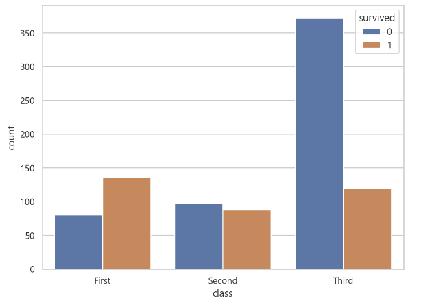

# 의사결정나무
- `의사결정나무 Decision Tree` : 여러가지 규칙을 순차적으로 적용하면서 독립변수 공간을 분할하는 분류모형
    - CART 모형 (Calssification And Regression Tree) : 분류 문제와 회귀 문제에 모두 사용할 수 있다.
    
## 1. 의사결정나무를 이용한 분류학습의 과정
- 의사결정나무 모델의 분류법
    - 최적의 분류규칙 정하기 : 독립변수들 중에서 하나의 독립변수를 선택하고 그 독립변수에 대한 기준값(threshold)을 정한다. 
    - 노드 분할하기 : 전체 학습 데이터 집합(부모노드)을 해당 독립변수의 값이 기준값 보다 작은 데이터 그룹(자식노드1)과 기준값 보다 큰 데이터 그룹(자식노드2)로 나눈다.
    - 노드 분할하기 : 각각의 자식노드에 대해서 앞의 과정을 반복한다.
    - 자식노드에 하나의 클래스(범주값) 데이터만 존재하면 더 이상 자식노드를 나누지 않고 중지한다.
- 이러한 방식으로 자식노드를 연속적으로 나누면서 노드가 증가하는 나무의 형태가 된다.    

## 2. 의사결정나무를 사용한 분류예측 방법
- 부모노드로부터 분할 된 자식노드 각각은 그 노드를 선택한 데이터 집합과 같다.
    - x <= 2 라는 규칙이 적용되었다면, 자식노드 1에는 0, 1에 해당하는 데이터 집합과 이에 상응하는 클래스가 있다.
- 이 노드의 조건부 확률을 노드에 속하는 데이터 클래스의 비율로 정의한다.
    - $P(Y=k|X)_{node} \approx \dfrac{N{node, k}}{N{node}}$
    - 노드의 데이터 집합의 전체 갯수와 노드의 클래스의 갯수의 비율
    - 클래스 집합이 [2, 3, 4, 2, 2]라면 클래스 2의 조건부확률은 2/5가 된다.
- 검증 데이터 X_test의 클래스 예측시에는 가장 상위의 노드로부터 분류규칙을 차례로 적용하여 마지막에 도달하는 노드의 조건부 확률 분포를 이용하여 클래스를 예측한다.
    - $\hat{Y} = \text{arg}\underset{k}{\text{max}} P(Y=k|X_{test})_{last node}$
    - 즉 마지막 노드의 클래스 집합의 조건부 확률분포의 값이 낮은 것을 예측값으로 반환한다.
    
## 4. 분류규칙을 정하는 방법
- `정보획득량 information gain` : 부모 노드와 자식 노드 간의 엔트로피를 가장 낮게 만드는 최상의 독립변수와 기준값을 찾는 방식을 정량화 한 것
    - 모든 독립변수와 모든 가능한 기준값에 대해 정보획득량을 계산하고 **가장 정보획득량이 큰 독립변수와 기준값을 선택한다.**
- 정보획득량은 X라는 조건에 의해서 확률변수 Y의 엔트로피가 얼마나 감소하였는지를 나타내는 값이다.
    - $IG[Y, X] = H[Y] - H[Y|X]$
    - 확률변수 Y의 엔트로피 값에서 X에 대한 Y의 조건부엔트로피 값을 뺀 값과 같다.
    - 즉 학습 데이터의 종속변수의 엔트로피 값에서 선택된 규칙에 따라서 측정한 조건부엔트로피 값을 빼고 가장 큰 정보획득량값에 해당하는 규칙을 기준으로 정한다.
- 즉 조건부엔트로피를 사용하여 가장 좋은 특징값과 기준점을 찾는다.
    - 조건부엔트로피 값이 낮을 수록 X로 Y를 예측하는데 더 도움이 된다는 의미

## 5. 확률론과 엔트로피 요약
- **수학 요약 중 12번 엔트로피에 상세 요약**
    - math -> 12.entropy
    - https://github.com/saint-hong/study-math/blob/main/12_entropy.md

### 5-1. 엔트로피의 의미
- `엔트로피 entropy` : 확률분포가 갖는 **정보의 확신도** 혹은 **정보량**을 수치로 표현한 것.
- 엔트로피값의 의미
    - 어떤 확률분포에서 특정한 값이 나올 확률이 높아지고 다른 값이 나올 확률이 낮아지면 엔트로피값이 작아진다. (분포가 한쪽에 쏠린 경우)
    - 여러가지 값이 나올 확률이 비슷하다면 엔트로피값은 높아진다.(분포가 골고루 퍼진 경우)
    - 확률분포의 모양에 대한 특성값 
    - 확률또는 확률밀도가 특정한 값에 몰려있으면 엔트로피가 작고, 반대로 여러값에 퍼져있으면 엔트로피가 크다고 할 수 있다.
- 확률론에서의 엔트로피
    - 확률분포의 모양을 설명하는 특정값이다.
    - 확률분포가 가지고 있는 정보의 양을 나타내는 값이기도 하다.
    - 두 확률분포의 모양이 어떤 관계를 갖는지 또는 유사한 정도를 표현한다.
    - **조건부엔트로피**는 한 확률분포에 대해서 다른 확률분포가 받는 영향을 설명해준다.
    - **교차엔트로피와 쿨벡-라이블러 발산**은 두 확률분포가 얼마나 닮았는지를 나타낸다.
    - **상호정보량**은 두 확률분포의 독립 및 상관관계를 나타낸다.

### 5-2. 엔트로피의 수학적 의미
- 확률변수 Y가 카테고리분포와 같은 이산확률변수인 경우 엔트로피
    - $\text{H}[Y] = - \sum_{k=1}^{K} p(y_k) log_2 p(y_k)$
    - K : X가 가질 수 있는 클래스(범주값)의 수
    - p(y_k) : 확률질량함수(pmf)
    - 확률의 로그값은 항상 음수이므로 -를 곱하여 양수값으로 만들어 준다.
    - 확률은 0과 1사이의 값이고 로그함수에서 0과 1 사이의 영역은 음수값이다.
- 확률변수 Y가 정규분포와 같은 연속확률변수인 경우 엔트로피
    - $\text{H}[Y] = - \int_{- \infty}^{\infty} p(y) log_2 p(y) dy$
    - p(y) : 확률밀도함수(pdf)
    - log2 : 정보통신 분야에서의 로그값 사용관례
- 엔트로피 계산에서 p(y) = 0 인 경우는 로그값이 정의되지 않는다. 따라서 로피탈의 정리(l'Hopitals rule)를 따라서 0으로 수렴하는 값으로 계산한다.
    - $\lim_{p \rightarrow 0} p log_2 p = 0$
    
### 5-3. 엔트로피의 성질
- **엔트로피의 최소값** : 확률변수가 결정론적이면 확률분포에서 어떤 값이 나올 확률은 1과 같다. 따라서 이러한 경우 엔트로피는 0이다. 이 값이 엔트로피가 가질 수 있는 최소값이다.
- **엔트로피의 최대값** : 이산확률변수의 클래스의 개수에 따라서 엔트로피의 값이 달라진다. 이산확률분포가 가질 수 있는 클래스의 개수가 2^K개일때 엔트로피의 최대값은 K이다.
    - $H = - 2^K \cdot \dfrac{1}{2^K} log_2 \dfrac{1}{2^K} = K$
    - 만약 이산확률분포의 클래스의 개수가 2^3=8이면 위의 계산에 의해 엔트로피가 가질 수 있는 최대값은 3이 된다.

### 5-4. 지니불순도
- `지니불순도 gini impurity` : 엔트로피 처럼 확률분포가 어느쪽에 치우쳐저 있는가를 계산하는 척도이다. **로그를 사용하지 않으므로 계산량이 적어서 엔트로피 대용으로 많이 사용된다.**
    - 경제학에서 사용되지만 확률론에서의 지니계수와는 다른의미로 사용된다.
    - $\text{G}[Y] = \sum_{k=1}^{K} P(y_k)(1-P(y_k))$ 
    
### 5-4. 조건부 엔트로피
- 두 확률변수의 결합엔트로피(joint entropy)와 조건부엔트로피(conditional entropy)를 구하고 분류문제에 적용한다. 

#### 결합엔트로피
- `결합엔트로피 joint entropy` : 결합확률분포를 사용하여 정의한 엔트로피이다.
- 이산확률변수 : $\text{H}[X, Y] = - \sum_{i=1}^{K_x} \sum_{j=1}^{K_Y} p(x_i, y_i)\log_2 p(x_i, y_i)$
    - K_X, K_Y 는 X의 갯수, Y의 갯수
    - p(x)는 확률질량함수
- 연속화률변수 : $\text{H}[X, Y] = - \int_{x} \int_{y} p(x, y) \log_2 p(x, y) dx dy$
    - p(x)는 확률밀도함수
- 결합엔트로피도 엔트로피와 같다. 확률분포가 고르게 퍼져있으면 엔트로피 값이 증가하고, 확률분포가 하나의 값에 치우쳐져 있으면 엔트로피 값이 감소한다.     
    
#### 조건부엔트로피
- `조건부엔트로피 conditioanl entropy` : 어떤 확률변수 X가 다른 확률변수 Y의 값을 예측하는데 도움이 되는지를 측정하는 방법이다. 
- 확률변수 X가 하나의 값을 갖고 확률변수 Y도 하나의 값만 갖는다면 X로 Y를 예측할 수 있다.
- 확률변수 X가 하나의 값을 갖고 확률변수 Y가 여러개의 값에 퍼져있다면 X로 Y를 예측할 수 없다. 
- 수학적 정의
    - $\text{H}[Y|X=x_i] = - \sum_{j=1}^{K_Y} p(y_j | x_i) \log_2 p(y_j | x_i)$
- **조건부엔트로피는 확률변수 X가 가질 수 있는 모든 경우에 대해 H[Y|X=x_i]를 가중평균한 값과 같다.**
- 이산확률변수
    - $\text{H}[Y|X] = \sum_{i=1}^{K_x} p(x_i) \text{H}[Y|X=x_i] = - \sum_{i=1}^{K_x} \sum_{j=1}^{K_Y} p(x_i, y_j) \log_2 p(y_j | x_i)$
    - `- {joint*log2(cond) + joint*log2(cond) + ...}`
    - K_X=2, K_Y=2 이면 : $p(x_1)(H[Y|X=x_1]) + p(x_2)(H[Y|X=x_2])$
- 연속확률변수
    - $\text{H}[Y|X] = - \int_{y} p(y|x) \log_2 p(y|x) dy = - \int_{x} \int_{y} p(x, y) \log_2 p(y|x) dx dy$        

## 6. scikit-learn Decision Tree 파라미터
- 이 중에서 tree의 크기와 관련 된 파라미터
    - **max_depth, min_sample_leaf, max_leaf_nodes**
- criterion : 노드를 분할하는 기준값 : 기본적으로 정보획득량을 판단한다.
    - {"gini", "entropy", "log_loss"}
    - gini는 계산식에서 로그를 사용하지 않으므로 entropy보다 계산 속도가 빠르다.
    - shannon 정보획득량 : entropy, log_loss
    - shannon entropy : 로그손실 값 또는 교차엔트로피값이 작은 것을 분할 기준으로 한다.
- splitter : 분할 기준 선택 방법
    - {"best", "random"}, 디폴트 "best"
- `max_depth : 트리의 최대 깊이 : 부모노드로부터 마지막 자식 노느까지의 최대 거리`
    - int 값
    - max_depth에 모델의 성능이 영향을 받는다.
- min_sample_split : 노드를 분할하는 데 필요한 최소 샘플 수
    - int or float
    - 기준값에 의해 노드를 분할할 때 필요한 최소 샘플 데이터 수
    - 이값을 6으로 정하면, x <= 1 이라는 기준에 의해 T 데이터 집합의 갯수가 5개이면 부합하지 않으므로 다른 기준을 정한다.
    - 이 값이 int이면 이 값을 최소샘플 수로 설정, float이면 이 값에 전체 샘플수를 곱한 값의 정수형을 최소샘플 수로 설정
- `min_sample_leaf : leaf 노드에 필요한 최소 샘플 수`
    - int or float
    - 노드 분할 시 왼쪽 오른쪽 노드에 이 값의 훈련샘플을 남긴다.
- min_weight_fraction_leaf : leaf 노드에 있어야하는 가중합의 최소값
    - float
    - 설정안하면 동일한 가중치 값을 갖는다.
- max_features : 최적의 분할을 위해 측정하는 독립변수의 수
    - int, float, {"auto", "sqrt", "log2", None}
    - sqrt, auto : sqrt(n_features)
    - log2 : log2(n_features)
    - None : max_features = n_features
- random_state : feature 선택의 임의성을 제어하는 값
    - int, None
    - splitter 값이 best이라도 features의 분할기준 측정시 순서대로 정렬된다.
    - 최적의 분할기준은 실행할 때마다 다를 수 있다. 
- `max_leaf_nodes : tree의 노드 갯수를 키우는 값`
    - int, None
- min_impurity_decrease : 분할 판단 기준으로 이 값보다 크면 분할 한다.
    - float, 0.0
    - 노드의 불순도에서 분할된 왼쪽, 오른쪽 노드의 불순도를 뺀 값이 계산식에서 사용된다.
- class_weight : 클래스별 가중치
    - dict of dict, list of dict, dict, balanced, None
    - {class_label : weighted} 형식
    - None : 모든 클래스에 대한 가중치값이 같다.
    - multi class 인 경우 y 열과 같은 순서로 가중치를 입력할 수 있다. 
    - multi class 인 경우, 클래스를 이진클래스로 바꾼 후 가중치를 적용해야 한다.
    - [{1:2}, {2:4}, {3:5}] -> [{0:1, 1:2}, {0:1, 2:4}, {0:1, 3:5}]
    - balanced : 클래스의 빈도수에 반비례하는 가중치값을 적용해준다. 
- ccp_alpha : Minimal Cost-Complexity Pruning에 사용되는 매개변수
    - 하위 트리 분할 시 비용복잡성이 크고 ccp_alpha보다 작은 것이 선택된다.(?)

# Python

## 1. 의사결정나무 실험 : 타이타닉 생존자 데이터
- seaborn의 타이타닉 데이터 set 사용


### 1-1. 데이터 임포트

```python
df_titanic = sns.load_dataset("titanic")
df_titanic.head(2)
```


### 1-2. 데이터 EDA

#### 데이터 정보
- 891개의 데이터와 14개의 변수
    - 독립변수 : 12개
    - 종속변수 : 2개(survived, alive)

```python
df_titanic.info()
```


#### 통계값

```python
df_titanic.describe()
```


### 1-2. 결측 데이터 측정

```python
df_titanic.isna().sum()

>>> print

survived         0
pclass           0
sex              0
age            177
sibsp            0
parch            0
fare             0
embarked         2
class            0
who              0
adult_male       0
deck           688
embark_town      2
alive            0
alone            0
dtype: int64
```

#### missingno 패키지 사용하여 결측 데이터 시각화
- msno.bar() : 컬럼별 결측데이터 갯수 바그래프
- msno.matrix() : 컬럼별 결측 데이터의 위치 그래프 

```python
import missingno as msno

msno.bar(df_titanic)
```


```python
msno.matrix(df_titanic)
```


### 1-3. 결측 데이터 채우기 위한 독립변수별 유니크 데이터 확인
- age, fare 컬럼은 실수형 데이터
    = 나머지 컬럼은 범주형 데이터에 가깝다.

```python
for col in df_titanic.columns :
    print("col : {}, unique : {}".format(col, df_titanic[col].unique()))
    print("=" * 80)

>>> print

col : survived, unique : [0 1]
================================================================================
col : pclass, unique : [3 1 2]
================================================================================
col : sex, unique : ['male' 'female']
================================================================================
col : age, unique : [22.   38.   26.   35.     nan 54.    2.   27.   14.    4.   58.   20.
 39.   55.   31.   34.   15.   28.    8.   19.   40.   66.   42.   21.
 18.    3.    7.   49.   29.   65.   28.5   5.   11.   45.   17.   32.
 16.   25.    0.83 30.   33.   23.   24.   46.   59.   71.   37.   47.
 14.5  70.5  32.5  12.    9.   36.5  51.   55.5  40.5  44.    1.   61.
 56.   50.   36.   45.5  20.5  62.   41.   52.   63.   23.5   0.92 43.
 60.   10.   64.   13.   48.    0.75 53.   57.   80.   70.   24.5   6.
  0.67 30.5   0.42 34.5  74.  ]
================================================================================
col : sibsp, unique : [1 0 3 4 2 5 8]
================================================================================
col : parch, unique : [0 1 2 5 3 4 6]
================================================================================
col : fare, unique : [  7.25    71.2833   7.925   53.1      8.05     8.4583  51.8625  21.075
  11.1333  30.0708  16.7     26.55    31.275    7.8542  16.      29.125
  13.      18.       7.225   26.       8.0292  35.5     31.3875 263.
   7.8792   7.8958  27.7208 146.5208   7.75    10.5     82.1708  52.
   7.2292  11.2417   9.475   21.      41.5792  15.5     21.6792  17.8
  39.6875   7.8     76.7292  61.9792  27.75    46.9     80.      83.475
  27.9     15.2458   8.1583   8.6625  73.5     14.4542  56.4958   7.65
  ...]
================================================================================
col : embarked, unique : ['S' 'C' 'Q' nan]
================================================================================
col : class, unique : ['Third', 'First', 'Second']
Categories (3, object): ['First', 'Second', 'Third']
================================================================================
col : who, unique : ['man' 'woman' 'child']
================================================================================
col : adult_male, unique : [ True False]
================================================================================
col : deck, unique : [NaN, 'C', 'E', 'G', 'D', 'A', 'B', 'F']
Categories (7, object): ['A', 'B', 'C', 'D', 'E', 'F', 'G']
================================================================================
col : embark_town, unique : ['Southampton' 'Cherbourg' 'Queenstown' nan]
================================================================================
col : alive, unique : ['no' 'yes']
================================================================================
col : alone, unique : [False  True]
================================================================================
```

### 1-4. 결측 데이터 채우기 

#### age
- 실수형 데이터 : 평균값으로 채워준다.

```python
df_titanic["age"].fillna("mean", inplace=True)
df_titanic["age"].isna().sum()

>>> print

0
```

#### embarked
- 카테고리형 데이터이므로 최빈값으로 채워준다.
    - 최빈값은 S

```python
## 결측데이터 갯수 확인
df_titanic["embarked"].isna().sum()

>>> print

2

## 결측값의 인덱스 측정 후 실제값 확인
idx = np.arange(0, 891)
idx[df_titanic["embarked"].isna()]

>>> print

array([ 61, 829])

df_titanic.iloc[61]["embarked"], df_titanic.iloc[829]["embarked"]

>>> print

(nan, nan)

## 최빈값 확인 후 결측 데이터 채우기
df_titanic["embarked"].value_counts()

>>> print

S    644
C    168
Q     77
Name: embarked, dtype: int64

df_titanic["embarked"].fillna("S", inplace=True)
df_titanic.iloc[61]["embarked"], df_titanic.iloc[829]["embarked"]

>>> print

('S', 'S')
```

#### embark_town 
- 카테고리형 데이터이므로 최빈값으로 채운다.
    - 최빈값 : Southampton

```python
## 결측 데이터 갯수
df_titanic["embark_town"].isna().sum()

>>> print

2

## 최빈값 측정
df_titanic["embark_town"].value_counts()

>>> print

Southampton    644
Cherbourg      168
Queenstown      77
Name: embark_town, dtype: int64

## 최빈값으로 채우기
df_titanic["embark_town"].fillna("Southampton", inplace=True)
df_titanic.iloc[61]["embark_town"], df_titanic.iloc[829]["embark_town"] 

>>> print

('Southampton', 'Southampton')
```

#### deck
- deck 컬럼은 결측 데이터가 많으므로 삭제한다.

```python
df_titanic["deck"].isna().sum()

>>> print

688
```
- 복사본 데이터 프레임 생성 deck 컬럼 삭제

```python
df_titanic2 = df_titanic.copy()
del df_titanic2["deck"]

"deck" in df_titanic2.columns

>>> print

False
```

#### 전체 컬럼별 결측 데이터 확인
- 결측 데이터가 잘 처리 되었다.

```python
df_titanic2.isna().sum()

>>> print

survived       0
pclass         0
sex            0
age            0
sibsp          0
parch          0
fare           0
embarked       0
class          0
who            0
adult_male     0
embark_town    0
alive          0
alone          0
dtype: int64
```

### 1-5. 컬럼별 종속변수와의 분포 측정

#### plcass와 survived
- pivot table

```python
df_titanic2.groupby(["pclass", "survived"])[["survived"]].count()
```


- bar graph

```python
plt.figure(figsize=(8, 6))
sns.countplot(df_titanic2["pclass"], hue="survived", data=df_titanic2)
plt.show() ;
```


#### sex와 survived
- pivot table

```python
df_titanic2.groupby(["sex", "survived"])[["survived"]].count()
```


- bar graph

```python
plt.figure(figsize=(8, 6))
sns.countplot(df_titanic2["sex"], hue="survived", data=df_titanic2)
plt.show() ;
```


#### class와 survived
- pivot table

```python
df_titanic2.groupby(["class", "survived"])[["survived"]].count()
```


- bar graph

```python
plt.figure(figsize=(8, 6))
sns.countplot(df_titanic2["class"], hue="survived", data=df_titanic2)
plt.show() ;
```


#### who와 survived
- pivot table

```python
df_titanic2.groupby(["who", "survived"])[["survived"]].count()
```


- bar graph

```python
plt.figure(figsize=(8, 6))
sns.countplot(df_titanic2["who"], hue="survived", data=df_titanic2)
plt.show() ;
```


#### alone과 survived
- pivot table

```python
df_titanic2.groupby(["alone", "survived"])[["survived"]].count()
```


- alone의 데이터 True, False를 alone, non_alnoe 값으로 변환 후 bar graph
    - countplot에서 불리언 데이터 타입을 인식하지 못함

```python
df_alone = df_titanic2[["alone", "survived"]]
df_alone["alone2"] = df_alone["alone"].apply(lambda x : "alone" if x == True else "non_alone")

plt.figure(figsize=(8, 6))
sns.countplot(df_alone["alone2"], hue="survived", data=df_alone)
plt.show() ;
```


### 1-6. 카테고리형 독립변수의 변형 : LabelEncoder, LabelBinarizer
- `LabelEncoder` : 카테고리형 데이터를 0과 1의 데이터로 바꿔준다.
    - 카테고리 데이터가 2개이면 LabelEncoder를 사용
- `LabelBinarizer` : 카테고리형 데이터를 더미변수형으로 바꿔준다.
    - 카테고리 데이터가 3개 이상이면 LabelBinarizer를 사용
    - 클래스 갯수 만큼 새로운 변수가 생성 됨

#### 유티크 데이터 갯수에 따라서 카테고리 데이터 변환
- LabelBinirizer는 클래스 갯수에 따라서 새로운 변수를 생성하므로 유니크 데이터의 갯수를 파악 후 LabelEncoder 또는 LabelBinarizer를 다르게 사용한다.

```python
## 순회 객체는 컬럼과 유니크데이터의 갯수로 이루어진 시리즈 데이터 타입
## items() 함수를 사용하면 시리즈에서 인덱스와 값을 반복문의 순회 객체로 사용할 수 있다.
for col, v in df_titanic2.apply(lambda x : x.nunique()).items() :
    ## 유니크 데이터 갯수가 2개 이면 LabelEncoder를 사용하여 변환
    if v == 2 :
        df_titanic2[col] = LabelEncoder().fit_transform(df_titanic2[col])
    ## 유니크 데이터 갯수가 10개 이하이면 LabelBinarizer를 사용하여 변환
    ## 10개 보다 많으면 카테고리형 데이터로 사용하지 않는다. 그러나 이러한 변수는 현재 없음
    else :
        if v <= 10 :
	    ## 컬럼을 클래스의 갯수만큼 만들기
            lb_column = pd.DataFrame(
                LabelBinarizer().fit_transform(df_titanic2[col]),
                columns=["{}_{}".format(col, i) for i in range(v)]
            )
	    ## 원래 데이터에서 카테고리 변수 제거하고 Binarizer 변수로 합하기
            df_titanic2 = pd.concat([df_titanic2, lb_column], axis=1)
            del df_titanic2[col]

## 카테고리 변형한 데이터의 컬럼 확인 : 유니크 데이터가 3개 이상인 컬럼은 새로운 컬럼이 생성됨
df_titanic2.columns

>>> print

Index(['survived', 'sex', 'age', 'fare', 'adult_male', 'alive', 'alone',
       'pclass_0', 'pclass_1', 'pclass_2', 'sibsp_0', 'sibsp_1', 'sibsp_2',
       'sibsp_3', 'sibsp_4', 'sibsp_5', 'sibsp_6', 'parch_0', 'parch_1',
       'parch_2', 'parch_3', 'parch_4', 'parch_5', 'parch_6', 'embarked_0',
       'embarked_1', 'embarked_2', 'class_0', 'class_1', 'class_2', 'who_0',
       'who_1', 'who_2', 'embark_town_0', 'embark_town_1', 'embark_town_2'],
      dtype='object')
```

### 1-7. DT 모델링
- alive와 survived는 같은 종속변수
    - 훈련데이터에서 제거해줘야 한다.

```python
from sklearn.model_selection import train_test_split
from sklearn.tree import DecisionTreeClassifier
from sklearn.metrics import (accuracy_score, confusion_matrix, classification_report)

X = df_titanic2.iloc[:, 1:]
y = df_titanic2["survived"]

X_train, X_test, y_train, y_test = train_test_split(X, y, test_size=0.2,
                                                   stratify=y, random_state=0)

tree = DecisionTreeClassifier(max_depth=3, random_state=0).fit(X_train, y_train)

y_pred_tr = tree.predict(X_train)
y_pred_test = tree.predict(X_test)

print("acc train : ", accuracy_score(y_train, y_pred_tr))
print("acc test : ", accuracy_score(y_test, y_pred_test))

>>> print

acc train :  1.0
acc test :  1.0
```

#### 분류 결과표, 분류 분석표 확인

```python
print(confusion_matrix(y_test, y_pred_test))

>>> print

[[110   0]
 [  0  69]]

print(classification_report(y_test, y_pred_test))

>>> print

              precision    recall  f1-score   support

           0       1.00      1.00      1.00       110
           1       1.00      1.00      1.00        69

    accuracy                           1.00       179
   macro avg       1.00      1.00      1.00       179
weighted avg       1.00      1.00      1.00       179
```

### 1-8. DT 모델의 성능이 1이 나온 이유는?
- model에서 가장 영향이 높은 독립변수
    - alive : 1
- survived와 alive는 종속변수
    - X 데이터에서 두개를 다 제거 해주어야 한다.

#### DT 모델에서 분류 기준으로 가장 높은 변수와 기준값
- 학습 데이터에 alive 변수가 분류 기준 1.0이 나왔다.
    - 즉 alive 변수로 100% 종속값을 예측할 수 있다는 것
    - alive가 survived와 같은 값이라는 의미

```python
dict(zip(X_train.columns, tree.feature_importances_))

>>> print

{'sex': 0.0,
 'age': 0.0,
 'fare': 0.0,
 'adult_male': 0.0,
 'alive': 1.0,
 'alone': 0.0,
 'pclass_0': 0.0,
 'pclass_1': 0.0,
 'pclass_2': 0.0,
 'sibsp_0': 0.0,
 'sibsp_1': 0.0,
 'sibsp_2': 0.0,
 'sibsp_3': 0.0,
 'sibsp_4': 0.0,
 'sibsp_5': 0.0,
 'sibsp_6': 0.0,
 'parch_0': 0.0,
 'parch_1': 0.0,
 'parch_2': 0.0,
 'parch_3': 0.0,
 'parch_4': 0.0,
 'parch_5': 0.0,
 'parch_6': 0.0,
 'embarked_0': 0.0,
 'embarked_1': 0.0,
 'embarked_2': 0.0,
 'class_0': 0.0,
 'class_1': 0.0,
 'class_2': 0.0,
 'who_0': 0.0,
 'who_1': 0.0,
 'who_2': 0.0,
 'embark_town_0': 0.0,
 'embark_town_1': 0.0,
 'embark_town_2': 0.0}
df_titanic2[["survived",
```

### 1-9. X에서 survived와 alive 제거
- 학습 데이터에서 alive 제거

```python
X = df_titanic2[[col for col in df_titanic2.columns
                 if col not in ("survived", "alive")]]
y = df_titanic2["survived"]

X.shape, y.shape

>>> print

((891, 34), (891,))
```

### 1-10. 데이터 분리기의 random_state와 DT모델의 max_depth 값을 조합하여 성능 측정
- 두 파라미터의 조합은 DT 모델의 성능을 높이는데 별로 상관 없다.
    - 성능 곡선에서 검증 성능이 max_depth에 따라서만 변화한다. 
- mean_test_score가 random_state에 영향을 받지 않는다.
    - **DT 모델의 성능은 max_depth 값에만 영향을 받는 것을 알 수 있다.**

```python
from sklearn.model_selection import cross_val_score

train_score = []
mean_test_score = []

for depth in range(2, 15) :
    for rs in range(0, 15) :
        X_train, X_test, y_train, y_test = train_test_split(X, y, test_size=0.2,
                                                       stratify=y, random_state=rs)
        model = DecisionTreeClassifier(max_depth=depth,
                                      random_state=0).fit(X_train, y_train)

        acc_tr = accuracy_score(y_train, model.predict(X_train))
        train_score.append(acc_tr)
        mean_test_score.append(cross_val_score(model, X, y,
                                               cv=5, scoring="accuracy").mean())

plt.figure(figsize=(8, 6))
plt.plot(np.arange(0, 195), train_score, label="train")
plt.plot(np.arange(0, 195), mean_test_score, label="test")
plt.legend(loc="upper left")
plt.show() ; 					       
```


#### 가장 높은 검증 성능 값

```python
np.max(mean_test_score)

>>> print

0.8260247316552632
```


