# 부스팅 방법

## 1. 특징
- 여러개의 약한 분류기(weak lerner)가 순차적으로 학습을 진행하는 방식
- 이전 분류기가 예측을 틀린 데이터에 대해 다음 분류기가 가중치를 인가해서 학습을 진행
- 약한 분류기들의 이러한 학습과정을 통해 강한 분류기가 된다.
    - weak learner -> output 1, output 2 , ... -> strong learner
- 예측 성능이 뛰어나 앙상블 학습에 많이 사용된다.
    - GradientBoosting, 
    - XGBoost(extra gradient boost), 
    - LightGBM(Light gradient Boost) 등
- `Boostrap Aggregating : bagging 방식`
    - parallel : 동시에 병렬적으로 결과를 얻음
    - 여러 분류기가 동시에 학습, 예측
- `boosting 방식`
    - sequential : 순차적으로 진행됨 
    - 여러 분류기가 순차적으로 학습, 예측, 이전 분류기의 결과를 이어받아 다음 분류기가 결과 예측

## 2. 이론

- `모형 결합 model combining` : 앙상블 방법론 ensemble mdehods, 여러개의 예측 모형을 결합하여 더 나은 성능을 예측하는 방법
    - 취합방법 aggregation
        - 다수결 방법 majority voting
        - 배깅 방법 bagging
        - 랜던포레스트 random forest
    - 부스팅 방법 boosting
        - 에이다 부스트 ada boost
        - 그래디언트 부스트 gradient boost
- `부스트 boost` : 하나의 모형에서 시작하여 모형 집합에 포함할 개별 모형을 하나씩 추가하는 방법
    - voting, bagging, RF 모형 등은 개별 모형의 갯수가 미리 정해진다.
- `위원회 commitee` : 모형의 집합, C
    - m개의 개별모형을 포함하는 위원회, 모형 집합 : $C_m$
    - 개별 모형 : 약 분류기 (weak classifier) : k
    - $C_1 =  [k_{1}] $ 
    - $C_m=C_{m-1} \cup k_m = [k_1, k_2, \cdots, k_m]$
    - 이전 위원회에 개별모형 k_m이 추가 된다.
- `k_m의 선택 방법`
    - $C_{m-1}$의 성능을 보완하는 것을 선택한다.
- `Cm의 최종 결정 방법 : m개의 모형을 결합한 Cm의 분류 예측`
    - 개별 모형의 예측값들에 가중치 $\alpha$를 가중선형조합한 값을 판별함수로 사용
    - 이 판별함수에 따라서 Cm의 예측값이 결정된다.
    - $C_m (x_i) = \text{sign} (\alpha_1 k_1 (x_i) + \cdots + \alpha_{m} k_m (x_i))$
    - $\alpha$는 개별모형에 대한 가중치
- `부스트 방법은 이진분류에만 사용할 수 있다.`
    - $y= -1 \ \text{or}  \ 1$
    - 정상-스펨, 환자-비환자, 개-고양이 등의 이진분류에만 적용가능
    - 이러한 이진분류의 특성에 따라서 개별모형의 가중치 등을 계산한다.

## 3. 에이다부스트
- `에이다부스트 ada boost` : 적응 부스트(adaptive boost). k_m을 선택하는 방법으로 학습 데이터의 i번째 데이터에 가중치 wi를 주고 분류 모형이 틀리게 예측한 데이터들의 가중치를 합한 값을 손실함수 L로 사용한다. 이 손실함수 L을 최소화하는 모형 k_m을 선택한다.
- `손실함수 L_m`    
    - $L_m = \sum_{i=1}^{N} w_{m,i} I(k_m(x_i) \neq y_i)$
    - I는 지시함수(indicator function) : 개별모형의 예측값과 종속변수의 값이 다르면 1, 같으면 0을 반환한다.
    - 즉 에이다부스트의 손실함수는 예측이 틀린 데이터의 가중치들을 모두 더한 값과 같다.
    - $w_i$는 i번째 데이터에 대한 가중치
- `개별모형의 가중치 alpha_m`
    - $\epsilon_m = \dfrac{\sum_{i=1}^{N} w_{m,i} I(k_m(x_i) \neq y_i)}{\sum_{i=1}^{N} w_{m,i}}$
        - 개별모형의 예측 틀린 데이터의 가중치의 합 / 전체 데이터의 가중치의 합
        - 즉 k_m 후보 모형의 틀린 예측의 데이터의 가중치의 비중
        - 후보 모형별로 예측을 틀리게 한 비중이 다르다.
    - $\alpha_m = \dfrac{1}{2} \text{log} \left( \dfrac{1-\epsilon_m}{\epsilon_m} \right)$
        - alpha는 모형에 대한 가중치, w는 데이터에 대한 가중치
- `Adaboost 진행 과정`
    - positive, negative 들 중에서 positive 를 분류하는 결정경계-1 설정
    - 결정경계-1 에서 잘 못 분류된 것들 중 pos 인데 neg 로 분류한 것들(틀린 예측)에 가중치 부여(boosting)해서 결정경계-2 설정
    - 결정경계-2 에서 잘 못 분류된 것들 중 neg 인데 pos 로 분류한 것들(틀린 예측)에 가중치를 부여해서 결정경계-3 설정
    - 이렇게 생성한 결정경계들을 합쳐서 정확도를 높임

### 3-1. 데이터 샘플에 대한 가중치 w
- 데이터에 대한 가중치 w_i는 최초에는 모든 데이터에 같은 균일한 값이지만, 위원회가 증가할때마다 값이 변한다.

       
    - 


    - 예측이 맞은 경우 가중치 값은 작아지고, 예측이 틀린 경우 가중치 값은 크게 확대(boosting) 된다.
        - 후속 약분류기는 이전 약분류기에서 예측이 틀린 데이터에 대해 학습을 더 집중하게 된다.
    - m번째 개별 모형의 모든 후보에 대해 이 손실함수 L을 적용하여 값이 가장 작은 후보 를 선택한다.

### 3-2. 에이다부스팅의 손실함수
- 손실함수 L_m    
    - $L_m = \sum_{i=1}^{N} exp(-y_i C_m (x_i))$
    - $C_m(x_i) = \sum_{j=1}^{m} \alpha_j k_j (x_i) = C_{m-1}(x_i) + \alpha_m k_m(x_i)$
        - 개별모형의 결과와 가중치의 선형조합형태
    - C_m 식을 손실함수 L에 대입하여 정리

    - 

    - 종속변수 y_i와 개별모형 k_m(x_i)의 값은 1 또는 -1 만 가질 수 있으므로,
    
    - 

    - **L_m을 최소화하는 alpha_m**
    - $\dfrac{d L_m}{d \alpha_m} = 0$
    
### 3-3. 에이다 부스트 모형의 정규화
- 모형의 과최적화를 방지하기 위해 학습 속도(learning rate)를 조정하여 정규화를 한다.
    - $C_m = C_{m-1} + \mu \alpha_m k_m$
    - $\mu$ : learning rate
    - 필요한 멤버의 수를 강제로 증가시켜서 과최적화를 막는 역할을 한다.
- learning rate 값이 1보다 작으면 새로운 멤버(k_m)의 가중치 $\alpha_m$를 강제로 낮춘다.
- learning rate 값이 1보다 크면 성능은 크게 저하된다.

## 4. 그래디언트 부스트
- `그래디언트 부스트 gradient boost` : 변분법(calculus of variations)을 사용한 모형
    - 변분법 : 범함수의 미분 : 입력 함수가 변화할 때 출력이 어떻게 달라지는지 계산
    - 범함수 functional : 함수를 입력받아 실수를 출력하는 함수, 기댓값, 엔트로피 등이 범함수에 해당함
- `그래디언트 디센트 gradient descent` : 경사하강법
    - $x_m = x_{m-1} - \alpha_m \dfrac{df}{dx}$
    - 함수의 현재 위치에서 다음 위치를 정하기 위한 방법 : 점차 최소값에 다가간다.
    - 스텝사이즈(=alpha=mu)에 따라서 수렴이 아닌 발산을 하기도 한다.
- `그래디언트 부스트 모형`    
    - $C_m = C_{m-1} - \alpha_m \dfrac{\delta L(y, C_{m-1})}{\delta C_{m-1}} = C_{m-1} + \alpha_m k_m$
    - $L(y, C_{m-1})$ : 손실 범함수
    - 손실 범함수 값을 최소화하는 개별 분류 모형 k_m을 찾는다.
- **그래디언트 부스트 방법은 회귀와 분류 문제에 상관없이 회귀 분석 방법을 사용한다.**
    - 의사결정 회귀나무(decision tree regression model) 모형을 주로 사용한다.
- GBM (Gradient Boosting Machine)
    - AdaBoost 기법과 비슷함
    - 가중치를 업데이트할 때 경사하강법 gredient descent 를 사용한다.

### 4-1. 그래디언트 부스트 모형의 계산 방식
- `계산 방식`
    - $- \dfrac{\delta L(y, C_m)}{\delta C_m}$ 를 목표값으로 개별 멤버 모형 k_m을 찾는다.
    - $(y - (C_{m-1} + \alpha_m k_m))^2$ 를 최소화하는 스텝사이즈 $\alpha_m$을 찾는다.
        - y와 예측값의 차이의 크기
    - $C_m = C_{m-1} + \alpha_m k_m$ 최종 모형을 갱신한다.
        - 이 과정을 반복하여 개별 모형과 가중치를 계산한다.
- `손실 범함수가 오차 제곱 형태인 경우`
    - $L(y, C_{m-1}) = \dfrac{1}{2} (y - C_{m-1})^2$
- `범함수의 미분은 실제 목표값 y와 C_{m-1}의 차이, 즉 잔차가 된다.`
    - $- \dfrac{d L(y, C_m)}{d C_m} = y - C_{m-1}$

### 4-2. python
- from sklearn.ensemble import GradientBoostingClassifier
    
## 5. XGBoost,  라이브러리
- `XGBoost (Extream Gradient Boosting)` : 그래디언트 부스팅 머신을 보완한 분류 모형
- `그래디언트 부스팅` : Friedman의 논문 "Greedy Function Approximation" 에서 "A Gradient Boosting Machine(GBM)"에서 유래됨
    - 위원회 방식 : 매 실행마다 손실함수를 최소화하는 m번째 약분류기를 추가하는 방식.이 과정에서 데이터샘플의 가중치와 약분류기의 가중치를 이전 위원회로부터 이어받는데 틀린 예측의 가중치를 확대하고, 맞은 예측의 가중치를 작게하는 방식으로 현재 모델의 가중치를 찾는다.  
    - 범함수 형태의 손실함수(L(y, C_m))를 최소하화하는 k_m을 찾기 위해 변분법을 사용하는 방식
    - 회귀와 분류문제 모두 회귀모형을 사용하며, "의사결정 회귀나무"를 주로 사용한다.
- `xgb 장점`
    - GBM에서 pc의 파워를 효율적으로 사용하기 위한 다양한 기법에 채택되어 빠른 속도와 효율을 가진다.

### 5-1. 이론적 배경
- `지도학습의 수학적 모형에 기반한다.`
    - $\hat{y} = \sum_{j} \theta_j, x_{ij}$  
- 회귀, 분류, 순위 지정과 같은 문제에 적용할 수 있다.
    - XGBLogisticRegressor
    - XGBClassifier
    - XGBRanking
- 목적함수의 구성 : 학습 데이터의 손실함수 + 정규화 항
    - $\text{obj}(\theta) = L(\theta) + \Omega(\theta)$
- 손실함수 L: 훈련 데이터에 대한 모형의 예측 정확도를 평균제곱오차(mse)로 측정함
    - $L(\theta) = \sum_{i} = (y_i - \hat{y}_2)^2$
    - 로지스틱 손실함수가 사용되기도 함
- 정규화 항 : 모델의 복잡성을 제어하여 과적합을 방지하는 역할
    - 학습 데이터에 대해 모형의 정규화 항의 갯수와 손실함수의 크기가 적당해야 한다.
    - 적당한 모형을 찾기 위해 편향-분산 트레이드 오프를 사용한다.
- `의사 결정 나무에 기반한 선택 과정을 따른다.`
    - 트리 앙상블 모델의 특징 : 회귀와 분류 문제에 사용할 수 있다. (CART)
    - DT는 노드에 결정값만 포함되지만 CART 모델은 결정값(점수)이 각 리프와 연결되어 있는 특징이 있다. 더 풍부한 해석이 가능하다.
    - 앙상블 트리는 개별 트리들의 결과값을 합산해주므로 DT 보다 더 유의미하다.
- `랜덤포레스트`
    - DT를 개별모형으로 모형결합하는 방식
    - 각 노드에서 모든 독립변수를 비교하는 것이 아니라, 랜덤하게 독립변수의 특징차원을 감소시키다.
    - 이 독립변수들을 비교한 후 노드를 분리할 최적의 변수를 선택한다. 개별 모형(DT)사이의 상관관계가 줄어들어 모형 성능의 변동이 감소한다. 즉 모형의 성능이 안정화 된다.
    - Extream Randomized Trees 모형은 노드 분리시 랜덤하게 독립변수의 차원을 줄이는 것이 아니라 아예 랜덤하게 독립변수를 선택한다.
- `앙상블 나무 모형`
    - 개별나무 전체를 평가하는 것이 아니라 각 단계마다 새로운 개별나무를 추가해나가는 방식
    - $\hat{y_i}^{t} = \sum_{k=1}^{t} f_k(x_i) = \hat{y_i}^{t-1} + f_t(x_i)$
    - 목적함수 : 
    
    -
    
    - 목저감수의 손실함수를 MSE를 사용하면 수식정리가 간단하지만, 로지스틱 손실함수를 사용하면 테일러 확장을 적용해야하므로 정리가 쉽지 않다.
- `XGBoost 모형의 목적함수` : 로그손실 값을 손실함수로 사용
    - $\sum_{i=1}^{n} [g_i f_t(x_i) + \dfrac{1}{2} h_i f_t^{2} (x_i)] + \omega (f_t)$
    - 이 목적함수를 최소화하는 새로운 개별 모형을 선택한다.
    - **XGBoost 모형은 로지스틱 회귀모형과 쌍별랭킹을 포함한 손실함수를 최적화할 수 있다.**
- 정규화 가중치 정의 : 복잡도에 대한 가중치
    - $\omega (f) = \gamma T + \dfrac{1}{2} \lambda \sum_{j=1}^{T} w_j^{2}$
    - $\omega$ : 노드(잎)에 대한 점수 벡터 : 가중치
    - T : 노드(잎)의 갯수
    - 일반적으로 나무 모형은 불순도(엔트로피) 개선에 중점을 두고 복잡성 제어는 휴리스틱 방법(사용자의 방법)에 맡긴다.
    - **XGBoost 모델은 이 복잡성 제어를 공식적으로 사용하여 더 나은 모델을 얻을 수 있는 방법이다.**
- 목적함수에 정규화 가중치 식을 추가하여 정리하면 정보획득량을 구할 수 있다.
    - gain = 1/2 [왼쪽 노드 점수 + 오른쪽 노드 점수 - 원래 노드 점수] + 정규화가중치

### 5-2. 파라미터 튜닝
- `편향-분산 법칙`
   - XGBoost의 파라미터는 편향-분산 트레이드 오프와 관련되어 있다.
   - 모델이 복잡해질 수록(max depth가 더 깊어질 수록) 훈련 데이터에 적합한 모형이 되어 편향이 줄어 든다.
   - 그러나 복잡해진 모델을 맞추기 위해서는 데이터가 더 필요하게 된다.
- `과적합 통제 방법`
   - 훈련 데이터에 대한 성능은 높지만 검증 데이터에 대한 성능이 낮을 경우 2가지 방법 사용할 수 있다.
   - 모델 복잡성을 직접 제어하는 방법
       - max_depth, min_child_weight, gamma
   - 훈련데이터에 임의성을 추가하여 노이즈에 강화시키는 방법 
       - subsample, colsample_bytree
       - eta(스텝사이즈), num_round
- `훈련 속도 증가`
    - tree_method, hist, gpu_hist
- `불균형 데이터 처리`
    - 광고 로그 데이터와 같이 데이터가 불균형인 경우
    - AUC 값과 관련하여 양수가중치와 음수가중치 설정
        - scale_pos_weight
    - 정확한 예측 확률과 관련하여
        - max_delta_step

### 5-3. 여러가지 XGBoost 모형
- 각 클래스마다 파라미터와 속성값이 거의 같다.
- 패키지 임포트
    - import xgboost
- 분류 모형 클래스
    - xgb = xgboost.XGBClassifier()
- Booster 모형 클래스
    - xgb_booster = xgboost.Booster()
- 교차검증 클래스
    - xgb_cv = xgboost.cv()
- XGBoost 용 scikit learn의 래퍼 함수 클래스
    - xgboost.XGBRegressor()
- XGBoost 랜덤 포레스트 회귀 나무 
    - xgboost.XGBRFRegressor()
- XGBoost 랜덤 포레스트 분류 모형
    - xgboost.XGBRFClssifier()
    
### 5-4. 파라미터
- n_estimators : 약 분류기의 갯수
- max_depth : 나무의 깊이
- max_leaves : 노드의 최대갯수
- grow_policy : 나무의 크기 정책 
    - 0 : 노드에서 가까운 노드로 분할
    - 1 : 손실의 변화가 가장 큰 노드에서 분할함
- learning_rate : 학습률
- booster : 부스터 방법 : gbtree, gblinear, dart 
- n_jobs : 병렬 스레드 수, 그리드 서치를 사용할 때 스레드를 병렬화하는 방식
- min_child_weight : 하위 노드에 필요한 가중치의 최소합
- early_stopping_rounds : 훈련을 조기에 중지하도록 설정

### 5-5. 속성값
- best_iteration : 훈련을 조기중지한 반복값
- best_score : 훈련을 조기중지한 최고의 성능값
- coeff : 계수값
- feature_importances : 독립변수 중요도

## 6. LightGBM 라이브러리
- LightGBM (Light Gradient Bosst Machine) : XGBoost 보다 빠른 속도를 갖는다.

### python
- import lightgbm
- lgbm = lightgbm.LGBMClassifier()

# Python

## 1. AdaBoost

### 1-1. 샘플 데이터 생성
- 가우시안 정규분포를 따르는 샘플 데이터 생성

```python
from sklearn.datasets import make_gaussian_quantiles

X1, y1 = make_gaussian_quantiles(cov=2, n_samples=100,
                                 n_features=2, n_classes=2, random_state=1)
X2, y2 = make_gaussian_quantiles(mean=(3, 3), cov=1.5,
                                 n_samples=200, n_features=2,
                                 n_classes=2, random_state=1)
X = np.concatenate((X1, X2))
y = np.concatenate((y1, - y2 + 1))
```

#### 샘플 데이터의 분포 형태

```python
plt.figure(figsize=(8, 6))
sns.scatterplot(X[:, 0], X[:, 1], hue=y)
plt.show() ;
```
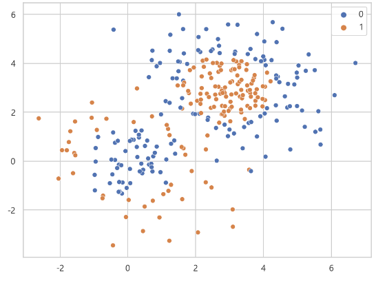

### 1-2. 에이다 부스트에서 표본 데이터의 가중치를 측정하기 위한 클래스
- 각 표본 데이터의 가중치값 확인을 위해 AdaBoostClassifier를 서브클래싱하고 가중치를 속성으로 저장하는 클래스를 만든다.
    - i번째 데이터에 대한 가중치 w_i의 변화를 확인 하기 위함

```python
from sklearn.ensemble import AdaBoostClassifier

class MyAdaBoostClassifier(AdaBoostClassifier) :

    ## ada boost의 파라미터값
    def __init__(self, base_estimator=None, n_estimators=50, learning_rate=1.,
                algorithm="SAMME.R", random_state=None) :
        ## 상속
        super(MyAdaBoostClassifier, self).__init__(
              base_estimator=base_estimator,
              n_estimators=n_estimators,
              learning_rate=learning_rate,
              random_state=random_state)

        ## 표본 데이터의 가중치
        self.sample_weight = [None] * n_estimators

    def _boost(self, iboost, X, y, sample_weight, random_state) :
        sample_weight, estimator_weight, estimator_error = super(MyAdaBoostClassifier, self)\
                                                           ._boost(iboost, X, y, sample_weight, random_state)
        self.sample_weight[iboost] = sample_weight.copy()

        return sample_weight, estimator_weight, estimator_error
```

### 1-3. 에이다 부스트 표본 데이터 0가중치 측정

```python
model_ada = MyAdaBoostClassifier(DecisionTreeClassifier(max_depth=1, random_state=0), n_estimators=20)
model_ada.fit(X, y)

>>> print

MyAdaBoostClassifier(base_estimator=DecisionTreeClassifier(max_depth=1,
                                                           random_state=0),n_estimators=20)
```

### 1-4. 에이다 부스트의 표본 가중치와 분류결과를 그래프로 나타내기

```python
def plot_result(model, title="분류결과", legend=False, s=50) :
    x1_min, x1_max = X[:, 0].min() - 1, X[:, 0].max() + 1
    x2_min, x2_max = X[:, 1].min() - 1, X[:, 1].max() + 1
    xx1, xx2 = np.meshgrid(np.arange(x1_min, x1_max, 0.02),
                          np.arange(x2_min, x2_max, 0.02))
    if isinstance(model, list) :
        Y = model[0].predict(np.c_[xx1.ravel(), xx2.ravel()]).reshape(xx1.shape)
        for i in range(len(model) - 1) :
            Y += model[i+1].predict(np.c_[xx1.ravel(),
                                          xx2.ravel()]).reshape(xx1.shape)
    else :
        Y = model.predict(np.c_[xx1.ravel(), xx2.ravel()]).reshape(xx1.shape)

    ## color bar 설정
    cs = plt.contourf(xx1, xx2, Y, cmap=plt.cm.Paired, alpha=0.5)

    ## 데이터 표본 그리기
    for i, n, c in zip(range(2), "01", "br") :
        ## y=0, y=1 인 샘플 데이터 별로 색을 다르게 하기 위한 인덱싱
        idx = np.where(y==i)
        ## s가 가중치 배열이므로 s도 인덱싱을 해주어야 한다.
        plt.scatter(X[idx, 0], X[idx, 1], c=c, s=s,
                    alpha=0.5, label="Class %s" % n)

    plt.xlim(x1_min, x1_max)
    plt.ylim(x2_min, x2_max)
    plt.xlabel("x1")
    plt.ylabel("x2")
    plt.title(title)
    plt.colorbar(cs)
    if legend :
        plt.legend()
    plt.grid(False)
```

#### 에이다 부스트 모형의 분류결과
- 20번째 위원회 모형의 결과

```python
plt.figure(figsize=(8, 6))
plot_result(model_ada, "에이다 부스트 (m=20) 분류 결과")
plt.show() ;
```
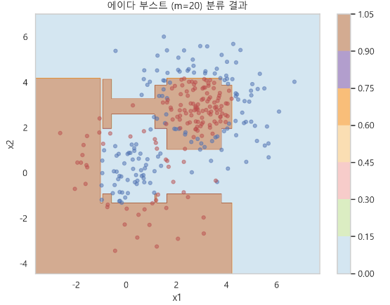


#### 1~8 위원회별 분류 결과
- 각 위원회는 전 단계의 위원회로부터 가중치를 이어 받는다.
   - 예측이 틀린 데이터의 가중치를 확대(boosting) 한다.

```python
plt.figure(figsize=(10, 15))

for i in range(0, 8) :
    plt.subplot(4, 2, i+1)
    if i == 0 :
        plot_result(model_ada.estimators_[i],
                    "{}번 분류모형의 분류결과".format(i+1))
    else :
        ## 점의 크기 s가 0인 값도 있으므로 +3을 해주어 표시되도록 한다.
        plot_result(model_ada.estimators_[i],
                    "{}번 분류모형의 분류결과".format(i+1),
                    s=(4000 * model_ada.sample_weight[i-1] + 3).astype(int))
plt.tight_layout()
plt.show() ;
```
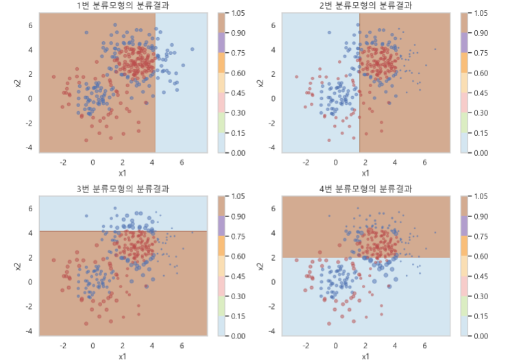

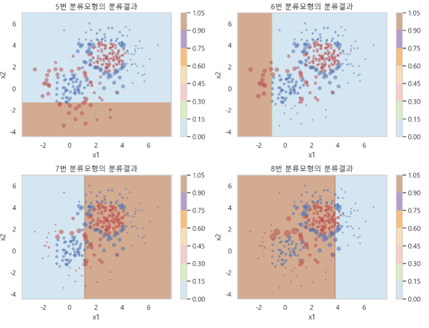

## 2. 에이다 부스트의 정규화
- learning rate 값을 조정하여 과적합을 방지한다.

```python
from sklearn.tree import DecisionTreeClassifier
from sklearn.ensemble import AdaBoostClassifier
from sklearn.model_selection import cross_val_score
from sklearn.metrics import accuracy_score
from sklearn.model_selection import train_test_split
import time

%%time

X_train, X_test, y_train, y_test = train_test_split(X, y, test_size=0.2,
                                                    stratify=y, random_state=0)

mean_cv_test_acc = []
train_acc = []
test_acc = []

for n in range(1, 1001, 100) :
    model_ada = AdaBoostClassifier(DecisionTreeClassifier(max_depth=1),
                                  n_estimators=n)
    train_acc.append(
        accuracy_score(y_train, model_ada.fit(X_train, y_train).predict(X_train)))
    test_acc.append(
        accuracy_score(y_test, model_ada.fit(X_train, y_train).predict(X_test)))
    mean_test_acc.append(cross_val_score(model_ada, X, y,
                                           cv=5, scoring="accuracy").mean())

>>> print

Wall time: 30.6 s
```

### 2-1. 과최적화가 커진다.
- train 성능이 test 성능보다 월등히 크다.
    - 개별 모형의 갯수가 늘어날 수록 cv test 성능이 작아진다.

```python
plt.figure(figsize=(8, 6))
plt.plot(np.arange(1, 1001, 100), train_acc, label="train acc")
plt.plot(np.arange(1, 1001, 100), test_acc, label="test acc")
plt.plot(np.arange(1, 1001, 100), mean_test_score, label="cv test acc")
plt.legend()
plt.show() ;
```
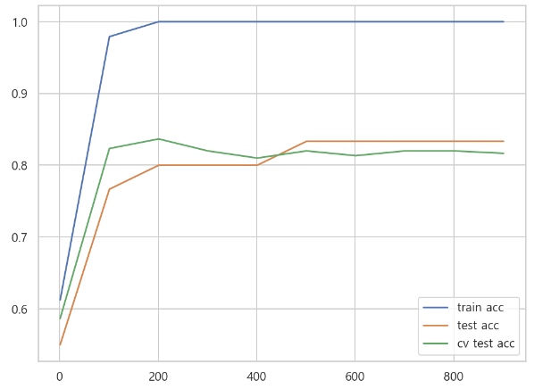


### 2-2. learning rate를 변화시켜 과최적화를 줄이기
- 학습률의 범위 설정

```python
learning_rate = np.linspace(0, 1, 50).round(2)
learning_rate

>>> print

array([0.  , 0.02, 0.04, 0.06, 0.08, 0.1 , 0.12, 0.14, 0.16, 0.18, 0.2 ,
       0.22, 0.24, 0.27, 0.29, 0.31, 0.33, 0.35, 0.37, 0.39, 0.41, 0.43,
       0.45, 0.47, 0.49, 0.51, 0.53, 0.55, 0.57, 0.59, 0.61, 0.63, 0.65,
       0.67, 0.69, 0.71, 0.73, 0.76, 0.78, 0.8 , 0.82, 0.84, 0.86, 0.88,
       0.9 , 0.92, 0.94, 0.96, 0.98, 1.  ])
```

- 학습률을 변화시켜 모형 학습

```python
%%time

train_acc = []
test_acc = []
cv_test_acc = []

for r in learning_rate[1:] :
    ada_model = AdaBoostClassifier(DecisionTreeClassifier(max_depth=1),
                                  n_estimators=500, learning_rate=r)
    train_acc.append(
        accuracy_score(y_train, ada_model.fit(X_train, y_train).predict(X_train)))
    test_acc.append(
        accuracy_score(y_test, ada_model.fit(X_train, y_train).predict(X_test)))
    cv_test_acc.append(
        cross_val_score(ada_model, X, y, cv=5, scoring="accuracy").mean())

>>> print

Wall time: 2min 46s
```

#### 학습률의 변화에 따른 학습, 검증 성능의 변화 그래프
- 과적합이 어느정도 줄어들긴 하지만 다시 커진다.
    - 적당한 학습률을 선택하는 문제가 있다.

```python
plt.figure(figsize=(8, 6))
plt.plot(learning_rate[1:], train_acc, label="train acc")
plt.plot(learning_rate[1:], test_acc, label="test acc")
plt.plot(learning_rate[1:], cv_test_acc, label="cv test acc")
plt.legend()
plt.show() ;
```
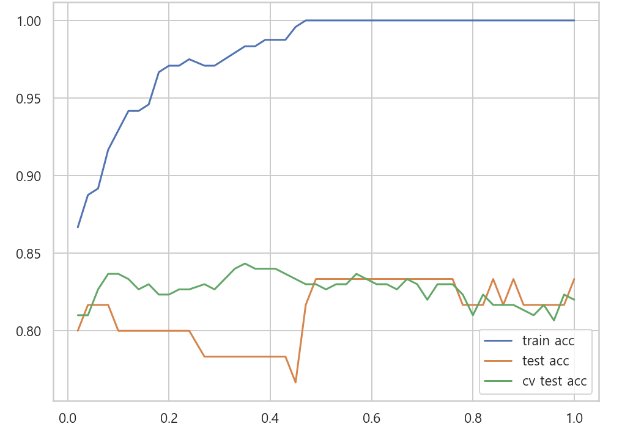

#### 교차검증의 성능만 그래프로 확인
- 가장 성능이 높은 경우

```python
%%time

cv_test_acc = []

for r in learning_rate[1:] :
    ada_model = AdaBoostClassifier(DecisionTreeClassifier(max_depth=1),
                                  n_estimators=1000, learning_rate=r)
    cv_test_acc.append(
        cross_val_score(ada_model, X, y, cv=5, scoring="accuracy").mean())

max_idx = np.array(cv_test_acc).argmax()
max_score = cv_test_acc[max_idx]
max_rate = learning_rate[max_idx+1]

plt.figure(figsize=(8, 6))
plt.plot(learning_rate[1:], cv_test_acc)
plt.plot(max_rate, max_score, "ro")
plt.title("cv test score")
plt.show() ;
```
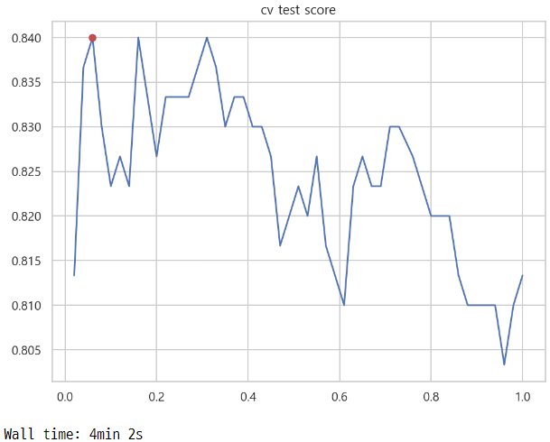

### 2-4. learning rate의 값을 정수로 하면?
- 정수값을 사용하면 성능이 현저히 낮아진다.

```python
learning_rate = np.arange(1, 10)

%%time

cv_test_acc = []

for r in learning_rate :
    ada_model = AdaBoostClassifier(DecisionTreeClassifier(max_depth=1),
                                  n_estimators=1000, learning_rate=r)
    cv_test_acc.append(
        cross_val_score(ada_model, X, y, cv=5, scoring="accuracy").mean())

max_idx = np.array(cv_test_acc).argmax()
max_score = cv_test_acc[max_idx]
max_rate = learning_rate[max_idx]

plt.figure(figsize=(8, 6))
plt.plot(learning_rate, cv_test_acc)
plt.plot(max_rate, max_score, "ro")
plt.title("cv test score")
plt.show() ; 	
```
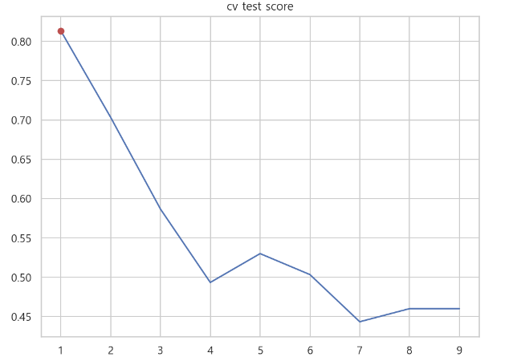


## 3. 그래디언트 부스트
- 범함수 형태의 손실함수를 최대 경사법(범함수의 미분 : 변분법)을 사용하여 최적화하는 방식
- 의사결정 회귀나무 사용 : 회귀, 분류 문제에 사용

### 3-1. 그래디언트 부스트 모형 생성
- 100개의 약분류기를 결합한 모델

```python
from sklearn.ensemble import GradientBoostingClassifier

model_grad = GradientBoostingClassifier(n_estimators=100, max_depth=2,
                                        random_state=0)
model_grad

>>> print

GradientBoostingClassifier(max_depth=2, random_state=0)
```

### 3-2. 그래디언트 부스트 모형 모수추정
- 교차검증 적용

```python
from sklearn.model_selection import cross_val_score

model_grad.fit(X, y)
cv_score = cross_val_score(model_grad, X, y, cv=5)
cv_score.mean()

>>> print

0.8266666666666665
```

### 3-3. 그래디언트 부스트 모형 분류 결과
- C_100의 분류 결과
    - 손실 함수를 최소화하는 100개의 개별 모형들의 결과를 선형조합한 결과
- 에이다 부스트 모형의 분류결과와 차이가 있다.

```python
plt.figure(figsize=(8, 6))
plot_result(model_grad)
plt.show() ;
```
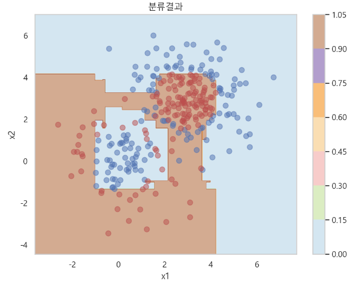

### 3-4. 1~3 번째 개별 모형의 분류결과와 위원회 모형의 분류결과

```python
plt.figure(figsize=(10, 8))

plt.subplot(221)
plot_result(model_grad.estimators_[0][0])
plt.title("1번째 개별 멤버 모형의 분류 결과")

plt.subplot(222)
plot_result(model_grad.estimators_[1][0])
plt.title("2번째 개별 멤버 모형의 분류 결과")

plt.subplot(223)
plot_result(model_grad.estimators_[2][0])
#plot_result([model_grad.estimators_[0][0], model_grad.estimators_[1][0]])
plt.title("3번째 개별 멤버 모형의 분류 결과의 합")

plt.subplot(224)
plot_result([model_grad.estimators_[0][0],
             model_grad.estimators_[1][0],
             model_grad.estimators_[2][0]])
plt.title("1, 2, 3번째 개별 멤버 모형의 분류 결과의 합")

plt.tight_layout()
plt.show() ;
```
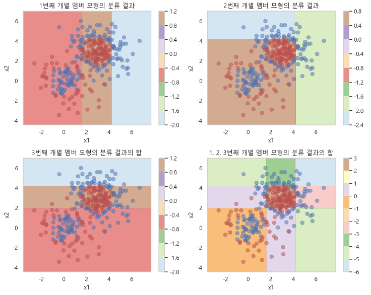


### 3-5. C_50, C_80, C_90, C_100 위원회 모형의 분류결과

```python
plt.figure(figsize=(10, 8))
plt.subplot(221)
plot_result([model_grad.estimators_[i][0] for i in range(0, 50)], s=20)
plt.title("C_50 위원회 모형의 분류결과")

plt.subplot(222)
plot_result([model_grad.estimators_[i][0] for i in range(0, 80)], s=20)
plt.title("C_80 위원회 모형의 분류결과")

plt.subplot(223)
plot_result([model_grad.estimators_[i][0] for i in range(0, 90)], s=20)
plt.title("C_90 위원회 모형의 분류결과")

plt.subplot(224)
plot_result([model_grad.estimators_[i][0] for i in range(0, 100)], s=20)
plt.title("C_100 위원회 모형의 분류결과")

plt.tight_layout()
plt.show() ;
```
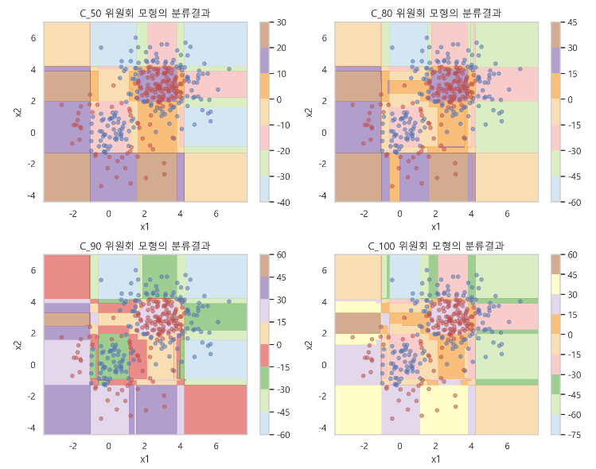

## 4. XGBoost 라이브러리

```python
## 모형 생성
model_xgb = xgboost.XGBClassifier(n_estimators=100, max_depth=1, random_state=0)
## 학습
model_xgb.fit(X, y)
## 교차검증
cv_score = cross_val_score(model_xgb, X, y, cv=5)
cv_score.mean()

>>> print

0.8133333333333332
```

### 4-1. XGB clf의 분류결과

```python
plt.figure(figsize=(8, 6))
plot_result(model_xgb, s=15)
plt.show() ;
```
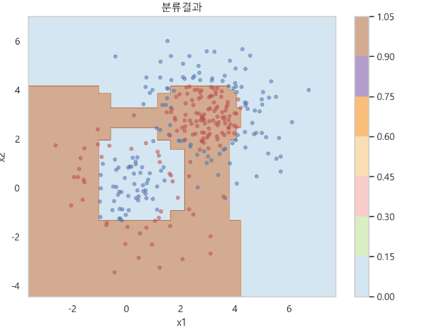


## 5. LightGBM 라이브러리

```python
model_lgbm = lightgbm.LGBMClassifier(n_estimators=100, max_depth=1, random_state=0)
model_lgbm.fit(X, y)
cv_score = cross_val_score(model_lgbm, X, y, cv=5)
cv_score.mean()

>>> print

0.7566666666666666
```
### 5-1. LightGBM의 분류결과

```python
plt.figure(figsize=(8, 6))
plot_result(model_lgbm)
plt.show() ;
```
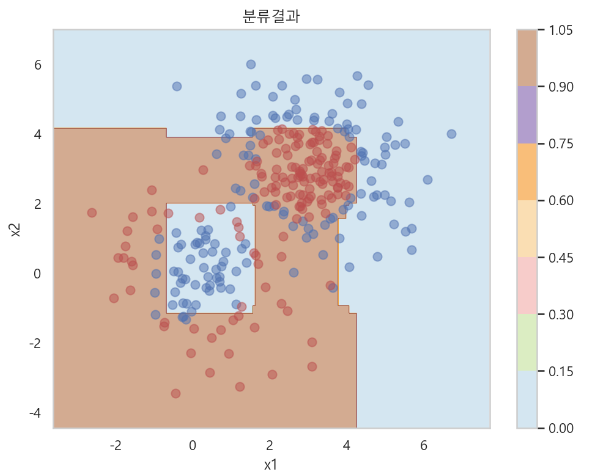


## 6. boosting 모형 그리드서치 실험

### 6-1. 모형 생성

```python
from sklearn.tree import DecisionTreeClassifier
from sklearn.ensemble import AdaBoostClassifier
from sklearn.ensemble import GradientBoostingClassifier
import xgboost
import lightgbm
from sklearn.model_selection import GridSearchCV

model_dt = DecisionTreeClassifier(max_depth=2, random_state=0)
model_ada = AdaBoostClassifier(DecisionTreeClassifier(max_depth=2, random_state=0))
model_grad = GradientBoostingClassifier()
model_xgb = xgboost.XGBClassifier()
model_lgbm = lightgbm.LGBMClassifier()
models = [model_dt, model_ada, model_grad, model_xgb, model_lgbm]
models

>>> print

[DecisionTreeClassifier(max_depth=2, random_state=0),
 AdaBoostClassifier(base_estimator=DecisionTreeClassifier(max_depth=2,
                                                          random_state=0)),
 GradientBoostingClassifier(),
 XGBClassifier(base_score=None, booster=None, colsample_bylevel=None,
               colsample_bynode=None, colsample_bytree=None, gamma=None,
               gpu_id=None, importance_type='gain', interaction_constraints=None,
               learning_rate=None, max_delta_step=None, max_depth=None,
               min_child_weight=None, missing=nan, monotone_constraints=None,
               n_estimators=100, n_jobs=None, num_parallel_tree=None,
               random_state=None, reg_alpha=None, reg_lambda=None,
               scale_pos_weight=None, subsample=None, tree_method=None,
               validate_parameters=False, verbosity=None),
 LGBMClassifier()]
```

### 6-2. 그리드 서치 적용
- n_estimators 값을 변경하여 측정
- 성능 순서
    - XGBoost > 에이다 부스트 > 그래디언트 부스트 > LGBM

```python
params = {"n_estimators" : [10, 50, 100, 200, 300, 400, 500, 1000, 1500]}

scores = []
for m in models[1:] :
    grid_cv = GridSearchCV(m, param_grid=params, cv=5, scoring="accuracy", return_train_score=True)
    grid_cv.fit(X, y)
    scores.append(grid_cv.best_score_)

scores

>>> print

[0.8633333333333333, 0.85, 0.8733333333333334, 0.8033333333333333]
```

## 7. 부스팅 모형을 사용하여 와인데이터 분류 실험

### 7-1. 데이터 임포트
- 스케일링 적용

```python
r = pd.read_csv("../../all_data/wine_data/winequality-red.csv", sep=";")
w = pd.read_csv("../../all_data/wine_data/winequality-white.csv", sep=";")

r["color"] = 1.
w["color"] = 0.

wine = pd.concat([r, w])
wine["taste"] = [1. if grade > 5 else 0. for grade in wine["quality"]]

X = wine.drop(["quality", "taste"], axis=1)
y = wine["taste"]

from sklearn.preprocessing import StandardScaler

SS = StandardScaler()
X_ss = SS.fit_transform(X)

## 스케일링 후 표준편차 확인
X_ss_df = pd.DataFrame(X_ss, columns=X.columns)
X_ss_df.describe().loc["std"]


>>> print

fixed acidity           1.000077
volatile acidity        1.000077
citric acid             1.000077
residual sugar          1.000077
chlorides               1.000077
free sulfur dioxide     1.000077
total sulfur dioxide    1.000077
density                 1.000077
pH                      1.000077
sulphates               1.000077
alcohol                 1.000077
color                   1.000077
Name: std, dtype: float64
```


### 7-2. train, test 데이터 분리

```python
from sklearn.model_selection import train_test_split

X_train, X_test, y_train, y_test = train_test_split(X_ss, y, test_size=0.2,
                                                   random_state=13)

X_train.shape, X_test.shape, y_train.shape, y_test.shape

>>> print

((5197, 12), (1300, 12), (5197,), (1300,))
```

### 7-3. boosting 모형 적용
- 모형 생성
- 교차검증 성능 측정
    - accuracy와 표준편차 측정
    - std값이 작을 수록 모형의 과적합이 작다고 볼 수 있다.

```python
from sklearn.ensemble import (AdaBoostClassifier, GradientBoostingClassifier,
                             RandomForestClassifier, ExtraTreesClassifier)
from sklearn.tree import DecisionTreeClassifier
from sklearn.linear_model import LogisticRegression
from sklearn.model_selection import KFold, cross_val_score

models = []
models.append(("DT", DecisionTreeClassifier()))
models.append(("RF", RandomForestClassifier()))
models.append(("ExTree", ExtraTreesClassifier()))
models.append(("Ada", AdaBoostClassifier()))
models.append(("Grad", GradientBoostingClassifier()))
models.append(("LogR", LogisticRegression()))

results = []
names = []

for name, model in models :
    kfold = KFold(n_splits=5, random_state=13, shuffle=True)
    cv_results = cross_val_score(model, X_train, y_train,
                                 cv=kfold, scoring="accuracy")
    results.append(cv_results)
    names.append(name)

    print(name, cv_results.mean(), cv_results.std())

>>> print

DT 0.7525457170356111 0.012567151701070306
RF 0.8179653142814838 0.018771744730417487
ExTree 0.8237378766565484 0.020339300498493144
Ada 0.7533103205745169 0.02644765901536818
Grad 0.7663959428444511 0.021596556352125432
LogR 0.74273191678389 0.015548839626296565    
```

### 7-4. cv score 비교 
- box plot
- 취합 방식인 랜덤 포레스트와 Extream Trees의 성능이 높은 것을 알 수 있다.
    - 분산은 크다.
- 부스팅 방식인 에이다 부스트, 그래디언트 부스트의 성능은 낮지만 분산이 작다.    

```python
plt.figure(figsize=(10, 8))
plt.boxplot(results)
plt.xticks(np.arange(1, 7), names)
plt.show() ;
```
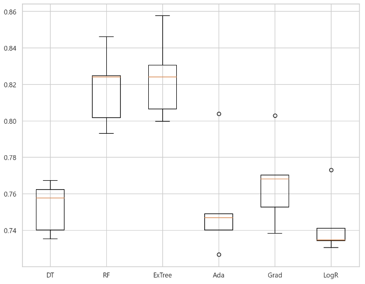

### 7-5. test 데이터를 사용한 성능 평가

```python
from sklearn.metrics import accuracy_score

for name, model in models :
    model.fit(X_train, y_train)
    pred = model.predict(X_test)
    print(name, accuracy_score(y_test, pred))

>>> print

DT 0.7853846153846153
RF 0.8361538461538461
ExTree 0.84
Ada 0.7553846153846154
Grad 0.7884615384615384
LogR 0.7469230769230769
```

# aggregation, boosting 모형 실험
- DecisionTree, RandomForest, ExtraTrees, AdaBoosting, GradientBoost, XGBoost, LGBM

## 1. DecisionTree 실험

### 1-1. DT 실험 1
- max_depth, random_state, min_samples_leaf 파라미터를 변화하여 실험
- min_samples_leaf에 따라서 성능 그룹이 생김
- 튜닝을 하기전보다 오히려 더 낮아짐

```python
from sklearn.model_selection import GridSearchCV

%%time

params_dt = {"max_depth" : np.arange(1, 200, 15),
            "random_state" : np.arange(0, 20),
            "min_samples_leaf" : np.arange(80, 101)}
grid_dt = GridSearchCV(models[0][1], param_grid=params_dt, cv=kfold,
                      scoring="accuracy", return_train_score=True)
grid_dt.fit(X_ss, y)

>>> print

Wall time: 7min 8s
```

#### 모형 실험 결과
- min_samples_leaf 파라미터를 기준으로 성능값이 같다.

```python
cv_result_dt = pd.DataFrame(grid_dt.cv_results_)
cv_result_dt = cv_result_dt[[
    "rank_test_score", "params",
    "mean_test_score", "std_test_score",
    "mean_train_score", "std_train_score"]].sort_values("rank_test_score",
                                                        ascending=True)
cv_result_dt
```
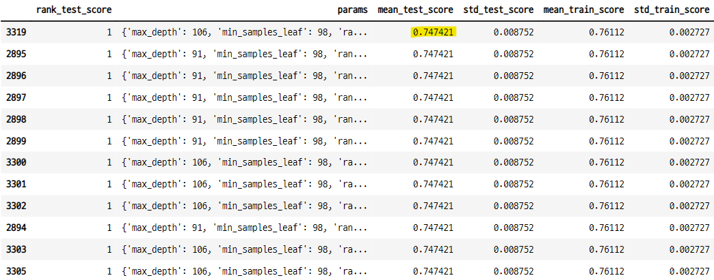

#### rank 1의 min samples leaf

```python
cv_result_dt[cv_result_dt["rank_test_score"] == 1]["params"].apply(lambda x : x["min_samples_leaf"]).value_counts()

>>> print

98    260
Name: params, dtype: int64
```
#### 성능이 좋은 모형

```python
grid_dt.best_estimator_

>>> print

DecisionTreeClassifier(max_depth=16, min_samples_leaf=98, random_state=0)
```

#### 가장 좋은 성능
- 파라미터 튜닝은 파라미터의 조합에 따라서 성능이 크게 달라진다.
    - 파라미터 튜닝을 하지 않은 기본 모형을 사용한 경우가 성능이 더 좋을 수 있다.

```python
grid_dt.best_score_

>>> print

0.747421330017173
```

#### 검증 데이터에 대한 성능

```python
accuracy_score(y_test, grid_dt.best_estimator_.predict(X_test))

>>> print

0.7730769230769231
```

### 1-2. DT 실험 2
- 파라미터 튜닝 : max_depth, random_state의 조합에 따라서 성능 측정
    - min_samples_leaf 제외

```python
%%time

params_dt = {"max_depth" : np.arange(1, 200, 15),
            "random_state" : np.arange(0, 20)}
grid_dt_2 = GridSearchCV(models[0][1], param_grid=params_dt, cv=kfold,
                      scoring="accuracy", return_train_score=True)
grid_dt_2.fit(X_ss, y)

>>> print

Wall time: 40.1 s
```

#### 모형의 실험 결과
- 성능이 가장 좋은 모형들
    - random_state 파라미터를 기준으로 성능이 그룹화 됨

```python
cv_result_dt_2 = pd.DataFrame(grid_dt_2.cv_results_)
cv_result_dt_2 = cv_result_dt_2[[
    "rank_test_score", "params",
    "mean_test_score", "std_test_score",
    "mean_train_score", "std_train_score"]].sort_values("mean_test_score",
                                                        ascending=False)
cv_result_dt_2[cv_result_dt_2["rank_test_score"]==1]
```
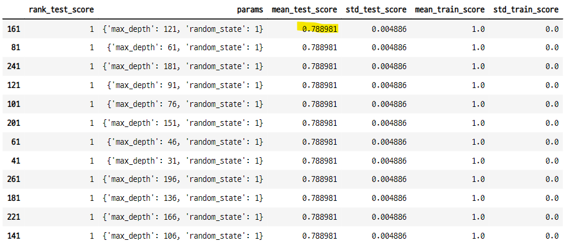


#### 가장 성능이 좋은 모형

```python
grid_dt_2.best_estimator_

>>> print

DecisionTreeClassifier(max_depth=31, random_state=1)
```

#### 가장 높은 성능
- min_samples_leaf 파라미터 튜닝을 사용했을 때보다 성능이 높다.

```python
grid_dt_2.best_score_

>>> print

0.7889809912950791
```

#### 성능값이 같은 모형의 파라미터
- **random_state 가 1이면서 max_depth 값이 작은 모형이 best 모형이라고 볼 수 있다.**
    - max_depth 값이 클 수록 모형의 과적합이 커진다.
    - 성능의 분산이 커진다.

```python
cv_result_dt_2[cv_result_dt_2["rank_test_score"]==1]["params"]

>>> print

161    {'max_depth': 121, 'random_state': 1}
81      {'max_depth': 61, 'random_state': 1}
241    {'max_depth': 181, 'random_state': 1}
121     {'max_depth': 91, 'random_state': 1}
101     {'max_depth': 76, 'random_state': 1}
201    {'max_depth': 151, 'random_state': 1}
61      {'max_depth': 46, 'random_state': 1}
41      {'max_depth': 31, 'random_state': 1}
261    {'max_depth': 196, 'random_state': 1}
181    {'max_depth': 136, 'random_state': 1}
221    {'max_depth': 166, 'random_state': 1}
141    {'max_depth': 106, 'random_state': 1}
Name: params, dtype: object
```

### 1-3. DT 실험 3
- 파라미터 튜닝 : max_depth 만 사용

```python
%%time
dt_3 = DecisionTreeClassifier()
params_dt = {"max_depth" : np.arange(1, 200, 15)}
grid_dt_3 = GridSearchCV(dt_3, param_grid=params_dt, cv=kfold,
                      scoring="accuracy", return_train_score=True)
grid_dt_3.fit(X_ss, y)

>>> print

Wall time: 2.09 s
```

#### 모형 실험 결과
- max_depth=151 인 모형의 성능이 가장 좋지만, 과적합이 심하다.
    - 분산 점수가 작다.
- max_depth=1 인 모형의 성능이 가장 낮지만, 과적합이 거의 없다.
    - 분산 점수가 크다.

```python
cv_result_dt_3 = pd.DataFrame(grid_dt_3.cv_results_)
cv_result_dt_3 = cv_result_dt_3[[
    "rank_test_score", "params",
    "mean_test_score", "std_test_score",
    "mean_train_score", "std_train_score"]].sort_values("mean_test_score",
                                                        ascending=False)
cv_result_dt_3
```
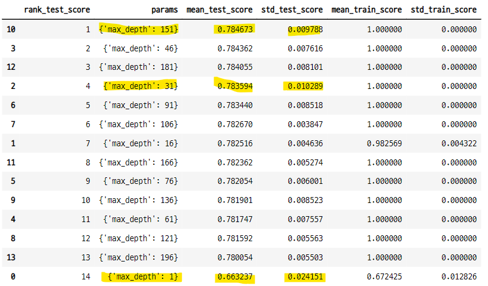

### 1-4. DT 실험 결과
- 파라미터 튜닝에서 파라미터의 조합에 따라서 성능이 크게 달라진다.
- 나무의 크기가 커질 수록 성능은 높지만 과적합이 심해진다.
- 따라서 나무의 크기와 연관된 파라미터 max_depth, min_samples_leaf의 값을 크게 늘일 필요가 없다.
    - 두 파라미터를 낮추면서 다른 방법들을 사용하여 성능을 높여야 모형이 좋다고 할 수 있다.
    - 혹은 데이터를 더 많이 수집하여야 한다.
- 이러한 측면에서 데이터에 따라서 특정 분류모형의 성능은 어떤 범위를 넘어서지 않는다고 볼 수 있다.
    - 어떤 방법을 사용하더라도 가장 좋은 모형의 성능이 월등히 높아질 수 없다.
    - **그러므로 여러 분류 모형을 실험하여 현재 데이터에 안정적이면서 성능이 높은 모형을 찾는 것이 좋다고 볼 수 있다.**


## 2. RandomForest 실험

### 2-1. RF 실험 1
- 파라미터 튜닝 : n_estimators

```python
%%time

rf = RandomForestClassifier()
params_rf = {"n_estimators" : np.arange(10, 101, 10)}
grid_rf = GridSearchCV(rf, param_grid=params_rf, cv=kfold,
                       scoring="accuracy", return_train_score=True)
grid_rf.fit(X_ss, y)

>>> print

Wall time: 19.8 s
```

#### 모형 실험 결과
- 10부터 100까지 10개 단위로 개별 모형의 갯수를 증가시킨 결과 DT 모델보다 성능이 좋다.
    - 과적합이 있지만 미세하게 작다.

```python
cv_result_rf = pd.DataFrame(grid_rf.cv_results_)
cv_result_rf = cv_result_rf[["rank_test_score", "param_n_estimators",
                            "mean_test_score", "std_test_score",
                            "mean_train_score", "std_train_score"]]
cv_result_rf = cv_result_rf.sort_values("mean_test_score", ascending=False)
cv_result_rf
```
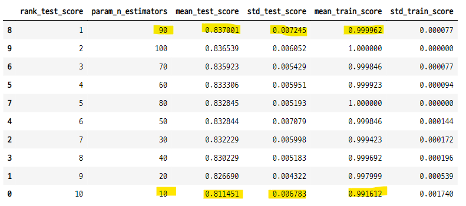


#### 가장 성능이 좋은 모형

```python
grid_rf.best_estimator_

>>> print

RandomForestClassifier(n_estimators=90)
```

#### 가장 높은 성능

```python
grid_rf.best_score_

>>> print

0.8370008882572394
```

### 2-2. RF 실험 2
- 파라미터 튜닝 : n_estimators의 범위를 100~1000 까지 확대

```python
%%time

rf = RandomForestClassifier()
params_rf = {"n_estimators" : np.arange(100, 1001, 15)}
grid_rf_2 = GridSearchCV(rf, param_grid=params_rf, cv=kfold,
                       scoring="accuracy", return_train_score=True)
grid_rf_2.fit(X_ss, y)

>>> print

Wall time: 19min 38s
```

#### 모형 실험 결과
- n_estimators가 100 이상인 경우 모든 모형이 과적합이 발생한다.
    - 100 이하인 모델의 성능과 크게 차이 나지 않는다.

```python
cv_result_rf_2 = pd.DataFrame(grid_rf_2.cv_results_)
cv_result_rf_2 = cv_result_rf_2[["rank_test_score", "param_n_estimators",
                            "mean_test_score", "std_test_score",
                            "mean_train_score", "std_train_score"]]
cv_result_rf_2 = cv_result_rf_2.sort_values("mean_test_score", ascending=False)
cv_result_rf_2
```
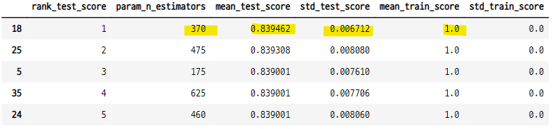


#### 가장 성능이 좋은 모형

```python
grid_rf_2.best_estimator_

>>> print

RandomForestClassifier(n_estimators=370)
```

#### 가장 높은 성능

```python
grid_rf_2.best_score_

>>> print

0.8394624267187776
```

### 2-3. RF 실험 3
- 파라미터 튜닝 : n_estimators, max_leaf_nodes(노드 분할 최대 갯수)

#### 개별 모형의 갯수 범위
- RF 실험 2에서 성능이 높은 모형의 파라미터도 추가함

```python
rf_range = np.concatenate([np.arange(100, 1000, 120), cv_result_rf_2[:5]["param_n_estimators"].values], axis=0)
rf_range

>>> print

array([100, 220, 340, 460, 580, 700, 820, 940, 370, 475, 175, 625, 460],
      dtype=object)
```

#### 모형 실험

```python
%%time

rf = RandomForestClassifier()
params_rf = {"n_estimators" : rf_range,
            "max_leaf_nodes" : np.arange(5)}
grid_rf_3 = GridSearchCV(rf, param_grid=params_rf, cv=kfold,
                       scoring="accuracy", return_train_score=True)
grid_rf_3.fit(X_ss, y)

>>> print

Wall time: 4min 10s
```

#### 모형 실험 결과
- **max_leaf_nodes 파라미터가 개별 모형의 갯수 증가에 따른 과적합을 방지해준다.**
    - RF 실험 2에서 개별 모형의 갯수가 크게 늘어나면서 모든 모형에서 과적합이 발생했지만, max_leaf_nodes 파라미터를 적용한 후 과적합이 거의 사라졌다.
    - 성능은 다소 낮지만 모형은 안정적이라고 볼 수 있다.    

```python
cv_result_rf_3 = pd.DataFrame(grid_rf_3.cv_results_)
cv_result_rf_3 = cv_result_rf_3[["rank_test_score", "param_n_estimators",
                                 "param_max_leaf_nodes", "mean_test_score",
                                 "std_test_score", "mean_train_score",
                                 "std_train_score"]]
cv_result_rf_3 = cv_result_rf_3.sort_values("mean_test_score", ascending=False)[:20]
cv_result_rf_3
```
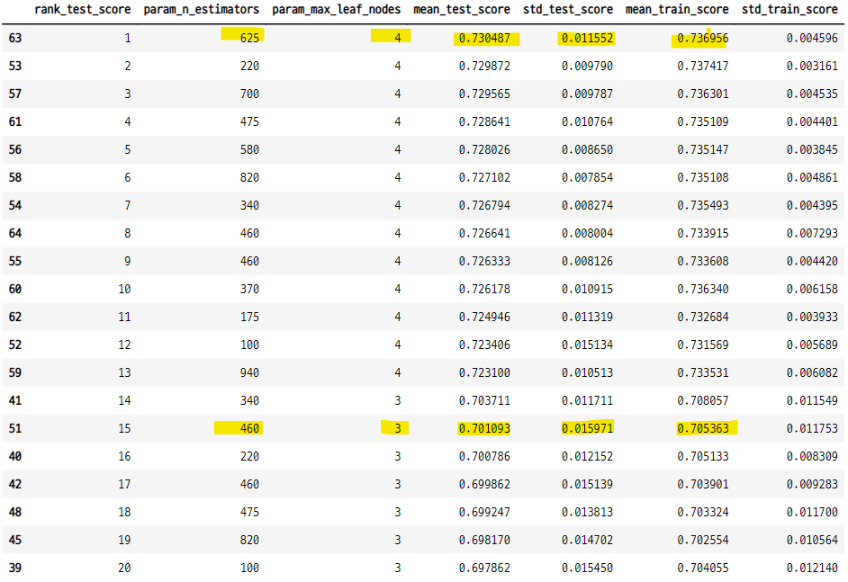

#### 가장 성능이 좋은 모형

```python
grid_rf_3.best_estimator_

>>> print

RandomForestClassifier(max_leaf_nodes=4, n_estimators=625)
```

#### 가장 높은 성능

```python
grid_rf_3.best_score_

>>> print

0.7304874755729258
```

### 2-4. RF 실험 4
- 파라미터 튜닝 : n_estimators, min_samples_leaf(노드의 데이터 집합의 최소 갯수)
    - max_leaf_nodes 제외
- 시간이 매우 오래 걸린다.

```python
rf = RandomForestClassifier()
params_rf = {"n_estimators" : best_esti,
            "min_samples_leaf" : np.arange(0, 21, 2)}
grid_rf_4 = GridSearchCV(rf, param_grid=params_rf, cv=kfold,
                       scoring="accuracy", return_train_score=True)
grid_rf_4.fit(X_ss, y)

>>> print

Wall time: 27min 57s
```

#### 모형 실험 결과
- estimator 갯수가 크게 증가하면서 성능이 증가하고, 과적합이 발생하지만 min_samples_leaf 가 다소 낮춰준다.
    - max_leaf_nodes 보다 과적합 방지 효과가 작다.

```python
cv_result_rf_4 = pd.DataFrame(grid_rf_4.cv_results_)
cv_result_rf_4 = cv_result_rf_4[["rank_test_score", "param_n_estimators",
                                 "param_min_samples_leaf", "mean_test_score",
                                 "std_test_score", "mean_train_score",
                                 "std_train_score"]]
cv_result_rf_4 = cv_result_rf_4.sort_values("mean_test_score", ascending=False)[:20]
cv_result_rf_4
```
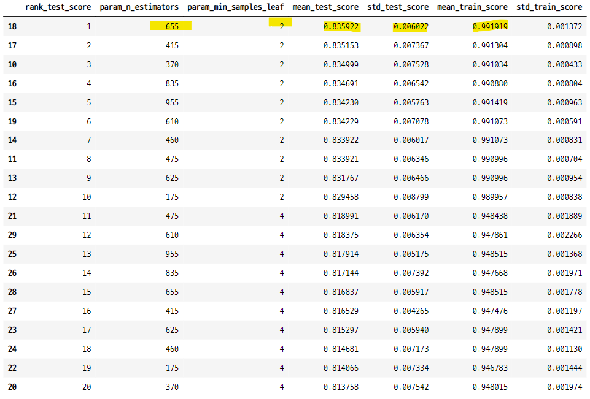

#### 가장 성능이 좋은 모형

```python
grid_rf_4.best_estimator_

>>> print

RandomForestClassifier(min_samples_leaf=2, n_estimators=655)
```

#### 가장 높은 성능

```python
grid_rf_4.best_score_

>>> print

0.8359223071001363
```

### 2-5. RF 실험 5
- 파라미터 튜닝 : n_estimators, max_depth

```python
%%time

rf = RandomForestClassifier()
params_rf = {"n_estimators" : [100, 500, 1000],
            "max_depth" : np.arange(0, 21)}
grid_rf_5 = GridSearchCV(rf, param_grid=params_rf, cv=kfold,
                       scoring="accuracy", return_train_score=True)
grid_rf_5.fit(X_ss, y)
```

#### 모형 실험 결과
- n_estimators 값이 커질 수록 과적합이 커지지만 max_depth 값이 미미하지만 과적합을 낮춰준다.
    - RF 실험 4와 성능과 과적합이 거의 비슷하다.

```python
cv_result_rf_5 = pd.DataFrame(grid_rf_5.cv_results_)
cv_result_rf_5 = cv_result_rf_5[["rank_test_score", "param_n_estimators",
                                 "param_max_depth", "mean_test_score",
                                 "std_test_score", "mean_train_score",
                                 "std_train_score"]]
cv_result_rf_5 = cv_result_rf_5.sort_values("mean_test_score", ascending=False)[:20]
cv_result_rf_5
```
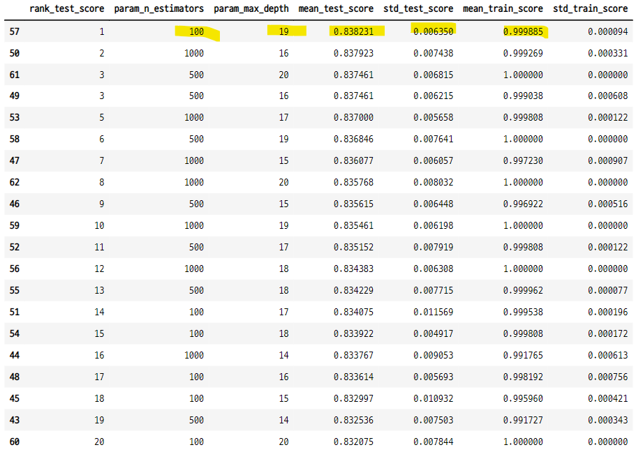

#### 가장 성능이 좋은 모형

```python
grid_rf_5.best_estimator_

>>> print

RandomForestClassifier(max_depth=19)
```

#### 가장 높은 성능

```python
grid_rf_5.best_score_

>>> print

0.838230946882217
```

### 2-6. RF 실험 6
- 파라미터 튜닝 : max_depth
    - 나무의 깊이만 변경하여 실험

```python
%%time

rf = RandomForestClassifier()
params_rf = {"max_depth" : np.arange(0, 50, 1)}
grid_rf_6 = GridSearchCV(rf, param_grid=params_rf, cv=kfold,
                       scoring="accuracy", return_train_score=True, n_jobs=2)
grid_rf_6.fit(X_ss, y)

>>> print

Wall time: 1min 25s
```

#### 모형 실험 결과 
- n_estimators 파라미터와 같이 max_depth 파라미터도 커질 수록 성능은 커지지만 과적합이 발생한다.

```python
cv_result_rf_6 = pd.DataFrame(grid_rf_6.cv_results_)
cv_result_rf_6 = cv_result_rf_6[["rank_test_score",
                                 "param_max_depth", "mean_test_score",
                                 "std_test_score", "mean_train_score",
                                 "std_train_score"]]
cv_result_rf_6 = cv_result_rf_6.sort_values("mean_test_score", ascending=False)[:20]
cv_result_rf_6
```
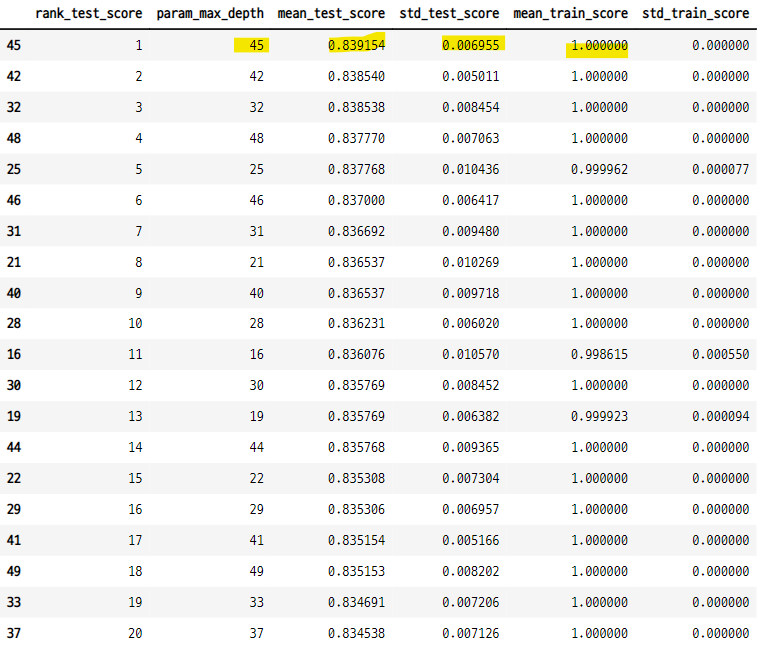

#### 가장 성능이 좋은 모형

```python
grid_rf_6.best_estimator_

>>> print

RandomForestClassifier(max_depth=45)
```

#### 가장 높은 성능

```python
grid_rf_6.best_score_

>>> print

0.8391541422395925
```

### 2-7. RF 실험 7
- 파라미터 튜닝 : n_estimators, max_leaf_nodes, max_depth
    - 파라미터의 범위를 낮추고 max_leaf_nodes를 사용하여 과적합을 방지
    - n_estimators 는 100 이하
    - max_leaf_nodes 10 이하
    - max_depth는 10 이하

```python
%%time
kfold = KFold(n_splits=5, shuffle=True, random_state=2)

rf = RandomForestClassifier()
params_rf = {"max_depth" : range(10),
            "max_leaf_nodes" : range(10),
            "n_estimators" : [10, 50, 100]}
grid_rf_7 = GridSearchCV(rf, param_grid=params_rf, cv=kfold,
                       scoring="accuracy", return_train_score=True, n_jobs=2)
grid_rf_7.fit(X_ss, y)

>>> print

Wall time: 1min 24s
```

#### 모형 실험 결과
- 과적합이 발생한 모형보다 성능은 떨어지지만 과적합은 거의 없는 것으로 나타난다.
    - 최대 성능 0.747120

```python
cv_result_rf_7 = pd.DataFrame(grid_rf_7.cv_results_)
cv_result_rf_7 = cv_result_rf_7[["rank_test_score",
                                 "param_max_depth",
                                 "param_n_estimators",
                                 "param_max_leaf_nodes",
                                 "mean_test_score",
                                 "std_test_score",
                                 "mean_train_score",
                                 "std_train_score"]]
cv_result_rf_7 = cv_result_rf_7.sort_values("mean_test_score", ascending=False)[:20]
cv_result_rf_7
```
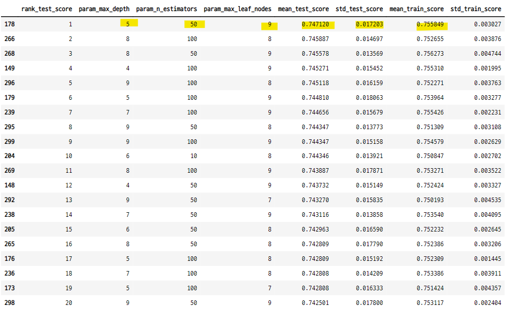

### 2-8. RF 실험 8
- 파라미터 튜닝 : n_estimators, max_leaf_nodes, max_depth
    - n_estimators 를 200과 500을 추가
    - max_leaf_nodes 10 이하
    - max_depth는 15 이하

```python
%%time
kfold = KFold(n_splits=5, shuffle=True, random_state=2)

rf = RandomForestClassifier()
params_rf = {"max_depth" : range(15),
            "max_leaf_nodes" : range(10),
            "n_estimators" : [10, 20, 50, 100, 200, 500]}
grid_rf_8 = GridSearchCV(rf, param_grid=params_rf, cv=kfold,
                       scoring="accuracy", return_train_score=True, n_jobs=2)
grid_rf_8.fit(X_ss, y)

>>> print

Wall time: 12min 11s
```

#### 모형 실험 결과
- 실험 7의 n_estimators와 max_depth 범위보다 증가시킨 후 성능이 다소 향상되었다.
    - 0.747427
    - 과적합은 거의 없다.

```python
cv_result_rf_8 = pd.DataFrame(grid_rf_8.cv_results_)
cv_result_rf_8 = cv_result_rf_8[["rank_test_score",
                                 "param_max_depth",
                                 "param_n_estimators",
                                 "param_max_leaf_nodes",
                                 "mean_test_score",
                                 "std_test_score",
                                 "mean_train_score",
                                 "std_train_score"]]
cv_result_rf_8 = cv_result_rf_8.sort_values("mean_test_score", ascending=False)[:20]
cv_result_rf_8
```
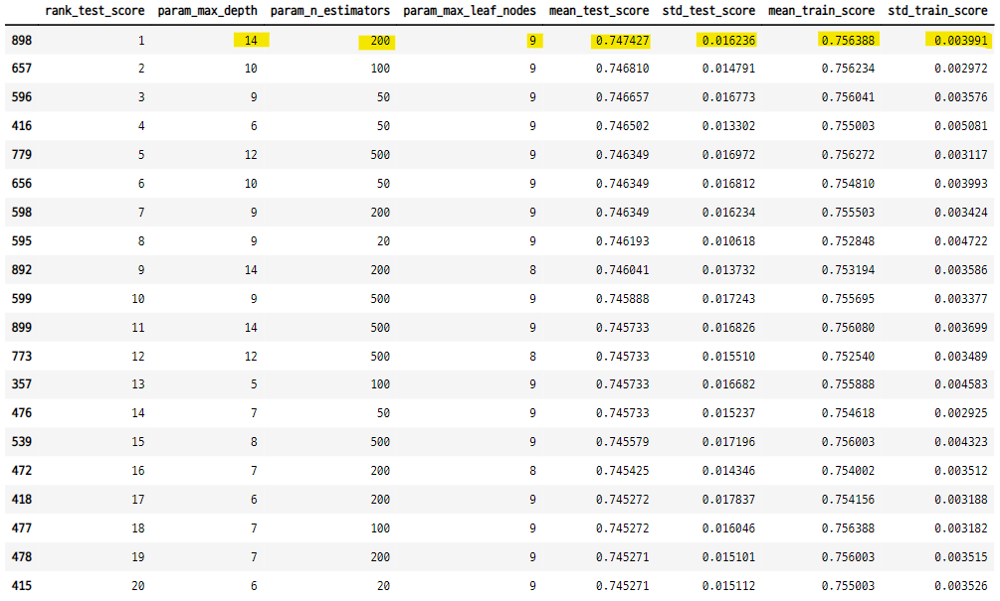

### 2-9. RF 실험 결과
- n_estimatros와 max_depth 파라미터가 커질 수록 모형의 성능은 좋지만 과적합이 발생한다.
    - 0.84 근처의 모형들
- max_leaf_nodes 파라미터를 함께 사용하면 모형의 성능은 떨어지지만 과적합이 사라진다.
    - 0.74 근처의 모형들
- 성능을 높이면서 과적합을 줄이는 파라미터 튜닝에 대한 연구가 필요해 보인다.

```python
%matplotlib inline

rf_model_scores = [
    ('grid_rf', 0.8370008882572394),
    ('grid_rf_2', 0.8394624267187776),
    ('grid_rf_3', 0.7304874755729258),
    ('grid_rf_4', 0.8359223071001363),
    ('grid_rf_5', 0.838230946882217),
    ('grid_rf_6', 0.8391541422395925),
    ('grid_rf_7', 0.747120),
    ('grid_rf_8', 0.747427)
]


plt.figure(figsize=(8, 6))
plt.scatter([n for n, s in rf_model_scores], [s for n, s in rf_model_scores],
            c="orange", edgecolors="k", s=50)
plt.xticks(rotation=-45)
plt.grid(ls="--", c="k", lw="0.4")
plt.title("RF : 그리드서치별 best score 비교", y=1.05)
plt.show() ;
```
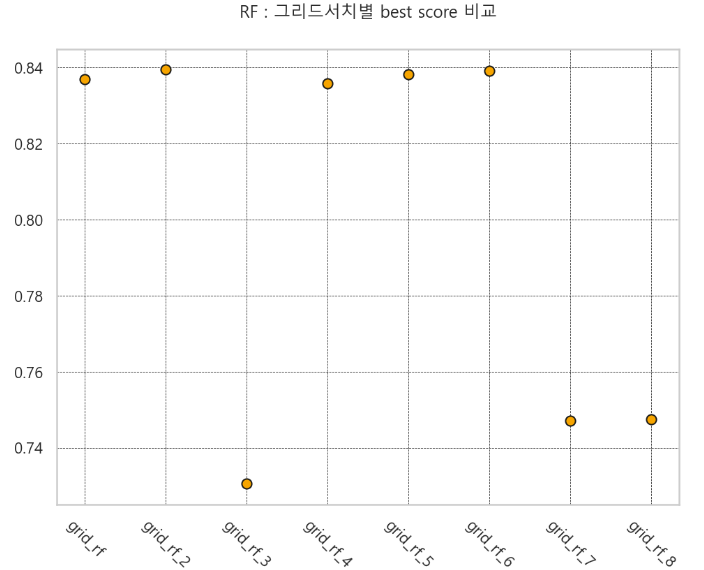

## 3. ExtraTrees
- ExtraTree 모형은 DT 개별모형간의 상관관계를 낮추기 위해서 노드의 분할 판단기준을 정할때 독립변수를 랜덤으로 선택하는 것이 특징이다.
- RF 모형은 노드 분할 시 기준으로 사용할 독립변수의 갯수를 랜덤으로 정한다.

### 3-1. EX Tree 실험 1
- 파라미터 튜닝 : n_estimators
    - 0부터 1000까지 50 단위로 증가    

```python
from sklearn.ensemble import ExtraTreesClassifier

%%time

extra_rf = ExtraTreesClassifier()
params_extra = {"n_estimators" : np.arange(0, 1001, 50)}
grid_extra = GridSearchCV(extra_rf, param_grid=params_extra, cv=kfold,
                       scoring="accuracy", return_train_score=True, n_jobs=2)
grid_extra.fit(X_ss, y)
```

#### 모형 실험 결과
- RF의 실험 결과와 비슷하게 n_estimators의 값이 커질 수록 성능은 좋지만 과적합이 발생한다.
    - RF의 최대 성능과 유사하다.

```python
cv_result_extra = pd.DataFrame(grid_extra.cv_results_)
cv_result_extra = cv_result_extra[["rank_test_score",
                                   "param_n_estimators",
                                   "mean_test_score",
                                   "std_test_score",
                                   "mean_train_score",
                                   "std_train_score"]]
cv_result_extra = cv_result_extra.sort_values("mean_test_score", ascending=False)[:20]
cv_result_extra
```
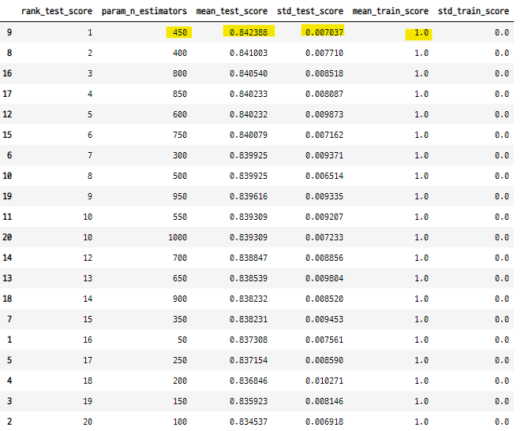

#### 가장 성능이 좋은 모형

```python
grid_extra.best_estimator_

>>> print

ExtraTreesClassifier(n_estimators=450)
```

#### 가장 높은 성능

```python
grid_extra.best_score_

>>> print

0.842387635459229
```


### 3-2. Extra Tree 실험 2
- 파라미터 튜닝 : n_estimators, max_depth

```python
%%time

extra_rf = ExtraTreesClassifier()
params_extra = {"n_estimators" : np.arange(0, 1001, 100),
               "max_depth" : np.arange(0, 20)}
grid_extra_2 = GridSearchCV(extra_rf, param_grid=params_extra, cv=kfold,
                       scoring="accuracy", return_train_score=True, n_jobs=2)
grid_extra_2.fit(X_ss, y)

>>> print

Wall time: 12min 22s
```

#### 모형 실험 결과
- n_estimators만 사용했을 때보다 max_depth를 함께 사용했을때 과적합이 다소 줄어드는 것을 볼 수 있다.
    - 성능은 다소 떨어진다.

```python
cv_result_extra_2 = pd.DataFrame(grid_extra_2.cv_results_)
cv_result_extra_2 = cv_result_extra_2[["rank_test_score",
                                   "param_n_estimators",
                                   "mean_test_score",
                                   "std_test_score",
                                   "mean_train_score",
                                   "std_train_score"]]
cv_result_extra_2 = cv_result_extra_2.sort_values("mean_test_score", ascending=False)[:20]
cv_result_extra_2
```
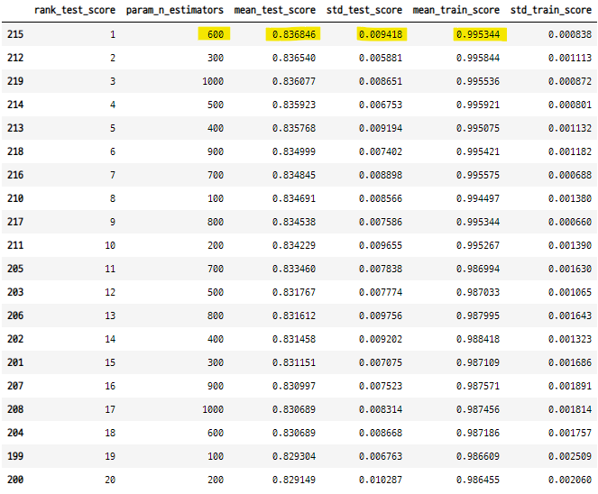


### 3-3. Extra Tree 실험 3
- 파라미터 튜닝 : n_estimators, max_depth, max_leaf_nodes
     - n_estimators의 범위를 125이하로 낮춤
     - max_leaf_nodes 파라미터 추가
     - 과적합을 낮춰주는 기능

```python
%%time

extra_rf = ExtraTreesClassifier()
params_extra = {"n_estimators" : [25, 50, 75, 100, 125],
               "max_depth" : np.arange(0, 10),
               "max_leaf_nodes" : np.arange(0, 16)}
grid_extra_3 = GridSearchCV(extra_rf, param_grid=params_extra, cv=kfold,
                       scoring="accuracy", return_train_score=True, n_jobs=2)
grid_extra_3.fit(X_ss, y)

>>> print

Wall time: 3min 24s
```

#### 모형 실험 결과
- max_leaf_nodes 를 추가하여 과적합을 없앴지만 성능은 떨어진다.

```python
cv_result_extra_3 = pd.DataFrame(grid_extra_3.cv_results_)
cv_result_extra_3 = cv_result_extra_3[["rank_test_score",
                                   "param_n_estimators",
                                   "param_max_depth",
                                   "param_max_leaf_nodes",
                                   "mean_test_score",
                                   "std_test_score",
                                   "mean_train_score",
                                   "std_train_score"]]
cv_result_extra_3 = cv_result_extra_3.sort_values("mean_test_score", ascending=False)[:20]
cv_result_extra_3
```
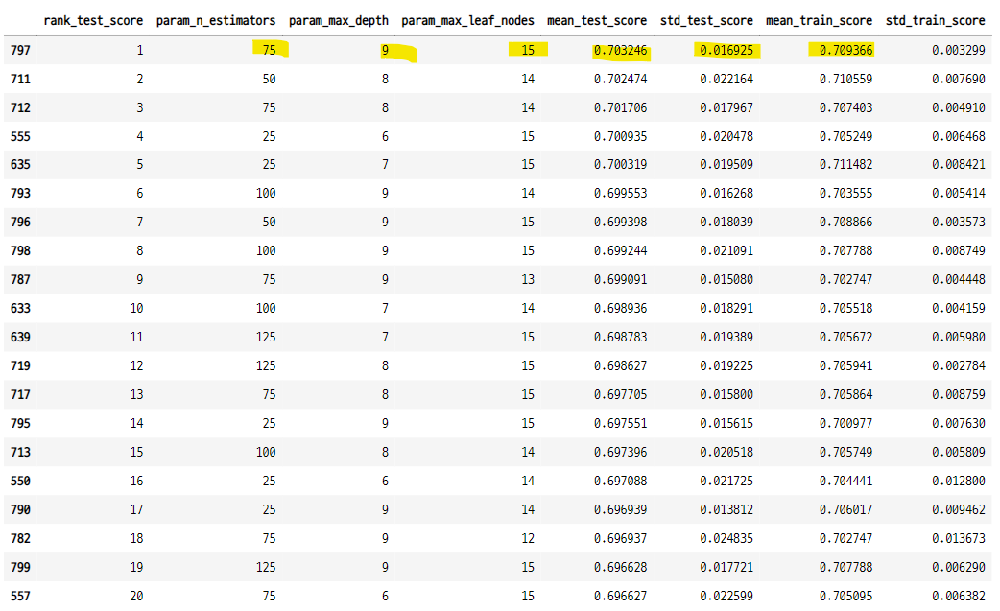


### 3-4. Extra Tree 실험 4
- 파라미터 튜닝 : n_estimators, max_depth, max_leaf_nodes, max_features
    - max_features : 노드 분할 시 사용할 독립변수의 갯수를 정하는 방식
    - auto는 전체 독립변수의 갯수에 루트를 적용한 값, sqrt와 같다.
    - log는 전체 독립변수의 갯수에 로그를 적용한 값
    - None은 전체 독립변수를 그대로 사용

```python
%%time

extra_rf = ExtraTreesClassifier()
params_extra = {"n_estimators" : [100, 150, 200],
               "max_depth" : [5, 7, 10, 15],
               "max_leaf_nodes" : np.arange(0, 16),
               "max_features" : ["auto", "log", None]}
grid_extra_4 = GridSearchCV(extra_rf, param_grid=params_extra, cv=kfold,
                       scoring="accuracy", return_train_score=True, n_jobs=2)
grid_extra_4.fit(X_ss, y)

>>> print

Wall time: 4min 57s
```

#### 모형 실험 결과
- 과적합이 없고 성능이 향상 되었다.
- 현재 데이터는 독립변수의 갯수가 크지 않으므로 max_features 값을 auto, sqrt, log로 제약할 필요가 없어 보인다.

```python
cv_result_extra_4 = pd.DataFrame(grid_extra_4.cv_results_)
cv_result_extra_4 = cv_result_extra_4[["rank_test_score",
                                   "param_n_estimators",
                                   "param_max_depth",
                                   "param_max_leaf_nodes",
                                   "param_max_features",
                                   "mean_test_score",
                                   "std_test_score",
                                   "mean_train_score",
                                   "std_train_score"]]
cv_result_extra_4 = cv_result_extra_4.sort_values("mean_test_score", ascending=False)[:20]
cv_result_extra_4
```
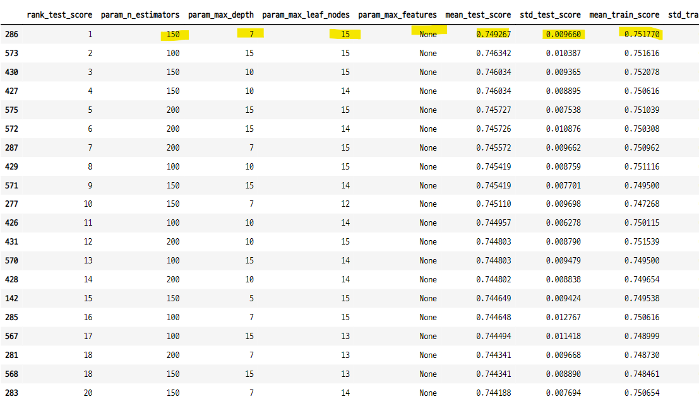

### 3-5. Extra Tree 실험 5
- 파라미터 튜닝 : n_estimators, max_depth, max_leaf_nodes, max_features
    - n_estimators, max_leaf_nodes의 범위 증가
    - max_features는 None으로 고정

```python
%%time

extra_rf = ExtraTreesClassifier()
params_extra = {"n_estimators" : [100, 120, 150, 180, 200, 250, 270, 300],
               "max_depth" : [5, 7, 8, 10, 12, 15],
               "max_leaf_nodes" : np.arange(0, 20),
               "max_features" : [None]}
grid_extra_5 = GridSearchCV(extra_rf, param_grid=params_extra, cv=kfold,
                       scoring="accuracy", return_train_score=True, n_jobs=2)
grid_extra_5.fit(X_ss, y)

>>> print

Wall time: 19min 58s
```

#### 모형 실험 결과
- Extra Tree 실험 4와 결과가 거의 같다.
- 즉 max_features를 None으로 한 경우, max_leaf_depth와 n_estimators의 값을 증가시켜도 모형의 성능에 크게 영향을 미치지 않는다.

```python
cv_result_extra_5 = pd.DataFrame(grid_extra_5.cv_results_)
cv_result_extra_5 = cv_result_extra_4[["rank_test_score",
                                   "param_n_estimators",
                                   "param_max_depth",
                                   "param_max_leaf_nodes",
                                   "param_max_features",
                                   "mean_test_score",
                                   "std_test_score",
                                   "mean_train_score",
                                   "std_train_score"]]
cv_result_extra_5 = cv_result_extra_5.sort_values("mean_test_score", ascending=False)[:20]
cv_result_extra_5
```
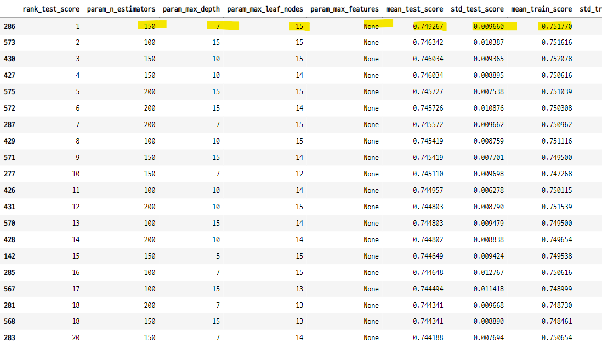

### 7-6. Extra Tree 실험 결과
- Extra Tree의 실험에서 과적합이 없는 가장 높은 성능은 0.749로 DT, RF 보다 다소 높아진 것을 볼 수 있다.
- 특히 Extra Tree의 모형은 개별 모형간의 상관관계를 낮추기 위해 각 노드의 분할시 사용하는 독립변수를 랜덤하게 선택하는 것이 특징이다. 
- 또한 max_features 파라미터가 auto로 설정되면 전체 독립변수 갯수에 루트를 적용한 갯수의 독립변수만 사용하게 된다.
- 즉 max_features 설정값을 None으로 설정하여 전체 독립변수를 모두 사용하고, 이중에서 무작위로 독립변수를 선택하도록 모형을 생성했을때 성능이 높아진 것을 알 수 있다.
    - 그러나 독립변수의 갯수가 많은 데이터라면 max_features를 None이 아닌 다른 값으로 설정하는 것이 더 좋을 수도 있다.

```python
plt.figure(figsize=(8, 6))
plt.scatter([n for n, s in ex_tree_model_scores],
            [s for n, s in ex_tree_model_scores],
            c="orange", edgecolors="k", s=50)
plt.xticks(rotation=-45)
plt.grid(ls="--", c="k", lw="0.4")
plt.title("ExtraTree : 그리드서치별 best score 비교", y=1.05)
plt.show() ;
```
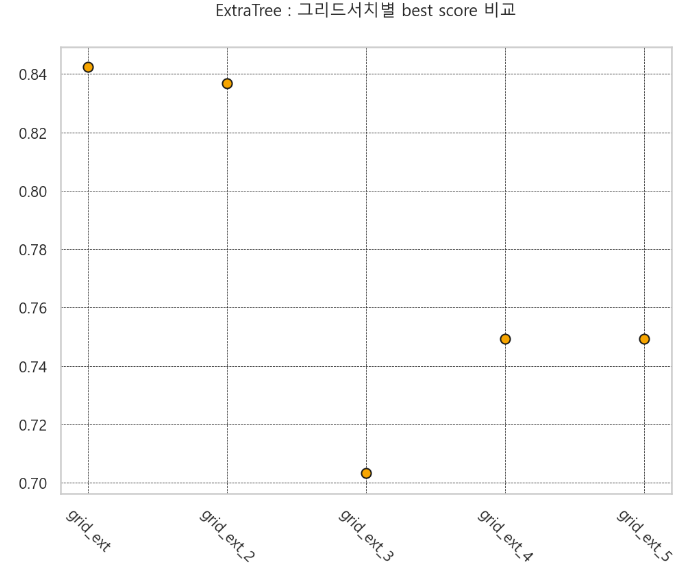


## 4. AdaBoost 실험

### 4-1. AdaBoost 실험 1
- DT, RF, Extra T 실험에서 과적합이 없고 성능이 가장 높은 grid_extra_5 모형을 기본 모형으로 사용
- 파라미터 튜닝 : n_estimators
    - 0부터 100까지 10 단위로 증가

```python
%%time

model_ada = AdaBoostClassifier(grid_extra_5.best_estimator_)
params_ada = {"n_estimators" : np.arange(0, 101, 10)}
grid_ada = GridSearchCV(model_ada, param_grid=params_ada, cv=kfold,
                       scoring="accuracy", return_train_score=True)
grid_ada.fit(X_ss, y)

>>> print

Wall time: 19min 38s
```

#### 모형 실험 결과
- 성능이 크게 개선 되었다.
    - 취합 방법 모형인 DT, RF, ExtraT 모형보다 성능이 높다.
    - 과적합이 있지만, DT, RF, ExtraT 모형보다 낮다.
- 과적합이 거의 없는 모형도 성능이 0.8점 대로 개선 되었다.    

```python
cv_result_ada = pd.DataFrame(grid_ada.cv_results_)
cv_result_ada = cv_result_ada[["rank_test_score",
                               "param_n_estimators",
                               "mean_test_score",
                               "std_test_score",
                               "mean_train_score",
                               "std_train_score"]]
cv_result_ada = cv_result_ada.sort_values("mean_test_score", ascending=False)[:20]
cv_result_ada
```
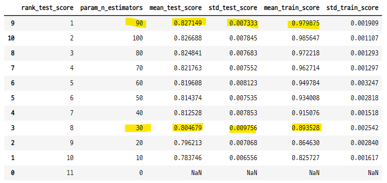


### 4-2. AdaBoost 실험 2
- 파라미터 튜닝 : n_estimators, learning_rate
    - learning_rate의 범위를 0부터 1까지 0.1 단위로 증가
    - learning_rate는 정규화 계수로 과적합을 낮춰주는 기능을 한다.
    - 어떤 값으로 하느냐에 따라서 성능이 달라진다.
- 학습시간이 오래 걸린다.

```python
%%time

model_ada = AdaBoostClassifier(grid_extra_5.best_estimator_)
params_ada = {"n_estimators" : [30, 50, 60, 90],
             "learning_rate" : np.linspace(0, 1, 10).round(1)}
grid_ada_2 = GridSearchCV(model_ada, param_grid=params_ada, cv=kfold,
                       scoring="accuracy", return_train_score=True)
grid_ada_2.fit(X_ss, y)

>>> print

Wall time: 1h 16min 13s
```

#### 모형 실험 결과
- 모형의 성능은 유지하면서 과적합이 다소 낮아졌다.
    - learning_rate 파라미터가 과적합을 낮춰준다는 것을 알 수 있다.

```python
cv_result_ada_2 = pd.DataFrame(grid_ada_2.cv_results_)
cv_result_ada_2 = cv_result_ada_2[["rank_test_score",
                               "param_n_estimators",
                               "param_learning_rate",
                               "mean_test_score",
                               "std_test_score",
                               "mean_train_score",
                               "std_train_score"]]
cv_result_ada_2 = cv_result_ada_2.sort_values("mean_test_score", ascending=False)[:20]
cv_result_ada_2
```
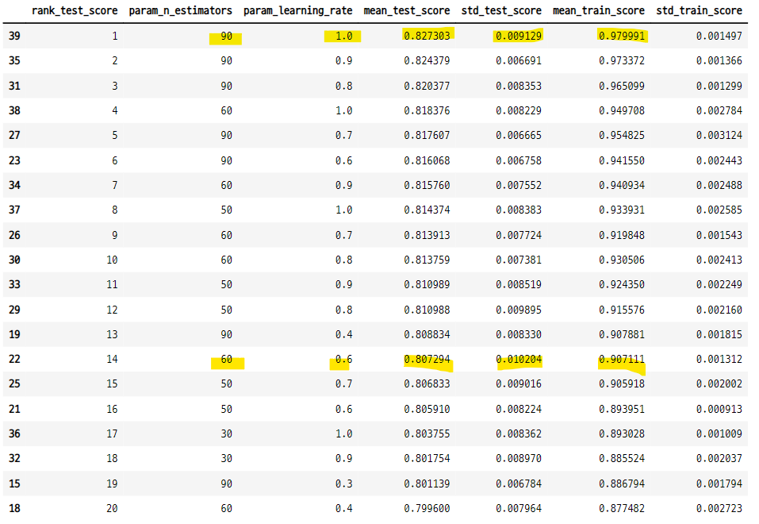


