# 추천 시스템
- `모형`
    - 1) 베이스라인 모형 (Baseline Model) : 추천 시스템의 기본 모형
    - 2) 협업 필터링 모형 (Collaborative Filtering)
        - 2-1) 이웃기반 협업 필터링 (Neighborhood Models)
            - 사용자 기반 필터링 user-based CF
            - 아이템 기반 필터링 item-based CF
        - 2-2) 잠재 요인 모델 (Latent Factor Models)
            - 행렬 분해 Matrix Factorization
            - 특잇값 분해 Singular Value Decomposition, SVD
            - 음수 미포함 행렬분해 Non-Negative Matrix Factorization, NMF
- `최적화` : 베이스라인 모형의 오차함수를 최소화하기 위한 방법
    - **확률적 경사 하강법 Stochastic Gradient Descent, SGD**
    - **교대 최소 자승법 Alternating Least Squares, ALS**
- `추천시스템 성능 평가기준`        
    - **루트오차제곱평균 Root Mean Squared Error, RMSE**
    - **오차절대값평균 Mean Absolute Error, MAE**
    - **일치쌍의 비율 Fraction of Concordant Pairs, FCP**
- `유사도` : 이웃기반협업필터링 모델에서 사용됨
    - **평균제곱차이 유사도 Mean Squared Difference Similarity, MSD**
    - **코사인 유사도 Cosine Similarity**
    - **피어슨 유사도 Pearson Similarity**
    - **피어슨-베이스라인 유사도 Pearson-Baseline Similarity**
- `KNN 가중치 예측 방법` : 이웃기반협업필터링 모델에서 유사도에 따른 가중치 예측
    - **KNNBasic**
    - **KNNWithMeans**
    - **KNNBaseline**
- `Python`
    - Baseline 모형 : 베이스라인 모형은 최적화 방법을 인수로 설정가능
        - **surprise.Baseline(bsl_options)** 
    - KNN 모형 : 이웃협업필터링 모형은 유사도 방법을 인수로 설정가능
        - **surprise.KNNBasic(sim_options)** 
        - **surprise.KNNWithMeans(sim_options)**
        - **surprise.KNNBaseline(sim_options)**
    - SVD 모형 : Latent Factor 모형의 하나. 차원 축소기능 있음.
        - **surprise.SVD(n_factors=100)**
    - NMF 모형 : Latent Factor 모형의 하나. 차원 축소기능 있음.
        - **surprise.NMF(n_factors=100)**
    - 최적화 : 딕셔너리 타입, Baseline 모형의 인수로 사용가능
        - **bal_options  = {"method":"als", "n_epochs":5, "reg_u":12, "reg_i":5}**
    - 유사도 : 딕녀너리 타입, KNN 모형의 인수로 사용가능
        - **sim_options = {"name" : "msd"}**
    - 모형 성능 평가 : rmse, mae, fcp 선태 가능
        - **surprise.accuracy.rmse(pred, verbose=True)**
    - 교차검증 : surprise 패키지의 model_selection 서브패키지에서 사용 가능
        - **from surprise.model_selection import cross_validate**
        - **cross_validate(model, data, maesures=["rmse", "mae", "fcp"])**
    
## 1. 추천 시스템
- `추천 시스템 Recommender System` : 사용자(user)가 선호하는 상품(Item)을 예측하는 시스템
    - 사용자가 아이템에 대해서 평가한 점수를 기반으로 예측한다.
    - **사용자 아이디와 상품 아이디라는 두 개의 카테고리 입력과 평점 출력을 갖는 예측 시스템**
- `추천시스템은 회귀모형을 따른다.`
    - user와 item 이라는 카테고리 독립변수와 rate 라는 실수형 종속변수를 토대로 평점을 예측하는 회귀모형을 따른다.

### 1-1. 평점 데이터
- `사용자 ID, 상품 ID, 평점으로 이루어진 행렬`
    - 독립변수 : user, item
    - 종속변수 : rate
- `R matrix`
    - x축 : item
    - y축 : user
    - value : rate
    - pivot_tabel(["user", "item"]).unstack()
    - user와 item을 이중 인덱스로 만들고, unstack() 을 사용하여 item을 열로 변환
- 평점 데이터가 일부에만 있다. : sparse 행렬
    - user가 모든 item에 대해서 평점을 매긴 것이 아니므로 평점이 비어 있게 된다.
    - 비어 있는 곳을 어떻게 채우냐에 따라서 예측 방법이 달라질 수 있다.
    
## 2. 추천시스템 알고리즘
- 추천 시스템은 두 개의 카테고리 값 입력으로부터 하나의 실수 값을 출력하는 **회귀모형**
    - 회귀분석과 유사하지만 여러가지 방법으로 성능을 증가시킬 수 있다.

### 2-1. 추천시스템 모형
- 1) 베이스라인 모형 (Baseline Model) : 추천 시스템의 기본 모형
- 2) 협업 필터링 모형 (Collaborative Filtering)
    - 2-1) 이웃기반 협업 필터링 (Neighborhood Models)
        - 사용자 기반 필터링 (user-based CF)
        - 아이템 기반 필터링 (item-based CF)
    - 2-2) 잠재 요인 모델 (Latent Factor Models)
        - 행렬 분해 (Matrix Factorization)
        - 특잇값 분해 (Singular Value Decomposition, SVD)

### 2-2. 최적화
- 오차함수를 최소화하기 위한 최적화 알고리즘
- `확률적 경사 하강법 Stochastic Gradient Descent, SGD ` 클래스의 인수
    - reg : 정규화 가중치, 디폴트 0.02 : 모형의 과최적화 방지
    - learning_rate : 최적화 스텝사이즈, 디폴트 0.005 : 스텝사이즈에 따라서 모형의 성능이 달라질 수 있다.
    - n_epochs : 최적화 반복 횟수, 디폴트 20
- `교대 최소 자승법 Alternating Least Squares` 클래스의 인수
    - reg_i : 상품에 대한 정규화 가중치, 디폴트 10 : b(i)의 값
    - reg_u : 사용자에 대한 정규화 가중치, 디폴트 15 : b(u)의 값
    - n_epochs : 최적화 반복 횟수, 디폴트 10

#### python
- 딕셔너리 안에 최적화 방법의 인수와 값을 저장한 후 최적화 모형의 인수로 입력한다.
    - bal_options  = {"method":"als", "n_epochs":5, "reg_u":12, "reg_i":5}
    - surprise.Baseline(bls_options)

### 2-3. 추천성능 평가기준
- `루트오차제곱평균 Root Mean Squared Error, RMSE`
    - $\text{RMSE} = \sqrt{\dfrac{1}{\vert \hat{R} \vert} \sum_{\hat{r}(u,i)\in \hat{R}} (r(u, i) - \hat{r}(u, i))^2}$
    - 원래 평점과 예측 평점의 차이를 제곱한 후 테스트 데이터 셋으로 나눈 값에 루트 변환한다.
    - $\hat{R}$ 은 테스트 데이터셋
- `오차절대값평균 Mean Absolute Error, MAE`
    - $\text{MAE} = \dfrac{1}{\vert \hat{R} \vert} \sum_{\hat{r}(u,i) \in \hat{R}} \vert r(u, i) - \hat{r}(u, i) \vert$
    - 원래 평점과 예측 평점의 차이에 절대값 적용한 후 테스트 데이터 셋으로 나눈 값
- `일치쌍의 비율 Fraction of Concordant Pairs, FCP`
    - $\text{FCP} = \dfrac{\text{number of concordant paris}}{\text{number of discordant pairs}}$
    - concordant pairs : 회귀분석에서 i, j번째 데이터에 대한 yi, yj와 예측한 값 $\hat{y}_i, \hat{y}_j$ 사이의 **증가 방향**이 같은 경우
        - $\text{sign}(y_i - y_j) = \text{sign}(\hat{y}_i - \hat{y}_j)$
        
#### python
- surprise 패키지의 accuracy 서브패키지의 클래스로 사용가능하다.
    - **surprise.accuracy.rmse(pred, verbose=True)**
        
## 3. 모형

### 3-1. 베이스라인 모형
- `베이스라인 모형 Baseline Model` : 사용자 아이디 u, 상품 아이디 i, 두 개의 카테고리값으로부터 평점인 r(u, i)의 예측값 $\hat{r}(u, i)$ 를 예측하는 회귀모형이다.
    - r(u, i) : u 사용자가 i 아이템에 매긴 평점
    - $\hat{r}(u, i)$ : 모형이 u 사용자의 i 아이템에 대한 평점을 예측한 값
    - $\hat{r}(u, i) = \mu + b(u) + b(i)$
    - mu : 전체 평점의 평균값
    - b(u) : 동일한 사용자에 의한 평점 조정값
    - b(i) : 동일한 아이템에 의한 평점 조정값
- `오차함수` : 베이스라인 모형의 모수추정은 오차함수를 최소화하는 방향으로 구해진다.
    - $\underset{u,i \in R_{train}}{\sum} (r(u, i) - \hat{r}(u, i))^2$
    - R_train 은 실제 데이터, 즉 u, i 는 실제 데이터에 포함된 데이터
- `정규화`
    - 과최적화를 방지하기 위한 방법 : 학습 데이터에 과도하게 최적화 되는 현상. 검증 데이터에서는 성능이 떨어진다.
    - $\underset{u,i \in R_{train}}{\sum} (r(u,i)-\hat{r}(u, i))^2 + \lambda (b(u)^2 + b(i)^2)$
    - $\hat{r}(u, i)^2$의 계산에서 나오는 b(u), b(i) 값을 상쇄 시켜준다.
    
#### python
- surprise 패키지의 BaselineOnly() 객체를 사용한다.
    - **model = surprise.BaselineOnly()**
    - 인수로 최적화 옵션을 사용할 수 있다.
- 모형 예측
    - **pred = model.test(test_set)**
- 성능 평가
    - **surprise.accuracy.rmse(pred, verbse=True)**
- cross_validate() 를 사용하면 교차검증 모델에 쉽게 적용가능하다.
    - **cross_validate(surprise.BaselineOnly(), data)**

### 3-2. Collaborative Filtering
- `협업필터링 Collaborative Filtering, CF` : 평점 행렬이 가진 특정한 패턴을 찾아서 이것을 평점 예측에 사용하는 방법
    - Neighborhood 모형 : 사용자나 아이템 기준으로 평점의 유사성을 찾는 방법
        - user-based CF
        - item-based CF
    - Latent Factor 모형 : 행렬의 수치적 특징을 이용하는 방법
        - Matrix Factorization 
        - SVD
    
### 3-3. Neighborhood
- `이웃협업필터링 Neighborhood Models` : Memory-based CF 라고도 한다. 해당 사용자와 유사한(similar) 사용자에 대해 가중치를 준다.
    - 특정 사용자의 평점을 예측하는 것과 다르다.
    - A 사용자가 item1, item2, item3 에 대해서 2.3, 3.5, 1.7 이라는 평점을 줬을때, 이와 유사한 다른 사용자에 대해서 가중치를 준다.
- `user-based CF` : 해당 사용자와 유사한 사용자를 찾는 방법, 평점 행렬 R에서 유사한 사용자 행 벡터를 찾고 이를 기반으로 빈 데이터를 예측하는 방식
    - 사용자 P의 평점 데이터에서 비어 있는 상품을 채워넣기 위해서 P와 유사한 평점을 준 다른 사용자들을 기반으로 가장 적당한 값을 채워 넣어 P의 평점을 완성한다.
- `item-based CF` : 특정한 상품에 대해 사용자가 준 점수를 찾는 방법, 평점 행렬 R에서 상품 열 벡터의 유사성을 찾고 이 상품들의 평점 정보로 해당 상품의 빈 평점을 예측하는 방법
    - 어떤 상품 J의 평점이 비어 있을때 유사성을 가진 다른 상품들의 평점 정보를 바탕으로 J의 비어있는 평점을 예측한다.
- 사용자기반, 아이템기반 둘다 유사한 다른 대상들의 평점정보를 바탕으로 비어있는 평점을 채워넣는 방식이다.

#### python
- surprise 패키지에서 가중치 예측 방법에 따라서 모형을 선택할 수 있다. 인수로 유사도 방법을 설정할 수 있다.
    - **surprise.KNNBasic(sim_options)**
    - **surprise.KNNWithMeans(sim_options)**
    - **surprise.KNNBaseline(sim_options)**
    

### 3-4. Latent Factor
- `잠재요인 모형 Latent Factor Model` : 사용자, 상품에 대한 대규모 데이터에서 몇가지의 특성을 벡터로 간략화(approximate)할 수 있다는 가정에 기반한다.
    - PCA(주성분 분석 Principle Component Analysis)를 사용하여 긴 특성벡터를 소수의 차원으로 차원 축소할 수 있는 것과 같다.
    - 사용자의 특성도 차원 축소 할 수 있다.
- `어떤 사용자의 특정 상품에 대한 평점은 사용자의 특성과 상품의 특성의 내적과 같다.`
    - A 사용자의 영화 장르에 대한 평점 : 액션, 로맨스, 느와르에 장르에 대한 각각의 점수
        - $p(u)^T = (-1, 2, 3)$
    - B 영화의 장르적 특성에 대한 평점 : 액션요소, 로맨스요소, 느와르요소에 대한 각각의 점수
        - $q(i)^T = (2, 1, 1)$
    - 평점 $r(u, i) = q(i)^Tp(u) = -1 \cdot 2 + 2 \cdot 1 + 3 \cdot 1$
- 즉 사용자가 어떤 대상에 대해 매긴 평점들과 어떤 상품이 이 대상들을 어느정도 요소로 지녔지에 대한 평점들을 내적하면, 특정사용자의 특정 상품에 대한 평점을 계산할 수 있다.
- 베이스라인 모형의 예측값 $\hat{r}(u, i)$와는 다른 의미이다.

### 3-5. Matrix Factorization
- `행렬인수분해 모델 Matrix Factorization` : 모든 사용자와 모든 상품에 대해 아래의 오차함수를 최소화하는 요인 벡터를 찾는다. 즉 P, Q 행렬을 찾는다.
    - $R \approx PQ^T$
    - $R \in \text{R}^{m \times n}$ : m 사용자와 n 상품의 **평점 행렬**
    - $P \in \text{R}^{m \times k}$ : m 사용자와 k 요인의 **관계 행렬**
    - $Q \in \text{R}^{n \times k}$ : n 상품과 k 요인의 **관계 행렬**
    
### 3-6. SVD
- `특잇값분해 모델 Singular Value Decomposition, SVD` : 행렬의 특잇값 분해를 사용하여 Matrix Factorization(행렬 인수분해) 문제를 푸는 한 방법. 
     - (m, n) 크기의 행렬을 특잇값분해 한 후 공분산행렬의 가장 큰 k개의 특이값을 사용하여 원래 행렬과 크기가 같고 원소가 유사한 새로운 특이행렬을 만든다.
     - $R = U \Sigma V^T$ 에서 $\hat{U} \hat{\Sigma} \hat{V}^T = \hat{R}$ 로 만든다.
- $\Sigma$ 행렬의 가장 큰 k개의 값을 사용하여 새로운 행렬을 만든다.
    - $\hat{U}$는 **U에서** 가장 큰 k개의 특이값에 대응하는 성분으로 만든 mxk의 행렬
    - $\hat{\Sigma}$는 가장 값이 큰 k개의 특이값에 대응하는 성분으로 만든 kxk의 행렬
    - $\hat{V}$는 **V에서** 가장 큰 k개의 특이값에 대응하는 성분으로 만든 kxn의 행렬
- 평점 행렬은 빈 데이터가 많은 sparse 행렬이므로 SVD를 적용하기 어렵다.
- 따라서 관계행렬 P, Q는 다음과 같은 오차함수를 최소화하여 구한다.
    - $\sum_{u,i \in R_{train}} (r(u, i) - \hat{r}(u, i))^2 + \lambda \left( b(i)^2 + b(u)^2 + {\Vert q(i) \Vert}^2 + {\Vert p(u) \Vert}^2 \right)$
    - $\hat{r}(u, i) = \mu + b(u) + b(i) + q(i)^Tp(u)$
    
#### pyrhon
- surprise 패키지에서 사용가능. 축소할 차원의 갯수를 인수로 설정 가능
    - **surprise.SVD(n_factors=100)**
    
### 3-7. NMF
- `음수 미포함 행렬분해 Non-Negative Matrix Factorization, NMF` : 음수를 포함하지 않는 행렬 X를 음수를 포함하지 않는 행렬 W와 H의 곱으로 분해하는 알고리즘
    - $X = WH$
    
#### pyrhon
- surprise 패키지에서 사용가능. 축소할 차원의 갯수를 인수로 설정 가능
    - **surprise.NMF(n_factors=100)**    
    
## 4. 유사도
- Neighborhood Models 는 유사한 사용자나 유사한 아이템에 대한 가중치를 적용하는 방식이다.
    - 어떤 사용자와 유사한 사용자들, 어떤 상품과 평점이 유사한 상품들을 찾기위해 유사도를 계산한다.

### 4-1. 유사도 계산
- 사용자 특성 벡터(평점 행렬의 행 벡터), 상품 특성 벡터(평점 행렬의 열 벡터)의 유사도를 비교하는 기준
    - **평균제곱차이 유사도 Mean Squared Difference Similarity**
    - **코사인 유사도 Cosine Similarity**
    - **피어슨 유사도 Pearson Similarity**
    - **피어슨-베이스라인 유사도 Pearson-Baseline Similarity**

#### pyrhon
- 딕셔너리 타입에 저장하여 KNN 모형의 인수로 사용가능.
    - **sim_options = {"name" : "msd"}**
    - **surprise.KNNBasic(sim_options)**

### 4-2. MSD
- `평균제곱차이 유사도 Mean Squared Difference, MSD` : 유클리드 공간에서 거리 제곱에 비례하는 값과 같다.
    - msd 값을 구한 후 역수를 적용한다. msd 값이 0이 될 수 있으므로 1을 더해준다.
- `사용자에 대한 msd 유사도` : 상품 i에 대한 사용자 u와 v의 평점의 차이를 제곱한 후, 사용자 u와 v가 공통으로 평가한 상품의 수로 나누어 준 값. 
    - $\text{msd sim}(u, v) = \dfrac{1}{msd(u,v) + 1}$
    - $msd(u, v) = \dfrac{1}{\vert I_{uv} \vert} \cdot \sum_{i \in I_{uv}} (r(u,i) - r(v, i))^2$
    - $I_{uv}$ : 사용자 u와 사용자 v에 의해 평가된 **상품의 집합**
    - $\vert I_{uv} \vert$ : 사용자 u와 사용자 v에 의해 평가된 **상품의 수**
- `상품에 대한 msd 유사도` : 사용자 u가 매긴 상품 i와 상품 j의 평점의 차이를 제곱한 후, 상품 i와 j를 공통으로 평가한 사용자의 수로 나누어 준 값.
    - $\text{msd sim}(i, j) = \dfrac{1}{msd(i,j) + 1}$
    - $msd(i, j) = \dfrac{1}{\vert U_{ij} \vert} \cdot \sum_{u \in U_{ij}} (r(u,i) - r(u, j))^2$
    - $U_{ij}$ : 상품 i와 상품 j를 모두 평가한 **사용자의 집합**
    - $\vert U_{ij} \vert$ : 상품 i와 상품 j를 모두 평가한 **사용자의 수**
    
### 4-3. Cosine Similarity
- `코사인 유사도 Cosine Similarity` : 두 특성 벡터의 각도에 대한 코사인 값. 두 벡터의 각도 $\theta$가 0이면 코사인 유사도는 1이고, $\theta$가 1이면 코사인 유사도는 0이다.
    - $x \cdot y = {\vert x \vert} {\vert y \vert} \text{cos}\theta$
    - $\text{cosine similarity} = \text{cos}\theta = \dfrac{x \cdot y}{{\vert x \vert} {\vert y \vert}}$
    - 벡터의 내적 공식으로부터 도출
    - **두 벡터가 같은 방향을 가리킬 수록, 즉 닮을 수록 코사인 유사도 값은 1에 가까워진다.**
- `사용자 u, v간의 코사인 유사도`
    - $\text{cosine sim}(u, v) = \dfrac{\underset{i \in I_{uv}}{\sum} r(u,i) \cdot r(v,i)}{\sqrt{\underset{i \in I_{uv}}{\sum} r(u,i)^2} \cdot \sqrt{\underset{i \in I_{uv}}{\sum} r(v,i)^2}}$
- `상품 i, j간의 코사인 유사도`
    - $\text{cosine sim}(i, j) = \dfrac{\underset{u \in U_{ij}}{\sum} r(u,i) \cdot r(u,j)}{\sqrt{\underset{u \in U_{ij}}{\sum} r(u,i)^2} \cdot \sqrt{\underset{u \in U_{ij}}{\sum} r(u,j)^2}}$
    
### 4-4. Pearson Similarity
- `피어슨 유사도 Pearson Similarity` : 두 벡터의 상관계수(pearson correlation coefficient) 값을 의미한다.
- `표본상관계수 sample correlation coefficient`
    - $r_{xy} = \dfrac{S_{x,y}}{\sqrt{S_x^2 \cdot S_y^2}} = \dfrac{\text{x,y의 공분산}}{\sqrt{\text{x의 분산} \cdot \text{y의 분산}}}$
    - $\text{sample covariance} = S_{x,y} = \dfrac{1}{N} \sum_{i=1}^{N} (x_i - \bar{x})(y_i - \bar{y})$
- `사용자 u와 v 간의 피어슨 유사도`
    - $\text{pearson sim}(u, v) = \dfrac{\underset{i \in I_{uv}}{\sum} (r(u,i) - \mu(u)) \cdot (r(v,i) - \mu(v))}{\sqrt{\underset{i \in I_{uv}}{\sum} (r(u,i) - \mu(u))^2} \cdot \sqrt{\underset{i \in I_{uv}}{\sum} (r(v,i) - \mu(v))^2}}$
    - $\mu(u), \mu(v)$ : 사용자 u와 v가 매긴 평점 평균
- `상품 i와 j간의 피어슨 유사도`
    - $\text{pearson sim}(i, j) = \dfrac{\underset{u \in U_{ij}}{\sum} (r(u,i) - \mu(i)) \cdot (r(u,j) - \mu(j))}{\sqrt{\underset{u \in U_{ij}}{\sum} (r(u,i) - \mu(i))^2} \cdot \sqrt{\underset{u \in U_{ij}}{\sum} (r(u,j) - \mu(j))^2}}$
    - $\mu(i), \mu(j)$ : 상품 i와 j가 받은 평점 평균
    
### 4-5. Pearson-Baseline Similarity
- `피어슨-베이스라인 유사도 ` : 피어슨 유사도와 같이 상관계수를 구하지만, 각 벡터의 기댓값을 단순 평균이 아니라 베이스라인 모형(Baseline Model)에서 예측한 값을 사용한는 방법
    - **Baseline Model** : 추천시스템의 기본모형. 사용자 아이디 u와 상품 아이디 i, 두 카테고리 입력변수와 평점인 실수 종속변수 r(u, i)의 예측치 평점 $\hat{r}(u, i)$을 예측하는 회귀분석모형. 최적화를 통해 오차함수를 최소화하는 방식으로 계산된다.
- `사용자 u, v 간의 msd(mean squared difference sim)` 
    - $\text{pearson baseline sim}(u, v) = \hat{\rho}_{uv} = \dfrac{\underset{i \in I_{uv}}{\sum} (r(u,i) - b(u,i)) \cdot (r(v,i) - b(v,i))}{\sqrt{\underset{i \in I_{uv}}{\sum} (r(u,i) - b(u,i))^2} \cdot \sqrt{\underset{i \in I_{uv}}{\sum} (r(v,i) - b(v,i))^2}}$
    - 피어슨 유사도와 구조는 같다. u와 v의 평점 평균 대신에 베이스라인 모형의 평점 조정값 b(u,i)와 b(v,i)가 사용된다.
- `상품 i와 j 간의 msd(mean squared difference sim)`
    - $\text{pearson baseline sim}(i, j) = \hat{\rho}_{ij} = \dfrac{\underset{u \in U_{ij}}{\sum} (r(u,i) - b(u,i)) \cdot (r(u,j) - b(u,j))}{\sqrt{\underset{u \in U_{ij}}{\sum} (r(u,i) - b(u,i))^2} \cdot \sqrt{\underset{u \in U_{ij}}{\sum} (r(u,j) - b(u,j))^2}}$
    - 피어슨 유사도와 구조는 같다. i와 j의 평점 평균 대신에 베이스라인 모형의 평점 조정값 b(u,i)와 b(u,j)가 사용된다.
- `shrinkage 정규화` : 피어슨-베이스라인 모형을 두 사용자간 또는 두 상품간의 평점 중 같은 평점 원소의 갯수를 이용하여 정규화하는 방법
    - $\text{pearson baseline shrunksim}(u,v) = \dfrac{{\vert I_{uv} \vert} - 1}{{\vert I_{uv} \vert} - 1 + \text{shrinkage}} \cdot \hat{\rho}_{uv}$
    - $\text{pearson baseline shrunk sim}(i,j) = \dfrac{{\vert U_{ij} \vert} - 1}{{\vert U_{ij} \vert} - 1 + \text{shrinkage}} \cdot \hat{\rho}_{ij}$
    
## 5. KNN 가중치 예측 방법
- `KNN 기반 예측 방법 K Nearest Neighbors` : 이웃기반협업필터링 Neighborhood Filtering 방법의 가중치 예측 방법에 해당한다. 평점을 구하고자 하는 사용자(또는 상품)의 유사도를 구한 뒤 유사도가 큰 k개의 사용자(또는 상품) 벡터를 사용하여 가중 평균을 구해서 가중치를 예측하는 방법.
- `surprise 패키지의 KNN 기반 가중치 예측 방법`
    - **KNNBasic**
    - **KNNWithMeans**
    - **KNNBaseline**
    
#### python
- surprise 패키지에서 사용가능. 인수로 유사도를 설정 할 수 있다.
    - **surprise.KNNBasic(sim_options)**
    
### 5-1. KNNBasic    
- `KNNBasic` : 평점들을 단순히 가중 평균하는 방식. $N^k$는 유사도가 가장 큰 k개의 벡터의 집합
- `사용자간 유사도를 기반으로한 가중치의 예측 평점`    
    - $\hat{r}(u,v) = \dfrac{\underset{v \in N_i^k (u)}{\sum} \text{sim}(u,v) \cdot r(v,i)}{\underset{v \in N_i^k (u)}{\sum} \text{sim} \text{sim}(u,v)}$
    - $v \in N_i^k (u)$ : 유사도가 가장 큰 k개의 상품 i 벡터의 집합 중 사용자 u의 벡터에 포함되는 사용자 v의 벡터 
- `상품간 유사도를 기반으로한 가중치의 예측 평점`
    - $\hat{r}(i,j) = \dfrac{\underset{j \in N_u^k (i)}{\sum} \text{sim}(i,j) \cdot r(u,j)}{\underset{j \in N_u^k (j)}{\sum} \text{sim} \text{sim}(i,j)}$
    - $i \in N_u^k (j)$ : 유사도가 가장 큰 k개의 사용자 u 벡터의 집합 중 상품 j의 벡터에 포함되는 사용자 i의 벡터
    
### 5-2. KNNWithMeans
- `KNNWithMeans` : 평점들을 평균값 기준으로 가중 평균해준다.
- `사용자간 유사도를 기반으로한 가중치의 예측 평점`
    - $\hat{r}(u,i) = \mu(u) + \dfrac{\underset{v \in N_i^k (u)}{\sum} \text{sim}(u,v) \cdot (r(v,i)-\mu(v))}{\underset{v \in N_i^k (u)}{\sum} \text{sim} \text{sim}(u,v)}$
- `상품간 유사도를 기반으로한 가중치의 예측 평점`
    - $\hat{r}(u,i) = \mu(i) + \dfrac{\underset{j \in N_u^k (i)}{\sum} \text{sim}(i,j) \cdot (r(u,j) - \mu(j))}{\underset{j \in N_u^k (j)}{\sum} \text{sim} \text{sim}(i,j)}$
    
### 5-3. KNNBaseline
- `KNNBaseline` : 평점들을 베이스라인 모형의 값 기준으로 가중 평균한다.
- `사용자간 유사도를 기반으로한 가중치의 예측 평점`
    - $\hat{r}(u,i) = b(u,i) + \dfrac{\underset{v \in N_i^k (u)}{\sum} \text{sim}(u,v) \cdot (r(v,i)-b(v, i))}{\underset{v \in N_i^k (u)}{\sum} \text{sim} \text{sim}(u,v)}$
- `상품간 유사도를 기반으로한 가중치의 예측 평점`
    - $\hat{r}(u,i) = b(u,i) + \dfrac{\underset{j \in N_u^k (i)}{\sum} \text{sim}(i,j) \cdot (r(u,j) - b(u,j))}{\underset{j \in N_u^k (j)}{\sum} \text{sim} \text{sim}(i,j)}$

## 6. Python
- surprise 패키지 임포트

```python
import surprise
```

### 6-1. surprise의 영화평점 데이터 임포트

```python
data = surprise.Dataset.load_builtin("ml-100k")
df = pd.DataFrame(data.raw_ratings, columns=["user", "item", "rate", "id"])
df.head()
```
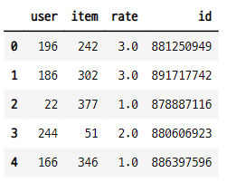

- 데이터 확인

```python
df.info()
```
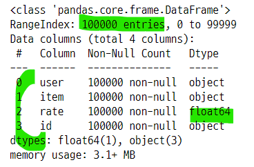

### 6-2. 컬럼 정리
- user, item, rate 컬럼만 사용

```python
del df["id"]
df.head()
```
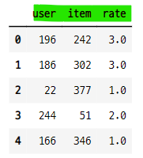

### 6-3. R 메트릭스 만들기
- x축 : 영화 id
- y축 : 사용자 id
- value : 평점
- set_index([행1, 행2])
- unstack() : 테이블 변환 : 마지막 행을 열로 변환시켜준다.

```python
df_table = df.set_index(["user", "item"]).unstack()
df_table
```
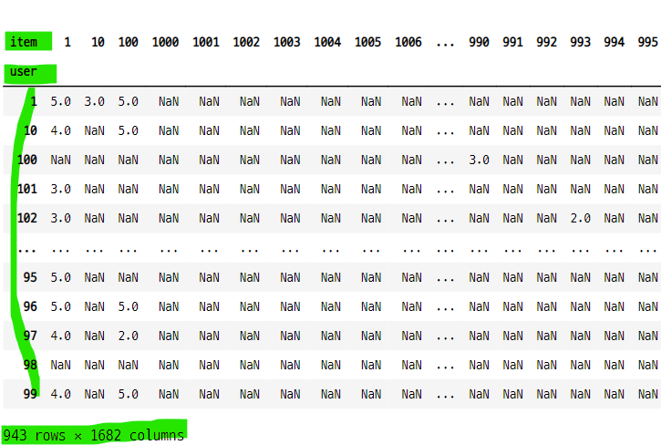


#### R 매트릭스 변환 과정
- user, item 컬럼을 이중 인덱스로 만들기

```python
df.set_index(["user", "item"])
```
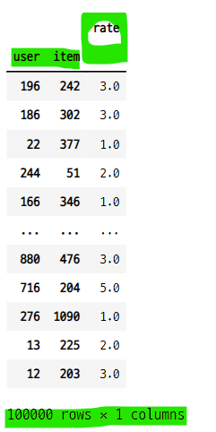

- unstack() 명령어를 사용하여 item 인덱스를 컬럼으로 변환

```python
df.set_index(["user", "item"]).unstack()
```
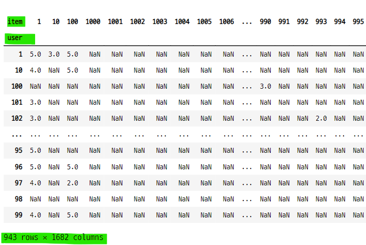

### 6-4. R 메트릭스의 일부만 조회하여 데이터 확인
- 사용자별 영화에 대한 평점이 일부에만 존재한다.
    - **sparse 행렬이다.**

```python
df_table.iloc[212:222, 808:817]
```
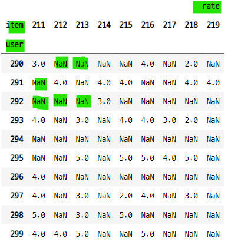

- fillna(" ")명령어를 사용하여 결측데이터를 공백으로 변환

```python
df_table.iloc[212:222, 808:817].fillna("")
```
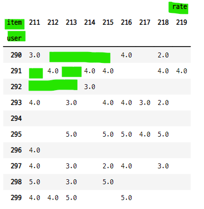

### 6-5. R 메트릭스 시각화
- 행렬의 빈칸을 흰색, 평점을 검은색으로 시각화
    - figsize의 값을 크게 해야 그래프가 제대로 출력 된다.

```python
plt.figure(figsize=(50, 50))
plt.imshow(df_table)
plt.xlabel("item:영화 id")
plt.ylabel("user:사용자 id")
plt.grid(False)
plt.title("Rate Matrix")
plt.show() ;
```
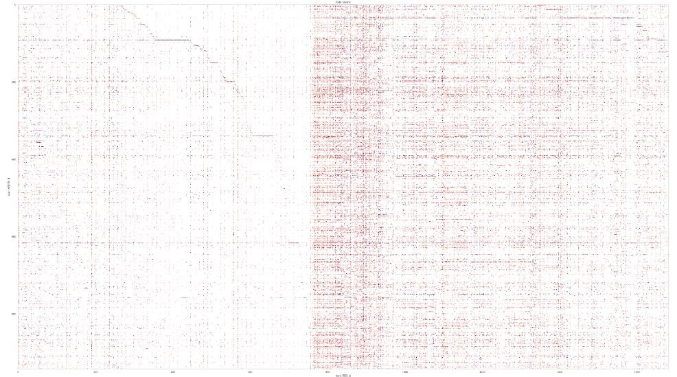

### 6-6. 베이스라인 모델로 추천 분석
- 모형 : 베이스라인 모델
- 최적화 방법 : als
- 교차검증 : KFold()
- 성능평가 : rmse(root mean squared error)

```python
from surprise.model_selection import KFold

bsl_options = {
    "method" : "als",
    "n_epochs" : 5,
    "reg_u" : 12,
    "reg_i" : 5
}

algo = surprise.BaselineOnly(bsl_options)

np.random.seed(0)
acc = np.zeros(3)
cv = KFold(3)

for i, (train_set, test_set) in enumerate(cv.split(data)) :
    algo.fit(train_set)
    pred = algo.test(test_set)
    acc[i] = surprise.accuracy.rmse(pred, verbose=True)

acc.mean()

>>> print

Estimating biases using als...
RMSE: 0.9453
Estimating biases using als...
RMSE: 0.9377
Estimating biases using als...
RMSE: 0.9500

0.9443304984013942
```

#### 최적화 방법 : sgd 사용

```python
bsl_options = {
    "name" : "sgd",
    "n_epochs" : 5
}

algo2 = surprise.BaselineOnly(bsl_options=bsl_options)

np.random.seed(0)
acc = np.zeros(3)
cv = KFold(3)
for i, (train_set, test_set) in enumerate(cv.split(data)) :
    algo2.fit(train_set)
    pred = algo2.test(test_set)
    acc[i] = surprise.accuracy.rmse(pred, verbose=True)

acc.mean()

>>> print

Estimating biases using als...
RMSE: 0.9487
Estimating biases using als...
RMSE: 0.9412
Estimating biases using als...
RMSE: 0.9534

0.9477424533684218
```
### 6-7. cross validate 명령 사용
- 모델의 변수와 데이터를 인수로 넣는다.
- 교차검증으로 학습, 검증 데이터 분리
    - 모델의 학습 데이터 훈련
    - 모델의 예측
    - 모델의 성능값 계산

```
cross_validate(
    algo,
    data,
    measures=['rmse', 'mae'],
    cv=None,
    return_train_measures=False,
    n_jobs=1,
    pre_dispatch='2*n_jobs',
    verbose=False,
)
```

```python
from surprise.model_selection import cross_validate

result_cv = cross_validate(algo, data)
result_cv
```
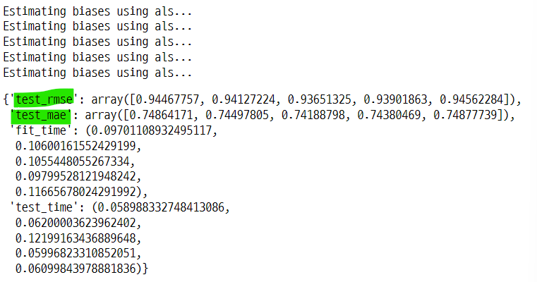

- 성능지표의 평균값 계산
    - 5번의 교차검증을 시행했으므로 성능지표 값이 5개 있다.

```python
test_rmse_mean = list(result_cv.values())[0].mean()
test_mae_mean = list(result_cv.values())[1].mean()


print("검증 성능 rmse : {}".format(test_rmse_mean))
print("검증 성능 mae : {}".format(test_mae_mean))

>>> print

검증 성능 rmse : 0.9414209071411914
검증 성능 mae : 0.7456179631203821
```

#### 성능 평가에 fcp 추가
- measures : 인수에 fcp 를 추가한다.
    - fcp : fraction of concordant pairs

```python
result_cv_2 = cross_validate(algo, data, measures=["rmse", "mae", "fcp"])

rmse_mean = list(result_cv_2.values())[0].mean()
mae_mean = list(result_cv_2.values())[1].mean()
fcp_mean = list(result_cv_2.values())[2].mean()

print("rmse : {}".format(rmse_mean))
print("mae : {}".format(mae_mean))
print("fcp : {}".format(fcp_mean))

>>> print

rmse : 0.9411881352307816
mae : 0.7454558447235036
fcp : 0.6960333975512645
```

#### sgd 최적화를 적용한 모형에 대한 교차검증

```python
result_cv_sgd = cross_validate(algo2, data, measures=["rmse", "mae", "fcp"])

print("rmse : {}".format(result_cv_sgd["test_rmse"].mean()))
print("mae : {}".format(result_cv_sgd["test_mae"].mean()))
print("fcp : {}".format(result_cv_sgd["test_fcp"].mean()))

>>> print

rmse : 0.9444418494047273
mae : 0.7491532000244742
fcp : 0.6947408367334745
```

### 6-8. 유사도를 사용한 KNNBasic 모델

#### 평균제곱차이 유사도 MSD 적용
- `평균제곱차이 Mean Squared Difference, MSD`
- KNNBasic : 가중치 예측 방법
- **모델을 만들 때 인수 sim_options 명을 입력해 줘야 한다.**

```python
sim_options = {"name" : "msd"}
algo = surprise.KNNBasic(sim_options=sim_options)
result_msd_sim = cross_validate(algo, data, measures=["rmse", "mae", "fcp"])

print("rmse : {}".format(result_msd_sim["test_rmse"].mean()))
print("mae : {}".format(result_msd_sim["test_mae"].mean()))
print("fcp : {}".format(result_msd_sim["test_fcp"].mean()))

>>> print

rmse : 0.9800636938448092
mae : 0.7737076747116417
fcp : 0.7070615496446295
```

#### 코사인 유사도 적용
- `코사인 유사도 Cosine Similarity`
- 모델 : KNNBasic()

```python
sim_options = {"name" : "cosine"}
algo = surprise.KNNBasic(sim_options=sim_options)
result_sim_cos = cross_validate(algo, data, measures=["rmse", "mae", "fcp"])

print("rmse : {}".format(result_sim_cos["test_rmse"].mean()))
print("mae : {}".format(result_sim_cos["test_mae"].mean()))
print("fcp : {}".format(result_sim_cos["test_fcp"].mean()))

>>> print

rmse : 1.0165382235748517
mae : 0.8039623088652244
fcp : 0.7060290984772848
```

#### 피어슨 유사도
- `피어슨 유사도 Pearson Similarity`
- 모델 : KNNBasic()

```python
sim_options = {"name" : "pearson"}
algo = surprise.KNNBasic(sim_options=sim_options)
result_sim_pears = cross_validate(algo, data, measures=["rmse", "mae", "fcp"])

print("rmse : {}".format(result_sim_pears["test_rmse"].mean()))
print("mae : {}".format(result_sim_pears["test_mae"].mean()))
print("fcp : {}".format(result_sim_pears["test_fcp"].mean()))

>>> print

rmse : 1.0117213900940567
mae : 0.8031572641478956
fcp : 0.711383372390755
```
### 피어슨 베이스라인 유사도
- `피어슨 베이스라인 유사도 Pearson-Baseline Similarity`
- 모델 : KNNBasic()

```python
sim_options = {"name" : "pearson_baseline"}
algo = surprise.KNNBasic(sim_options=sim_options)
result_sim_pb = cross_validate(algo, data, measures=["rmse", "mae", "fcp"])

print("rmse : {}".format(result_sim_pb["test_rmse"].mean()))
print("mae : {}".format(result_sim_pb["test_mae"].mean()))
print("fcp : {}".format(result_sim_pb["test_fcp"].mean()))

>>> print

rmse : 0.9999113744886522
mae : 0.7911695900085085
fcp : 0.7138938051094229
```

### 6-9. 유사도를 사용한 KNN 가중치 예측 방법
- `k-최근접 이웃 알고리즘 K Nearest Neighbors, KNN`
    - KNNBasic()
    - KNNwithMeans()
    - KNNBaseline()

#### KNNBasic()

```python
sim_options = {"name" : "pearson_baseline"}
algo1 = surprise.KNNBasic(sim_options=sim_options)
result_knnbasic = cross_validate(algo1, data, measures=["rmse", "mae", "fcp"])

print("rmse : {}".format(result_knnbasic["test_rmse"].mean()))
print("mae : {}".format(result_knnbasic["test_mae"].mean()))
print("fcp : {}".format(result_knnbasic["test_fcp"].mean()))

>>> print

rmse : 0.9984173799213437
mae : 0.7899063534726789
fcp : 0.7163764635631642
```

#### KNNWithMeans()

```python
sim_options = {"name" : "pearson_baseline"}
alog2 = surprise.KNNWithMeans(sim_options=sim_options)
result_knnwm = cross_validate(alog2, data, measures=["rmse", "mae", "fcp"])

print("\n")
print("KNNWithMeans rmse : {}".format(result_knnwm["test_rmse"].mean()))
print("KNNWithMeans mae : {}".format(result_knnwm["test_mae"].mean()))
print("KNNWithMeans fcp : {}".format(result_knnwm["test_fcp"].mean()))

>>> print

KNNWithMeans rmse : 0.9371964155714494
KNNWithMeans mae : 0.7300143537357556
KNNWithMeans fcp : 0.7134800681231417
```

#### KNNBaseline()

```python
sim_options = {"name" : "pearson_baseline"}
algo3 = surprise.KNNBaseline(sim_options=sim_options)
result_knnb = cross_validate(algo3, data, measures=["rmse", "mae", "fcp"])

print("\n")
print("KNNBaseline rmse : {}".format(result_knnb["test_rmse"].mean()))
print("KNNBaseline mae : {}".format(result_knnb["test_mae"].mean()))
print("KNNBaseline fcp : {}".format(result_knnb["test_fcp"].mean()))

>>> print

KNNBaseline rmse : 0.9213050439632138
KNNBaseline mae : 0.721297959901484
KNNBaseline fcp : 0.7140869594875696
```

### 6-10. latent factor 모형

#### 특잇값 분해 방법 Singular Value Decomposition, SVD

```python
%%time

algo4 = surprise.SVD(n_factors=100, n_epochs=10)
result_svd = cross_validate(algo4, data, measures=["rmse", "mae", "fcp"],
                            verbose=True)

print("\n")
print("svd rmse : {}".format(result_svd["test_rmse"].mean()))
print("svd mae : {}".format(result_svd["test_mae"].mean()))
print("svd fcp : {}".format(result_svd["test_fcp"].mean()))
print("\n")
```
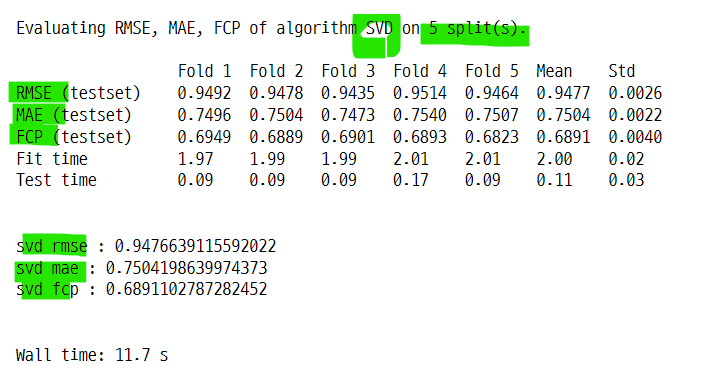


####  비음수 행렬 분해 모델 Non-Negative Matrix Factorization, NMF

```python
%%time

algo5 = surprise.NMF(n_factors=100, n_epochs=10)
result_nmf = cross_validate(algo5, data, measures=["rmse", "mae", "fcp"],
                           verbose=True)

print("\n")
print("nmf rmse : {}".format(result_nmf["test_rmse"].mean()))
print("nmf mae : {}".format(result_nmf["test_mae"].mean()))
print("nmf fcp : {}".format(result_nmf["test_fcp"].mean()))
print("\n")
```
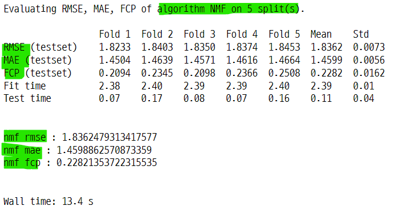

## 7. 추천시스템 실습 : 카운트 벡터와 코사인 유사도를 사용한 영화 추천
- 영화 평점데이터를 사용한 추천 시스템
    - 장르 데이터를 전처리하여
    - countvectorizer로 희소행렬로 변환하고
    - cosine_similarity로 유사도를 측정

### 7-1. 데이터 임포트

```python
mv_df = pd.read_csv("../../04_machine_learning/tmdb-movie-metadata/\
tmdb_5000_movies.csv")

mv_df.head(3)
```
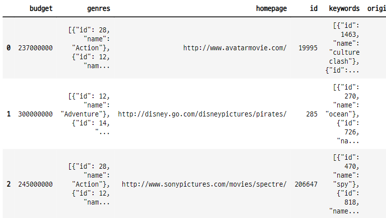


- 데이터 정보 확인

```python
mv_df.info()
```
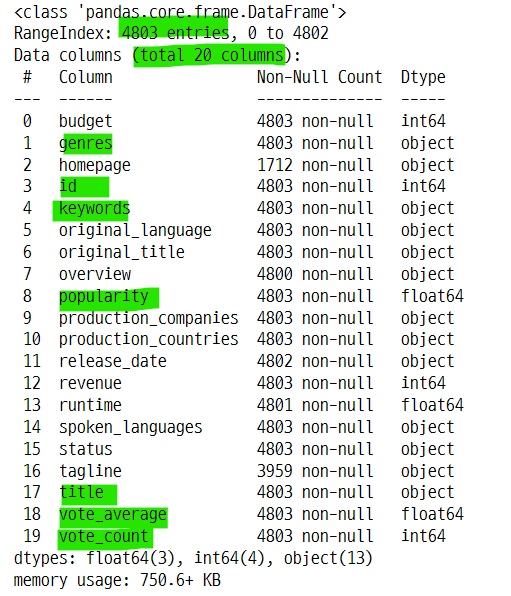

- 데이터 내용 확인

```python
mv_df.iloc[0]
```
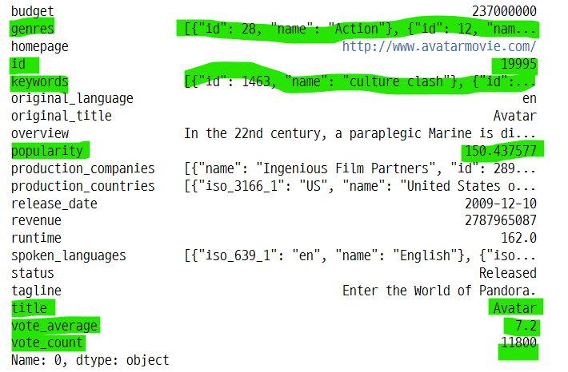

- 컬럼 확인

```python
mv_df.columns

>>> print

Index(['budget', 'genres', 'homepage', 'id', 'keywords', 'original_language',
       'original_title', 'overview', 'popularity', 'production_companies',
       'production_countries', 'release_date', 'revenue', 'runtime',
       'spoken_languages', 'status', 'tagline', 'title', 'vote_average',
       'vote_count'],
      dtype='object')
```

#### 결측 데이터 확인
- homepage, tagline 컬럼에 결측 데이터가 많다.
- 현재 분석에 영향을 주진 않는다.
- isnull() 명령을 사용하면 True, False 값으로 반환된다.

```python
mv_df.isnull()
```
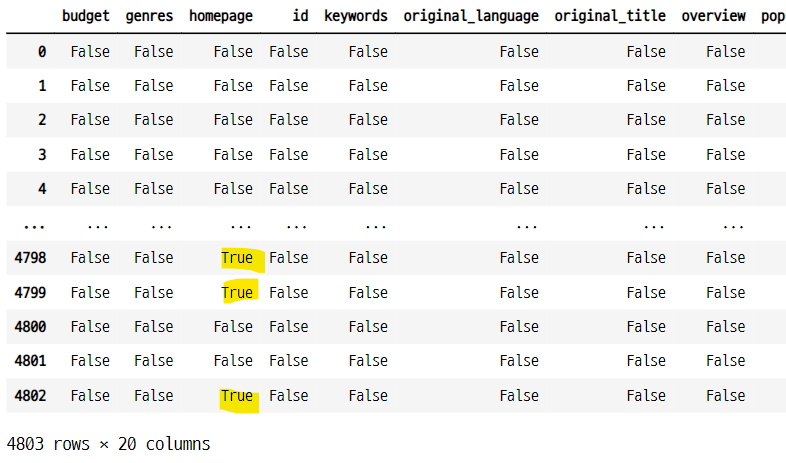

- isnull().sum() : T, F 데이터의 합을 계산하면 결측 데이터(True)의 갯수를 알 수 있다.

```python
mv_df.isnull().sum()
```
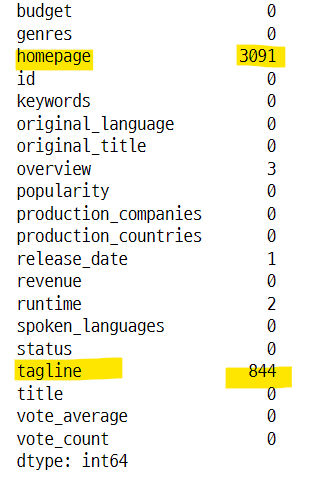


- missingno 패키지로 결측 데이터 확인
    - 결측 데이터를 그래프로 확인 할 수 있다.

```python
import missingno as msno

msno.matrix(mv_df)
plt.show() ;
```
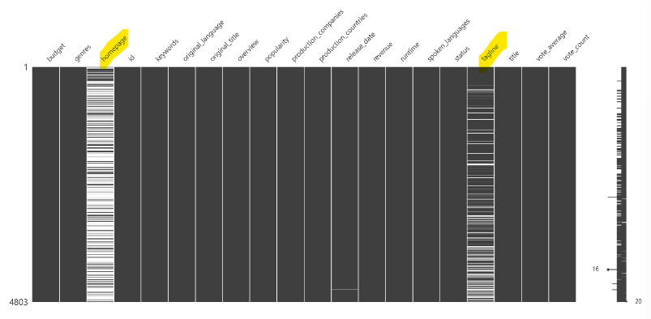

- 막대 그래프로 결측 데이터 확인

```python
msno.bar(mv_df)
plt.show() ;
```
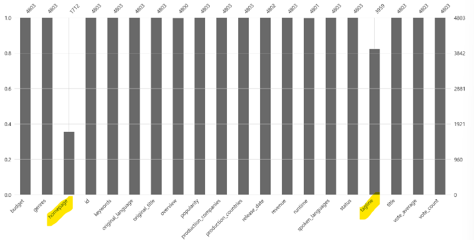


### 7-2. 컬럼 선택
- 분석에 사용할 컬럼 선택

```python
mv = mv_df[["id", "title", "genres", "vote_average", "vote_count",
           "popularity", "keywords", "overview"]]

mv.head(3)
```
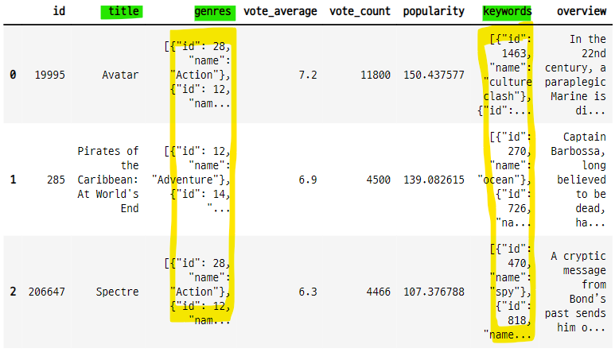


### 7-3. 코사인 유사도를 적용할 genres 컬럼과 keywords 컬럼 전처리
- genres와 keywords 데이터는 str 안에 다른 자료형의 데이터가 들어 있다.
    - '[{}, {}, {}]' : str 안에 list가 있고 list 안에 dict 가 있다. 
    - dict 안에 id와 name key와 이에 대응하는 value 가 있다.
    - **name의 값으로 코사인 유사도를 측정한다.**
- literal_eval 함수
    - apply 함수에 적용하여 str 안의 자료형을 선택한다.
- str로 만들어진 list, dict, tuple 데이터 타입을 원래의 데이터 타입으로 변환한다.
    - "[]" -> []
    - "()" -> ()
    - "{}" -> {}
- 리스트 컴프리핸션
    - list안의 dict에서 name key에 해당하는 value를 선택한다.
- join 함수
    - genre와 keywords의 데이터를 공백으로 연결 된 한 문장으로 만들어 준다.
    - countverctorizer의 input 데이터로 사용할 수 있다.    

```python
from ast import literal_eval

test_code = """(1, 2, {'foo' : 'val'})"""
test_code

>>> print

"(1, 2, {'foo' : 'val'})"

type(test_code)

>>> print

str

trans_code = literal_eval(test_code)

type(trans_code)

>>> print

tuple
```

- 다른 테스트

```python
code2 = "[(1, 2), (3, 4)]"
code_eval = literal_eval(code2)

print(type(code2), type(code_eval))

>>> print

<class 'str'> <class 'list'>
```

### 7-4. literal_eval 함수를 사용하여 데이터 전처리
- genres와 keywords의 str 데이터를 list와 dict로 변환
    - mv["genres"].apply(literal_eval)

- genres 데이터 확인

```python
mv["genres"][0]

>>> print

'[{"id": 28, "name": "Action"}, {"id": 12, "name": "Adventure"}, {"id": 14, "name": "Fantasy"}, {"id": 878, "name": "Science Fiction"}]'
```

- literal_eval() 함수로 변환

```python
literal_eval(mv["genres"][0])

>>> print

[{'id': 28, 'name': 'Action'},
 {'id': 12, 'name': 'Adventure'},
 {'id': 14, 'name': 'Fantasy'},
 {'id': 878, 'name': 'Science Fiction'}]
```

#### 전체 데이터에 적용

```python
mv["genres"] = mv["genres"].apply(literal_eval)
mv["keywords"] = mv["keywords"].apply(literal_eval)

mv.head(3)
```
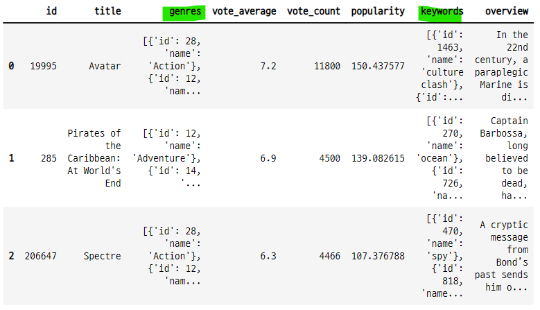

- 데이터 전처리 전후 데이터 타입 확인

```python
print("변환전 type : {}".format(type(mv_df["genres"][0])))
print("변환후 type : {}".format(type(mv["genres"][0])))

>>>> print

변환전 type : <class 'str'>
변환후 type : <class 'list'>
```

### 7-5. apply(lambda x : 리스트컴프리핸션)으로 dict의 value 값을 특성으로 사용할 수 있도록 변환
- list 안에 dict 형태로 되어 있는 데이터에서 특정 value 값만 선택하는 방법
    - lambda() 함수를 사용
    - [{"id" : 123, "name" : "hong"}, {"id" : 0909, "name" : "kim"}]
    - lambda x : [ele[name] for ele in x]
    - list에서 dict 하나를 x로 선택하여 ele로 선언하고, ele의 name key 값을 선택

```python
mv["genres"][0]

>>> print

[{'id': 28, 'name': 'Action'},
 {'id': 12, 'name': 'Adventure'},
 {'id': 14, 'name': 'Fantasy'},
 {'id': 878, 'name': 'Science Fiction'}]


[ele["name"] for ele in mv["genres"][0]]

>>> print

['Action', 'Adventure', 'Fantasy', 'Science Fiction']
```

#### lambda 함수를 사용하여 모든 데이터에 적용

```python
mv["genres"] = mv["genres"].apply(lambda x : [ele["name"] for ele in x])
mv["keywords"] = mv["keywords"].apply(lambda x : [ele["name"] for ele in x])

mv.head(3)
```
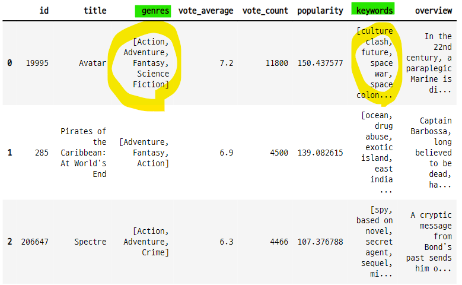


### 7-6. genres의 데이터를 하나의 문장으로 변환
- list 안에 str로 구분된 데이터를 join() 함수를 사용하여 하나의 문장 형식으로 변환
    - ['a', 'b', 'c'] -> 'a b c'
    - 공백 사이에 , 없음


```python
mv["genres"][0]

>>> print

['Action', 'Adventure', 'Fantasy', 'Science Fiction']

" ".join(mv["genres"][0])

>>> print

'Action Adventure Fantasy Science Fiction'
```

#### 전체 데이터 적용
- apply(lambda x : (" ").join(x))

```python
mv["genres_literal"] = mv["genres"].apply(lambda x : (" ").join(x))

mv.head(3)
```
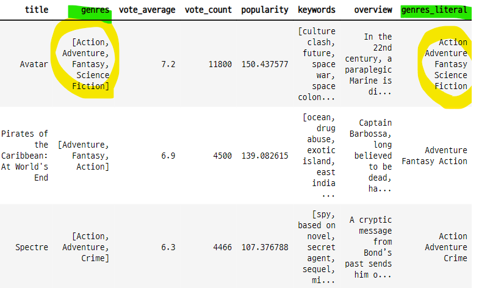

### 7-7. 문자열로 변환된 genres를 countvectorize 수행
- genres_literal 컬럼의 데이터는 띄어쓰기로 이어져 있는 str 타입
    - Action Adventure Fantasy Science Fiction
- 이렇게 변환 시키는 이유는 **countvectorizer**를 사용하기 위함
    - countvectorizer의 input 데이터로 사용
- countvectorizer의 ngram_range : 토큰화된 말뭉치가 다른 말뭉치와 함께 쓰였을 경우 반환해준다.
    - A 말뭉치가 다른 말뭉치 B, C와 쓰였다면
    - ngram_range=(1, 2) 값 설정
    - 'A', 'A, B', 'A, C' 로 구분 해 준다.
- 어떤 문장에 이 패턴에 해당하는 것이 있으면 해당 인덱스에 1 값이 저장 된다.
    - 희소행렬로 코사이 유사도 즉 문장과 문장의 거리를 계산할 수 있다.    
- 순서
    - 모델 생성 : CountVectorizer(min_df=0, ngram_range=(1, 2))
    - 모델 훈련 : count_vect.fit_transform(mv["genres_literal"])

```python
from sklearn.feature_extraction.text import CountVectorizer

count_vect = CountVectorizer(min_df=0, ngram_range=(1, 2))
genre_mat = count_vect.fit_transform(mv["genres_literal"])

print(genre_mat.shape)

>>> print

(4803, 276)
```

#### 원본 데이터 프레임의 모양

```python
mv.shape

>>> print

(4803, 9)
```

#### 전체 영화 장르의 종류

```python
genre_lst = []
max_range = len(mv["genres"])
i = 0
while i < max_range :
    for ele in mv["genres"][i] :
        if ele not in genre_lst :
            genre_lst.append(ele)
    i += 1

genre_lst

>>> print

['Action',
 'Adventure',
 'Fantasy',
 'Science Fiction',
 'Crime',
 'Drama',
 'Thriller',
 'Animation',
 'Family',
 'Western',
 'Comedy',
 'Romance',
 'Horror',
 'Mystery',
 'History',
 'War',
 'Music',
 'Documentary',
 'Foreign',
 'TV Movie']
```
- 장르의 갯수

```python
len(genre_lst)

>>> print

20
```

### 7-8. countvectorizer의 ngram_range 결과
- action 장르가 다른 장르와 함께 사용 된 경우
    - 다른 15개 장르와 함께 사용 됨
    - adventure animation comedy crime drama family fantasy history horror mystery romance science thriller war western
- 장르마다 다르다.
- **이런식으로 사용된 데이터에서 2개의 장르를 합쳐서 짝을 만든 것이 276가 된다.**

- 말뭉치의 종류

```python
count_vect.get_feature_names()
```
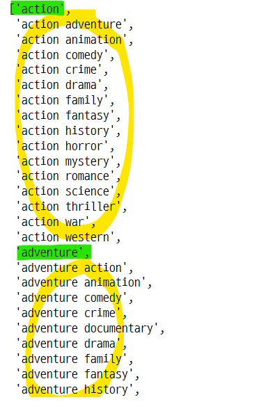

- 말뭉치의 갯수

```python
len(count_vect.get_feature_names())

>>> print

276
```

#### action 장르는 어떤 짝을 이루고 있을까?
- 장르 데이터에서 action 이 어떤 종류의 장르들과 사용됐는지 확인

```python
[ele[len("action")+1:] for ele in count_vect.get_feature_names()[:16][1:]]

>>> print

['adventure',
 'animation',
 'comedy',
 'crime',
 'drama',
 'family',
 'fantasy',
 'history',
 'horror',
 'mystery',
 'romance',
 'science',
 'thriller',
 'war',
 'western']
```

### 7-9. ngram_range 테스트
- ngram_range=(1, 3)으로 설정하면 하나의 장르가 2개의 장르와의 조합으로 나타난다.

```python
test_countvect = CountVectorizer(min_df=0, ngram_range=(1, 3))
test_genre_mat = test_countvect.fit_transform(mv["genres_literal"])

test_countvect.get_feature_names()[:15]
```
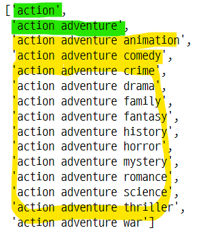

### 7-10. toarray() 희소행렬에는 원래 특성이 들어있는 feature_name에 1이 마킹된다.
- count_vect.toarray()의 모양은 (4803, 276) 이다.
    - 컬럼의 갯수가 276 인 이유는 ngram_range=(1, 2)로 설정했기때문에, 각각의 장르가 2개의 짝을 이루는 형태로 만들어졌기 때문
    
- 첫 번째 데이터의 get_literal
    - 'Action Adventure Fantasy Science Fiction'
- 첫 번째 데이터의 toarray() 
    - [0, 1, 16, 24, 124, 135, 138, 232, 233]
    - 이 인덱스는 get_feature_names()의 장르 짝 세트에서 해당하는 것의 인덱스와 같다.
- feature_names() 에서 1의 인덱스에 해당하는 값
    - numpy로 변환 한 뒤 T, F 배열을 만들어 인수로 넣으면 True에 해당하는 값 출력
    
```
array(['action', 'action adventure', 'adventure', 'adventure fantasy',
       'fantasy', 'fantasy science', 'fiction', 'science',
       'science fiction'], dtype='<U21')
```

- get_literal 에서 어떤 규칙에 의해서 get_feature_names() 의 짝이 선택됨

- genre_mat의 모양
    - 컬럼은 말뭉치의 갯수와 같다.

```python
genre_mat.toarray().shape

>>> print

(4803, 276)
```

#### 첫 번째 데이터의 toarray() 희소행렬
- get_literal의 값 중 get_feature_names() 에 해당하는 것이 있으면 해당 인덱스에 1이 저장된다.

```python
genre_mat.toarray()[0]

>>> print

array([1, 1, 0, 0, 0, 0, 0, 0, 0, 0, 0, 0, 0, 0, 0, 0, 1, 0, 0, 0, 0, 0,
       0, 0, 1, 0, 0, 0, 0, 0, 0, 0, 0, 0, 0, 0, 0, 0, 0, 0, 0, 0, 0, 0,
       0, 0, 0, 0, 0, 0, 0, 0, 0, 0, 0, 0, 0, 0, 0, 0, 0, 0, 0, 0, 0, 0,
       0, 0, 0, 0, 0, 0, 0, 0, 0, 0, 0, 0, 0, 0, 0, 0, 0, 0, 0, 0, 0, 0,
       0, 0, 0, 0, 0, 0, 0, 0, 0, 0, 0, 0, 0, 0, 0, 0, 0, 0, 0, 0, 0, 0,
       0, 0, 0, 0, 0, 0, 0, 0, 0, 0, 0, 0, 0, 0, 1, 0, 0, 0, 0, 0, 0, 0,
       0, 0, 0, 1, 0, 0, 1, 0, 0, 0, 0, 0, 0, 0, 0, 0, 0, 0, 0, 0, 0, 0,
       0, 0, 0, 0, 0, 0, 0, 0, 0, 0, 0, 0, 0, 0, 0, 0, 0, 0, 0, 0, 0, 0,
       0, 0, 0, 0, 0, 0, 0, 0, 0, 0, 0, 0, 0, 0, 0, 0, 0, 0, 0, 0, 0, 0,
       0, 0, 0, 0, 0, 0, 0, 0, 0, 0, 0, 0, 0, 0, 0, 0, 0, 0, 0, 0, 0, 0,
       0, 0, 0, 0, 0, 0, 0, 0, 0, 0, 0, 0, 1, 1, 0, 0, 0, 0, 0, 0, 0, 0,
       0, 0, 0, 0, 0, 0, 0, 0, 0, 0, 0, 0, 0, 0, 0, 0, 0, 0, 0, 0, 0, 0,
       0, 0, 0, 0, 0, 0, 0, 0, 0, 0, 0, 0], dtype=int64)
```

- 1에 해당하는 인덱스를 사용하여 말뭉치 확인
    - 즉 0번째 데이터의 장르 특성은 어떤 말뭉치에 해당하는 지를 알 수 있다.

```python
np.array(count_vect.get_feature_names())[genre_mat.toarray()[0]==1]

>>> print

array(['action', 'action adventure', 'adventure', 'adventure fantasy',
       'fantasy', 'fantasy science', 'fiction', 'science',
       'science fiction'], dtype='<U21')
```

### 7-11. 코사인 유사도
- genre_mat의 희소행렬 toarray()의 모든 행을 다른 행들과의 코사인 유사도를 계산한다.
    - 문장과 문자의 거리
    - 1에 가까울 수록 유사도가 크다. 
- (4083, 276) 행렬이 -> (4083, 4083) 정방행렬이 된다.    
- 자기자신과의 거리는 1 
    - 문장을 벡터화 했을 때 두 벡터가 같다면 같은 방향을 향한다.    

- 코사인 유사도 패키지 임포트

```python
from sklearn.metrics.pairwise import cosine_similarity
```

- 유사도 측정
    - 희소행렬의 유사도 측정
    - 각 행을 다른 모든 행과의 유사도를 측정하여 유사도 값을 반환

```python
genre_sim = cosine_similarity(genre_mat, genre_mat)
genre_sim

>>> print

array([[1.        , 0.59628479, 0.4472136 , ..., 0.        , 0.        ,
        0.        ],
       [0.59628479, 1.        , 0.4       , ..., 0.        , 0.        ,
        0.        ],
       [0.4472136 , 0.4       , 1.        , ..., 0.        , 0.        ,
        0.        ],
       ...,
       [0.        , 0.        , 0.        , ..., 1.        , 0.        ,
        0.        ],
       [0.        , 0.        , 0.        , ..., 0.        , 0.        ,
        0.        ],
       [0.        , 0.        , 0.        , ..., 0.        , 0.        ,
        1.        ]])
```

#### 하나의 행에 대해 자신을 포함한 4802개의 행과의 거리를 계산했으므로 정방행렬이 된다.

```python
genre_sim.shape

>>> print

(4803, 4803)
```

#### 3개의 toarray()로 코사인 유사도 계산 테스트
- 같은 행 끼리는 유사도가 같으므로 값이 1이 된다.
    - 대각성분이 모두 1이다.
- 비대각 성분의 값이 각 행의 다른 행들과의 코사인 유사도 이다.    

```python
test_mat = genre_mat.toarray()[:3]

cosine_similarity(test_mat, test_mat)

>>> print

array([[1.        , 0.59628479, 0.4472136 ],
       [0.59628479, 1.        , 0.4       ],
       [0.4472136 , 0.4       , 1.        ]])
```

### 7-12. 코사인 유사도를 큰 값 순으로 인덱스값으로 정렬
- argsort() : 작은 값의 인덱스가 배열의 가장 앞에 온다.
- [:, ::-1] : 행은 그대로 두고, 열의 값을 역순으로 정렬하면 큰 값이 배열의 앞으로 온다.

```python
genre_sim_sorted_ind = genre_sim.argsort()[:, ::-1]
genre_sim_sorted_ind

>>> print

array([[   0, 3494,  813, ..., 3038, 3037, 2401],
       [ 262,    1,  129, ..., 3069, 3067, 2401],
       [   2, 1740, 1542, ..., 3000, 2999, 2401],
       ...,
       [4800, 3809, 1895, ..., 2229, 2230,    0],
       [4802, 1594, 1596, ..., 3204, 3205,    0],
       [4802, 4710, 4521, ..., 3140, 3141,    0]], dtype=int64)
```

### 7-13. 추천 영화를 DataFrame으로 반환하는 함수
- 영화의 타이틀을 입력하면
- 타이틀에 해당하는 인덱스를 찾아서
- 코사인 유사도 행렬에서 해당 인덱스의 값을 확인한다.
- 이중에서 코사인 유사도가 가장 큰 값 즉 벡터가 가장 유사한 인덱스 n개를 반환한다.
- 이 인덱스에 해당하는 타이틀을 검색하면 유사한 영화가 된다.

#### 영화 인셉션의 인덱스
- 평균 평점이 8.0보다 크고, 평점의 갯수가 13000 개보다 많은 영화
    - Inception

```python
mv[(mv["vote_average"] > 8.0) & (mv["vote_count"] > 13000)]
```
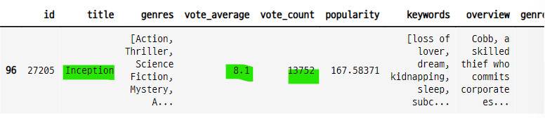


- Inception의 인덱스 조회

```python
test_index = mv[(mv["vote_average"] > 8.0) & (mv["vote_count"] > 13000)].index[0]
test_index

>>> print

96
```

#### 코사인 유사도 정렬 행렬에서 인셉션에 해당하는 행
- Inception 영화와 다른 영화들의 유사도 값의 크기 순 인덱스 값이 저장 되어 있다.

```python
genre_sim_sorted_ind[test_index]

>>> print

array([  96,  275,  607, ..., 2399, 2397, 4802], dtype=int64)
```

#### 유사도값이 큰 5개의 인덱스에 해당하는 영화

```python
test_recommend = mv.loc[genre_sim_sorted_ind[test_index][:5]]
test_recommend
```
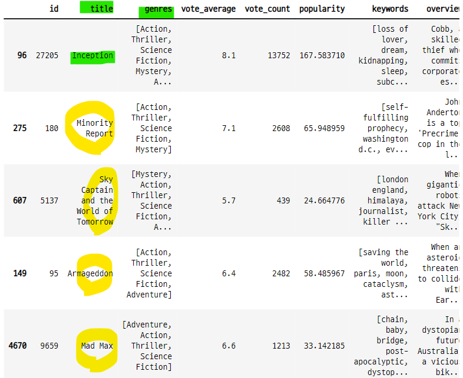


#### 5개 영화의 장르 확인
- 5개 영화의 장르가 유사한 것을 확인 할 수 있다.

```python
test_recommend["genres_literal"]

>>> print

96      Action Thriller Science Fiction Mystery Adventure
275               Action Thriller Science Fiction Mystery
607     Mystery Action Thriller Science Fiction Adventure
149             Action Thriller Science Fiction Adventure
4670            Adventure Action Thriller Science Fiction
Name: genres_literal, dtype: object
```

### 7-14. 추천 영화를 DataFrame으로 반환하는 함수
- 영화의 타이틀을 입력하면
- 타이틀에 해당하는 인덱스를 찾아서
- 코사인 유사도 행렬에서 해당 인덱스의 값을 확인한다.
- 이중에서 코사인 유사도가 가장 큰 값 즉 벡터가 가장 유사한 인덱스 n개를 반환한다.
- 이 인덱스에 해당하는 타이틀을 검색하면 유사한 영화가 된다.

```python
def find_sim_mv(df, title, sorted_ind, top_n=10) :
    title_mv = df[df["title"]==title]
    title_idx = title_mv.index.values
    sim_idx = sorted_ind[title_idx, :top_n].reshape(-1)
    print(sim_idx)

    return df.iloc[sim_idx]
```

- 함수 호출

```python
find_sim_mv(mv, "Inception", genre_sim_sorted_ind, 10)
```
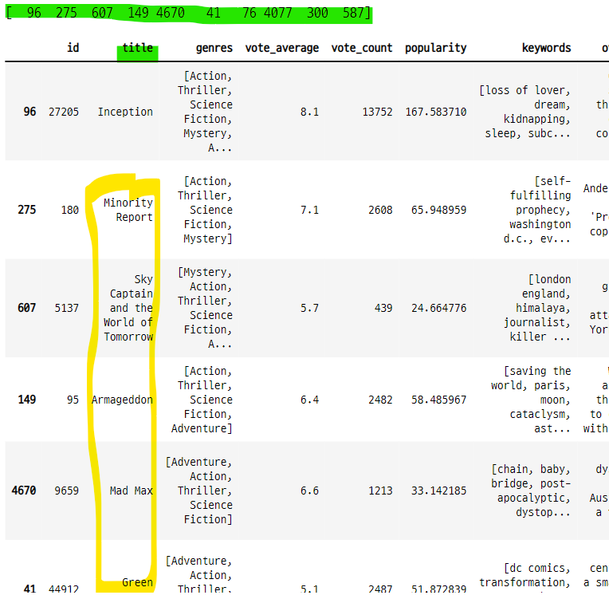


### 7-15. vote_count의 평균값에 가장 가까운 영화를 조회하고 유사한 영화들 추천
- 평점의 평균

```python
mv["vote_count"].mean()

>>> print

690.2179887570269
```

- 평점이 690보다 크고 700보다 작은 영화 데이터 중 1번째 데이터

```python
mv[(mv["vote_count"] > 690) & (mv["vote_count"] < 700)].sort_values("vote_count").iloc[1]

>>> print

id                                                            38321
title                                                        Priest
genres            [Action, Science Fiction, Fantasy, Thriller, H...
vote_average                                                    5.4
vote_count                                                      692
popularity                                                28.350927
keywords          [vampire, crucifixion, post-apocalyptic, dysto...
overview          In an alternate world, humanity and vampires h...
genres_literal       Action Science Fiction Fantasy Thriller Horror
Name: 768, dtype: object
```

- 이 영화의 제목

```pythn
new_title = mv[(mv["vote_count"] > 690) & (mv["vote_count"] < 700)].sort_values("vote_count").iloc[1]["title"]
new_title

>>> print

'Priest'
```

#### Priest 영화와 유사한 영화 추천

```python
find_sim_mv(mv, new_title, genre_sim_sorted_ind, 10)
```
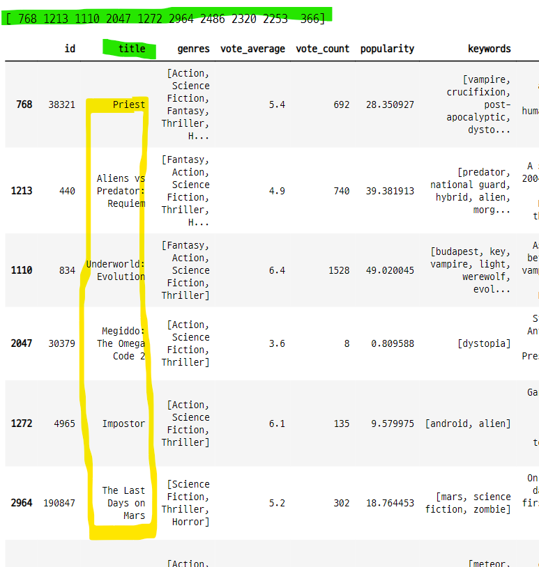


### 7-16. 코사인 유사도 값을 반환하도록 함수 변경

```python
def find_sim_mv_2(df, title, sorted_idx, cosine_sim, top_n=10) :
    title_mv = df[df["title"]==title]
    title_idx = title_mv.index.values
    sim_idx = sorted_idx[title_idx, :top_n].reshape(-1)
    print(sim_idx)

    df2 = df.iloc[sim_idx]

    ## 코사인 유사도 값 행렬에서 조회 영화와, 유사도 인덱스를 사용하여 조회한다.
    ## 이 값을 데이터 프레임에 컬럼으로 추가
    df2["sim_score"] = cosine_sim[title_idx, sim_idx]
    result_df = df2[["title", "vote_count", "vote_average", "sim_score"]]

    return result_df
```

#### 영화 추천

```python
find_sim_mv_2(mv, new_title, genre_sim_sorted_ind, genre_sim, 10)
```
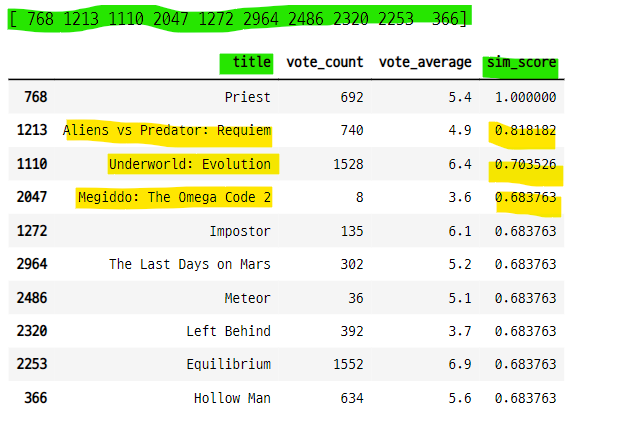


## 8. 평점에 가중치를 적용하여 새로운 평점 생성
- 그러나 이 값이 코사인 유사도와는 별개이므로 추천 영화 자체에 영향을 주진 않는다.
    - 코사인 값은 평점에 따른 것이 아니라 장르 벡터에 따른 것이므로
- 코사인 유사도 값이 높은 10개 중에서 가중치 평점에 따라 정렬하더라도 큰 변화는 없다.

### 8-1. 평점 횟수와 평점 간의 관계가 기울어진 데이터
- 평점 횟수가 1인데 10점인 것과 평점 횟수가 8205인데 평점이 8.5 인 것의 가중치는 달라야 함

```python
mv[["title", "vote_average", "vote_count"]].sort_values("vote_average", ascending=False)[:10]
```
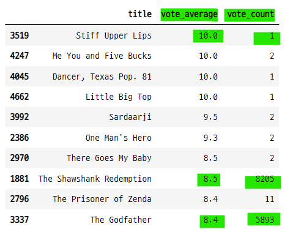


### 8-2. 영화 평점 가중치 부여하기
- v : 개별 영화에 평점을 투표한 횟수
- m : 평점을 부여하기 위한 최소 투표 횟수
    - quantile() : 함수를 사용하여 사분위수를 구할 수 있다.
    - 0.6 : 전체 데이터 중 60% 지점에 해당하는 값
- R : 개별 영화에 대한 평균 평점
- C : 전체 영화에 대한 평균 평점

```python
C = mv["vote_average"].mean()
m_60 = mv["vote_count"].quantile(0.6)
m_70 = mv["vote_count"].quantile(0.7)

print("C : ", round(C, 3),
      "m lower 60 : ", round(m_60, 3), "m lower 70 : ", round(m_70, 3))

>>> print

C :  6.092 m lower 60 :  370.2 m lower 70 :  581.0
```

- 영화 평점 조정 함수

```python
def weighted_vote_avg(df, m, C) :
    v = df["vote_count"]
    R = df["vote_average"]

    result = ((v / (v + m)) * R) + ((m / (v+m)) * C)

    return result
```

#### 전체 데이터에 함수를 적용
- 60%, 70% 계산 값에 해당하는 컬럼을 만들고 데이터 추가

```python
mv["weighted_vote_60"] = weighted_vote_avg(mv, m_60, C)
mv["weighted_vote_70"] = weighted_vote_avg(mv, m_70, C)

mv.head(3)
```
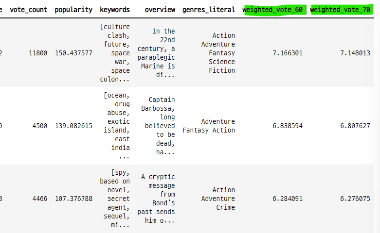


### 8-3. 조정 평점값을 적용한 데이터로 다시 유사 영화 추천
- 추천 시스템 함수에서 조정 평점값 컬럼을 기준으로 정렬한 후 반환 한다.

```python
def find_sim_mv_3(df, title, sorted_idx, genre_sim, top_n=10) :
    title_df = df[df["title"]==title]
    title_idx = title_df.index.values
    sim_idx = sorted_idx[title_idx, :top_n].reshape(-1)

    df2 = df.iloc[sim_idx]
    df2["sim_score"] = genre_sim[title_idx, sim_idx]
    
    ## 조정 평점값을 기준으로 데이터 프레임 정렬
    return df2.sort_values("weighted_vote_60", ascending=False)
```

#### 유사 영화 추천
- 유사한 영화의 추천 원리는 변하지 않음
- 추천 된 영화중에서 조정 평점값을 통해 어떤 영화가 더 추천하기 좋은지 판단할 수 있다.

```python
recommed_mv_2 = find_sim_mv_3(mv, new_title, genre_sim_sorted_ind, genre_sim, 10)
recommed_mv_2[["title", "vote_average", "weighted_vote_60", "sim_score"]]
```
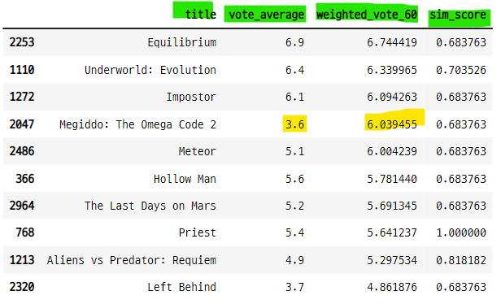

