# 추천시스템 실습 : 최근접 이웃 협업 필터링, 아이템 기반
- 협업 필터링 모델 : 평점 행렬에서 패턴을 찾아서 특정 평점을 예측하는 방식
    - knn filtering
        - user based : 비슷한 패턴으로 평점을 준 사용자의 데이터를 기반으로 평점 예측
	- item based : 비슷한 패턴으로 평점을 받은 아이템의 데이터를 기반으로 평점 예측
    - latent filtering

### 1. 데이터 임포트
- 영화 데이터
    - 영화 아이디, 제목, 장르
- 평점 데이터
    - 유저 아이디, 영화 아이디, 평점, 시계열
    
- movies 데이터

```python
movies = pd.read_csv("../../04_machine_learning/ml-latest-small/ml-latest-small/\
movies.csv")

movies.head(3)
```
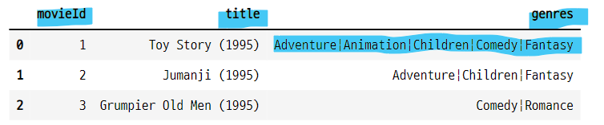

- ratings 데이터

```python
ratings = pd.read_csv("../../04_machine_learning/ml-latest-small/ml-latest-small/\
ratings.csv")

ratings.head(3)
```
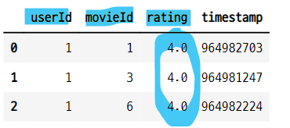

### 2. 데이터 확인

### 2-1. movies 데이터 확인
- 영화 데이터 정보 확인

```python
movies.info()
```
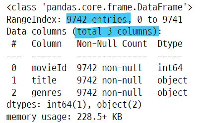

- 영화 데이터의 tail 확인

```python
movies.tail()
```
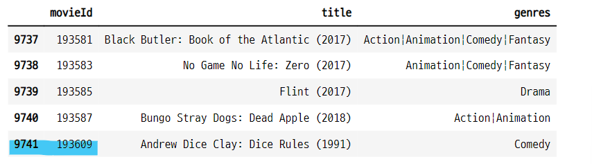


### 2-2. movies 데이터에서 중복 데이터 확인
- 중복 된 영화는 없는지 확인
    - value_counts 함수를 사용하여 id별 갯수를 계산
    - 데이터 프레임으로 만든 후 unique() 함수로 1이 아닌 수가 있는지 계산
- 중복 영화 데이터 없음.    

```python
vc_df = pd.DataFrame(movies.value_counts("movieId"),
                     columns=["count"]).sort_values("count", ascending=False)
vc_df["count"].unique()

>>> print

array([1], dtype=int64)
```

### 2-2. ratings 데이터 확인
- 평점 데이터의 정보 확인

```python
ratings.info()
```
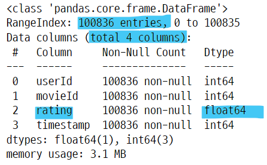


#### 영화 아이디별로 평점 갯수 조회
- 평점 갯수가 영화마다 다르다.

```python
vote_count_df = pd.DataFrame(ratings["movieId"].value_counts()).reset_index()
vote_count_df.columns = ["movieId", "count"]
vote_count_df
```
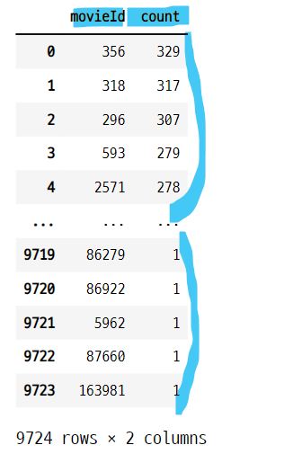

#### 평점 갯수가 많은 영화 아이디 20개

```python
vote_count_20 = vote_count_df[:20]
vote_count_20
```
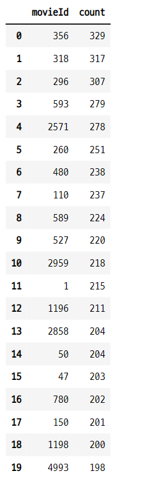


#### 평점 갯수가 많은 영화 20개의 제목, 장르, 평점 횟수 조회
- 영화의 제목만 봐도 유명한 영화들이 평점의 갯수도 많다는 것을 알 수 있다.

```python
pd.merge(vote_count_mv, vote_count_20).sort_values("count", ascending=False)
```
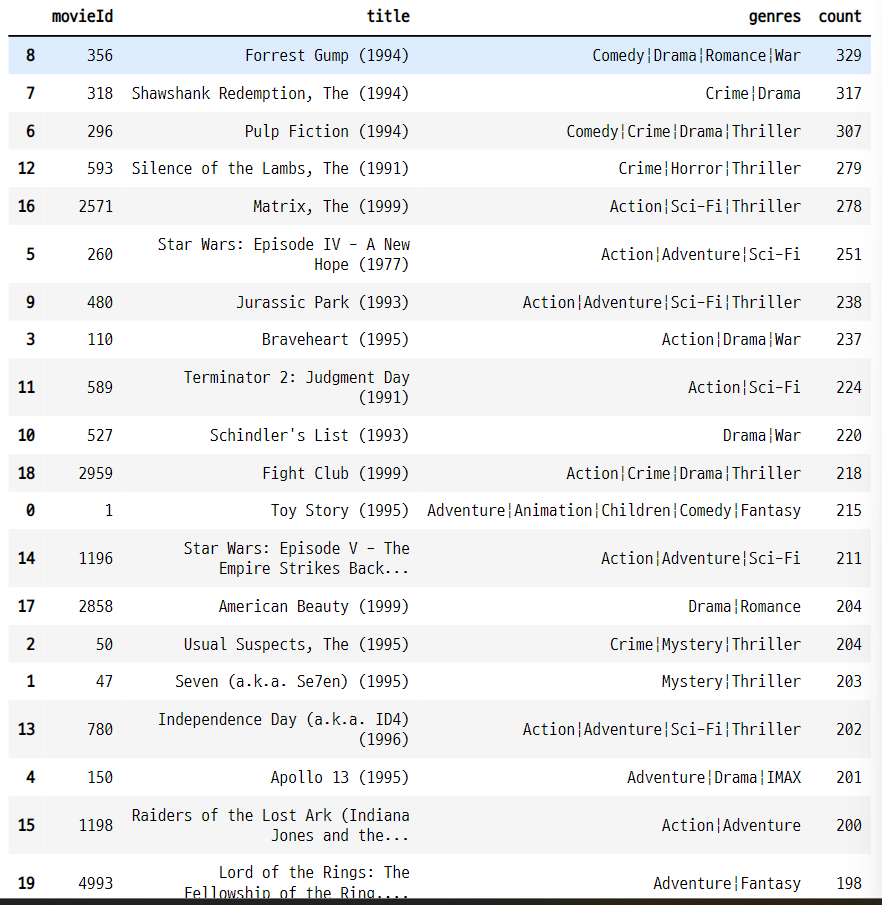

### 3. R 매트릭스
- 행 : userID, 열 : movieID 

```python
ratings_matrix = ratings.pivot_table("rating", index="userId", columns="movieId")
ratings_matrix
```
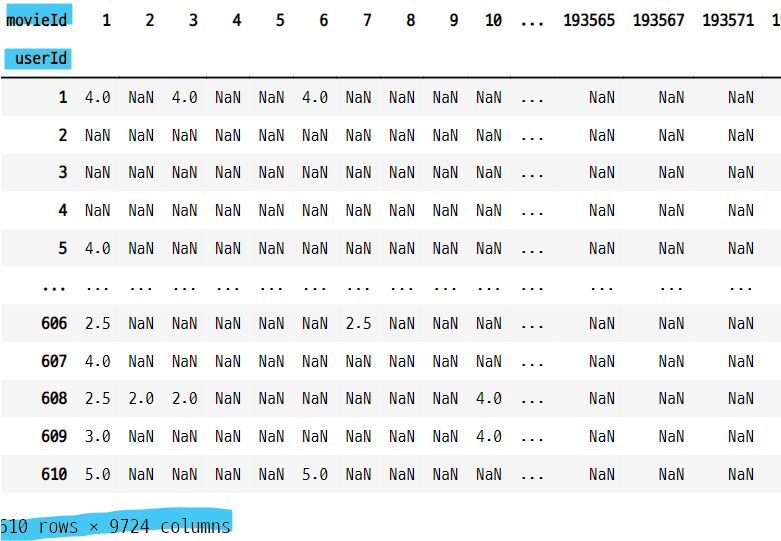

### 4. 새로운 R 매트릭스
- movies 데이터와 ratings 데이터를 movieId 기준으로 병합
- userId와 title로 이루어진 R 매트릭스로 만들기

- movieId 키 값을 기준으로 ratings와 movies 데이터를 병합

```python
ratings_movies = pd.merge(ratings, movies, on="movieId")

ratings_movies.head(3)
```
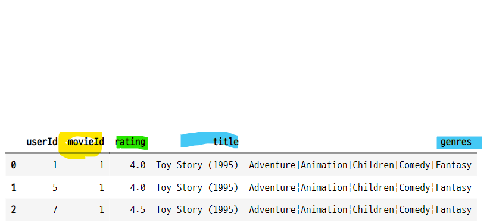

- 인덱스 : userId, columns : title

```python
r_matrix = ratings_movies.pivot_table("rating", index="userId", columns="title")
r_matrix
```
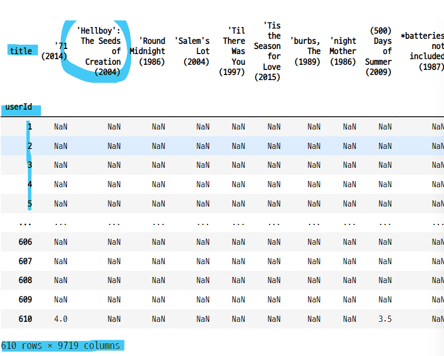


### 4-1. 결측값 처리
- 결측값을 0으로 변환한다.

```python
r_matrix = r_matrix.fillna(0)
r_matrix.head(3)
```
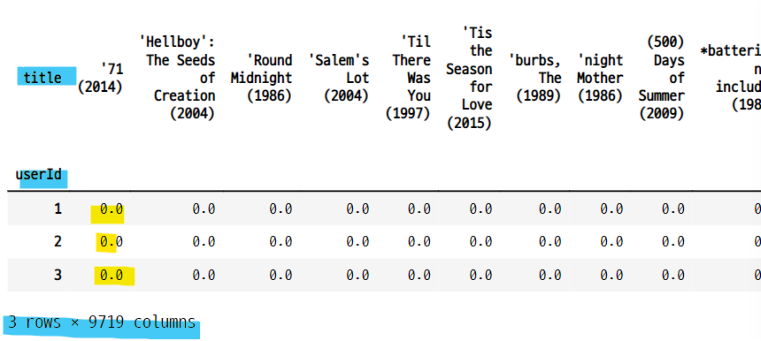


### 5. 코사인 유사도 측정을 위해 행렬 transpose
- R 매트릭스를 transpose 한다.
    - 행 : title
    - 열 : userId

```python
r_matrix_T = r_matrix.transpose()
r_matrix_T.head()
```
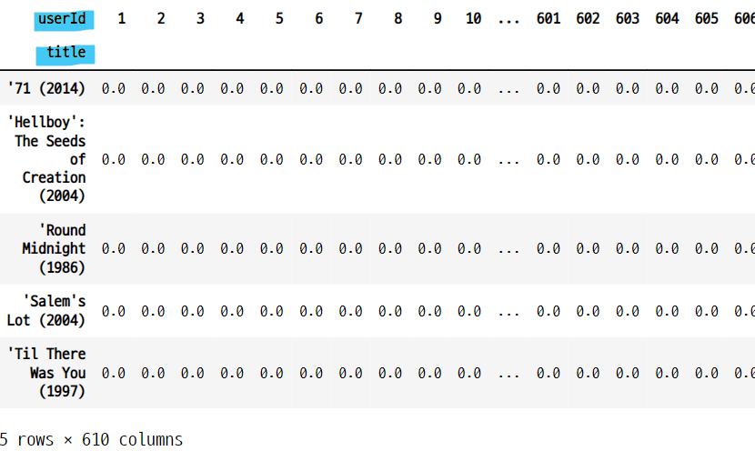

### 6. 코사인 유사도 측정
- r_matrix_T 는 희소행렬과 같은 형태이다.
     - 한 영화에 대한 유저별 평점 데이터로 영화의 유사성을 계산한 것과 같다.
- R 매트릭스를 사용하는 경우 희소행렬 변환을 안해도 된다.
    - count_vect나 tfidf 로 변환하지 않아도 된다.


```python
from sklearn.metrics.pairwise import cosine_similarity

item_sim = cosine_similarity(r_matrix_T, r_matrix_T)
item_sim

>>> print

array([[1.        , 0.        , 0.        , ..., 0.32732684, 0.        ,
        0.        ],
       [0.        , 1.        , 0.70710678, ..., 0.        , 0.        ,
        0.        ],
       [0.        , 0.70710678, 1.        , ..., 0.        , 0.        ,
        0.        ],
       ...,
       [0.32732684, 0.        , 0.        , ..., 1.        , 0.        ,
        0.        ],
       [0.        , 0.        , 0.        , ..., 0.        , 1.        ,
        0.        ],
       [0.        , 0.        , 0.        , ..., 0.        , 0.        ,
        1.        ]])
```

- r matrix의 모양

```python
item_sim.shape

>>> print

(9719, 9719)
```

#### 코사인 유사도 행렬을 데이터 프레임으로 변환
- 행, 열 모두 영화 제목으로 설정
    - 아이템 별 유저의 평점을 데이터로, 모든 영화의 평점과의 유사도를 계산한 것
    - 따라서 A영화와 B영화의 평점의 유사도 값과 같다.

```python
item_sim_df = pd.DataFrame(data=item_sim, index=r_matrix.columns,
                          columns=r_matrix.columns)
item_sim_df.head()
```
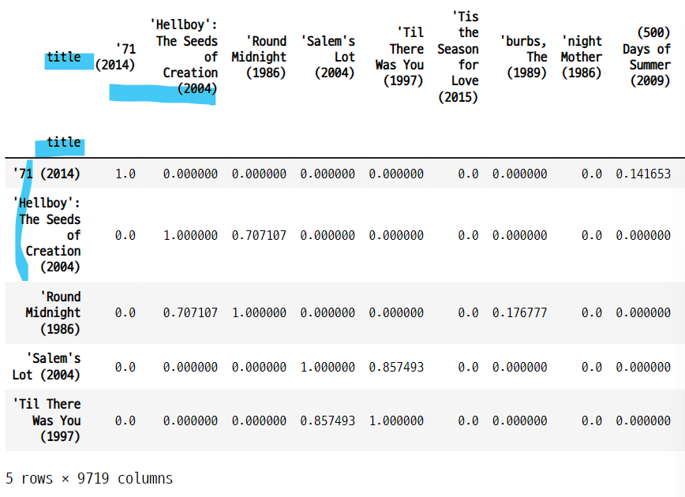

- 아이템 기반 평점 데이터의 크기
    - 각각의 영화와 다른 모든 영화와의 유사도를 측정한 것이므로 영화의 갯수에 해당하는 정방행렬이 된다.

```python
item_sim_df.shape

>>> print

(9719, 9719)
```

### 7. 유사한 영화 찾기
- 코사인 유사도 행렬에서 Toystory 컬럼을 검색하고, 값이 큰 순서데로 정렬
    - Toystory에 평점을 준 유저의 평점 데이터를 기반으로 코사인 유사도를 계산함

### 7-1. Toystory와 유사한 영화들
- 코사인 유사도의 값이 전체적으로 작다.
- 장르의 유사성은 떨어지는 것 같다.

```python
sim_mv = item_sim_df[movies["title"][0]].sort_values(ascending=False)[:10]
sim_mv

>>> print

title
Toy Story (1995)                                     1.000000
Toy Story 2 (1999)                                   0.572601
Jurassic Park (1993)                                 0.565637
Independence Day (a.k.a. ID4) (1996)                 0.564262
Star Wars: Episode IV - A New Hope (1977)            0.557388
Forrest Gump (1994)                                  0.547096
Lion King, The (1994)                                0.541145
Star Wars: Episode VI - Return of the Jedi (1983)    0.541089
Mission: Impossible (1996)                           0.538913
Groundhog Day (1993)                                 0.534169
Name: Toy Story (1995), dtype: float64
```

- 유사한 영화의 타이틀과 장르를 반환

```python
movies[movies["title"].isin(sim_mv.index)][["title", "genres"]]
```
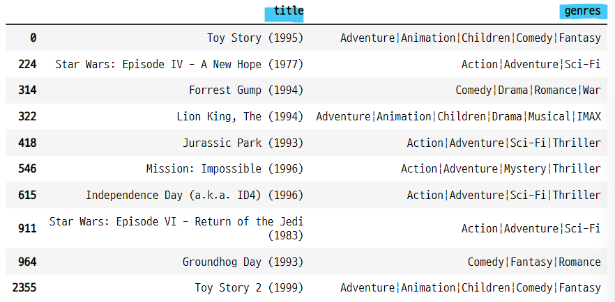


### 7-2. 추천 영화별로 어떤 유저가 어떤 평점을 줬는지 조회
- 아이템 기반 필터링의 원리는 아이템별 평점의 패턴을 기반으로 유사한 평점을 가진 아이템을 찾는 것과 같다.
    - A 아이템에 평점을 준 유저들의 패턴과 유사한 영화에 가중치를 줌
- ratings_movies 데이터에서 유사한 영화들만 인덱싱
- 영화 아이디와 영화 타이틀을 인덱스로하고 유저 아이디를 컬럼으로 하는 피벗 테이블 생성

```python
sim_mv_df = ratings_movies[ratings_movies["title"].isin(sim_mv.index)]
sim_mv_mat = sim_mv_df.groupby([sim_mv_df.movieId, sim_mv_df.title, sim_mv_df.userId]).sum().unstack().fillna(0)
sim_mv_mat = sim_mv_mat.astype("int")

sim_mv_mat
```
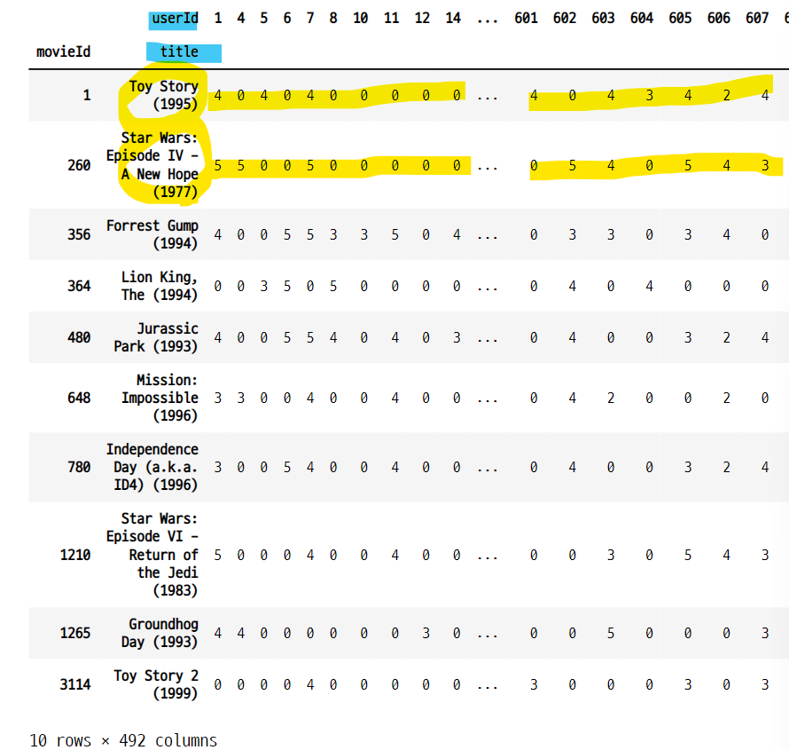

### 8. 장르 데이터로 코사인 유사도를 측정한 후 아이템 기반 필터링과 비교

### 8-1. ratings 데이터에서 평점 평균과, 평점 횟수 계산

```python
rating_df = ratings.groupby("movieId").agg({"rating":"mean", "userId":"count"}).reset_index()
```

### 8-2. movies 데이터와 병합

```python
mv_df_2 = pd.merge(movies, rating_df, on="movieId")
mv_df_2 = mv_df_2.rename(columns={"userId":"count"})
mv_df_2.head()
```

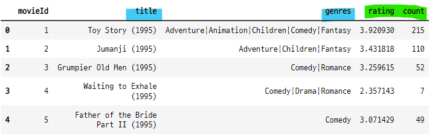


### 8-3. genres 데이터 전처리
- countvectorizer의 희소행렬을 만들기 위해서 genres 데이터를 전처리 한다.
    - genres 데이터의 |를 공백으로 바꾼다.
    - 한 문장으로 만든다.

```python
mv_df_2["genres"] = mv_df_2["genres"].apply(lambda x : x.replace("|", " "))
mv_df_2.head(3)
```
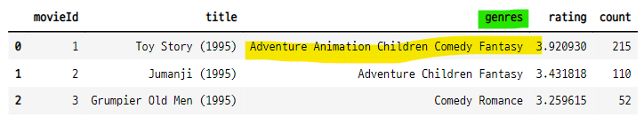


### 8-4. CountVectorizer를 사용하여 희소행렬 생성

```python
from sklearn.feature_extraction.text import CountVectorizer

count_vect = CountVectorizer(min_df=0, ngram_range=(1, 2))
genres_mat = count_vect.fit_transform(mv_df_2["genres"])
```

- 말뭉치 데이터 확인

```python
feature_names = count_vect.get_feature_names()
feature_names

>>> print

['action',
 'action adventure',
 'action animation',
 'action children',
 'action comedy',
 'action crime',
 'action documentary',
 'action drama',
 'action fantasy',
 'action horror',
 'action imax',
 'action mystery',
 ...]
```

- 말뭉치 데이터의 길이
    - 179개의 말뭉치가 생성 됨

```python
len(feature_names)

>>> print

179
```

#### 희소행렬 확인

```python
genres_sparse = genres_mat.toarray()
genres_sparse

>>> print

array([[0, 0, 0, ..., 0, 0, 0],
       [0, 0, 0, ..., 0, 0, 0],
       [0, 0, 0, ..., 0, 0, 0],
       ...,
       [0, 0, 0, ..., 0, 0, 0],
       [1, 0, 1, ..., 0, 0, 0],
       [0, 0, 0, ..., 0, 0, 0]], dtype=int64)
```

```python
genres_sparse[0]

>>> print

array([0, 0, 0, 0, 0, 0, 0, 0, 0, 0, 0, 0, 0, 0, 0, 0, 0, 1, 1, 0, 0, 0,
       0, 0, 0, 0, 0, 0, 0, 0, 0, 0, 0, 1, 1, 0, 0, 0, 0, 0, 0, 0, 0, 0,
       0, 0, 1, 1, 0, 0, 0, 0, 0, 0, 0, 0, 0, 0, 0, 1, 0, 0, 0, 1, 0, 0,
       0, 0, 0, 0, 0, 0, 0, 0, 0, 0, 0, 0, 0, 0, 0, 0, 0, 0, 0, 0, 0, 0,
       0, 0, 0, 0, 0, 0, 0, 0, 0, 0, 0, 0, 0, 0, 0, 0, 0, 0, 0, 0, 1, 0,
       0, 0, 0, 0, 0, 0, 0, 0, 0, 0, 0, 0, 0, 0, 0, 0, 0, 0, 0, 0, 0, 0,
       0, 0, 0, 0, 0, 0, 0, 0, 0, 0, 0, 0, 0, 0, 0, 0, 0, 0, 0, 0, 0, 0,
       0, 0, 0, 0, 0, 0, 0, 0, 0, 0, 0, 0, 0, 0, 0, 0, 0, 0, 0, 0, 0, 0,
       0, 0, 0], dtype=int64)
```

### 8-5. 희소행렬의 코사인 유사도 측정

```python
from sklearn.metrics.pairwise import cosine_similarity

cosine_sim = cosine_similarity(genres_mat, genres_mat)
cosine_sim

>>> print

array([[1.        , 0.4472136 , 0.19245009, ..., 0.        , 0.19245009,
        0.33333333],
       [0.4472136 , 1.        , 0.        , ..., 0.        , 0.        ,
        0.        ],
       [0.19245009, 0.        , 1.        , ..., 0.        , 0.        ,
        0.57735027],
       ...,
       [0.        , 0.        , 0.        , ..., 1.        , 0.        ,
        0.        ],
       [0.19245009, 0.        , 0.        , ..., 0.        , 1.        ,
        0.        ],
       [0.33333333, 0.        , 0.57735027, ..., 0.        , 0.        ,
        1.        ]])
```

- 코사인 유사도 행렬의 크기

```python
cosine_sim.shape

>>> print

(9724, 9724)
```

### 8-6. 코사인 유사도를 크기순으로 정렬
- 유사도 값이 큰 순서로 정렬하고, 인덱스값을 반환한다.

```python
sorted_sim = cosine_sim.argsort()[:, ::-1]
sorted_sim

>>> print

array([[   0, 2353, 6469, ..., 4632, 8771, 4861],
       [6058, 1555,   53, ..., 6032, 6033, 4861],
       [5405, 6385,  394, ..., 3581, 3582, 4861],
       ...,
       [4861, 5768, 2354, ..., 5820, 5821,    0],
       [7878, 9722, 5584, ..., 5833, 5835, 4861],
       [9723, 7856, 6281, ..., 7269, 4043, 4861]], dtype=int64)
```

### 8-7. Toystory 와 유사한 영화 데이터 프레임
- 코사인 유사도 순으로 정렬
- 장르가 똑같은 것은 코사인 유사도 값이 1이 된다.
    - 이렇게 장르 데이터가 같은 영화들이 많다.
    - 제대로 된 추천일 수 있을까?

```python
genres_sim_df = mv_df_2.loc[sorted_sim[0]]
genres_sim_df["sim_score"] = cosine_sim[0][sorted_sim[0]]
genres_sim_df = genres_sim_df.reset_index()
genres_sim_df
```
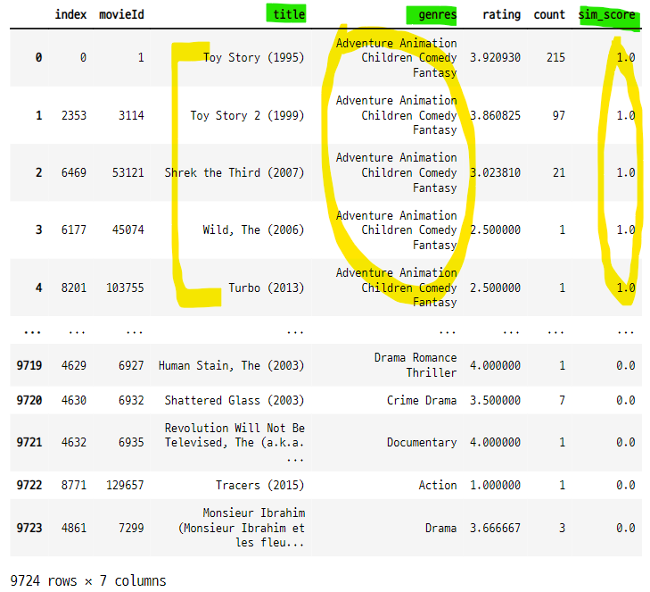

#### 아이템 기반 필터링으로 추천한 영화 리스트와 비교
- 장르가 달라도 평점의 패턴이 유사한 것들이 추천됨
    - 장르 기반 유사도 추천 영화와 차이가 난다.

```python
genres_sim_df[genres_sim_df["title"].isin(sim_mv.index)]
```
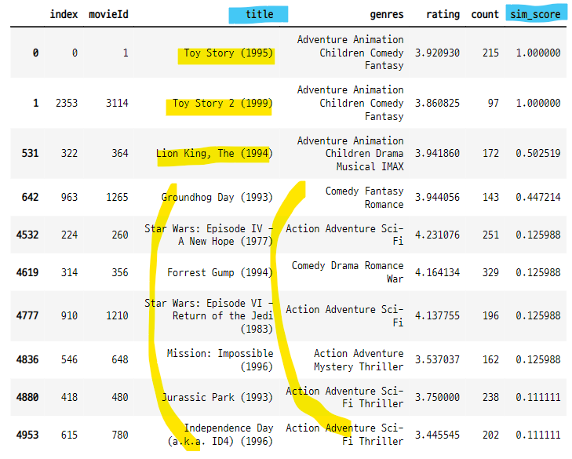


