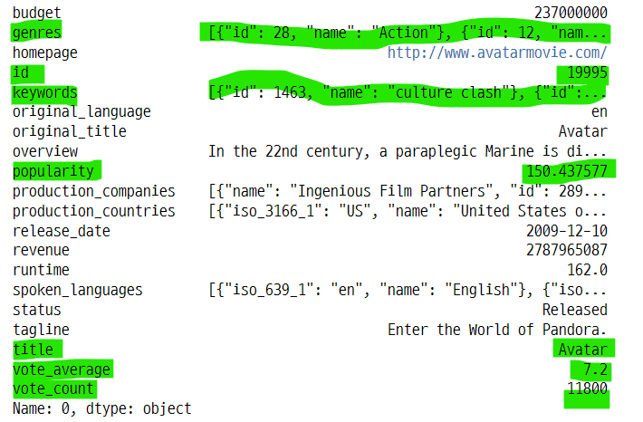
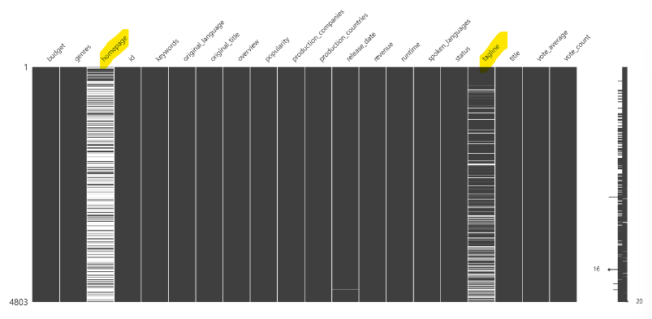
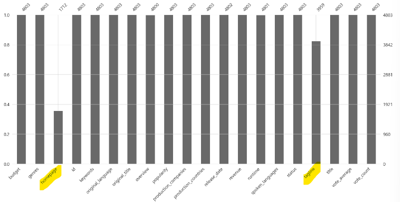
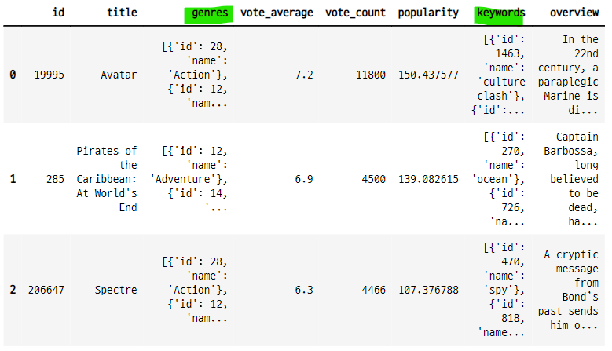
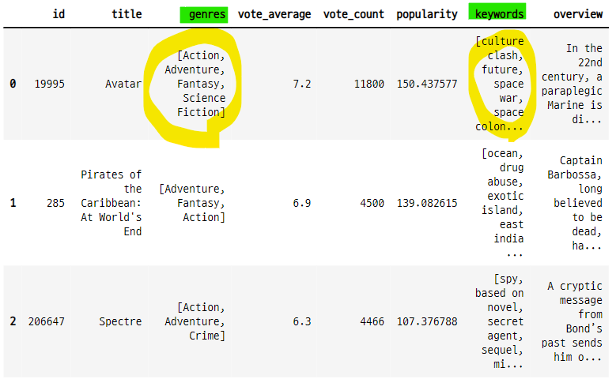
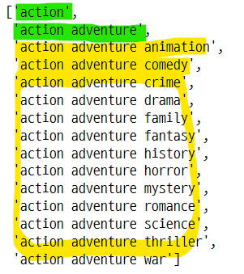
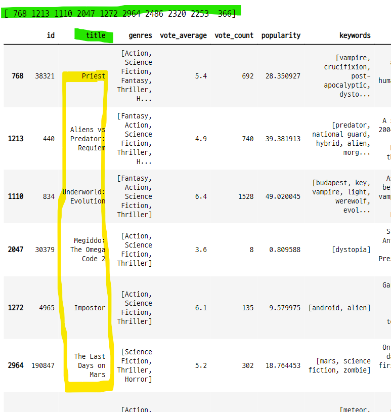
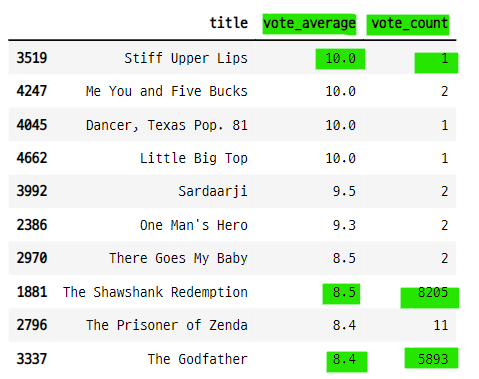
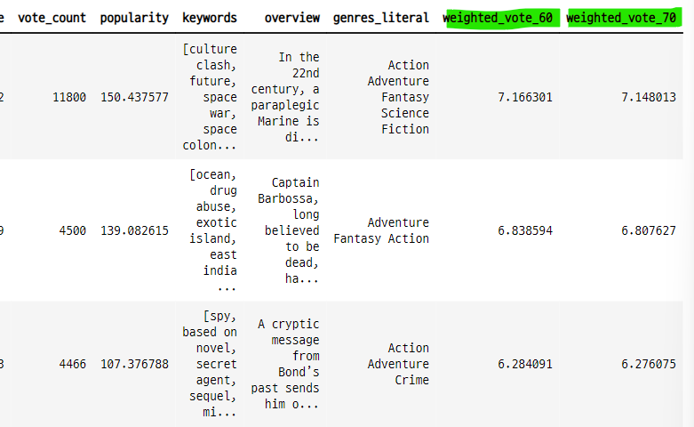

# 추천시스템 실습 : 카운트 벡터와 코사인 유사도를 사용한 영화 추천
- 영화 평점데이터를 사용한 추천 시스템
    - 장르 데이터를 전처리하여
    - countvectorizer로 희소행렬로 변환하고
    - cosine_similarity로 유사도를 측정


### 7-1. 데이터 임포트

```python
mv_df = pd.read_csv("../../04_machine_learning/tmdb-movie-metadata/\
tmdb_5000_movies.csv")

mv_df.head(3)
```


- 데이터 정보 확인

```python
mv_df.info()
```


- 데이터 내용 확인

```python
mv_df.iloc[0]
```


- 컬럼 확인

```python
mv_df.columns

>>> print

Index(['budget', 'genres', 'homepage', 'id', 'keywords', 'original_language',
       'original_title', 'overview', 'popularity', 'production_companies',
       'production_countries', 'release_date', 'revenue', 'runtime',
       'spoken_languages', 'status', 'tagline', 'title', 'vote_average',
       'vote_count'],
      dtype='object')
```

#### 결측 데이터 확인
- homepage, tagline 컬럼에 결측 데이터가 많다.
- 현재 분석에 영향을 주진 않는다.
- isnull() 명령을 사용하면 True, False 값으로 반환된다.

```python
mv_df.isnull()
```


- isnull().sum() : T, F 데이터의 합을 계산하면 결측 데이터(True)의 갯수를 알 수 있다.

```python
mv_df.isnull().sum()
```


- missingno 패키지로 결측 데이터 확인
    - 결측 데이터를 그래프로 확인 할 수 있다.

```python
import missingno as msno

msno.matrix(mv_df)
plt.show() ;
```


- 막대 그래프로 결측 데이터 확인

```python
msno.bar(mv_df)
plt.show() ;
```



### 7-2. 컬럼 선택
- 분석에 사용할 컬럼 선택

```python
mv = mv_df[["id", "title", "genres", "vote_average", "vote_count",
           "popularity", "keywords", "overview"]]

mv.head(3)
```


### 7-3. 코사인 유사도를 적용할 genres 컬럼과 keywords 컬럼 전처리
- genres와 keywords 데이터는 str 안에 다른 자료형의 데이터가 들어 있다.
    - '[{}, {}, {}]' : str 안에 list가 있고 list 안에 dict 가 있다. 
    - dict 안에 id와 name key와 이에 대응하는 value 가 있다.
    - **name의 값으로 코사인 유사도를 측정한다.**
- literal_eval 함수
    - apply 함수에 적용하여 str 안의 자료형을 선택한다.
- str로 만들어진 list, dict, tuple 데이터 타입을 원래의 데이터 타입으로 변환한다.
    - "[]" -> []
    - "()" -> ()
    - "{}" -> {}
- 리스트 컴프리핸션
    - list안의 dict에서 name key에 해당하는 value를 선택한다.
- join 함수
    - genre와 keywords의 데이터를 공백으로 연결 된 한 문장으로 만들어 준다.
    - countverctorizer의 input 데이터로 사용할 수 있다.    

```python
from ast import literal_eval

test_code = """(1, 2, {'foo' : 'val'})"""
test_code

>>> print

"(1, 2, {'foo' : 'val'})"

type(test_code)

>>> print

str

trans_code = literal_eval(test_code)

type(trans_code)

>>> print

tuple
```

- 다른 테스트

```python
code2 = "[(1, 2), (3, 4)]"
code_eval = literal_eval(code2)

print(type(code2), type(code_eval))

>>> print

<class 'str'> <class 'list'>
```

### 7-4. literal_eval 함수를 사용하여 데이터 전처리
- genres와 keywords의 str 데이터를 list와 dict로 변환
    - mv["genres"].apply(literal_eval)

- genres 데이터 확인

```python
mv["genres"][0]

>>> print

'[{"id": 28, "name": "Action"}, {"id": 12, "name": "Adventure"}, {"id": 14, "name": "Fantasy"}, {"id": 878, "name": "Science Fiction"}]'
```

- literal_eval() 함수로 변환

```python
literal_eval(mv["genres"][0])

>>> print

[{'id': 28, 'name': 'Action'},
 {'id': 12, 'name': 'Adventure'},
 {'id': 14, 'name': 'Fantasy'},
 {'id': 878, 'name': 'Science Fiction'}]
```

#### 전체 데이터에 적용

```python
mv["genres"] = mv["genres"].apply(literal_eval)
mv["keywords"] = mv["keywords"].apply(literal_eval)

mv.head(3)
```


- 데이터 전처리 전후 데이터 타입 확인

```python
print("변환전 type : {}".format(type(mv_df["genres"][0])))
print("변환후 type : {}".format(type(mv["genres"][0])))

>>>> print

변환전 type : <class 'str'>
변환후 type : <class 'list'>
```

### 7-5. apply(lambda x : 리스트컴프리핸션)으로 dict의 value 값을 특성으로 사용할 수 있도록 변환
- list 안에 dict 형태로 되어 있는 데이터에서 특정 value 값만 선택하는 방법
    - lambda() 함수를 사용
    - [{"id" : 123, "name" : "hong"}, {"id" : 0909, "name" : "kim"}]
    - lambda x : [ele[name] for ele in x]
    - list에서 dict 하나를 x로 선택하여 ele로 선언하고, ele의 name key 값을 선택

```python
mv["genres"][0]

>>> print

[{'id': 28, 'name': 'Action'},
 {'id': 12, 'name': 'Adventure'},
 {'id': 14, 'name': 'Fantasy'},
 {'id': 878, 'name': 'Science Fiction'}]


[ele["name"] for ele in mv["genres"][0]]

>>> print

['Action', 'Adventure', 'Fantasy', 'Science Fiction']
```

#### lambda 함수를 사용하여 모든 데이터에 적용

```python
mv["genres"] = mv["genres"].apply(lambda x : [ele["name"] for ele in x])
mv["keywords"] = mv["keywords"].apply(lambda x : [ele["name"] for ele in x])

mv.head(3)
```



### 7-6. genres의 데이터를 하나의 문장으로 변환
- list 안에 str로 구분된 데이터를 join() 함수를 사용하여 하나의 문장 형식으로 변환
    - ['a', 'b', 'c'] -> 'a b c'
    - 공백 사이에 , 없음


```python
mv["genres"][0]

>>> print

['Action', 'Adventure', 'Fantasy', 'Science Fiction']

" ".join(mv["genres"][0])

>>> print

'Action Adventure Fantasy Science Fiction'
```

#### 전체 데이터 적용
- apply(lambda x : (" ").join(x))

```python
mv["genres_literal"] = mv["genres"].apply(lambda x : (" ").join(x))

mv.head(3)
```


### 7-7. 문자열로 변환된 genres를 countvectorize 수행
- genres_literal 컬럼의 데이터는 띄어쓰기로 이어져 있는 str 타입
    - Action Adventure Fantasy Science Fiction
- 이렇게 변환 시키는 이유는 **countvectorizer**를 사용하기 위함
    - countvectorizer의 input 데이터로 사용
- countvectorizer의 ngram_range : 토큰화된 말뭉치가 다른 말뭉치와 함께 쓰였을 경우 반환해준다.
    - A 말뭉치가 다른 말뭉치 B, C와 쓰였다면
    - ngram_range=(1, 2) 값 설정
    - 'A', 'A, B', 'A, C' 로 구분 해 준다.
- 어떤 문장에 이 패턴에 해당하는 것이 있으면 해당 인덱스에 1 값이 저장 된다.
    - 희소행렬로 코사이 유사도 즉 문장과 문장의 거리를 계산할 수 있다.    
- 순서
    - 모델 생성 : CountVectorizer(min_df=0, ngram_range=(1, 2))
    - 모델 훈련 : count_vect.fit_transform(mv["genres_literal"])

```python
from sklearn.feature_extraction.text import CountVectorizer

count_vect = CountVectorizer(min_df=0, ngram_range=(1, 2))
genre_mat = count_vect.fit_transform(mv["genres_literal"])

print(genre_mat.shape)

>>> print

(4803, 276)
```

#### 원본 데이터 프레임의 모양

```python
mv.shape

>>> print

(4803, 9)
```

#### 전체 영화 장르의 종류

```python
genre_lst = []
max_range = len(mv["genres"])
i = 0
while i < max_range :
    for ele in mv["genres"][i] :
        if ele not in genre_lst :
            genre_lst.append(ele)
    i += 1

genre_lst

>>> print

['Action',
 'Adventure',
 'Fantasy',
 'Science Fiction',
 'Crime',
 'Drama',
 'Thriller',
 'Animation',
 'Family',
 'Western',
 'Comedy',
 'Romance',
 'Horror',
 'Mystery',
 'History',
 'War',
 'Music',
 'Documentary',
 'Foreign',
 'TV Movie']
```
- 장르의 갯수

```python
len(genre_lst)

>>> print

20
```

### 7-8. countvectorizer의 ngram_range 결과
- action 장르가 다른 장르와 함께 사용 된 경우
    - 다른 15개 장르와 함께 사용 됨
    - adventure animation comedy crime drama family fantasy history horror mystery romance science thriller war western
- 장르마다 다르다.
- **이런식으로 사용된 데이터에서 2개의 장르를 합쳐서 짝을 만든 것이 276가 된다.**

- 말뭉치의 종류

```python
count_vect.get_feature_names()
```


- 말뭉치의 갯수

```python
len(count_vect.get_feature_names())

>>> print

276
```

#### action 장르는 어떤 짝을 이루고 있을까?
- 장르 데이터에서 action 이 어떤 종류의 장르들과 사용됐는지 확인

```python
[ele[len("action")+1:] for ele in count_vect.get_feature_names()[:16][1:]]

>>> print

['adventure',
 'animation',
 'comedy',
 'crime',
 'drama',
 'family',
 'fantasy',
 'history',
 'horror',
 'mystery',
 'romance',
 'science',
 'thriller',
 'war',
 'western']
```

### 7-9. ngram_range 테스트
- ngram_range=(1, 3)으로 설정하면 하나의 장르가 2개의 장르와의 조합으로 나타난다.

```python
test_countvect = CountVectorizer(min_df=0, ngram_range=(1, 3))
test_genre_mat = test_countvect.fit_transform(mv["genres_literal"])

test_countvect.get_feature_names()[:15]
```


### 7-10. toarray() 희소행렬에는 원래 특성이 들어있는 feature_name에 1이 마킹된다.
- count_vect.toarray()의 모양은 (4803, 276) 이다.
    - 컬럼의 갯수가 276 인 이유는 ngram_range=(1, 2)로 설정했기때문에, 각각의 장르가 2개의 짝을 이루는 형태로 만들어졌기 때문
    
- 첫 번째 데이터의 get_literal
    - 'Action Adventure Fantasy Science Fiction'
- 첫 번째 데이터의 toarray() 
    - [0, 1, 16, 24, 124, 135, 138, 232, 233]
    - 이 인덱스는 get_feature_names()의 장르 짝 세트에서 해당하는 것의 인덱스와 같다.
- feature_names() 에서 1의 인덱스에 해당하는 값
    - numpy로 변환 한 뒤 T, F 배열을 만들어 인수로 넣으면 True에 해당하는 값 출력
    
```
array(['action', 'action adventure', 'adventure', 'adventure fantasy',
       'fantasy', 'fantasy science', 'fiction', 'science',
       'science fiction'], dtype='<U21')
```

- get_literal 에서 어떤 규칙에 의해서 get_feature_names() 의 짝이 선택됨

- genre_mat의 모양
    - 컬럼은 말뭉치의 갯수와 같다.

```python
genre_mat.toarray().shape

>>> print

(4803, 276)
```

#### 첫 번째 데이터의 toarray() 희소행렬
- get_literal의 값 중 get_feature_names() 에 해당하는 것이 있으면 해당 인덱스에 1이 저장된다.

```python
genre_mat.toarray()[0]

>>> print

array([1, 1, 0, 0, 0, 0, 0, 0, 0, 0, 0, 0, 0, 0, 0, 0, 1, 0, 0, 0, 0, 0,
       0, 0, 1, 0, 0, 0, 0, 0, 0, 0, 0, 0, 0, 0, 0, 0, 0, 0, 0, 0, 0, 0,
       0, 0, 0, 0, 0, 0, 0, 0, 0, 0, 0, 0, 0, 0, 0, 0, 0, 0, 0, 0, 0, 0,
       0, 0, 0, 0, 0, 0, 0, 0, 0, 0, 0, 0, 0, 0, 0, 0, 0, 0, 0, 0, 0, 0,
       0, 0, 0, 0, 0, 0, 0, 0, 0, 0, 0, 0, 0, 0, 0, 0, 0, 0, 0, 0, 0, 0,
       0, 0, 0, 0, 0, 0, 0, 0, 0, 0, 0, 0, 0, 0, 1, 0, 0, 0, 0, 0, 0, 0,
       0, 0, 0, 1, 0, 0, 1, 0, 0, 0, 0, 0, 0, 0, 0, 0, 0, 0, 0, 0, 0, 0,
       0, 0, 0, 0, 0, 0, 0, 0, 0, 0, 0, 0, 0, 0, 0, 0, 0, 0, 0, 0, 0, 0,
       0, 0, 0, 0, 0, 0, 0, 0, 0, 0, 0, 0, 0, 0, 0, 0, 0, 0, 0, 0, 0, 0,
       0, 0, 0, 0, 0, 0, 0, 0, 0, 0, 0, 0, 0, 0, 0, 0, 0, 0, 0, 0, 0, 0,
       0, 0, 0, 0, 0, 0, 0, 0, 0, 0, 0, 0, 1, 1, 0, 0, 0, 0, 0, 0, 0, 0,
       0, 0, 0, 0, 0, 0, 0, 0, 0, 0, 0, 0, 0, 0, 0, 0, 0, 0, 0, 0, 0, 0,
       0, 0, 0, 0, 0, 0, 0, 0, 0, 0, 0, 0], dtype=int64)
```

- 1에 해당하는 인덱스를 사용하여 말뭉치 확인
    - 즉 0번째 데이터의 장르 특성은 어떤 말뭉치에 해당하는 지를 알 수 있다.

```python
np.array(count_vect.get_feature_names())[genre_mat.toarray()[0]==1]

>>> print

array(['action', 'action adventure', 'adventure', 'adventure fantasy',
       'fantasy', 'fantasy science', 'fiction', 'science',
       'science fiction'], dtype='<U21')
```

### 7-11. 코사인 유사도
- genre_mat의 희소행렬 toarray()의 모든 행을 다른 행들과의 코사인 유사도를 계산한다.
    - 문장과 문자의 거리
    - 1에 가까울 수록 유사도가 크다. 
- (4083, 276) 행렬이 -> (4083, 4083) 정방행렬이 된다.    
- 자기자신과의 거리는 1 
    - 문장을 벡터화 했을 때 두 벡터가 같다면 같은 방향을 향한다.    

- 코사인 유사도 패키지 임포트

```python
from sklearn.metrics.pairwise import cosine_similarity
```

- 유사도 측정
    - 희소행렬의 유사도 측정
    - 각 행을 다른 모든 행과의 유사도를 측정하여 유사도 값을 반환

```python
genre_sim = cosine_similarity(genre_mat, genre_mat)
genre_sim

>>> print

array([[1.        , 0.59628479, 0.4472136 , ..., 0.        , 0.        ,
        0.        ],
       [0.59628479, 1.        , 0.4       , ..., 0.        , 0.        ,
        0.        ],
       [0.4472136 , 0.4       , 1.        , ..., 0.        , 0.        ,
        0.        ],
       ...,
       [0.        , 0.        , 0.        , ..., 1.        , 0.        ,
        0.        ],
       [0.        , 0.        , 0.        , ..., 0.        , 0.        ,
        0.        ],
       [0.        , 0.        , 0.        , ..., 0.        , 0.        ,
        1.        ]])
```

#### 하나의 행에 대해 자신을 포함한 4802개의 행과의 거리를 계산했으므로 정방행렬이 된다.

```python
genre_sim.shape

>>> print

(4803, 4803)
```

#### 3개의 toarray()로 코사인 유사도 계산 테스트
- 같은 행 끼리는 유사도가 같으므로 값이 1이 된다.
    - 대각성분이 모두 1이다.
- 비대각 성분의 값이 각 행의 다른 행들과의 코사인 유사도 이다.    

```python
test_mat = genre_mat.toarray()[:3]

cosine_similarity(test_mat, test_mat)

>>> print

array([[1.        , 0.59628479, 0.4472136 ],
       [0.59628479, 1.        , 0.4       ],
       [0.4472136 , 0.4       , 1.        ]])
```

### 7-12. 코사인 유사도를 큰 값 순으로 인덱스값으로 정렬
- argsort() : 작은 값의 인덱스가 배열의 가장 앞에 온다.
- [:, ::-1] : 행은 그대로 두고, 열의 값을 역순으로 정렬하면 큰 값이 배열의 앞으로 온다.

```python
genre_sim_sorted_ind = genre_sim.argsort()[:, ::-1]
genre_sim_sorted_ind

>>> print

array([[   0, 3494,  813, ..., 3038, 3037, 2401],
       [ 262,    1,  129, ..., 3069, 3067, 2401],
       [   2, 1740, 1542, ..., 3000, 2999, 2401],
       ...,
       [4800, 3809, 1895, ..., 2229, 2230,    0],
       [4802, 1594, 1596, ..., 3204, 3205,    0],
       [4802, 4710, 4521, ..., 3140, 3141,    0]], dtype=int64)
```

### 7-13. 추천 영화를 DataFrame으로 반환하는 함수
- 영화의 타이틀을 입력하면
- 타이틀에 해당하는 인덱스를 찾아서
- 코사인 유사도 행렬에서 해당 인덱스의 값을 확인한다.
- 이중에서 코사인 유사도가 가장 큰 값 즉 벡터가 가장 유사한 인덱스 n개를 반환한다.
- 이 인덱스에 해당하는 타이틀을 검색하면 유사한 영화가 된다.

#### 영화 인셉션의 인덱스
- 평균 평점이 8.0보다 크고, 평점의 갯수가 13000 개보다 많은 영화
    - Inception

```python
mv[(mv["vote_average"] > 8.0) & (mv["vote_count"] > 13000)]
```


- Inception의 인덱스 조회

```python
test_index = mv[(mv["vote_average"] > 8.0) & (mv["vote_count"] > 13000)].index[0]
test_index

>>> print

96
```

#### 코사인 유사도 정렬 행렬에서 인셉션에 해당하는 행
- Inception 영화와 다른 영화들의 유사도 값의 크기 순 인덱스 값이 저장 되어 있다.

```python
genre_sim_sorted_ind[test_index]

>>> print

array([  96,  275,  607, ..., 2399, 2397, 4802], dtype=int64)
```

#### 유사도값이 큰 5개의 인덱스에 해당하는 영화

```python
test_recommend = mv.loc[genre_sim_sorted_ind[test_index][:5]]
test_recommend
```


#### 5개 영화의 장르 확인
- 5개 영화의 장르가 유사한 것을 확인 할 수 있다.

```python
test_recommend["genres_literal"]

>>> print

96      Action Thriller Science Fiction Mystery Adventure
275               Action Thriller Science Fiction Mystery
607     Mystery Action Thriller Science Fiction Adventure
149             Action Thriller Science Fiction Adventure
4670            Adventure Action Thriller Science Fiction
Name: genres_literal, dtype: object
```

### 7-14. 추천 영화를 DataFrame으로 반환하는 함수
- 영화의 타이틀을 입력하면
- 타이틀에 해당하는 인덱스를 찾아서
- 코사인 유사도 행렬에서 해당 인덱스의 값을 확인한다.
- 이중에서 코사인 유사도가 가장 큰 값 즉 벡터가 가장 유사한 인덱스 n개를 반환한다.
- 이 인덱스에 해당하는 타이틀을 검색하면 유사한 영화가 된다.

```python
def find_sim_mv(df, title, sorted_ind, top_n=10) :
    title_mv = df[df["title"]==title]
    title_idx = title_mv.index.values
    sim_idx = sorted_ind[title_idx, :top_n].reshape(-1)
    print(sim_idx)

    return df.iloc[sim_idx
```

- 함수 호출

```python
find_sim_mv(mv, "Inception", genre_sim_sorted_ind, 10)
```


### 7-15. vote_count의 평균값에 가장 가까운 영화를 조회하고 유사한 영화들 추천
- 평점의 평균

```python
mv["vote_count"].mean()

>>> print

690.2179887570269
```

- 평점이 690보다 크고 700보다 작은 영화 데이터 중 1번째 데이터

```python
mv[(mv["vote_count"] > 690) & (mv["vote_count"] < 700)].sort_values("vote_count").iloc[1]

>>> print

id                                                            38321
title                                                        Priest
genres            [Action, Science Fiction, Fantasy, Thriller, H...
vote_average                                                    5.4
vote_count                                                      692
popularity                                                28.350927
keywords          [vampire, crucifixion, post-apocalyptic, dysto...
overview          In an alternate world, humanity and vampires h...
genres_literal       Action Science Fiction Fantasy Thriller Horror
Name: 768, dtype: object
```

- 이 영화의 제목

```pythn
new_title = mv[(mv["vote_count"] > 690) & (mv["vote_count"] < 700)].sort_values("vote_count").iloc[1]["title"]
new_title

>>> print

'Priest'
```

#### Priest 영화와 유사한 영화 추천

```python
find_sim_mv(mv, new_title, genre_sim_sorted_ind, 10)
```



### 7-16. 코사인 유사도 값을 반환하도록 함수 변경

```python
def find_sim_mv_2(df, title, sorted_idx, cosine_sim, top_n=10) :
    title_mv = df[df["title"]==title]
    title_idx = title_mv.index.values
    sim_idx = sorted_idx[title_idx, :top_n].reshape(-1)
    print(sim_idx)

    df2 = df.iloc[sim_idx]

    ## 코사인 유사도 값 행렬에서 조회 영화와, 유사도 인덱스를 사용하여 조회한다.
    ## 이 값을 데이터 프레임에 컬럼으로 추가
    df2["sim_score"] = cosine_sim[title_idx, sim_idx]
    result_df = df2[["title", "vote_count", "vote_average", "sim_score"]]

    return result_df
```

#### 영화 추천

```python
find_sim_mv_2(mv, new_title, genre_sim_sorted_ind, genre_sim, 10)
```


## 8. 평점에 가중치를 적용하여 새로운 평점 생성
- 그러나 이 값이 코사인 유사도와는 별개이므로 추천 영화 자체에 영향을 주진 않는다.
    - 코사인 값은 평점에 따른 것이 아니라 장르 벡터에 따른 것이므로
- 코사인 유사도 값이 높은 10개 중에서 가중치 평점에 따라 정렬하더라도 큰 변화는 없다.

### 8-1. 평점 횟수와 평점 간의 관계가 기울어진 데이터
- 평점 횟수가 1인데 10점인 것과 평점 횟수가 8205인데 평점이 8.5 인 것의 가중치는 달라야 함

```python
mv[["title", "vote_average", "vote_count"]].sort_values("vote_average", ascending=False)[:10]
```



### 8-2. 영화 평점 가중치 부여하기
- v : 개별 영화에 평점을 투표한 횟수
- m : 평점을 부여하기 위한 최소 투표 횟수
    - quantile() : 함수를 사용하여 사분위수를 구할 수 있다.
    - 0.6 : 전체 데이터 중 60% 지점에 해당하는 값
- R : 개별 영화에 대한 평균 평점
- C : 전체 영화에 대한 평균 평점

```python
C = mv["vote_average"].mean()
m_60 = mv["vote_count"].quantile(0.6)
m_70 = mv["vote_count"].quantile(0.7)

print("C : ", round(C, 3),
      "m lower 60 : ", round(m_60, 3), "m lower 70 : ", round(m_70, 3))

>>> print

C :  6.092 m lower 60 :  370.2 m lower 70 :  581.0
```

- 영화 평점 조정 함수

```python
def weighted_vote_avg(df, m, C) :
    v = df["vote_count"]
    R = df["vote_average"]

    result = ((v / (v + m)) * R) + ((m / (v+m)) * C)

    return result
```

#### 전체 데이터에 함수를 적용
- 60%, 70% 계산 값에 해당하는 컬럼을 만들고 데이터 추가

```python
mv["weighted_vote_60"] = weighted_vote_avg(mv, m_60, C)
mv["weighted_vote_70"] = weighted_vote_avg(mv, m_70, C)

mv.head(3)
```



### 8-3. 조정 평점값을 적용한 데이터로 다시 유사 영화 추천
- 추천 시스템 함수에서 조정 평점값 컬럼을 기준으로 정렬한 후 반환 한다.

```python
def find_sim_mv_3(df, title, sorted_idx, genre_sim, top_n=10) :
    title_df = df[df["title"]==title]
    title_idx = title_df.index.values
    sim_idx = sorted_idx[title_idx, :top_n].reshape(-1)

    df2 = df.iloc[sim_idx]
    df2["sim_score"] = genre_sim[title_idx, sim_idx]
    
    ## 조정 평점값을 기준으로 데이터 프레임 정렬
    return df2.sort_values("weighted_vote_60", ascending=False)
```

#### 유사 영화 추천
- 유사한 영화의 추천 원리는 변하지 않음
- 추천 된 영화중에서 조정 평점값을 통해 어떤 영화가 더 추천하기 좋은지 판단할 수 있다.

```python
recommed_mv_2 = find_sim_mv_3(mv, new_title, genre_sim_sorted_ind, genre_sim, 10)
recommed_mv_2[["title", "vote_average", "weighted_vote_60", "sim_score"]]
```


