# 추천 시스템 : TfidfVectorizer와 liner_kernel을 사용한 유사도 측정
- book 데이터를 사용

### 과정
- 데이터 임포트
- 희소행렬 변환할 텍스트 데이터 컬럼의 전처리
    - author
    - tag
    - author + tag
- Tfidf로 가중치 문서 희소행렬 생성 : tfidf_matrix
    - countvectorizer와 사용법은 같다.
    - 가중치 값이 마킹된다.
    - from sklearn.feature_extraction.text import TfidfVectorizer
- 유사도 측정
    - 여러가지 유사도 측정 패키지 중 적절한 것을 선택하여 측정한다.
    - form sklearn.metrics.pairwise import (cosine_similarity, linear_kernel)
    - linear_kernel(tfidf_matrix, tfidf_matrix)
- 유사도 값의 크기에 따른 인덱스 반환
    - sim_scores = list(enumerate())
    - sorted(sim_scores, key=lambda x: x[1], reverse=True)
- 인덱스에 해당하는 책의 정보 반환

### 1. books 데이터 임포트

### 1-1. os 패키지로 디렉토리의 파일 리스트 확인
- book 데이터의 종류
    - books.csv : 책 정보
    - ratings.csv : 책 아이디, 유저 아이디, 평점
    - book_tags.csv : 책 아이디, 태그 아이디, 갯수
    - tags.csv : 태그 아이디, 태그 이름
    - to_read.csv : 유저 아이디, 책 아이디

```python
import os

print(os.listdir("../../04_machine_learning/goodbooks-10k"))

>>> print

['books.csv', 'book_tags.csv', 'ratings.csv', 'sample_book.xml', 'tags.csv', 'to_read.csv']
```

### 1-2. books 데이터 임포트

```python
path = "../../04_machine_learning/goodbooks-10k/"
books = pd.read_csv(path + "books.csv", encoding="ISO-8859-1")

books.head(3)
```
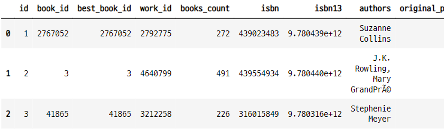

### 2. books 데이터 정보 조회
- 10000의 책에 대한 23개의 특징값들이 들어 있다.

```python
books.shape

>>> print

(10000, 23)
```

### 2-1. 정보 확인

```python
books.info()
```
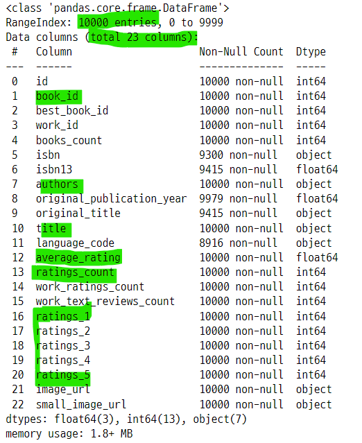

### 2-2. 특정 컬럼만 확인

```python
books[["id", "book_id", "title", "authors", "ratings_count", "average_rating",
       "ratings_1", "ratings_2", "ratings_3", "ratings_4", "ratings_5"]][:10]
```
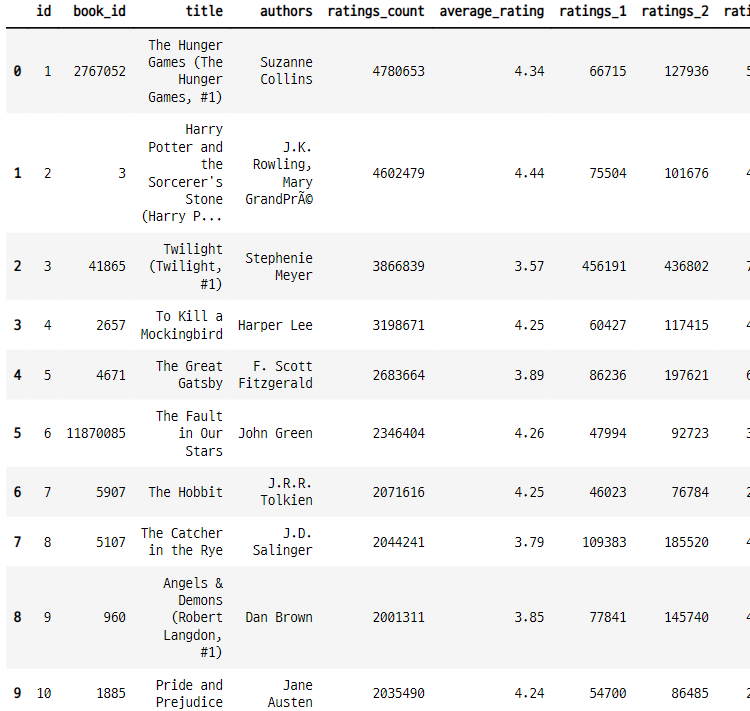

### 2-3. 컬럼과 데이터 내용

```python
books.loc[0]
```
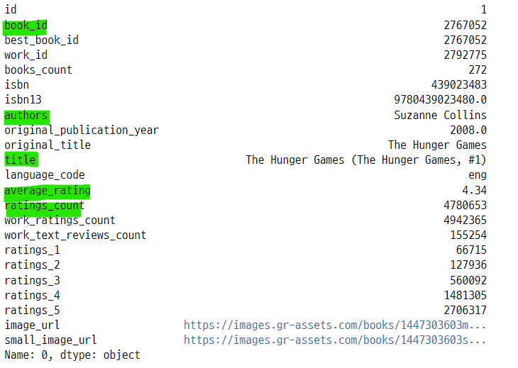

### 3. ratings 파일 임포트
- 10000개의 책에 대한 유저들의 평점
- 책 별로 평가한 유저들의 수가 다르다.
    - 100명의 유저들이 평가한 책이 대부분을 차지한다.

```python
ratings = pd.read_csv(path + "ratings.csv", encoding="ISO-8859-1")

ratings.head(3)
```
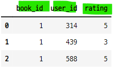

### 3-1. ratings 데이터 크기 확인
- 책에 대한 유저 아이디의 평점이 들어 있다.

```python
ratings.shape

>>> print

(981756, 3)
```

### 3-2. 북 아이디 당 평점의 갯수
- 대부분의 북 아이디는 100개의 평점이 달려있다.

```python
ratings.groupby("book_id").agg({"user_id" : "count"})
```
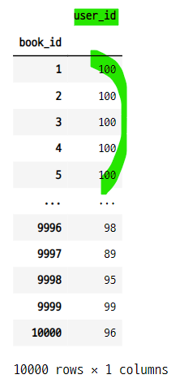


- 100개의 평점이 달린 북 아이디의 갯수

```python
ratings.groupby("book_id").agg({"user_id" : "count"}).value_counts("user_id")

>>> print

user_id
100    7456
99      744
98      329
97      245
96      159
95      148
94       93
93       90
92       74
91       58
89       58
90       55
88       39
87       38
86       37
85       35
84       31
...
```

### 4. book tag 데이터 임포트
- 책 별로 태그 아이디가 연결되어 있다.
    - 한 책당 100개의 태가 아이디가 연결되어 있다.


```python
books_tags = pd.read_csv(path + "book_tags.csv", encoding="ISO-8859-1")

books_tags.head(3)
```
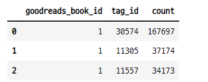


### 4-1. book tag 데이터 크기 확인

```python
books_tags.shape

>>> print

(999912, 3)
```

### 4-2. 태그의 갯수별 북 아이디의 갯수
- 모든 책들은 100개의 태그 아이디가 달려 있다.
    - 북 아이디로 그룹화한 후 태그 아이디의 갯수를 계산한다.
    - 태그 아이디 갯수를 계산한다.

```python
books_tags.groupby("goodreads_book_id").agg({"tag_id" : "count"}).value_counts("tag_id")

>>> print

tag_id
100    9997
56        1
62        1
94        1
dtype: int64
```

### 5. tag 데이터 임포트
- 태그 아이디와 태그의 내용이 들어있다.
- 34251개의 태가 아이디가 있다.

```python
tags = pd.read_csv(path + "tags.csv")

tags.tail(3)
```
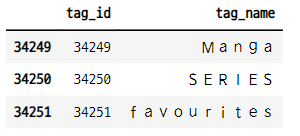

### 5-1. tag 데이터의 샘플 확인
- 어떤 태그들이 있는지 확인
- 3만 4천여개의 태그가 있다.

```python
tags.sample(10)
```
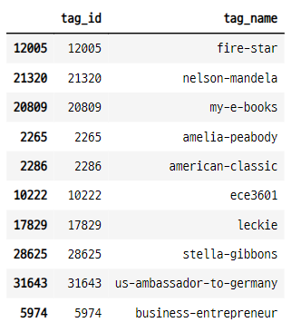

### 6. book_tags, tags 데이터 병합
- book_tags는 북 아이디와 태그 아이디로 이루어진 데이터 프레임
- tags는 태그 아이디와 태그의 내용으로 이루어진 데이터 프레임
    - 합하면 북 아이디와 태그 아이디와 태그 내용으로 이루어진 데이터 프레임을 만들 수 있다.
- 병합 방법
    - left_on, right_on : 키 값으로 사용할 열의 이름을 지정한다. 두 데이터프레임에서 데이터는 같은데 열의 이름이 다를 수 있다.
    - how="inner" : 공통 된 키값이 있는 데이터만 반환한다.


### 6-1. books_tags 데이터에서 태그 아이디 30574 조회
- 9983개의 책에 이 태그가 연결되어 있다.

```python
books_tags[books_tags["tag_id"]==30574]
```
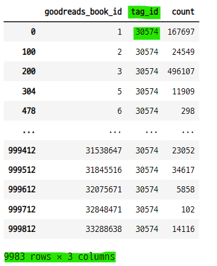

### 6-2. tags 30574는 어떤 태그 인지 조회
- to-read 라는 내용의 태그 이다.

```python
tags[tags["tag_id"]==30574]
```
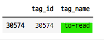

### 6-3. 데이터 병합
- 북 아이디와 태그 아이디에 해당하는 내용이 연결된다.

```python
tags_join_df = pd.merge(books_tags, tags, left_on="tag_id", right_on="tag_id", how="inner")

tags_join_df.tail()
```
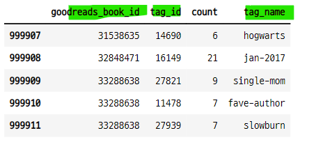

### 6-4. 병합한 데이터의 크기

```python
tags_join_df.shape

>>> print

(999912, 4)
```

### 7. 50번 사용된 태그 아이디 조회
- 태그 아이디는 사용 된 횟수가 다르다.
- 이중에서 50번 사용 된 태그 아이디를 조회
- **시리즈 데이터에서 items() 함수를 사용하여 인덱스와 값을 분리할 수 있다.**

```python
[tag_id for tag_id, val in tags_join_df.value_counts("tag_id").items() if val == 50][:10]

>>> print

[29568, 32914, 33127, 31186, 24083, 30463, 31156, 24136, 12724, 27705]
```

### 8. to_read 데이터 임포트
- 유저 아이디와 북 아이디가 연결되어 있다.
- 유저별 읽은 책의 아이디를 확인 할 수 있다.

```python
to_read = pd.read_csv(path + "to_read.csv")

to_read.tail(3)
```
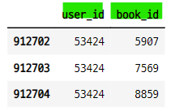

### 8-1. 유저별 읽은 책의 갯수 조회
- 48871 개의 유저 아이디가 있다.

```python
to_read.groupby("user_id").agg({"book_id" : "count"})
```
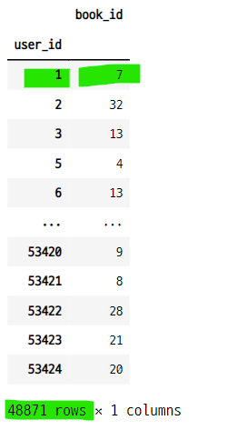

### 8-2. 유저 아이디 1 이 읽은 책의 아이디
- 유저 아이디 1은 7권의 책을 읽었다고 볼 수 있다.

```python
to_read[to_read["user_id"]==1]
```
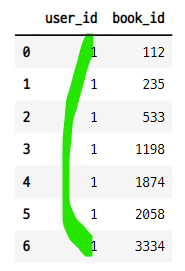


### 9. author 데이터로 Tfidf 수행
- Tf-idf : 가중 문서 희소 행렬을 만들어 준다.
    - analyzer : 단어나 ngram 문자로 만들지 선택
    - ngram_rang : 추출할 ngram의 하한, 상한 경계값    
    - min_df : 빈도수가 이 값보다 낮은 단어는 제외하는 기능, cut-off라고도 한다.
- **희소행렬의 형태**
    - tfidfvectorizer 패키지를 사용하여 희소행렬을 만든 경우 가중치 값이 마킹된다.
    - countvectorizer 패키지를 사용하여 희소행렬을 만든 경우 1로 마킹된다.
    
### 9-1. sklearn :  pairwise metrics docs
- 두 개의 객체의 거리 또는 유사도 계산에 관한 모듈
- kernel은 두 객체의 거리측정법과 유사성 측정을 변환해주는 방법들 중 하나이다.
    - S = kernel, D = 거리
    - S = np.exp(-D * gamma), S = 1. / (D / np.max(D))
- pairwise_distances : 행렬 X와 행렬 Y의 행벡터들간의 거리 계산
    - Y 가 생략되면 X 행렬의 행벡터간의 거리 계산

```
# pairwise_distances(X, Y, metric='manhattan')  
# pairwise_distances(X, metric='manhattan')
```

- pairwise.pairwise_kernels : 다른 거리계산 방식을 추가할 수 있다.

```
#pairwise_kernels(X, Y, metric='linear')
```

### 9-2. pairwise metircs 모듈의 여러가지 거리, 유사도 측정 방법들
- cosine similarity
    - tf-idf 벡터로 나타낸 문서간 유사성을 계산하는데 잘 쓰인다.
    - tf-idf 로 정규화된 벡터를 계산할 때는 cosine similarity 보다 linear kernal이 더 빠르다. (기능은 동일하다.)
    - `sklearn.metrics.pairwise.cosine_similarity(X, Y=None, dense_output=True)`
- linear kernel
    - 차수가 1이고 균일한 다항식 커널을 계산한다. ??
    - tf-idf 벡터로 나타낸 문서간 유사성을 계산하는데 잘 쓰인다.
    - `sklearn.metrics.pairwise.linear_kernel(X, Y=None, dense_output=True)`
- polynomial kerner
    - 차수가 D이고 균일한 두 벡터의 다항식 커널을 계산한다.
    - 두 벡터의 유사성을 나타낸다.
    - 머신러닝에 사용하면 두 feature 간의 상호작용(상관관계)를 계산할 수 있다.
    - `sklearn.metrics.pairwise.polynomial_kernel(X, Y=None, degree=3, gamma=None, coef0=1)`
- sigmoid kernel
    - 두 벡터 사이의 시그모이드 커널을 계산한다.
    - 시그모이드 커널은 하이퍼 탄젠트 또는 다층 퍼셉트론으로 알려져 있다.
    - `sklearn.metrics.pairwise.sigmoid_kernel(X, Y=None, gamma=None, coef0=1)`
- RBF kernel
    - 두 벡터 사이의 RBF (방사형 기저 함수) 커널을 계산한다.
    - `sklearn.metrics.pairwise.rbf_kernel(X, Y=None, gamma=None)`
- laplacian kernel
    - RBF kerner의 변형 계산 방법이다.
    - noise 가 없는 데이터의 ML 사용에서 유용하게 쓰인다. 양자역학 기계학습
    - `sklearn.metrics.pairwise.laplacian_kernel(X, Y=None, gamma=None)`
- chi-squared kernel
    - 컴퓨터 비전 어플리케이션에서 비선형 SVM을 훈련시키는데 유용하다.
    - 시각적 단어의 히스토램에 잘 사용된다. ??
    - `sklearn.metrics.pairwise.chi2_kernel(X, Y=None, gamma=1.0)`    
    
### 9-3. Tf-idf 가중 문서 희소 행렬 사용한 텍스트 분류 예제 참고
- bow 접근 방식을 사용한 문서 분류
- 희소 행렬을 효율적으로 처리할 수 있는 다양한 분류기 사용

- https://scikit-learn.org/stable/auto_examples/text/plot_document_classification_20newsgroups.html#sphx-glr-auto-examples-text-plot-document-classification-20newsgroups-py        


### 9-4. tfidf 생성 및 훈련
- ngram_range의 값에 따라서 말뭉치의 조합 방식이 달라진다.
    - ngram_range=(1, 2) 이면, 단어 한개당 다른 단어 한개가 조합된다.

```python
tf = TfidfVectorizer(analyzer="word", ngram_range=(1, 2),
                     min_df=0, stop_words="english")
tfidf_matrix = tf.fit_transform(books["authors"])
```

### 9-4. 말뭉치 확인

```python
word_feature = tf.get_feature_names()
word_feature

>>> print

['aardema',
 'aardema leo',
 'aaron',
 'aaron alexovich',
 'aaron asher',
 'aaron ehasz',
 'aaron johnston',
 'aaron leichter',
 'aaron lopresti',
 'aaron sowd',
 'aaronovitch',
 'ab',
 'ab di',
 'abagnale',
```

- 말뭉치의 길이

```python
len(word_feature)

>>> print

14742
```

### 9-5. 희소 행렬 확인
- 10000개의 책 별로 말뭉치 14742개에 대한 마킹 데이터가 들어있다.

```python
tfidf_sparse_matrix = tfidf_matrix.toarray()
tfidf_sparse_matrix

>>> print

array([[0., 0., 0., ..., 0., 0., 0.],
       [0., 0., 0., ..., 0., 0., 0.],
       [0., 0., 0., ..., 0., 0., 0.],
       ...,
       [0., 0., 0., ..., 0., 0., 0.],
       [0., 0., 0., ..., 0., 0., 0.],
       [0., 0., 0., ..., 0., 0., 0.]])
```

- 희소행렬의 크기 확인

```python
tfidf_sparse_matrix.shape

>>> print

(10000, 14742)
```

### 9-6. 첫번째 데이터에는 어떤 말뭉치가 마킹 되어 있을까?
- 첫 번째 데이터 = 북 아이디 1번 데이터
- 첫 번째 책의 작가 이름

```python
books["authors"][0]

>>> print

'Suzanne Collins'
```

### 9-7. 희소값이 큰 순서로 인덱스 반환
- 인덱스를 사용하여 말뭉치와 희소값 확인

```python
for idx in tfidf_sparse_matrix[0].argsort()[::-1][:5] :
    print(word_feature[idx], " : ", tfidf_sparse_matrix[0][idx])

>>> print

suzanne collins  :  0.6040560087272662
collins  :  0.5635229978982601
suzanne  :  0.5635229978982601
gier anthea  :  0.0
gilbert ford  :  0.0
```

### 10. 유사도 측정
- linear_kernel : 선형 커널, polynomial_kernel의 특수한 경우 계산
    - 10000권의 책 각각의 희소값 벡터를 다른 벡터들과의 거리를 측정

```python
from sklearn.metrics.pairwise import linear_kernel

linear_kernel_sim = linear_kernel(tfidf_matrix, tfidf_matrix)
linear_kernel_sim

>>> print

array([[1., 0., 0., ..., 0., 0., 0.],
       [0., 1., 0., ..., 0., 0., 0.],
       [0., 0., 1., ..., 0., 0., 0.],
       ...,
       [0., 0., 0., ..., 1., 0., 0.],
       [0., 0., 0., ..., 0., 1., 0.],
       [0., 0., 0., ..., 0., 0., 1.]])
```

### 10-1. 유사도 행렬의 크기
- 10000개의 책에 10000개의 책과의 거리 유사도값이 저장 되어 있다.

```python
linear_kernel_sim.shape

>>> print

(10000, 10000)
```

### 11. 시리즈 데이터 생성 : 북의 이름
- books의 인덱스와 books["title"]로 시리즈 데이터를 만든다. 
    - 시리즈의 인덱스를 책이름, 값을 데이터프레임의 인덱스로 설정

```python
titles = books["title"]
indices = pd.Series(books.index, index=books["title"])
indices[:10]

>>> print

title
The Hunger Games (The Hunger Games, #1)                     0
Harry Potter and the Sorcerer's Stone (Harry Potter, #1)    1
Twilight (Twilight, #1)                                     2
To Kill a Mockingbird                                       3
The Great Gatsby                                            4
The Fault in Our Stars                                      5
The Hobbit                                                  6
The Catcher in the Rye                                      7
Angels & Demons  (Robert Langdon, #1)                       8
Pride and Prejudice                                         9
dtype: int64
```

### 11-1. 책 이름을 인덱서로 사용하면 데이터 프레임의 인덱스 값이 반환된다.

```python
indices["The Hobbit"]

>>> print

6
```

### 12. 유사도값 확인
- 호빗 책의 유사도값 확인
    - 호빗 책의 희소행렬과 다른 책의 희소행렬들과의 유사도값

```python
linear_kernel_sim[indices["The Hobbit"]]

>>> print

array([0., 0., 0., ..., 0., 0., 0.])
```

### 12-1. 높은 유사도값의 인덱스

```python
linear_kernel_sim[indices["The Hobbit"]].argsort()[::-1]

>>> print

array([  18,  963,  188, ..., 6663, 6662,    0], dtype=int64)
```

### 12-2. 평점 갯수가 가장 많은 책의 유사도 조회

```python
top_rating_count_book = books[["title", "authors", "ratings_count"]].sort_values("ratings_count", ascending=False).loc[0]
top_rating_count_book

>>> print

title            The Hunger Games (The Hunger Games, #1)
authors                                  Suzanne Collins
ratings_count                                    4780653
Name: 0, dtype: object
```

- 헝거 게임 책의 제목으로 유사도 값 조회
    - 책 이름-인덱스로 이루어진 시리즈 데이터에서 책이름을 조회

```python
linear_kernel_sim[indices[top_rating_count_book["title"]]]

>>> print

array([1., 0., 0., ..., 0., 0., 0.])
```

### 12-3. 유사도 결과를 인덱스를 가진 list 데이터로 변환
- enumerate() 함수를 사용하여, 인덱스와 유사도 값을 데이터화 한다.
    - list(enumerate()) : 리스트 안에 튜플 데이터가 저장된다.
- argsort()는 큰 또는 작은 값으로 정렬하고 인덱스를 반환해준다.

```python
list(enumerate(linear_kernel_sim[indices["The Hobbit"]]))

>>> print

[(0, 0.0),
 (1, 0.0),
 (2, 0.0),
 (3, 0.0),
 (4, 0.0),
 (5, 0.0),
 (6, 1.0),
 (7, 0.0),
 (8, 0.0),
 (9, 0.0),
 ...]
```

### 13. 가장 유사한 책의 인덱스
- 호빗 책의 유사도를 조회하고 enumerate() 함수로 인덱스와 유사도값을 리스트안에 튜플로 저장한다.
- **sorted()** 함수를 사용하여 이 데이터를 정렬한다.
    - key 인수는 정렬의 기준 값을 어떤 방식으로 구할지 설정할 수 있다.

```python
sim_scores = list(enumerate(linear_kernel_sim[indices["The Hobbit"]]))
sim_scores = sorted(sim_scores, key=lambda x : x[1], reverse=True)
sim_scores

>>> print

[(6, 1.0),
 (18, 1.0),
 (154, 1.0),
 (160, 1.0),
 (188, 1.0),
 (963, 1.0),
 (4975, 0.7392897825294644),
 (2308, 0.5902624351487145),
 (610, 0.5574817139590805),
 (8271, 0.4294557506655334),
 (1128, 0.4083418840881659),
 (465, 0.24362189060736741),
 (0, 0.0),
 (1, 0.0),
 ...]
```

### 13-1. argsort()를 사용
- 크기가 큰 값의 인덱스만 가져올 수 있다.

```python
test_idx = linear_kernel_sim[indices["The Hobbit"]].argsort()[::-1][:20]
lst = []
for idx in test_idx :
    idx_val = (idx, linear_kernel_sim[indices["The Hobbit"]][idx])
    lst.append(idx_val)

lst

>>> print

[(18, 1.0),
 (963, 1.0),
 (188, 1.0),
 (160, 1.0),
 (154, 1.0),
 (6, 1.0),
 (4975, 0.7392897825294644),
 (2308, 0.5902624351487145),
 (610, 0.5574817139590805),
 (8271, 0.4294557506655334),
 (1128, 0.4083418840881659),
 (465, 0.24362189060736741),
 (3332, 0.0),
 (3336, 0.0),
 (3334, 0.0),
 (3333, 0.0),
 (3335, 0.0),
 (3329, 0.0),
 (3331, 0.0),
 (3330, 0.0)]
```

### 14. 작가로 본 Hobbit과 유사한 책 조회
- 유사도 값 1 중에는 자기 자신도 들어 있으므로 인덱싱을 사용하여 제외한다.
    - sim_scores의 인덱스로 책 이름을 조회한다. 
- **작가 이름으로 추천 시스템의 결과**     

```python
sim_scores = sim_scores[1:11]
book_indices = [i[0] for i in sim_scores]
sim_hobbit_authors = pd.DataFrame(titles.iloc[book_indices], columns=["title"])

sim_hobbit_authors
```
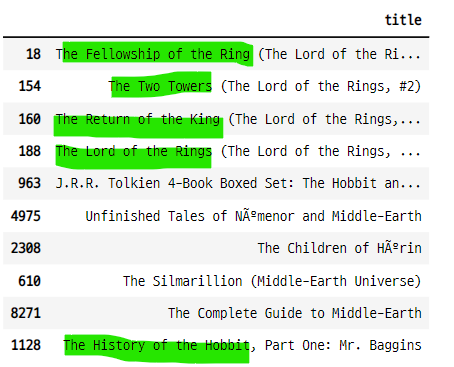

### 15. 태그 데이터로 유사도 측정

### 15-1. 북 데이터와 태그 데이터를 병합

```python
books_with_tags = pd.merge(books, tags_join_df, left_on="book_id",\
                           right_on="goodreads_book_id", how="inner")
books_with_tags.head(3)
```

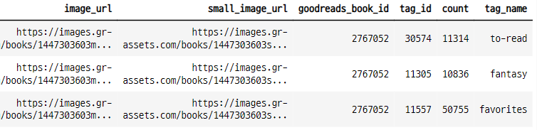


### 15-2. tag tfidf 측정
- 가중치 문서 희소행렬 계산

```python
tf_tag = TfidfVectorizer(analyzer="word", ngram_range=(1, 2),
                        min_df=0, stop_words="english")
tfidf_matrix_tag = tf_tag.fit_transform(books_with_tags["tag_name"].head(10000))
```

- 말뭉치 데이터의 길이 확인

```python
len(tf_tag.get_feature_names())

>>> print

1381
```

- 희소행렬의 크기 확인

```python
tfidf_matrix_tag.toarray().shape

>>> print

(10000, 1381)
```

### 15-3. 유사도 측정

```python
linear_kernel_sim = linear_kernel(tfidf_matrix_tag, tfidf_matrix_tag)

linear_kernel_sim.shape

>>> print

(10000, 10000)
```

### 15-4. 추천책을 반환하는 함수 생성

```python
titles2 = books["title"]
indices2 = pd.Series(books.index, index=books["title"])

def tag_recommendations(title) :
    ## 책이름-인덱스로 이루어진 시리즈 데이터에서 title의 인덱스 조회
    idx = indices[title]
    ## 유사도 행렬에서 title의 인덱스에 해당하는 데이터 조회하고 인덱스와 값을 list(tuple())로 저장
    sim_scores = list(enumerate(linear_kernel_sim[idx]))
    ## 유사도값이 큰 순서데로 데이터 정렬
    sim_scores = sorted(sim_scores, key=lambda x : x[1], reverse=True)
    ## 유사도 값이 높은 인덱스를 저장하고 제목을 조회
    sim_scores = sim_scores[1:11]
    book_indices = [i[0] for i in sim_scores]

    return titles.iloc[book_indices]
```

### 15-5. 태그 데이터로 측정한 유사 책

```python
sim_hobbit_tags =tag_recommendations("The Hobbit").head(15)
sim_hobbit_tags
```
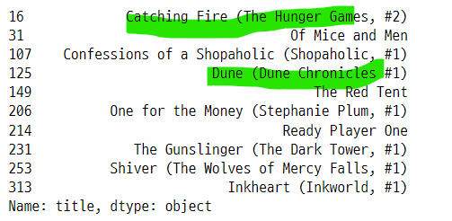


### 16. tag와 author로 Tfidf
- author 데이터와 tag 데이터를 합한 후 이 데이터로 유사한 책 추천

### 16-1. book_id로 그룹화
- book_id에 해당하는 tag 데이터를 하나로 합쳐준다.
    - (" ").join() 함수로 tag 데이터를 연결해준다.

```python
temp_df = books_with_tags.groupby("book_id")["tag_name"].apply(" ".join).reset_index()

temp_df.head(3)
```
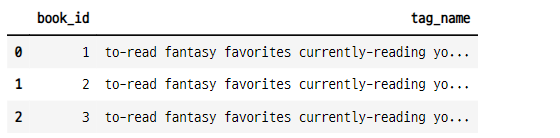

### 16-2. temp_df를 books에 병합 한다.
- books 는 10000개의 책에 대한 정보가 있다.
    - 한 개의 책에 모든 태가가 합쳐지 셀이 더 해진다.
- books_with_tags 는 하나의 책에 여러개의 태그가 행별로 연결되어 있다.

```python
books_2 = pd.merge(books, temp_df, left_on="book_id", right_on="book_id",
                  how="inner")

books_2.head()
```
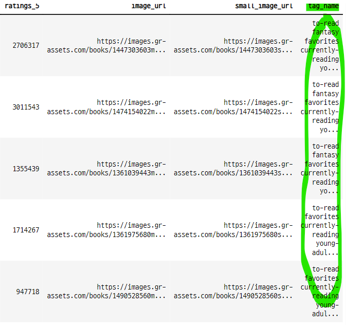

### 16-3. authors와 tag_name을 합쳐준다.
- 시리즈 데이터로 만든다.
    - authors와 tag_name 만 선택한다.
    - fillna("") : 공백을 "" 으로 채운다.
    - values : 데이터 값을 np.array()안에 author와 tag_name이 각각 str로 저장된다.
    - tolist() : np.array()를 벗긴다.
    - pd.Series() : authors와 tag_name이 연결된 값으로 이루어진 시리즈가 된다.
    - .str : str로 변환 한뒤
    - .join(" ") : authors와 tag_name을 공백으로 연결해준다.  

```python
books_2["corpus"] = (pd.Series(books_2[["authors", "tag_name"]]
                               .fillna("").values.tolist()).str.join(" "))

books_2["corpus"][:5]

>>> print

0    Suzanne Collins to-read fantasy favorites curr...
1    J.K. Rowling, Mary GrandPré to-read fantasy f...
2    Stephenie Meyer to-read fantasy favorites curr...
3    Harper Lee to-read favorites currently-reading...
4    F. Scott Fitzgerald to-read favorites currentl...
Name: corpus, dtype: object
```

- tolist() 명령어를 적용하면 시리즈 데이터의 np.array()가 리스트 데이터 타입으로 바뀐다.

```python
books_2[["authors", "tag_name"]].fillna("").values.tolist()[0]

>>> print

['Suzanne Collins',
 'to-read fantasy favorites currently-reading young-adult fiction books-i-own owned ya series favourites re-read adventure sci-fi-fantasy all-time-favorites default my-books reread i-own audiobook 5-stars favorite-books novels fantasy-sci-fi favorite audiobooks read-more-than-once my-library ya-fantasy teen english books ya-fiction my-favorites own-it library audio young-adult-fiction novel scifi-fantasy faves favorite-series shelfari-favorites kindle romance favourite to-buy read-in-2014 ebook contemporary 5-star coming-of-age favourite-books favs action read-in-2013 read-in-2011 finished ya-books borrowed sci-fi ya-lit loved love thriller science-fiction finished-series action-adventure scifi sf book-club speculative-fiction ebooks e-book read-in-2012 read-in-2010 survival future drama reviewed suspense dystopia dystopian post-apocalyptic read-2012 dystopias dystopian-fiction distopia distopian read-2011 teen-fiction 2012-reads futuristic ya-dystopian trilogy completed-series love-triangle suzanne-collins hunger-games the-hunger-games']
```

### 16-4. authors+tag_name 문장으로 tfidf 측정

```python
tf_corpus = TfidfVectorizer(analyzer="word", ngram_range=(1, 2), min_df=0, stop_words="english")
tfidf_matrix_corpus = tf_corpus.fit_transform(books_2["corpus"])
```

- 말뭉치 데이터의 길이

```python
tfidf_matrix_corpus = tf_corpus.fit_transform(books_2["corpus"])

>>> print

156464
```

- 희소행렬의 크기

```python
tfidf_matrix_corpus.toarray().shape

>>> print

(10000, 156464)
```

### 16-5. 유사도 측정

```python
linear_kernel_corpus = linear_kernel(tfidf_matrix_corpus, tfidf_matrix_corpus)

linear_kernel_corpus.shape

>>> print

(10000, 10000)
```

### 16-6. 추천 결과

```python
titles_3 = books["title"]
indices = pd.Series(books.index, index=books["title"])

def corpus_recommentation(title) :
    idx = indices[title]
    sim_scores = list(enumerate(linear_kernel_corpus[idx]))
    sim_scores = sorted(sim_scores, key=lambda x : x[1], reverse=True)
    sim_scores = sim_scores[1:11]
    book_indices = [i[0] for i in sim_scores]

    return titles_3.iloc[book_indices]

sim_hobbit_corpus = corpus_recommentation("The Hobbit")
sim_hobbit_corpus

>>> print

188     The Lord of the Rings (The Lord of the Rings, ...
154            The Two Towers (The Lord of the Rings, #2)
160     The Return of the King (The Lord of the Rings,...
18      The Fellowship of the Ring (The Lord of the Ri...
610              The Silmarillion (Middle-Earth Universe)
4975        Unfinished Tales of Númenor and Middle-Earth
2308                               The Children of Húrin
963     J.R.R. Tolkien 4-Book Boxed Set: The Hobbit an...
465                             The Hobbit: Graphic Novel
8271                   The Complete Guide to Middle-Earth
Name: title, dtype: object
```

### 16-7. author, tag, corpus 별 유사도 책 비교
- author, tag, author+tag 기준으로 구한 유사도로 추천한 책을 비교
    - author와 author+tag 기준 유사도로 추천한 책이 유사하다.
    - tag 유사도 기준으로 추천한 책은 다른 추천책들과 차이가 있다.

#### 유사한 책의 이름 비교

```python
sim_hobbi_df = pd.DataFrame(sim_hobbit_authors, columns=["title"]).reset_index()
sim_hobbi_df["title_2"] = sim_hobbit_tags.values
sim_hobbi_df["title_3"] = sim_hobbit_corpus.values
sim_hobbi_df = sim_hobbi_df[["title", "title_2", "title_3"]]
sim_hobbi_df.columns = ["sim_author", "sim_tag", "sim_author_tag"]
sim_hobbi_df
```
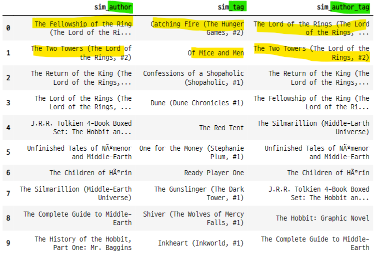


#### 유사한 책의 인덱스 비교

```python
sim_hobbit_df_idx = pd.DataFrame({"sim_author" : sim_hobbit_authors.index,
                                  "sim_tag" : sim_hobbit_tags.index,
                                  "sim_author_tag" : sim_hobbit_corpus.index},
                                 columns=["sim_author", "sim_tag", "sim_author_tag"])
sim_hobbit_df_idx
```
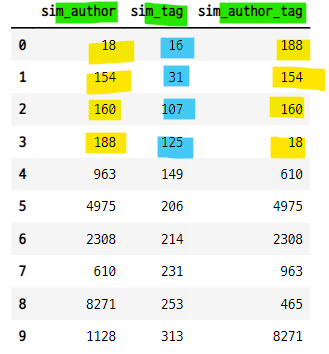

