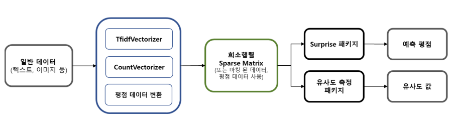

# study-recommendation
Description and Summary of the Recommendation

# Recommendation 요약
- **추천시스템은 user와 item 이라는 카테고리 독립변수와 rate 라는 실수형 종속변수를 토대로 평점을 예측하는 회귀모형을 따른다.**
- 예측 문제 풀이의 한 방식
    - 실수 데이터 : 회귀분석 : 가중치 계산
    - 카테고리 데이터 : 분류 : 조건부 확률 계산
    - **텍스트, 이미지, 평점 데이터 : 추천시스템 : 벡터의 유사도 계산**
- 데이터간의 유사성을 측정하여 유사한 결과물을 보여주는 방식
    - 데이터의 종류에 따라서 유사성을 측정하는 방법이 다름
- 텍스트 데이터
    - 텍스트를 전처리하여
    - 희소행렬화 하고 
        - TfidfVectorizer : 가중치 문서 희소행렬
        - CountVectorizer : 희소행렬
    - 벡터간의 거리를 계산(코사인 유사도 등)
        - from sklearn.metrics.pariwise import linear_kernel, cosine_similarity
- 이미지 데이터
    - 이미지를 전처리하여
    - 희소행렬화 하고
    - 벡터간의 거리를 계산(코사인 유사도 등)
- 평점 데이터
    - 유저와 아이템으로 이루어진 R 매트릭스
    - sklearn의 surprise 패키지를 사용
    - 유사도를 측정하는 다양한 방식
    - 베이스라인 모형, 이웃 협업 필터링, 잠재요인 필터링 등
    
#### 추천 시스템의 방법론
- 희소행렬(sparse matrix)을 surprise 패키지를 사용하거나 유사도 측정 패키지를 사용하여 유사값을 구한다. 
    - 일반 데이터는 tfidf, countvect를 사용하거나 평점 데이터를 만들어 희소행렬로 변환해준다.

    

## 1. surprise 패키지의 추천 모형

### 1-1. 베이스라인 모형 (Baseline Model)
- 예측 평점 측정 : 사용자 i의 아이템 i에 대한 예측 평점을 구한다.
    - 예측 평균값과 동일한 유저, 동일한 상품의 평점의 조정값을 더한다.
- 최적화 : 오차함수인 기존 평점과 예측 평점의 차이의 제곱의 합을  최적화한다.
- 정규화 : 예측 평점의 조정값에 대한 가중치 적용해 과최적화를 방지한다.

### 1-2. 협업 필터링 모형 (Collaborative Filtering Model)
- **평점 행렬(R Matrix)의 특정한 패턴을 찾아서 평점 예측에 사용하는 방법**
- 최근접 이웃 협업 필터링 (Neighborhood Models) : 아래의 기준에 따라 유사한 데이터를 찾고 이를 기반으로 평점 예측
    - 사용자 기반 (user based CF) : 사용자 P와 유사한 패턴의 평점을 준 다른 사용자를 찾고 이를 기반으로 평점 예측
    - 아이템 기반 (item based CF) : 아이템 Q와 유사한 패턴의 평점을 받은 다른 아이템을 찾고 이를 기반으로 평점 예측
- 잠재요인 모델 (Latent Factor Models) : 행렬의 수치적 특징을 벡터로 간략화 하는 방식(차원축소, PCA), 상품의 특성에 대한 사용자의 평점과 상품이 갖는 요소적 평점 벡터를 내적
    - 행렬 인수분해 모델 (MF : Matrix Factorization Models) : 모든 사용자, 상품에 대해 오차함수를 최소화하는 요인 벡터를 찾는 방식
    - 특잇값 분해 모델 (SVD : Singular Value Decomposition Models) : 행렬을 특이값 분해한 후 공분산행렬의 가장 큰 k개의 특이값을 사용하여 원래 행렬과 크기가 같고 원소가 유사한 새로운 특이행렬을 만드는 방식
        - SVD는 Spars 행렬인 평점 행렬에 적용하기 어렵다.
	- **SVD는 장르, 태그 등의 데이터에 사용할 수 있다.**

### 1-3. 음수 미포함 행렬분해 (NMF : Non-Negative Matrix Factorization Model)
- 음수를 포함하지 않는 행렬 X를 음수를 포함하지 않는 행렬 W와 H의 곱으로 분해하는 알고리즘

### 1-4. KNN 가중치 예측 방법
- **KNN (K Nearest Neighbors) 이웃 기반 협업 필터링 Neighborhood Filtering 방법의 가중치 예측 방법**
    - 평점을 구하고자 하는 사용자(또는 상품)의 유사도를 구한 뒤 유사도가 큰 k개의 사용자(또는 상품) 벡터를 사용하여 가중 평균을 구해서 가중치를 예측하는 방법
- KNNBasic : 평점들을 단순히 가중 평균하는 방식
- KNNWithMeans : 평점들을 평균값 기준으로 가중 평균하는 방식
- KNNBaseline : 평점들을 베이스라인 모형의 값 기준으로 가중 평균하는 방식

### 1-4. Python
- surprise.KNNBasic(sim_options)
- surprise.KNNWithMeans(sim_options)
- surprise.KNNBaseline(sim_options)
- surprise.SVD(n_epochs, n_factors)
- surprise.NMF(n_epochs, n_factors)

## 2. 유사도(simirarity)
- **최근접 이웃 협업 필터링 모델에서 사용**
    - 이웃 협업 모델은 유사한 사용자나 유사한 아이템에 대한 가중치를 적용하는 방식이다.
    - 어떤 사용자와 유사한 사용자들, 어떤 상품과 평점이 유사한 상품들을 찾기위해 유사도를 계산한다.

### 2-1. 유사도의 종류
- 평균제곱차이 유사도 (MSD : Mean Squared Difference Similarity)
    - 유클리드 공간에서 거리(벡터의 차이) 제곱에 비례하는 값
    - 사용자에 대한 msd, 아이템에 대한 msd 를 측정
- 코사인 유사도 (Cosine Similarity)
    - 두 특성 벡터의 각도에 대한 코사인 값
    - 두 벡터가 같은 방향을 가리킬 수록, 즉 닮을 수록 코사인 유사도 값은 1에 가까워진다.
    - 사용자 u와 v의 코사인 유사도
    - 아이템 i와 j의 코사인 유사도
- 피어슨 유사도 (Pearson Similarity)
    - 두 벡터의 상관계수(pearson correlation coefficient) 값을 의미한다.
    - 사용자 u와 v의 피어슨 유사도
    - 아이템 i와 j의 피어슨 유사도
- 피어슨-베이스라인 유사도 (Pearson-Baseline Similarity)
    - 피어슨 유사도와 같이 상관계수를 구하지만, 각 벡터의 기댓값을 단순 평균이 아니라 베이스라인 모형(Baseline Model)에서 예측한 값을 사용한는 방법
    - 사용자 u와 v의 msd (mean squared difference similarity)
    - 아이템 i와 j의 msd (mean squared difference similarity)
    - shrinkage 정규화 : 피어슨-베이스라인 유사도를 정규화 할 수 있다.

### 2-2. Python
- 딕셔너리에 유사도 값을 저장 후 이웃 협업 필터링 모델의 인수로 설정
- sim_options = {"name" : "msd"}
- surprise.KNNBasic(sim_options)

### 3. 추천성능 평가기준
- 루트오차제곱평균 (RMSE : Root Mean Squared Error) : 원래 평점과 예측 평점의 차이를 제곱한 후 테스트 데이터 셋으로 나눈 값에 루트 변환한다.
- 오차절대값평균 (MAE : Mean Absolute Error) : 원래 평점과 예측 평점의 차이에 절대값 적용한 후 테스트 데이터 셋으로 나눈 값
- 일치쌍의 비율 (FCP : Fraction of Concordant Paris) : i, j 번째 원래 평점과 i, j 번째 예측 평점의 증가방향이 같은 것의 갯수와 와 증가방향이 다른 것의 갯수의 비율

### 4. surprise 패키지 모델을 사용한 추천 시스템 요약
- 평점 데이터 사용
- 평점 데이터 임포트
 - Reader로 불러올 데이터 형식 설정
   - from surprise import Reader
   - Reader(line_format, sep, rating_scale)
- 인덱스와 헤더값이 없는 데이터 임포트
   - Dataset.load_file(file_path, reader)
- 데이터 프레임 임포트
   - Dataset.load_df(df[["col", "col"]], reader)
- 학습-검증 데이터 분리
   - from surprise.model_selection import train_test_split
- 모델 생성
   - 베이스라인, 협업필터링, 잠재요인 모델 등
   - algo = SVD(n_epochs, n_factors)
- 모델 학습
   - algo.fit(train_set)
- 모델 검증
   - algo.test(test_set)
- 모델 예측 : uid의 iid에 대한 예측 평점 반환
   - algo.predict(uid, iid)
- 모델 성능 측정
   - from surprise import accuracy
   - accuracy.rmse(predictions)
   - rmse, mae, fcp 성능 지표
- 교차검증 패키지 : KFold
   - from surprise.model_selection import cross_validate
   - cross_validate(algo, data, measures=[])
- 그리드 서치 패키지 : 모델의 가장 좋은 파라미터 선택
   - from surprise.model_selection import GridSearchCV
   - param_grid = {"n_epochs": [], "n_factors" : []}
   - gs = GridSearchCV(SVD, param_grid, measures, cv)
   - gs.fit(data)
   - gs.best_params["rmse"] : 성능 지표별 파라미터 반환
- 최적의 파라미터로 모델 생성, 학습, 예측

### 5. 코사인 유사도를 사용한 추천 시스템 요약
- 최근접 이웃 협업 필터링 : 아이템 기반으로 적용
- 데이터 전처리
- R 매트릭스 생성
    - 유저 아이디와 아이템 아이디로 이루어진 매트릭스
    - pivot_table("rating", index="userId", columns="itemId 또는 타이틀")
    - 또는 pivot_tabel(["user", "item"]).unstack()
- R 매트릭스가 희소행렬(sparse matrix)과 같은 역할을 한다.
- 유사도 측정
    - cosine_similarity(r_matrix, r_matrix)
- 유사도 값이 큰 순서로 인덱스 반환
- 인덱스에 해당하는 책 정보 반환

### 6. 희소행렬을 사용한 텍스트 데이터 유사도 추천 시스템
- 데이터 임포트
- 희소행렬 변환할 텍스트 데이터 컬럼의 전처리
    - author
    - tag
    - author + tag
- 희소행렬 생성 : tfidf_matrix, count_vect_matrix
   - count_vect 또는 tfidf 패키지 사용
   - count_vect : 0, 1 마킹, tfidf : 가중치 값 마킹
   - from sklearn.feature_extraction.text import TfidfVectorizer
   - from sklearn.feature_extraction.text import CountVectorizer
- 유사도 측정
    - 여러가지 유사도 측정 패키지 중 적절한 것을 선택하여 측정한다.
    - form sklearn.metrics.pairwise import (cosine_similarity, linear_kernel)
    - linear_kernel(tfidf_matrix, tfidf_matrix)
- 유사도 값의 크기에 따른 인덱스 반환
    - sim_scores = list(enumerate())
    - sorted(sim_scores, key=lambda x: x[1], reverse=True)
- 인덱스에 해당하는 책의 정보 반환

