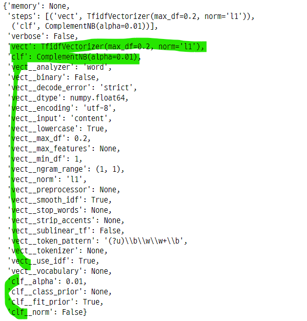
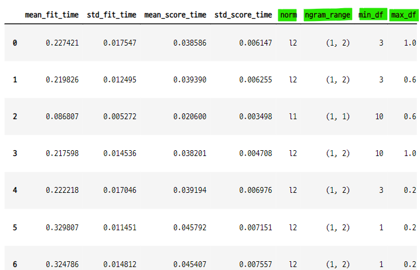
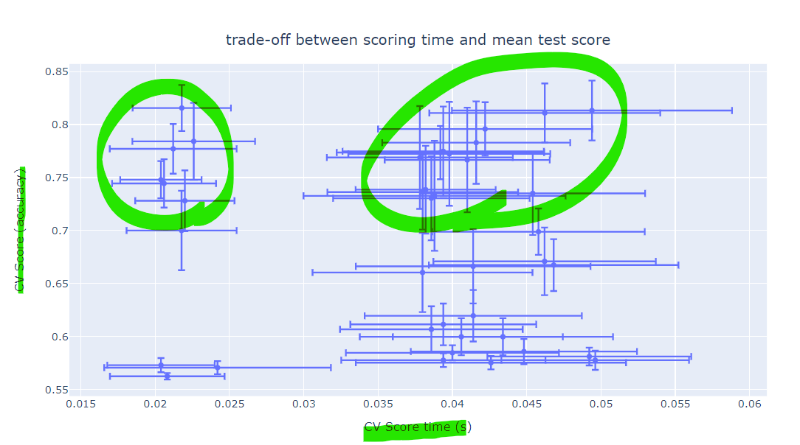
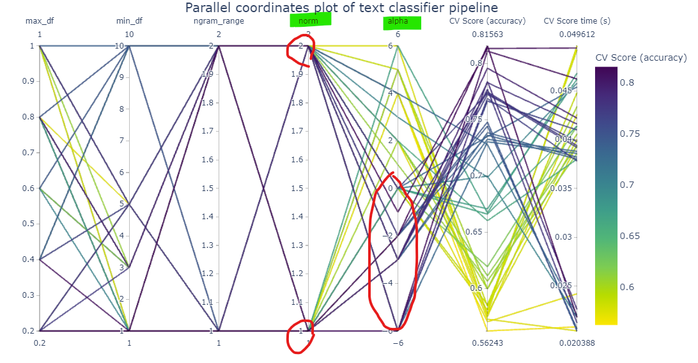

# RandomSearchCV를 사용한 하이퍼파라미터 튜닝 및 시각화
- 파이프라인을 사용한 텍스트 분류의 과정에서 하이퍼파라미터 튜닝을 시각화 할 수 있다.
- RandomizedSearchCV : vect와 clf 분류기의 하이퍼파라미터를 조정할 수 있다.
    - 하이퍼파라미터의 조합을 제어할 수 있다.
    
### 과정
- 데이터 임포트
- 파이프라인 생성
    - **pipeline = Pipeline()**
- 하이퍼파리미터 그리드 생성
    - **parameter_grid = {}**
    - random search cv에서 사용
- RandomizedSearchCV 설정
    - **random_search = RandmoizedSearchCV()**
    - estimator=pipeline : 파이프라인 연결
    - param_distributions=parameter_grid : 하이퍼파라미터 그리드
    - n_iter : 조합의 반복수
    - n_jobs : CPU 병렬 연결 수, 계산 시간과 관련있음
    - random_state : 난수 발생값
    - verbose : 피팅 설명 출력
- 하이퍼파라미터 튜닝
    - **random_search.fit(data_train.data, data_train.target)**
- 튜닝 결과 확인
    - **random_search.best_estimator_.get_params()** : 최적의 parameter 값 반환
    - vect와 clf의 여러가지 파라미터 값이 출력된다.
    - 하이퍼파라미터 그리드에서 설정하지 않은 파라미터는 디폴트 값
- 성능 측정
    - **accuracy = random_search.score(data_test.data, data_test.target)**
    - 검증 데이터를 사용하여 정확도 측정
    - 훈련 데이터를 사용한 정확도는 **random_search.best_score_** 에 저장되어 있음
- 성능 결과 데이터 프레임으로 변환
    - 모든 성능 측정 결과는 **random_search.cv_results_** 에 저장되어 있음
    - **pd.DataFrame(random_search.cv_results_)**
    - 데이터 프레임의 컬럼은 파라미터 이름으로 되어 있으므로, 긴 컬럼은 정리를 하여 가독성을 높여준다.
    - **param_name.rsplit("__", 1)[1]**
- 측정시간-성능값 그래프
    - plotly를 사용하여 오차막대 그래프로 시각화
    - x축 : 측정시간, y축 : 성능값
    - 측정시간과 성능값으로 이루어진 클러스터를 찾을 수 있다.
    - **px.scatter()**
- 하이퍼파라미터 조합의 병렬좌표플롯
    - plotly를 사용하여 하이퍼파라미터간의 조합에 따른 성능 변화를 시각화
    - 어떤 파라미터가 성능에 영향을 주는지 파악할 수 있다.
    - **px.parallel_coordinates()**


### 1. 데이터 임포트
- 20news groups 데이터 사용
    - categoreis 인수 설정하여 원하는 특징 벡터만 선택가능
    - test set, train set 을 각각 다른 변수에 저장

```python
from sklearn.datasets import fetch_20newsgroups

categories = ["alt.atheism", "talk.religion.misc"]

data_train = fetch_20newsgroups(
    subset="train", categories=categories, shuffle=True,
    random_state=42, remove=("headers", "footers", "quotes"))

data_test = fetch_20newsgroups(
    subset="test", categories=categories, shuffle=True,
    random_state=42, remove=("header", "footer", "quotes"))

print(f"Loading 20 newsgroups datasets for {len(data_train.target_names)} categories :")
print(data_train.target_names)
print(f"{len(data_train.data)} documents")

>>> print

Loading 20 newsgroups datasets for 2 categories :
['alt.atheism', 'talk.religion.misc']
857 documents
```

### 2. 하이퍼파라미터 튜닝을 위한 파이프라인 생성
- TfidfVectorizer : text feature vectorizer : 텍스트 특징 벡터화기
- ComplementNB : 분류기
- Pipeline : 파이프라인

```python
from sklearn.feature_extraction.text import TfidfVectorizer
from sklearn.naive_bayes import ComplementNB
from sklearn.pipeline import Pipeline

pipeline = Pipeline(
    [
        ("vect", TfidfVectorizer()),
        ("clf", ComplementNB()),
    ]
)
pipeline

>>> print

Pipeline(steps=[('vect', TfidfVectorizer()), ('clf', ComplementNB())])
```

### 3. 하이퍼파라미터의 그리드 설정
- RandomizedSearchCV의 param_distributions 인수에 사용할 설정값
- 하이퍼 파라미터 튜닝 특징
    - RandomizedSearchCV : 무작위 조합의 수를 제어한다. 
    - GridSearchCV : 계산 비용이 많이 든다. 모든 조합을 탐색한다.
- n_iter : 무작위 조합 수 제어 인수
    - 그리드에서 가능한 조합의 수보다 클 경우 이미 탐색한 조합을 반복한다.
- pipeline의 vect와 clf의 최상의 매개변수 조합을 조회한다.    

```python
parameter_grid = {
    "vect__max_df" : (0.2, 0.4, 0.6, 0.8, 1.0),
    "vect__min_df" : (1, 3, 5, 10),
    "vect__ngram_range" : ((1, 1), (1, 2)), #unigram or bigram
    "vect__norm" : ("l1", "l2"),
    "clf__alpha" : np.logspace(-6, 6, 13)
}

parameter_grid

>>> print

{'vect__max_df': (0.2, 0.4, 0.6, 0.8, 1.0),
 'vect__min_df': (1, 3, 5, 10),
 'vect__ngram_range': ((1, 1), (1, 2)),
 'vect__norm': ('l1', 'l2'),
 'clf__alpha': array([1.e-06, 1.e-05, 1.e-04, 1.e-03, 1.e-02, 1.e-01, 1.e+00, 1.e+01, 1.e+02, 1.e+03, 1.e+04, 1.e+05, 1.e+06])}
```


### 4. RandomizedSearchCV 설정
- n_iter : 설정에 따라서 조합의 제어가 달라진다.
    - 불필요한 조합은 제거한다는 의미인 것 같다.
- n_jobs : 계산량 증가를 낮추기위해 CPU를 병렬화하여 사용하도록 설정 할 수 있다.    

```python
from pprint import pprint
from sklearn.model_selection import RandomizedSearchCV

random_search = RandomizedSearchCV(
    estimator=pipeline, # vect : tfidf, clf : complementNB
    param_distributions=parameter_grid,
    n_iter=40,
    random_state=0,
    n_jobs=2,
    verbose=1
)

random_search

print("Perfoming grid search...")
print("Hyperparameters to be evaluated : ")
pprint(parameter_grid)

>>> print

Perfoming grid search...
Hyperparameters to be evaluated :
{'clf__alpha': array([1.e-06, 1.e-05, 1.e-04, 1.e-03, 1.e-02, 1.e-01, 1.e+00, 1.e+01, 1.e+02, 1.e+03, 1.e+04, 1.e+05, 1.e+06]),
 'vect__max_df': (0.2, 0.4, 0.6, 0.8, 1.0),
 'vect__min_df': (1, 3, 5, 10),
 'vect__ngram_range': ((1, 1), (1, 2)),
 'vect__norm': ('l1', 'l2')}
```

### 5. 하이퍼 파라미터 튜닝
- RandomizedSearchCV
    - estimator=pipeline : vect와 clf 모형 객체 연결
    - param_distributions=parameter_grid : 모형의 파라미터 값 탐색

```python
from time import time

t0 = time()
random_search.fit(data_train.data, data_train.target)
print(f"Done in {time() - t0:.3f}s")

>>> print

Fitting 5 folds for each of 40 candidates, totalling 200 fits
Done in 27.184s
```

### 5-1. 튜닝 결과값 확인
- best_estimators_.get_params()에는 dict안에 vect와 clf의 여러가지 하이퍼 파라미터 값이 저장 되어 있다.
- dict의 key 값을 사용하여 parameter_grid에 해당하는 파라미터 값을 반환한다.

```python
best_parameters = random_search.best_estimator_.get_params()
best_parameters
```


- best parameter 조회

```python
print("Best parameters combination found : ")
for param_name in sorted(parameter_grid.keys()) :
    print(f"{param_name} : {best_parameters[param_name]}")

>>> print

Best parameters combination found :
clf__alpha : 0.01
vect__max_df : 0.2
vect__min_df : 1
vect__ngram_range : (1, 1)
vect__norm : l1
```

### 6. 성능 측정
- random_search의 score() 매서드 사용하여 accuracy 값을 측정할 수 있다.
- 검증 데이터 사용

```python
test_accuracy = random_search.score(data_test.data, data_test.target)
test_accuracy

>>> print

0.7385964912280701
```

- train, test score 조회

```python
print("Accuracy of the best parameters using the inner CV of the random search : {:.3f}".format(random_search.best_score_))
print("Accuracy on test set : {:.3f}".format(test_accuracy))

>>> print

Accuracy of the best parameters using the inner CV of the random search : 0.816
Accuracy on test set : 0.739

## f 문자열의 다른 사용방식

print("Accuracy of the best parameters using the inner CV of "
      f"the random search : {random_search.best_score_ : .3f}")
print(f"Accuracy on test set : {test_accuracy : .3f}")

>>> print

Accuracy of the best parameters using the inner CV of the random search :  0.816
Accuracy on test set :  0.739
```
### 7. 데이터 프레임 생성을 위한 튜닝 된 하이퍼파라미터의 이름 변경
- 컬럼으로 사용할 파라미터 이름 앞의 vect와 clf를 제거해도 상관없다.
    - 가독성을 위해서 제거
- 파라미터 튜닝 결과를 데이터 프레임으로 변환
- rename의 인수로 이름 변환 함수를 넣는다.
- 이름 변환 함수에서 rsplit() 명령어를 사용하여 간단하게 컬럼명을 구분지을 수 있다.

#### rsplit 명령어를 사용한 이름 변환 함수 생성

```python
def shorten_param(param_name) :
    """Remove components prefixes in param_name."""
    if "__" in param_name :
        return param_name.rsplit("__", 1)[1]

    return param_name
```
#### 데이터 프레임 생성 후 컬럼 이름 변경에 함수 적용

```python
cv_results = pd.DataFrame(random_search.cv_results_)
cv_results = cv_results.rename(shorten_param, axis=1)
cv_results
```


#### cv results의 내용
- radnomizedsearchcv의 결과값이 들어 있다.

```python
{'mean_fit_time': array([0.22742147, 0.21982579, 0.08680677, 0.21759787, 0.22221813,
        0.32980714, 0.32478633, 0.22721715, 0.21642385, 0.21521187,
        0.21740341, 0.21720405, 0.22261415, 0.10020971, 0.2182076 ,
        0.22759438, 0.09021926, 0.10280228, 0.23600974, 0.32659044,
        0.10240326, 0.22440977, 0.32779346, 0.21762042, 0.09862938,
        0.34258099, 0.33779683, 0.34057326, 0.08981357, 0.09957824,
        0.23260531, 0.22879543, 0.33599329, 0.23439436, 0.09220729,
        0.09820023, 0.23040476, 0.23879161, 0.23241048, 0.33480043]),
 'std_fit_time': array([0.01754682, 0.01249539, 0.00527153, 0.01453608, 0.01704623,
        0.01145056, 0.01481237, 0.00991886, 0.0107595 , 0.01316205,
        0.01063186, 0.01059675, 0.0096899 , 0.00570122, 0.01504112,
        0.01451331, 0.00402055, 0.01087122, 0.01964806, 0.01987564,
        0.00342271, 0.00704833, 0.01413574, 0.01013777, 0.0043053 ,
	(...)
 'std_test_score': array([0.02170946, 0.01966042, 0.02280702, 0.04141504, 0.02519725,
        0.02185207, 0.0391924 , 0.00643639, 0.04904124, 0.05189316,
        0.04850168, 0.03741855, 0.01746987, 0.02173863, 0.03542621,
        0.02524376, 0.00666797, 0.00618019, 0.0350768 , 0.01186088,
        0.03629456, 0.04938434, 0.03192696, 0.03958563, 0.03748169,
        0.0083943 , 0.02447775, 0.00908977, 0.01756248, 0.02348092,
        0.04223432, 0.00707168, 0.02787646, 0.01746987, 0.02866437,
        0.00303588, 0.02428689, 0.00630756, 0.03887462, 0.02826089]),
 'rank_test_score': array([29, 28, 14, 15,  9, 22, 17, 35, 10, 18, 11, 26, 30,  1, 16,  4, 38,
        39, 25, 32,  5, 12, 23, 19, 21, 34, 24, 35, 13,  7,  8, 33,  3, 30,
        20, 40, 27, 37,  6,  2])}	
```

#### rsplit() 테스트
- **rsplit("__", 1)**
    - 오른쪽에서부터 1번째 있는 **__**을 기준으로 구분해준다.
    - 구분자는 반환되지 않는다.

```python
test_name = "param_vect__analyzer"
test_name

>>> print

'param_vect__analyzer'
```

- 오른쪽에서 첫번쨰 **__**을 기준으로 구분

```python
test_name.rsplit("__", 1)

>>> print

['param_vect', 'analyzer']
```
- 오른쪽에서 a를 찾아서 2개까지 구분

```python
test_name.rsplit("a", 2)

>>> print

['param_vect__', 'n', 'lyzer']
```

### 8. 측정 시간과 측정 성능값을 시각화
- 오차 막대를 사용하여 측정시간, 성능값의 클러스터를 알 수 있다.
- plotly 사용
    - 그래프 위에 커서를 대면 정보를 확인할 수 있다.    
- 그래프의 왼쪽 상단의 클러스가 최상의 트레이드 오프 결과값이다.
    - 시간이 짧고 score 값이 높음
- 하이퍼 파라미터 중 ngram_range의 값을 bigram으로 설정하면 정확도가 줄고, 시간이 늘어난다.    

#### 파라미터 그리드의 key값의 이름 전처리
- 이름 변환함수를 사용하여 **vect__** 이것을 제거한다.

```python
param_names = [shorten_param(name) for name in parameter_grid.keys()]
param_names

>>> print

['max_df', 'min_df', 'ngram_range', 'norm', 'alpha']
```

#### plotly로 그래프 생성

```python
import plotly.express as px

labels = {
    "mean_score_time" : "CV Score time (s)",
    "mean_test_score" : "CV Score (accuracy)"
}

## 오차 막대 : error_x : x 값의 표준편차, error_y : y값의 표준편차
## hover_data : 표시할 데이터의 이름
## labels : x, y축 라벨
fig = px.scatter(cv_results, x="mean_score_time", y="mean_test_score",
                error_x="std_score_time", error_y="std_test_score",
                hover_data=param_names, labels=labels)

## 제목 설정
fig.update_layout(
    title={
        "text" : "trade-off between scoring time and mean test score",
        "y" : 0.95,
        "x" : 0.5,
        "xanchor" : "center",
        "yanchor" : "top"}
)

fig
```



### 9. 하이퍼파라미터 조합의 성능 측정 시각화 : 병렬좌표플롯
- px.parallel_coordinates : 평균 테스트 점수를 조정된 하이퍼파라미터의 함수로 시각화 할 수 있다.
    - 2개 이상의 하이퍼파라미터 간의 상호 작용을 찾는데 도움을 준다.
    - 파이프라인의 성능 향상을 위한 관련성에 직관적 데이터를 제공해 준다.
- 여러가지 하이퍼파라미터 값들의 조합을 시각화하여 어떤 조합이 성능값이 높은지를 나타내준다.
    - 위의 오차 막대 그래프와 비교해보면, 측정 시간이 짧고 성능값이 높은 클러스터와 측정 시간이 길고 성능값이 높은 클러스터를 볼 수 있다.
- 성능이 크게 바뀌는 지점의 하이퍼파라미터
    - "vect__norm" : ("l1", "l2") : l2 에서 성능이 높아진다.
    - "clf__alpha" : np.logspace(-6, 6, 13) : alpha 값이 작을 수록 성능이 높아진다.
- 모델의 복잡성의 증가와 정규화의 필요성에 대해서 알 수 있다.    

#### 컬럼 추가

```python
column_results = param_names + ["mean_test_score", "mean_score_time"]
column_results

>>> print

['max_df',
 'min_df',
 'ngram_range',
 'norm',
 'alpha',
 'mean_test_score',
 'mean_score_time']
```

### 9-1. dict의 value에 함수 설정
- `dict.fromkeys(iterable, value=None)`
    - 새로운 딕셔너리를 만들어주는 클래스 매서드.
    - **iterable로 키를 만들고, value로 모든 값을 설정해준다.**
    - value에 lambda와 같은 함수를 넣어서 값을 일괄적으로 만들 수 있다.
    - https://docs.python.org/ko/3/library/stdtypes.html?highlight=dict%20fromkeys#dict.fromkeys
- 리스트에 key 이름을 저장하여 dict.fromkeys()의 인수로 넣으면 key값이 된다.
- key 값에 해당하는 값을 저장할 때 람다 함수를 거친다.
    - 람다 함수에서 특정한 값을 선택하거나
    - 조건문을 설정하여 값을 변환할 수 있다.
- apply() 함수안에 넣어서 사용할 수 있다.
    - cv_results[column_results].apply(transform_funcs)

```python
transform_funcs = dict.fromkeys(column_results, lambda x : x)
transform_funcs

>>> print

{'max_df': <function __main__.<lambda>(x)>,
 'min_df': <function __main__.<lambda>(x)>,
 'ngram_range': <function __main__.<lambda>(x)>,
 'norm': <function __main__.<lambda>(x)>,
 'alpha': <function __main__.<lambda>(x)>,
 'mean_test_score': <function __main__.<lambda>(x)>,
 'mean_score_time': <function __main__.<lambda>(x)>}

## value 값을 설정하지 않으면 None 값이 저장된다.
dict.fromkeys(column_results)

>>> print

{'max_df': None,
 'min_df': None,
 'ngram_range': None,
 'norm': None,
 'alpha': None,
 'mean_test_score': None,
 'mean_score_time': None}
```

- clf의 alpha 인수의 dict 값 설정

```python
import math

transform_funcs["alpha"] = math.log10
transform_funcs

>>> print

{'max_df': <function __main__.<lambda>(x)>,
 'min_df': <function __main__.<lambda>(x)>,
 'ngram_range': <function __main__.<lambda>(x)>,
 'norm': <function __main__.<lambda>(x)>,
 'alpha': <function math.log10(x, /)>,
 'mean_test_score': <function __main__.<lambda>(x)>,
 'mean_score_time': <function __main__.<lambda>(x)>}
```

- vect의 norm (정규화) 인수의 dict 값 설정
    - norm 의 값은 l1, l2로 설정함
    - l을 제거하는 함수

```python
transform_funcs["norm"] = lambda x : 2 if x == "l2" else 1
transform_funcs

>>> print

{'max_df': <function __main__.<lambda>(x)>,
 'min_df': <function __main__.<lambda>(x)>,
 'ngram_range': <function __main__.<lambda>(x)>,
 'norm': <function __main__.<lambda>(x)>,
 'alpha': <function math.log10(x, /)>,
 'mean_test_score': <function __main__.<lambda>(x)>,
 'mean_score_time': <function __main__.<lambda>(x)>}
```

- vect의 ngram_range dict 값 설정
    - ngram_range는 (1, 1), (1, 2)로 설정함
    - 1, 2가 반환되도록 하는 함수

```python
transform_funcs["ngram_range"] = lambda x : x[1]
transform_funcs

>>> print

{'max_df': <function __main__.<lambda>(x)>,
 'min_df': <function __main__.<lambda>(x)>,
 'ngram_range': <function __main__.<lambda>(x)>,
 'norm': <function __main__.<lambda>(x)>,
 'alpha': <function math.log10(x, /)>,
 'mean_test_score': <function __main__.<lambda>(x)>,
 'mean_score_time': <function __main__.<lambda>(x)>}
```

#### 병렬좌표플롯
- 컬럼을 누르면 좌우로 넓이를 조절할 수 있다.

```python
fig = px.parallel_coordinates(
    cv_results[column_results].apply(transform_funcs),
    color="mean_test_score",
    color_continuous_scale=px.colors.sequential.Viridis_r,
    labels=labels
)

fig.update_layout(
    title={
        "text" : "Parallel coordinates plot of text classifier pipeline",
        "y" : 0.99,
        "x" : 0.5,
        "xanchor" : "center",
        "yanchor" : "top"
    }
)

fig
```


