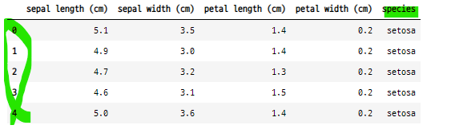

# 분류용 예제 데이터
- scikit-learn 패키지의 분류용 예제 데이터들
    - 분류 모형에 대한 기초적인 공부

### 순서
- 1) 데이터 임포트
    - 데이터의 속성값 확인
    - 어떤 값에 특징값이 들어있고, 어떤값에 종속값이 들어있는지 확인
- 2) pandas DataFrame으로 변환
    - 카테고리값을 가진 종속값을 pd.Series로 카테고리 자료형으로 변경해준다.
- 3) 데이터 구조 확인
    - 데이터의 구조 : shape, size, len, type, describe, info 등
    - 특징값과 종속값의 특징 : unique, nunique, min, max, mean, std 등
        - 특징값이 실수인지, 카테고리값인지 확인
        - 카테고리값이면 자료형 변경 : astype("category")
- 4) 특징값간의 상관관계
    - sns.pairplot(df, hue="class")
    - **vars=[특징값1, 특징값2, ...] : 특징값의 이름을 직접입력, 이때는 data=df 인수를 넣어줘야 한다.**
    - hue : 종속값, 카테고리값
- 5) 특징값의 분포도
    - sns.distplot(특징값, hist=True, rug=True, data=df)
    - 하나의 plot에 여러개 분포도 그리기 가능
- 6) 특징벡터의 이진 카테고리값과 클래스 값의 비교
    - 이진 카테고리 값인 경우, 0과 1에 해당하는 클래스의 갯수 확인
    - pivot_table()을 만든 후
        - count = df.pivot_table(index="target", columns="col_name", aggfunc="size")
    - sns.heatmap()으로 확인
        - sns.heatmap(count, cmap=sns.light_palette("gray", as_cmap=True),
                      annot=True, fmt="0")
- 7) 텍스트 데이터
    - plt.spy(데이터, markersize=1)
- 8) 이미지 데이터
    - imshow(데이터, cmap=plt.cm.bone)

## 1. 붓꽃 데이터
- 통계학자 피셔의 붓꽃 분류 연구에 기반한 데이터

### 1-1. 데이터 임포트

```python
from sklearn.datasets import load_iris
iris = load_iris()
print(iris.DESCR)
```


### 1-2. 데이터의 속성들
- 독립변수

```python
iris.data

>>> print

array([[5.1, 3.5, 1.4, 0.2],
       [4.9, 3. , 1.4, 0.2],
       [4.7, 3.2, 1.3, 0.2],
       [4.6, 3.1, 1.5, 0.2],
       [5. , 3.6, 1.4, 0.2],
       [5.4, 3.9, 1.7, 0.4],
       [4.6, 3.4, 1.4, 0.3],
       [5. , 3.4, 1.5, 0.2],
       [4.4, 2.9, 1.4, 0.2],
       [4.9, 3.1, 1.5, 0.1],
       ...])
```

- 독립변수의 컬럼 이름

```python
iris.feature_names

>>> print

['sepal length (cm)',
 'sepal width (cm)',
 'petal length (cm)',
 'petal width (cm)']
```

- 카테고리 종속값

```python
iris.target

>>> print

array([0, 0, 0, 0, 0, 0, 0, 0, 0, 0, 0, 0, 0, 0, 0, 0, 0, 0, 0, 0, 0, 0,
       0, 0, 0, 0, 0, 0, 0, 0, 0, 0, 0, 0, 0, 0, 0, 0, 0, 0, 0, 0, 0, 0,
       0, 0, 0, 0, 0, 0, 1, 1, 1, 1, 1, 1, 1, 1, 1, 1, 1, 1, 1, 1, 1, 1,
       1, 1, 1, 1, 1, 1, 1, 1, 1, 1, 1, 1, 1, 1, 1, 1, 1, 1, 1, 1, 1, 1,
       1, 1, 1, 1, 1, 1, 1, 1, 1, 1, 1, 1, 2, 2, 2, 2, 2, 2, 2, 2, 2, 2,
       2, 2, 2, 2, 2, 2, 2, 2, 2, 2, 2, 2, 2, 2, 2, 2, 2, 2, 2, 2, 2, 2,
       2, 2, 2, 2, 2, 2, 2, 2, 2, 2, 2, 2, 2, 2, 2, 2, 2, 2])
```

- 카테고리 종속값의 문자열

```python
iris.target_names

>>> print

array(['setosa', 'versicolor', 'virginica'], dtype='<U10')
```

### 1-3. 판다스 데이터 프레임으로 변환
- 카테고리값 0, 1, 2와 품종의 이름을 시리즈를 사용하여 변환할 수 있다.

```python
df = pd.DataFrame(iris.data, columns=iris.feature_names)
sy = pd.Series(iris.target, dtype="category")
sy = sy.cat.rename_categories(iris.target_names)
df["species"] = sy
df.tail()
```


#### 함수를 사용하여 target을 target_names으로 변환
- agg(lambda) 를 사용
    - 특징벡터 하나를 사용할거면 axis=1로 설정해줘야 한다.
    - axis=0이면 모든 특징벡터의 한 행이 적용된다.

```python
def target_names(x) :
    if x == 0 :
        return "setosa"
    elif x == 1:
        return "versicolor"
    else :
        return "virginica"

iris_df = pd.DataFrame(iris.data, columns=iris.feature_names)
iris_df["species"] = iris.target
iris_df["species"] = iris_df.agg(lambda x : target_names(x.species), axis=1)
iris_df.head()	
```



### 1-4. 특징값의 분포와 상관관계
- 꽃잎의 길이 petal_length 값 만으로도 setosa 종을 다른 종들과 분류할 수 있다.
- 다른 특징값들로는 종을 구분하기 어렵다.

```python
%matplotlib inline

sns.pairplot(df, hue="species")
plt.show() ;
```


#### 종별 꽃잎의 길이 분포
- setosa와 다른 두 종의 꽃잎의 길이 분포

```python
plt.figure(figsize=(7, 5))

## 베르시칼라와 버지니카 종의 분포
sns.distplot(df[df.species != "setosa"]["petal length (cm)"], hist=True, rug=True,
            label="others")
## 세토사 종의 분포
sns.distplot(df[df.species == "setosa"]["petal length (cm)"], hist=True, rug=True,
            label="setosa")
plt.legend()
plt.show() ;
```


### 1-5. 연습문제 1
- 꽃잎 길이의 기준값 (others)이 얼마이면 세토사와 다른종을 완벽하게 구분할 수 있는가?
    - 꽃잎 길이가 1.9이면 세토사와 다른 품종들간의 구분이 가능하다.

#### 각 품종별 min, max값을 확인한다.
- 구분되는 지점을 찾는다.

```python
df[df["species"]=="setosa"]["petal length (cm)"].max()

>>> print

1.9
```
- groupby()를 사용하여 각 품종별 경계선 확인

```python
df.groupby("species")["petal length (cm)"].describe()
```


```python
df.groupby("species")["petal length (cm)"].describe()[["min", "max"]]
```


#### 베르시칼라와 버지니카 품종의 꽃잎 길이 분포
- 꽃잎의 길이를 기준값으로 두 종을 정확하게 분류하기 어렵다.
    - 두 종의 꽃잎 길이이의 범위가 겹치기 때문이다.

```python
plt.figure(figsize=(7, 5))

sns.distplot(df[df.species == "virginica"]["petal length (cm)"], hist=True, rug=True,
            label="virginica")

sns.distplot(df[df.species == "versicolor"]["petal length (cm)"], hist=True, rug=True, label="versicolor")

plt.legend()
plt.show() ;
```


### 1-6. 연습문제 2
- 가장 적합한 꽃잎 길이의 기준값(thresh)을 생각하라. 이 값을 이용하여 베르시칼라와 버지니카를 분류하라.
- 위 방법에 따라서 분류하였을 때 잘못 분류된 표본의 갯수는 몇개인가?

#### 꽃잎의 길이를 베르시칼라의 종의 가장 큰 길이를 하면?
- 베르시칼라 종의 가장 큰 꽃잎 길이 5.1을 기준값으로 두 종을 분류하면
    - 버지니카 종의 16개가 베르시칼라 종으로 잘 못 분류될 수 있다.
- 버지니카 종의 가장 작은 꽃잎 길이 4.5를 기준값으로 두 종을 분류하면
    - 베르시칼라 종의 21개가 버지니카 종으로 잘 못 분류될 수 있다.
- **즉 꽃잎의 길이를 기준값을 한다면 세토사 품종은 완전히 분류되지만, 베르시칼라와 버지니카 품종은 완전히 분류되지 않는다.**

```python
df[df.species=="versicolor"]["petal length (cm)"].max()

>>> print

5.1
```

#### 버지니카 품종 중 꽃잎의 길이가 5.1보다 작은 것의 갯수

```python
len(df[(df["petal length (cm)"] <= 5.1) & (df["species"]=="virginica")])

>>> print

16
```

- 버지니카 품종의 꽃잎의 길이 가장 작은 값

```python
df[df.species=="virginica"]["petal length (cm)"].min()

>>> 4.5
```

#### 베르시칼라 품종 중 꽃잎의 길이가 4.5보다 큰 것의 갯수

```python
len(df[(df["petal length (cm)"] >= 4.5) & (df["species"]=="versicolor")])

>>> 21
```
## 2. 와인데이터
- 와인의 화학 조성을 사용하여 와인의 종류를 예측하기 위한 데이터
- 종속값이 카테고리값(범주형값)으로 이루어져 있다.
    - class_0, class_1, class_2

### 2-1. 데이터 임포트

## 2. 와인데이터
- 와인의 화학 조성을 사용하여 와인의 종류를 예측하기 위한 데이터
- 종속값이 카테고리값(범주형값)으로 이루어져 있다.
    - class_0, class_1, class_2

```python
from sklearn.datasets import load_wine
wine = load_wine()
print(wine.DESCR)    
```


### 2-2. 판다스 데이터프레임으로 변환

```python
wine_df = pd.DataFrame(wine.data, columns=wine.feature_names)
sy = pd.Series(wine.target, dtype="category")
sy = sy.cat.rename_categories(wine.target_names)
wine_df["class"] = sy
wine_df.head()
```


### 2-3. 일부 컬럼별 상관관계 확인

```python
sns.pairplot(vars=["alcohol", "alcalinity_of_ash", "total_phenols", "flavanoids"],
            hue="class", data=wine_df)
plt.show() ;
```


### 2-4. 연습문제 3
- 이 시각화 결과에서 어떤 특징값을 사용하면 두 개의 클래스를 완벽하게 구분할 수 있다는 것을 알 수 있다.
- 특징값과 클래스?

#### class_0와 class_2의 flavanoids 특징값 분포도
- class_0와 class_2의 falvanoids 특징값은 겹치는 부분이 없다.
- **즉 flavanoids 특징값을 기준값으로 사용하면, class_0와 class_2 는 구분이 가능하다.**

```python
plt.figure(figsize=(8, 6))

sns.distplot(wine_df[wine_df["class"]=="class_0"]["flavanoids"], hist=True, rug=True,
            label="class_0")

sns.distplot(wine_df[wine_df["class"]=="class_2"]["flavanoids"], hist=True, rug=True,
            label="class_1")
plt.legend()
plt.show() ;
```


#### class_2의 flavanoids 값 중 가장 큰 값

```python
wine_df[wine_df["class"]=="class_2"]["flavanoids"].max()

>>> print

1.57
```

#### class_0의 flavanoids 값 중 가장 작은 값

```python
wine_df[wine_df["class"]=="class_0"]["flavanoids"].min()

>>> print

2.19
```

#### class_1의 flavanoids 값의 작은값과 큰 값
- class_1의 flavanoids 값의 범위는 매우 넓다.

```python
wine_df[wine_df["class"]=="class_1"]["flavanoids"].agg(["min", "max"])

>>> print

min    0.57
max    5.08
Name: flavanoids, dtype: float64
```

## 3. 유방암 진단 데이터
- 유방암 진단 데이터
    - 유방암 진단 사진으로부터 측정한 종양(tumar)의 특징값을 사용하여 종양의 양성(benign), 악성(malignant) 여부를 판별한다.

### 3-1. 데이터 임포트

```python
from sklearn.datasets import load_breast_cancer

cancer = load_breast_cancer()
print(cancer.DESCR)
```


#### 카테고리값 확인

```python
cancer["target_names"]

>>> print

array(['malignant', 'benign'], dtype='<U9')
```

#### 특징변수의 이름 확인

```python
cancer["feature_names"]

>>> print

array(['mean radius', 'mean texture', 'mean perimeter', 'mean area',
       'mean smoothness', 'mean compactness', 'mean concavity',
       'mean concave points', 'mean symmetry', 'mean fractal dimension',
       'radius error', 'texture error', 'perimeter error', 'area error',
       'smoothness error', 'compactness error', 'concavity error',
       'concave points error', 'symmetry error',
       'fractal dimension error', 'worst radius', 'worst texture',
       'worst perimeter', 'worst area', 'worst smoothness',
       'worst compactness', 'worst concavity', 'worst concave points',
       'worst symmetry', 'worst fractal dimension'], dtype='<U23')
```

### 3-2. 판다스 데이터 프레임으로 변환

```python
df = pd.DataFrame(cancer.data, columns=cancer.feature_names)
sy = pd.Series(cancer.target, dtype="category")
sy = sy.cat.rename_categories(cancer.target_names)
df["class"] = sy
df.head(3)
```

- 데이터프레임 요약정보 확인

```python
df.info()
```


### 3-2. 일부 특징값의 상관관계

```python
sns.pairplot(vars=["worst radius", "worst texture", "worst perimeter", "worst area"],
            hue="class", data=df)
plt.show() ;
```


#### mean 으로 시작하는 컬럼들 확인
- 리스트 컴프리헨션

```python
[i for i in df.columns if i[:4] == "mean"]

>>> print

['mean radius',
 'mean texture',
 'mean perimeter',
 'mean area',
 'mean smoothness',
 'mean compactness',
 'mean concavity',
 'mean concave points',
 'mean symmetry',
 'mean fractal dimension']
```

- 반복문

```python
test_col = []
for i in df.columns :
    if i[:4] == "mean" :
        test_col.append(i)

>>> print

['mean radius',
 'mean texture',
 'mean perimeter',
 'mean area',
 'mean smoothness',
 'mean compactness',
 'mean concavity',
 'mean concave points',
 'mean symmetry',
 'mean fractal dimension']
```

#### mean으로 시작하는 특징값의 상관관계

```python
sns.pairplot(vars=test_col[:4], hue="class", data=df)
plt.show() ;
```


## 4. 대표 수종 데이터
- 미국 삼림을 30x30 영역으로 나누고 각 영역의 특징으로부터 대표적인 **나무의 종류**를 예측하기 위한 데이터

```python
from sklearn.datasets import fetch_covtype

covtype = fetch_covtype()
print(covtype.DESCR)
```


### 4-1. 판다스 데이터 프레임으로 변환
- 특징값이 54개로 매우 많다.
    - 각 특징값의 이름을 특정한 양식으로 통일해준다. 

```python
df = pd.DataFrame(covtype.data,
                  columns=["x{:02d}".format(i + 1) \
                           for i in range(covtype.data.shape[1])], dtype=int)
sy = pd.Series(covtype.target, dtype="category")
df["covtype"] = sy
df.tail()
```


### 4-2. 각 컬럼별 값의 특징
- 카테고리 값인지 실수값인지 파악하기 위한 간단한 분석
    - x01~x10 : 실수값
    - x11~x54 : 이진 카테고리값 

```python
pd.DataFrame(df.nunique()).T
```


### 4-3. 이진 카테고리값의 자료형을 카테고리 형태로 변경
- 특징변수의 자료형 확인

```python
df.info()
```


#### 11~54 번째 특징값의 자료형 변경
- 이진 카테고리형값을 가진 독립변수들의 데이터 타입 변경

```python
df.iloc[:, 10:54] = df.iloc[:, 10:54].astype("category")

df.info()
```


### 4-4. 카테고리 특징벡터와 종속값(클래스) 비교
- 카테고리 값을 가진 특징벡터를 클래스로 구분할 수 있는지 히트맵으로 확인
    - pivot_table()을 사용하여 특징값이 클래스별로 어떻게 분포되어 있는지 계산
    - pivot_table()을 히트맵에 적용하면 보기 쉽다.
- 클래스별로 특징값이 어떻게 분포되어 있는지를 확인한다.
    - **1, 5, 7, 4 클랙스는 특징값 0, 1의 갯수가 명확하게 구분된다.**

```python
df_count = df.pivot_table(index="covtype", columns="x14", aggfunc="size")
df_count
```


- 카테고리별 분포를 히트맵으로 확인

```python
%matplotlib inline

plt.figure(figsize=(8, 6))
sns.heatmap(df_count, cmap=sns.light_palette("grey", as_cmap=True),
            annot=True, fmt="0")
plt.show() ;
```


#### x30 특징벡터의 특징값과 클래스 값의 분포 확인
- x30 특징벡터의 경우 7번 클래스만 명확하게 구분된다.

```python
count_x30 = df.pivot_table(index="covtype", columns="x30", aggfunc="size")

plt.figure(figsize=(8, 6))
sns.heatmap(count_x30, cmap=sns.light_palette("gray", as_cmap=True),
           annot=True, fmt="0")
plt.show() ;
```


### 4-5. 카테고리 특징벡터 별 구분가능한 클래스 확인
- 특징변수별로 카테고리값의 갯수를 계산하고 반환해주는 코드

```python
def class_feature_count(matrix) :
    pass_col_lst = []

    for col in matrix.columns :
        if col != "covtype" :
            pvt_count = matrix.pivot_table(index="covtype", columns=matrix[col],
                                           aggfunc="size")
            idx_lst = []

            for idx in range(pvt_count.shape[0]) :
                val_0 = pvt_count.iloc[idx][0]
                val_1 = pvt_count.iloc[idx][1]

                if (val_0 == 0) or (val_1 == 0) :
                    idx_lst.append(idx+1)
                    pass_col_lst.append(col)

            print("column : {}, class : {}".format(col, idx_lst))

    return set(pass_col_lst)
```

- 함수를 테스트하기 위해서 x11~x14 특징변수만 따로 데이터 프레임으로 만들기

```python
test_df = df.iloc[:, 10:14]
test_df["covtype"] = df["covtype"]
test_df.tail()
```


- 카테고리값 카운터 함수 호출

```python
class_feature_count(test_df)

>>> print

column : x11, class : [3, 4, 6]
column : x12, class : [3, 4, 5, 6]
column : x13, class : [4]
column : x14, class : [1, 4, 5, 7]
```

- x11~x54 특징변수의 이진 카테고리값에 해당하는 종속값의 클래스 중에서 구분가능하는 것 확인
    - x20 특징변수는 클래스 1, 5, 7이 0과 1 둘 중 하나에만 분포해 있다.

```python
class_feature_count(df.iloc[:, 10:])
```


## 5. 뉴스 그룹 텍스트 데이터
- 20개의 뉴스 그룹 문서 데이터
    - 타겟 데이터 : 문서가 속한 뉴스 그룹
    - 특징 데이터 : 문서 텍스트

```python
from sklearn.datasets import fetch_20newsgroups

newsgroups = fetch_20newsgroups(subset="all")
print(newsgroups.DESCR)    
```


### 5-1. 종속값 확인
- 뉴스의 종류

```python
from pprint import pprint

pprint(list(newsgroups.target_names))

>>> print

['alt.atheism',
 'comp.graphics',
 'comp.os.ms-windows.misc',
 'comp.sys.ibm.pc.hardware',
 'comp.sys.mac.hardware',
 'comp.windows.x',
 'misc.forsale',
 'rec.autos',
 'rec.motorcycles',
 'rec.sport.baseball',
 'rec.sport.hockey',
 'sci.crypt',
 'sci.electronics',
 'sci.med',
 'sci.space',
 'soc.religion.christian',
 'talk.politics.guns',
 'talk.politics.mideast',
 'talk.politics.misc',
 'talk.religion.misc']
```

### 5-2. 문서의 내용과 종류 확인

```python
print(newsgroups.data[1])
print("=" * 80)
print(newsgroups.target_names[newsgroups.target[1]])
```


## 6. 로이터 말뭉치
- 47,236 개의 단어로 이루어진 804,414개의 문서
- 103개의 클래스로 분류하기 위한 텍스트 데이터
- TF-IDF 인코딩된 특징 데이터 행렬 제공

### 6-1. 데이터 임포트

```python
from sklearn.datasets import fetch_rcv1

rcv = fetch_rcv1()
print(rcv.DESCR)
```


### 6-2. 단어분포도
- plt.spy()

```python
plt.figure(figsize=(10, 8))
plt.spy(rcv.data[:1000, :1000], markersize=1)
plt.show() ;
```


## 7. 숫자 필기 이미지 데이터
- 0~9까지 손으로 숫자를 쓴 이미지 데이터
- 각각의 이미지는 0부터 15까지의 명암을 가지는 8x8 픽셀 해상도의 흑백 이미지

```python
from sklearn.datasets import load_digits

digits = load_digits()
print(digits.DESCR)
```


### 7-1. 데이터 이미지 확인

```python
np.random.seed(0)
N = 4
M = 10
fig = plt.figure(figsize=(10, 5))
plt.subplots_adjust(top=1, bottom=0, hspace=0, wspace=0.8)

for i in range(N) :
    for j in range(M) :
        k = i * M + j
        ax = fig.add_subplot(N, M, k+1)
        ax.imshow(digits.images[k], cmap=plt.cm.bone, interpolation="none")
        ax.grid(False)
        ax.xaxis.set_ticks([])
        ax.yaxis.set_ticks([])
        plt.title(digits.target_names[digits.target[k]])
plt.tight_layout()
plt.show() ;
```


## 8. 올리베티 얼굴 사진 데이터
- AT&T와 캠브릿지 대학 전산 연구실에서 공동으로 제작한 얼굴 사진 데이터 베이스
- 64x64=4096 해상도
- 흑백 이미지
- 40명의 사진 400장으로 구성되어 있다.

### 8-1. 데이터 임포트

```python
from sklearn.datasets import fetch_olivetti_faces

olivetti = fetch_olivetti_faces()
print(olivetti.DESCR)
```


### 8-2. 이미지 데이터 확인

```python
np.random.seed(0)
N = 2
M = 5
fig = plt.figure(figsize=(8, 5))
plt.subplots_adjust(top=1, bottom=0, hspace=0, wspace=0.05)
klist = np.random.choice(range(len(olivetti.data)), N * M)

for i in range(N) :
    for j in range(M) :
        k = klist[i * M + j]
        ax = fig.add_subplot(N, M, i * M + j + 1)
        ax.imshow(olivetti.images[k], cmap=plt.cm.bone)
        ax.grid(False) ; ax.xaxis.set_ticks([]) ; ax.yaxis.set_ticks([])
        plt.title(olivetti.target[k])

plt.tight_layout()
plt.show() ;
```


### 8-3. 올리베티 이미지 10개씩 확인

```python
N = 4
M = 10

image_num = np.random.choice(range(0, 400, 10), N)
fig = plt.figure(figsize=(9, 5))
plt.subplots_adjust(top=1, bottom=0, hspace=0.5, wspace=0)

for i, num in enumerate(image_num) :
    for j in range(M) :
        k = i * M + j
        ax = fig.add_subplot(N, M, k+1)
        ax.imshow(olivetti.images[num+j], cmap=plt.cm.bone)
        ax.grid(False) ; ax.xaxis.set_ticks([]) ; ax.yaxis.set_ticks([])
        plt.title(str(olivetti.target[num+j]) + "-" + str(j+1), fontsize=10)

plt.tight_layout()
plt.show() ;
```


## 9. Labeled Faces in the Wild (LFW) 데이터
- 유명 정치인 등 실제 얼굴 이미지 데이터
- 50x37=5,828 해상도
- 0~255 정수값을 갖는 컬러 이미지
- 5,749명
- 13,233개의 사진
- 인수
    - funneled : 디폴트 True
        - 이미지의 위치 조정(funnel) 여부
    - resize : 디폴트 0.5
        - 원래 이미지보다 일정 비율로 크기를 줄여서 로드
    - min_faces_per_person : 디폴트 N
        - 각 인물당 최소 사진의 수
    - color : 디폴트 False
        - True 이면 컬러사진, False 이면 흑백 사진 로드

### 9-1. 데이터 임포트

```python
from sklearn.datasets import fetch_lfw_people

lfw_people = fetch_lfw_people(min_faces_per_person=70, resize=0.4)
print(lfw_people.DESCR)
```


#### 종속값 확인
- target_names

```python
for name in lfw_people.target_names :
    print(name)

>>> print

Ariel Sharon
Colin Powell
Donald Rumsfeld
George W Bush
Gerhard Schroeder
Hugo Chavez
Tony Blair
```

### 9-2. 이미지 확인

```python
np.random.seed(0)
N = 2
M = 5
fig = plt.figure(figsize=(8, 5))
plt.subplots_adjust(top=1, bottom=0, hspace=0.1, wspace=0.05)
klist = np.random.choice(range(len(lfw_people.data)), N * M)

for i in range(N) :
    for j in range(M) :
        k = klist[i * M + j]
        ax = fig.add_subplot(N, M, i * M + j+ 1)
        ax.imshow(lfw_people.images[k], cmap=plt.cm.bone)
        ax.grid(False) ; ax.xaxis.set_ticks([]) ; ax.yaxis.set_ticks([])
        plt.title(lfw_people.target_names[lfw_people.target[k]])

plt.tight_layout()
plt.show() ;
```


### 9-3. 쌍 이미지 임포트
- 한 쌍의 이미지를 로드해준다.
- 동일인물이거나 아닐 수 있다.

```python
from sklearn.datasets import fetch_lfw_pairs

lfw_pairs = fetch_lfw_pairs(resize=0.4)
print(lfw_pairs.DESCR)
```


### 9-4. 쌍 이미지 데이터 확인

```python
np.random.seed(0)
N = 2
M = 5
fig = plt.figure(figsize=(8, 5))
plt.subplots_adjust(top=1, bottom=0, hspace=0.01, wspace=0.05)
klist = np.random.choice(range(len(lfw_pairs.data)), M)

for i in range(N) :
    for j in range(M) :
        k = klist[j]
        ax1 = fig.add_subplot(N, M, j + 1)
        ax1.imshow(lfw_pairs.pairs[k][0], cmap=plt.cm.bone)
        ax1.grid(False) ; ax1.xaxis.set_ticks([]), ax1.yaxis.set_ticks([])
        plt.title(lfw_pairs.target_names[lfw_pairs.target[k]])

        ax2 = fig.add_subplot(N, M, j + 1 + M)
        ax2.imshow(lfw_pairs.pairs[k][1], cmap=plt.cm.bone)
        ax2.grid(False) ; ax2.xaxis.set_ticks([]) ; ax2.yaxis.set_ticks([])

plt.tight_layout()
plt.show() ;
```

