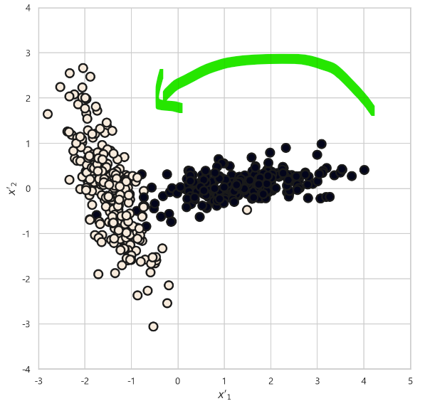
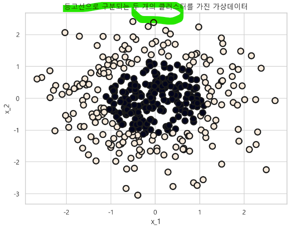

# 분류용 가상 데이터 생성
- scikit-learn 패키지의 분류 모형의 테스트를 위한 여러가지 가상 데이터 생성 함수
- make_classification() : 분류용 가상데이터 생성
- make_blobs() : 클러스터링용 가상데이터 생성
    - 등방성 가우시안 정규분포 함수 사용
- make_moons() : 초승달 형태의 클러스터가 두개인 가상 데이터 생성
- make_gaussian_quantiles() : 등고선으로 분리되는 클래스를 가진 가상 데이텅 생성
    - 다차원 가우시안분포 함수 사용

## 1. make_classification
- 인수
    - n_samples : 표본데이터의 수, 디폴트 100
    - n_features : 독립변수의 수, 디폴트 20
    - n_informative : 독립변수 중 종속변수와 상관관계가 있는 성분의 수, 디폴트 2
        - 예측문제의 회귀와 분류는 독립변수와 종속변수의 상관관계가 중요하다.
        - 회귀분석용 데이터에서는 독립변수와 종속변수의 상관관계가 있어야 모수 추정이 가능하다.
    - n_redundant : 독립변수 중 다른 독립변수의 선형조합으로 나타나는 성분의 수, 디폴트 2
        - 독립변수간의 상관관계가 있다는 의미
    - n_repeated : 독립변수 중 단순 중복된 성분의 수, 디폴트 0
    - n_classes : 종속변수의 클래스 수, 디폴트 2
    - n_clusters_per_class : 클래스 당 클러스터의 수, 디폴트 2
    - weights : 각 클래스에 할당된 표본의 수
    - random_state : 난수 발생 시드
- 반환값
    - x : [n_samples, n_feaures] 크기의 배열 : 독립변수
    - y : [n_samples] 크기의 배열 : 종속변수

### 1-1. 데이터 생성 1
- n_features=1 : 독립변수 1개
- n_informative=1 : 종속변수와 상관관계가 있는 독립변수 갯수 1개
- n_redundant=0 : 다른 독립변수의 선형조합으로 이루어진 독립변수의 갯수 0개
- n_clusters_per_class=1 : 클래스 당 클러스터의 수 1개

```python
from sklearn.datasets import make_classification

%matplotlib inline

X, y = make_classification(n_features=1, n_informative=1, n_redundant=0,
                          n_clusters_per_class=1, random_state=4)

plt.figure(figsize=(8, 6))
plt.scatter(X, y, marker="o", c=y, s=100, edgecolor="k", linewidth=2)
plt.xlabel("x")
plt.ylabel("y")
plt.title("1개의 독립변수를 가진 가상 데이터")
plt.show() ;
```


### 1-2. 분포도 확인

```python
plt.figure(figsize=(8, 5))
sns.distplot(X[y==0], label="y=0")
sns.distplot(X[y==1], label="y=1")
plt.legend()
plt.show() ;
```


### 1-3. 데이터프레임으로 변환

```python
dfX = pd.DataFrame(X, columns=["x"])
dfy = pd.DataFrame(y, columns=["y"])
df = pd.concat([dfX, dfy], axis=1)
df.head()
```


### 2. 데이터 샘플 생성 2
- n_features=2 : 독립변수 갯수 2개
- n_informative=1 : 종속변수와 상관관계를 갖는 독립변수의 갯수 1개
- n_redundant=0 : 다른 독립변수의 선형조합으로 이루어진 독립변수의 갯수 0개
- n_clusters_per_class=1 : 클래스당 갖는 클러스터의 갯수 1개

```python
X, y = make_classification(n_features=2, n_informative=1, n_redundant=0,
                          n_clusters_per_class=1, random_state=4)

plt.figure(figsize=(8, 5))
plt.scatter(X[:, 0], X[:, 1], marker="o",
            c=y, s=100, edgecolor="k", linewidth=2)

plt.title("하나의 독립변수만 클래스와 상관관계가 있는 가상 데이터")
plt.xlabel("$x_1$")
plt.ylabel("$x_2$")
plt.show() ;
```


### 2-1. 데이터 프레임으로 변환

```python
dfX = pd.DataFrame(X, columns=["x_1", "x_2"])
dfy = pd.DataFrame(y, columns=["y"])
df = pd.concat([dfX, dfy], axis=1)
df.head()
```


### 2-2. 상관관계 확인

```python
df.corr()
```


### 2-3. 분포도 확인
- 클래스가(범주값, 종속값) 0에 해당하는 X의 첫번째 컬럼의 데이터
    - y==0 불리언 값을 인덱서로 사용

```python
X[y==0, 0]

>>> print

array([ 1.57887425, -0.07997949, -0.68114843,  0.42584671, -1.96601472,
        0.30290203, -0.67690095, -0.2910958 ,  0.61474063, -1.16829028,
        0.85038687,  0.18083331,  0.40805817, -0.85295128,  1.02645497,
       -0.40865031,  1.73239851,  0.71827439, -0.43388638,  1.04090637,
        0.03863521,  0.64979034, -1.20740046, -0.21015656, -0.48084914,
       -0.89097573, -1.12511459, -1.68296489, -0.34944796,  2.03217933,
        1.55593792,  0.03006708,  1.12837333,  0.61353263,  1.40127689,
       -0.20718168, -0.24052418,  0.11492218,  0.08126377, -1.23313682,
       -1.10457461, -0.33617984,  0.879899  ,  0.51655963,  0.67380149,
        0.21237029, -0.45104291, -0.12656859, -1.41622753,  1.37459323])
```

- 분포도 그래프

```python
plt.figure(figsize=(8, 6))

plt.subplot(121)
sns.distplot(X[y==0, 0], label="y=0")
sns.distplot(X[y==1, 0], label="y=1")
plt.xlabel("x_1")
plt.legend()

plt.subplot(122)
sns.distplot(X[y==0, 1], label="y=0")
sns.distplot(X[y==1, 1], label="y=1")
plt.xlabel("x_2")
plt.legend()

plt.tight_layout()
plt.show() ;
```


- 독립변수 별 상관관계 분포
    - 독립변수간에는 상관관계가 없다.

```python
sns.pairplot(df, hue="y")
plt.show() ;
```


### 3. 데이터 샘플 생성 3
- 두개의 독립변수가 모두 종속변수와 상관관계를 갖는 데이터 샘플

```python
X, y = make_classification(n_samples=500, n_features=2, n_informative=2,
                          n_redundant=0, n_clusters_per_class=1, random_state=6)

plt.figure(figsize=(8, 8))
plt.scatter(X[:, 0], X[:, 1], marker="o", c=y, s=100, edgecolor="k", linewidth=2)
plt.title("두개의 독립변수 모두 클래스와 상관관계가 있는 가상데이터")
plt.xlim(-4, 4)
plt.ylim(-4, 4)
plt.xlabel("$x_1$")
plt.ylabel("$x_2$")
plt.show() ;
```


### 3-1. 데이터 프레임으로 변환

```python
dfX = pd.DataFrame(X, columns=["x1", "x2"])
dfy = pd.DataFrame(y, columns=["y"])
df = pd.concat([dfX, dfy], axis=1)
df.head()
```


### 3-2. 상관관계

```python
df.corr()
```


### 3-3. 독립변수 별 분포도

```python
plt.figure(figsize=(8, 6))

plt.subplot(121)
sns.distplot(X[y==0, 0], label="y=0")
sns.distplot(X[y==1, 0], label="y=1")
plt.xlabel("x_1")
plt.legend()

plt.subplot(122)
sns.distplot(X[y==0, 1], label="y=0")
sns.distplot(X[y==1, 1], label="y=1")
plt.xlabel("x_2")
plt.legend()

plt.tight_layout()
plt.show() ;
```


### 3-4. 고윳값 분해
- X의 분산행렬(정방행렬)을 고윳값 분해한다.
    - l : 고윳값(2X1)
    - V : 고유벡터행렬(2X2)
- X2 : X에 -1을 곱하고, 고유벡터행렬과 내적

```python
l, V = np.linalg.eig(X.T @ X)
l, V

>>> print

(array([1314.01933999,  275.76601612]),
 array([[ 0.75679278, -0.65365487],
        [ 0.65365487,  0.75679278]]))
```

### 3-5. 분산행렬은 정방행렬이 된다.

```python
X.T @ X

>>> print

array([[870.41035701, 513.60448917],
       [513.60448917, 719.37499909]])
```

### 3-6. 새로운 데이터 생성
- 원래 데이터 X에 마이너스로 변환하고 고유벡터를 내적하면
    - X를 고유벡터 만큼 회전한 것과 같다.

```python
X2 = -X @ V
X2

>>> print

array([[ 1.46639922e+00, -2.54422041e-02],
       [-1.31165275e+00, -4.79879800e-01],
       [ 1.22630385e+00,  1.64928342e-01],
       [-1.03265812e+00, -9.23025042e-01],
       [-1.27979893e+00, -4.79185177e-01],
       [-7.66152886e-01, -9.14792909e-01],
       [-2.52984333e+00,  2.24404121e+00],
       [ 3.36698962e+00,  2.88529977e-01],
       [ 1.27658527e+00,  2.39826014e-01],
       [-1.37352445e+00, -1.11008709e-01],
       [ 1.71496334e+00,  1.78504898e-01],
       ...])
```
```python
plt.figure(figsize=(8, 8))
plt.scatter(X2[:, 0], X2[:, 1], marker="o", c=y,
            s=100, edgecolor="k", linewidth=2)
plt.xlabel("$x'_1$")
plt.ylabel("$x'_2$")
plt.xlim(-3, 5)
plt.ylim(-4, 4)
plt.show() ;
```


### 3-7. 차원축소 하고 분포 확인

```python
from sklearn.decomposition import PCA

pca = PCA(n_components=1)
pca

>>> print

PCA(n_components=1)
```

- 차원축소한 데이터 확인

```python
X_pca = pca.fit_transform(X)
X_pca

>>> print

array([[ 1.50317203],
       [-1.27491355],
       [ 1.26309074],
       [-0.9959517 ],
       [-1.24305967],
       [-0.72944585],
       [-2.49290266],
       [ 3.40378564],
       [ 1.3133777 ],
       [-1.33675797],
       [ 1.75175123],
       ...])
```

#### 원래 데이터와 차원 축소한 데이터의 모양

```python
X.shape

>>> print

(500, 2)

X_pca.shape

>>> print

(500, 1)
```

- 차원축소 한 후 데이터 분포도

```python
plt.figure(figsize=(8, 6))

sns.distplot(X_pca[y==0], label="y=0")
sns.distplot(X_pca[y==1], label="y=1")
plt.xlabel("x")
plt.xlim(-3, 5)
plt.legend()
plt.show() ;
```


### 4. 데이터 샘플 생성 4
- weights : 클래스별 데이터 갯수에 차이를 주는 방법, 클래스별 할당된 표본 수
- 비대칭 데이터의 시물레이션 때 사용

```python
X, y = make_classification(n_features=2, n_informative=2, n_redundant=0,
                          n_clusters_per_class=1, weights=[0.9, 0.1], random_state=6)
```

### 4-1. 클래스별 갯수
- weights의 인수값데로 클래스별 표본의 갯수가 다르다.
- 넘파이의 unique() 함수로 계산
    - return_counts=True

```python
val, cnt = np.unique(y, return_counts=True)
val, cnt

>>> print

(array([0, 1]), array([90, 10], dtype=int64))
```

- Counter 메서드로 계산

```python
from collections import Counter

Counter(y)

>>> print

Counter({0: 90, 1: 10})
```

### 4-2. 분포도

```python
print("각 클래스별 데이터의 갯수 = {} 클래스 : {}, {} 클래스 : {}".format(
val[0], cnt[0], val[1], cnt[1]))

plt.figure(figsize=(8, 6))
plt.scatter(X[:, 0], X[:, 1], marker="o", c=y,
            s=100, edgecolor="k", linewidth=2)
plt.title("비대칭 데이터")
plt.xlabel("$x_1$")
plt.ylabel("$x_2$")
plt.show() ;
```


### 5. 데이터 샘플 생성 5
- n_clusters_per_class : 클래스 당 클러스터의 갯수
    - 숫자를 늘이면 잘 분리되어 있지 않은 가상 데이터가 생성 된다.
- $\text{n_classes} \times \text{n_cluster_per_class} \leq 2^{\text{n_informative}}$
    - 클래스의 갯수 * 클래스당 클러스터 수 <= 종속변수와 상관관계가 있는 독립변수의 수

```python
X2, Y2 = make_classification(n_samples=400, n_features=2, n_informative=2,
                            n_redundant=0, n_clusters_per_class=2, random_state=0)
```

### 5-1. 분포도

```python
plt.figure(figsize=(8, 6))
plt.scatter(X2[:, 0], X2[:, 1], marker="o", c=Y2,
           s=100, edgecolor="k", linewidth=2)
plt.title("클래스 당 2개의 클러스터가 있는 가상데이터")
plt.xlabel("x_1")
plt.ylabel("x_2")
plt.show() ;
```


### 6. 데이터 샘플 생성 6
- 다중 클래스를 갖는 가상 데이터
    - 클래스의 갯수가 2개이면 이진 클래스
    - 클래스의 갯수가 3개 이상이면 다중 클래스

```python
X, y = make_classification(n_samples=300, n_features=2, n_informative=2,
                          n_redundant=0, n_clusters_per_class=1, n_classes=3,
                          random_state=0)
```

### 6-1. 클래스별 갯수

```python
np.unique(y, return_counts=True)

>>> print

(array([0, 1, 2]), array([ 99, 101, 100], dtype=int64))
```

### 6-2. 분포도

```python
plt.figure(figsize=(8, 6))
plt.scatter(X[:, 0], X[:, 1], marker="o", c=y,
           s=100, edgecolor="k", linewidth=2)
plt.title("다중 클래스를 가진 가상데이터")
plt.xlabel("x_1")
plt.ylabel("x_2")
plt.show() ;
```


## 2. make_blobs
- 등방성 가우시안 정규분포를 이용한 가상 데이터 생성
- 등방성 : 모든 방향으로 같은 성질을 갖는다는 의미
- 클러스터링 용 가상데이터 생성할 때 주로 사용한다.
- 인수 
    - n_samples : 표본 데이터의 수, 디폴트 100
    - n_features : 독립변수의 갯수, 디폴트 20
    - centers : 생성할 클러스터의 수, 또는 중심, 디폴트 3
        - [n_centers, n_features] 크기의 배열
    - cluster_std : 클러스터의 표준편차, 디폴트 1.0
    - center_box : 생성할 클러스터의 바운딩 박스, 디폴트 (-10.0, 10.0)
        - bounding box
- 반환값
    - x : [n_samples, n_features] 크기의 배열, 독립변수
    - y : [y_samples] 크기의 배열, 종속변수

### 1-1. 데이터 생성

```python
from sklearn.datasets import make_blobs

X, y = make_blobs(n_samples=300, n_features=2, centers=3, random_state=1)
```

### 1-2. 분포도

```python
plt.figure(figsize=(8, 6))
plt.scatter(X[:, 0], X[:, 1], marker="o", c=y,
           s=100, edgecolor="k", linewidth=2)
plt.title("세개의 클러스터를 가진 가상데이터")
plt.xlabel("x_1")
plt.ylabel("x_2")
plt.show() ;
```


## 3. make_moons
- 초승달 모양의 클러스터 두 개 형상의 가상 데이터를 생성한다.
- **직선을 사용하여 분류할 수 없다.**
- 인수
    - n_samples : 표본 데이터의 수, 디폴트 100
    - noise : 잡음의 크기, 0이면 정확한 반원을 이룬다.

### 1-1. 데이터 생성

```python
from sklearn.datasets import make_moons

X, y = make_moons(n_samples=400, noise=0.1, random_state=0)
```

### 1-2. 분포도

```python
plt.figure(figsize=(8, 6))
plt.scatter(X[:, 0], X[:, 1], marker="o", c=y,
           s=100, edgecolor="k", linewidth=2)
plt.title("초승달 모양의 클러스터를 가진 가상 데이터")
plt.xlabel("x_1")
plt.ylabel("x_2")
plt.show() ;
```


## 4. make_gaussian_quantiles
- 다차원 가우시안 분포의 표본을 생성한다.
- 분포의 기댓값을 중심으로 **등고선으로 클래스를 분리한다.**
- **타원형 형태의 닫힌 경계선으로만 분류할 수 있다**
- 인수
    - mean : 기댓값 벡터
    - cov : 공분산 행렬
    - n_samples : 표본 데이터의 수, 디폴트 100
    - n_features : 독립변수의 수, 디폴트 20
    - n_classes : 클래스의 갯수
- 반환값
    - X : [n_samples, n_features] 크기의 배열, 독립변수
    - y : [n_samples] 크기의 배열, 종속변수

### 1-1. 데이터 생성

```python
from sklearn.datasets import make_gaussian_quantiles

X, y = make_gaussian_quantiles(n_samples=400, n_features=2,
                               n_classes=2, random_state=0)
```

### 1-2. 분포도

```python
plt.figure(figsize=(8, 6))
plt.scatter(X[:, 0], X[:, 1], marker="o", c=y,
           s=100, edgecolor="k", linewidth=2)
plt.title("등고선으로 구분되는 두 개의 클러스터를 가진 가상데이터")
plt.xlabel("x_1")
plt.ylabel("x_2")
plt.show() ;
```



