# 모형 결합
- `모형 결합 model combining` : 앙상블 방법론(ensemble methods)이라고도 한다. 여러개의 예측 모형을 결합하여 더 나은 성능의 예측을 하는 방법
- `모형 결합의 장점`
    - 계산량은 증가한다.
    - 단일 모형 사용때보다 성능의 분산이 감소한다. 과최적화를 방지할 수 있다. 
    - 개별 모형이 성능이 안좋을 경우 결합 모형의 성능이 더 향상 된다. 
- `모형 결합의 종류`
    - 취합 aggregation : 사용할 모형의 집합이 이미 결정되어 있다. 
        - 다수결 (Majority Voting)
        - 배깅 (Bagging)
        - 랜던포레스트 (Random Forests)
    - 부스팅 boosting : 사용할 모형을 점진적으로 늘려간다.
        - 에이다 부스트 (Ada Boost)
        - 그레디언트 부스트 (Gradient Boost)

    
## 1. 취합 방법 : 다수결 방법
- 취합 방법 aggregation, 다수결 방법 Majority Voting
- 기본적인 모형 결합 방법 : 완전히 다른 모형도 결합 할 수 있다. 
    - hard voting : 단순 투표, 개별 모형의 결과 기준
    - soft voting : 가중치 투표, 개별 모형의 조건부 확률의 합 기준
- `모형 결합을 사용한 성능의 향상` : 이항분포의 pmf의 합과 같다.
    - $\sum_{k > \frac{N}{2}}^{N} \binom{N}{k} p^{k}(1-p)^{N-k}$
    - p : 모형이 정답을 출력할 확률, N : 모형의 갯수
- **독립적인 모형의 수가 많을 수록 성능 향상이 일어날 가능성이 높다.**

### python
- scikit-learn의 ensemble 서브패키지 사용
- `VotingClassifier의 인수`
    - estimators : 개별 모형 목록, 리스트나 named parameter 형식으로 입력
        - 개별 모델 : vc.set_params(lr="drop")
    - voting : 문자열, {hard voting, soft voting} 중에서 선택. 디폴트 hard
        - hard : predict 반환 : 예측 클래스를 반환한다.
        - soft : predict_proba 반환 : 클래스별 조건부 확률을 반환한다. 
    - weights : 사용자 가중치 리스트
    - n_jobs : 병렬 작업 시행 여부
    - flatten_transform : 반환 행렬의 형태
    - verbose : 모수추정 과정 프린트
- 개별 모형보다 성능이 좋은 편이다.
- 성능의 분산이 작다. 과최적화가 방지된다.

## 2. 취합 방법 : 배깅
- `배깅 bagging` : 트레이닝 데이터를 랜덤하게 선택해서 다수결 모형에 적용하는 방식
    - 동일한 모형과 모형의 모수를 사용하는 대신, 부트스트래핑(bootstrapping) 방식 사용
- `트레이닝 데이터 선택 방식`    
    - Bagging : 중복사용(replacement)하는 경우
    - Pasting : 중복사용 안하는 경우
    - Random Subspaces : 데이터가 아닌 다차원의 독립변수에서 일부 차원을 선택하는 경우
    - Random Patches : 데이터 샘플과 독립변수 차원 모두 일부만 랜덤하게 사용하는 경우
- `OOB out-of-bag` : 성능 평가시 사용하는 트레이닝 데이터가 아닌 검증용 데이터

### Python
- scikit-learn의 ensemble 서브패키지 사용
- `BaggingClassifier의 인수`
    - base_estimator : 기본 모형
    - n_estimators : 모형 결합 갯수, 디폴트 10
        - 100이면 base_estimator 모형을 100개 결합한 것과 같음
    - bootstrap : 데이터 중복 사용 여부, 디폴트 True(중복사용)
    - max_samples : 선택할 데이터 샘플의 수 혹은 비율, 디폴트 1.0
    - bootstrap_features : 특징벡터 차원의 중복 사용 여부, 디폴트 False(중복 안함)
    - max_features : 다차원 독립 변수 중 선택할 차원의 수 혹은 비율, 디폴트 1.0
    - oob_score : 일반화 오류를 막기위해 외부 샘플 사용 여부, bootstrap=True 인 경우
        - out of bag : 현재 데이터가 아닌 다른 데이터를 의미하는 용어
    - warm_start : True 이면 이전 모델의 속성을 사용함, False이면 새로운 모델 생성
        - 일부 매개변수만 적용됨
        - 그리스 서치에서 이전 매개변수값을 재사용할 수 있음
    - n_jobs : 병렬 처리 여부
    - random_state : 원본 데이터의 무작위 샘플링
    
## 3. 랜덤포레스트
- `랜덤포레스트 Random Forest` : 의사결정나무를 개별 모형으로 사용하는 모형 결합 방법.
    - 데이터의 특징차원의 일부만 선택하여 사용
- 노드 분리 방법 
    - 독립변수 차원을 랜덤하게 감소시킨 후 이 중에서 기준 독립변수를 선택한다.
    - 모든 독립변수의 기준을 비교하여 최선의 독립변수를 찾는 것이 아니다.
    - 개별 모형들 사이의 상관관계가 줄어들어 모형 성능의 변동이 감소하는 효과가 있다.
- `익스트림리 랜덤트리 Extremley Randomized Trees` : 각 노드마다 랜덤하게 독립변수를 선택한다.
- meta estimator 메타 추정기의 한 종류
    - 평균화를 사용하여 예측 정확도를 개선하고 과적합을 제어한다. 
- `장점`
    - 각 독립변수의 중요도를 계산할 수 있다. feature importance
    - 포레스트의 모든 노드에서 어떤 독립변수를 사용했고, 그 노드에서 얻은 정보획득량(information gain)을 구할 수 있다.
    - 각각의 독립변수가 얻은 정보획득량의 평균을 비교하면 어떤 독립변수가 중요한지 비교할 수 있다.

### Python
- scikit-learn의 ensemble 서브패키지 사용
- `RandomForestClassifier의 인수`
    - n_estimators : 나무의 갯수
    - criterion : 노드 분류 기준 측정 방법, {"gini", "entropy", "log_loss"}
    - max_depth : None이면 min_samples_split 미만이 될때까지 노드가 분류 된다.
    - min_samples_split : 노드를 분할하기 위한 최소 샘플수
    - min_samples_leaf : 양쪽 자식 노드에 있어야할 최소 샘플수 (즉 노드의 데이터 집합의 갯수)
    - min_weight_fraction_leaf : 자식 노드에 있어야 하는 가중치(입력 샘플의) 합계의 최소 비율
    - max_features : 노드 분할 기준을 찾을 때 사용할 독립변수의 최대 수, {"sqrt", "log2", None}
    - max_leaf_nodes : 나무를 성장시키는 기본 크기값
    - min_impurity_decrease : 노드 분할 불순도 기준값, 이 기준값 보다 크거나 같은 값이면 노드가 분할 된다.
    - bootstrap : 부트스트랩 사용 여부
    - oob_score : 외부 데이터 샘플 사용 여부
    - n_jobs : 병렬 처리 여부
    - random_state : 원본 데이터의 무작위 샘플링
    - verbose : 모수 추정 과정 프린트
    - warm_start : 이전 모델의 속성값을 재사용 할지 여부
    - class_weight : 클래스 값별 가중치
    - ccp_alpha : 비용 함수에 관한 복잡성 매개변수
    - max_samples : 각 추정기 훈련에 사용할 데이터 샘플의 수
- `ExtraTreesClassifier의 인수`
    - RandomForestClassifier의 인수와 같음

## Python

### 4-1. 취합 방법 : 다수결 방법
- 세가지 분류 모형 각각의 성능과 세가지 모형을 합한 모형의 성능 비교
    - VotingClassifier : 다수결 방법 모형
    - LogisticRegression : 로지스틱회귀 모형
    - QuadraticDiscriminantAnalysis : QDA 모형
    - GaussianNB : 가우시안 나이브 베이즈 모형

### 4-2. 데이터 샘플 생성

```python
X = np.array([[0, -0.5], [-1.5, -1.5], [1, 0.5],
              [-3.5, -2.5], [0, 1], [1, 1.5], [-2, -0.5]])
y = np.array([1, 1, 1, 2, 2, 2, 2])
x_new = [0, -1.5]

plt.figure(figsize=(8, 6))
plt.scatter(X[y==1, 0], X[y==1, 1], s=100, marker="o", c="r", label="클래스1")
plt.scatter(X[y==2, 0], X[y==2, 1], s=100, marker="o", c="b", label="클래스2")
plt.scatter(x_new[0], x_new[1], s=100, marker="^", c="g", label="테스트 데이터")
plt.xlabel("x1")
plt.ylabel("x2")
plt.title("이진 분류 예제 데이터")
plt.legend()
plt.show() ;
```
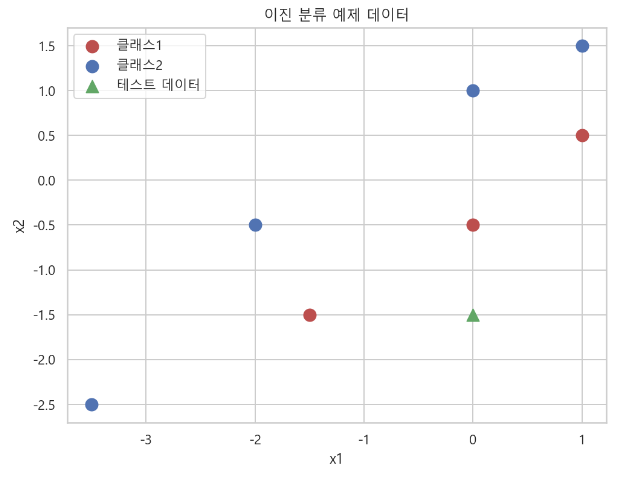

### 4-3. 모형 생성

```python
from sklearn.linear_model import LogisticRegression
from sklearn.naive_bayes import GaussianNB
from sklearn.discriminant_analysis import QuadraticDiscriminantAnalysis
from sklearn.ensemble import VotingClassifier

model1 = LogisticRegression(random_state=1)
model2 = QuadraticDiscriminantAnalysis()
model3 = GaussianNB()
```

#### 취합 방법 : 다수결 방법 : soft voting : 가중치 투표 방식, 개별 모형의 조건부확률의 합 기준
```python
ensemble = VotingClassifier(estimators=[("lr", model1),
                                        ("qda", model2),
                                        ("gnb", model3)], voting="soft")
ensemble

>>> print

VotingClassifier(estimators=[('lr', LogisticRegression(random_state=1)),
                             ('qda', QuadraticDiscriminantAnalysis()),
                             ('gnb', GaussianNB())],
                 voting='soft')
```

### 4-4. 샘플 데이터에 대한 분류 예측 결과
- 각 모형별로 조건부확률의 합이 반환된다.

```python
probas = [c.fit(X, y).predict_proba([x_new]) \
          for c in (model1, model2, model3, ensemble)]
probas

>>> print

[array([[0.7713643, 0.2286357]]),
 array([[9.59836414e-10, 9.99999999e-01]]),
 array([[0.67309197, 0.32690803]]),
 array([[0.48148542, 0.51851458]])]
```

### 4-5. 조건부 확률 분리
- pr[0, 0] : 각 모형의 클래스1, 2에 대한 조건부 확률 중 클래스1에 대한 조건부 확률
- pr[0, 1] : 각 모형의 클래스1, 2에 대한 조건부 확률 중 클래스2에 대한 조건부 확률

```python
class1_1 = [pr[0, 0] for pr in probas]
class2_1 = [pr[0, 1] for pr in probas]

class_1

>>> print

[0.771364295516996,
 9.598364138507458e-10,
 0.6730919742971819,
 0.48148542359133817]

class_2

>>> print

[0.22863570448300394,
 0.9999999990401636,
 0.32690802570281785,
 0.5185145764086617]
```

### 4-6. 각 모형별 조건부 확률 그래프
- 샘플 데이터에 대한 분류 결과
    - lr : 클래스 1이 더 높다.
    - qda : 클래스 2가 더 높다.
    - gnb : 클래스 1이 더 높다.
    - soft voting : 클래스 2가 더 높다.
- hard voting은 조건부 확률 값이 반환되지 않고, 클래스 값이 반환된다.

```python
ind = np.arange(4)
width = 0.35

## 각 모형별 조건부 확률 값 그리기
## 0, 1, 2, 3 의 위치에 2개의 데이터 샘플에 대한 조건부 확률 값의 막대 그래프를 넣는다.
plt.figure(figsize=(8, 6))
## 각 모형의 클래스 1의 조건부 확률
p1 = plt.bar(ind, np.hstack(([class1_1[:-1], [0]])),
             width, color="green")
## 각 모형의 클래스 2의 조건부 확률
p2 = plt.bar(ind + width, np.hstack(([class2_1[:-1], [0]])),
             width, color="lightgreen")
## 소프트 다수결 모형의 클래스 1의 조건부 확률
p3 = plt.bar(ind, [0, 0, 0, class1_1[-1]], width, color="blue")
## 소프트 다수결 모형의 클래스 2의 조건부 확률
p4 = plt.bar(ind + width, [0, 0, 0, class2_1[-1]], width, color="steelblue")

## xticks 설정 : width의 절반 위치에 label을 넣는다.
plt.xticks(ind + 0.5 * width, ["LogistciR", "QDA", "GaussianNB", "soft voting clf"])
plt.ylim([0, 1.1])
plt.title("3 가지 분류 모형과 소프트 다수결 모형의 분류 결과")
plt.legend([p1[0], p2[0]], ["클래스1", "클래스2"], loc="upper left")
plt.show() ;
```
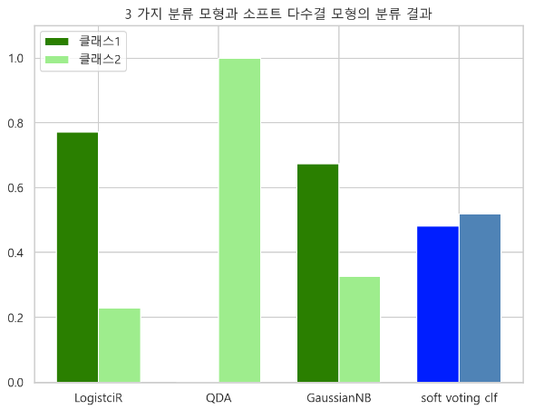

### 4-7. 하드보팅 다수결 모형 포함
- voting="hard" 디폴트 값이다.
- 샘플 데이터에 대한 분류결과 : 클래스 1

```python
ensemble2 = VotingClassifier(estimators=[("lr", model1),
                                         ("qda", model2),
                                         ("gnb", model3)])
ensemble2

>>> print

VotingClassifier(estimators=[('lr', LogisticRegression(random_state=1)),
                             ('qda', QuadraticDiscriminantAnalysis()),
                             ('gnb', GaussianNB())])

ensemble2.fit(X, y).predict([x_new])

>>> print

array([1])
```

### 4-8. 판별 경계면
- Voting 모델의 판별경계면이 더 정확하다. 

```python
from itertools import product

x_min, x_max = -4, 2
y_min, y_max = -3, 2
xx, yy = np.meshgrid(np.arange(x_min, x_max, 0.005),
                    np.arange(y_min, y_max, 0.005))

plt.figure(figsize=(8, 6))
f, axarr = plt.subplots(2, 2)
for idx, clf, tt in zip(product([0, 1], [0, 1]),
                       [model1, model2, model3, ensemble],
                       ["lr", "qda", "gnb", "softvoting"]) :

    Z = clf.predict(np.c_[xx.ravel(), yy.ravel()])
    Z = Z.reshape(xx.shape)

    axarr[idx[0], idx[1]].contourf(xx, yy, Z, alpha=0.3, cmap=mpl.cm.jet)
    axarr[idx[0], idx[1]].scatter(X[:, 0], X[:, 1],
                                  c=y, alpha=0.5, s=50, cmap=mpl.cm.jet)
    axarr[idx[0], idx[1]].scatter(x_new[0], x_new[1], marker="x")
    axarr[idx[0], idx[1]].set_title(tt)

plt.tight_layout()
plt.show() ;
```
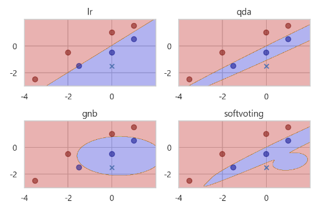

### 4-9. 모형 결합의 성능 향상 그래프
- 단일 모델만 사용한 경우보다 모형 결합을 사용하면 성능이 더 높다.
    - 모형 10개를 결합한 모형의 확률, N=10
    - 모형 100개를 결합한 모형의 확률, N=100

```python
## 조합을 계산해주는 함수
## comb(n, k, exact, repetition=False)

from scipy.special import comb

comb(4, 2)

>>> print

6.0
```

#### 그래프

```python
# p = 개별 모형의 성능
def total_error(p, N) :
    te = 0.0
    for k in range(int(np.ceil(N/2)), N+1) :
        ## 모형 결합 모형의 정답 출력 확률 : 즉 성능과 같은 의미이다.
        te += comb(N, k) * p**k * (1-p)**(N-k)
    return te

## x = 개별 모형의 성능값
x = np.linspace(0, 1, 100)
plt.figure(figsize=(8, 6))
plt.plot(x, x, "g", lw=3, label="개별 모형")
## 다수결 모형의 성능값
plt.plot(x, total_error(x, 10), "b-", label="다수결 모형 (N=10)")
plt.plot(x, total_error(x, 100), "r-", label="다수결 모형 (N=100)")
plt.xlabel("개별 모형의 성능")
plt.ylabel("다수결 모형의 성능")
plt.legend(loc=0)
plt.show()
```
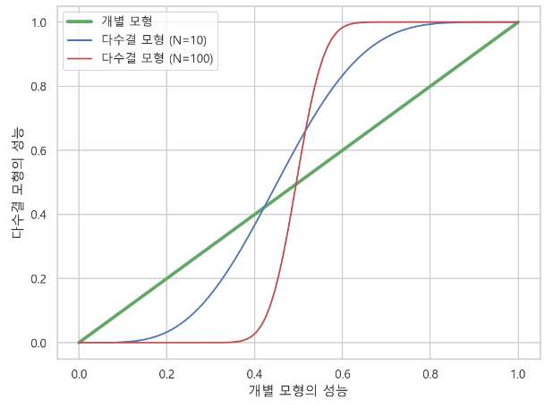


### 4-10. 분류 모형별 brease cancer 데이터 분류 성능 비교

```python
from sklearn.datasets import load_breast_cancer

bc = load_breast_cancer()
X = bc.data
y = bc.target

X.shape, y.shape

>>> print

((569, 30), (569,))
```

#### 분류 모형 생성

```python
from sklearn.tree import DecisionTreeClassifier
from sklearn.linear_model import LogisticRegression
from sklearn.discriminant_analysis import QuadraticDiscriminantAnalysis
from sklearn.discriminant_analysis import LinearDiscriminantAnalysis
from sklearn.naive_bayes import GaussianNB
from sklearn.ensemble import VotingClassifier

model1 = DecisionTreeClassifier(max_depth=3, random_state=0, min_samples_leaf=3)
model2 = LogisticRegression(solver="liblinear")
model3 = QuadraticDiscriminantAnalysis()
model4 = LinearDiscriminantAnalysis()
model5 = GaussianNB()
estimators = [("dt", model1),
             ("lr", model2),
             ("qda", model3),
             ("lda", model4),
             ("gnb", model5)]
en_vc1 = VotingClassifier(estimators=estimators,
                          voting="soft", weights=[1, 2, 1, 2, 1])
en_vc2 = VotingClassifier(estimators=estimators, voting="hard")
```

#### 모형 객체 저장

```python
models = [model1, model2, model3, model4, model5, en_vc1, en_vc2]
models
```

#### 모형별 교차 검증

```python
from sklearn.model_selection import cross_val_score

cv_scores = []

for i, clf in enumerate(models) :
    cv_scores.append(cross_val_score(clf, X, y, cv=5, scoring="r2"))
```

#### 모형별 성능 그래프
- soft voting 모형의 성능이 가장 높다.

```python
model_names = ["dt", "lr", "qda", "lda", "gnb", "soft", "hard"]
mean_score = np.mean(cv_scores, axis=1)

plt.figure(figsize=(8, 6))
plt.scatter(model_names, mean_score, c="orange", s=50, edgecolor="k")
plt.title("clf compare : dt, lr, qda, lda, gnb, softvoting, hardvoting",
         y=1.05, fontsize=13)
plt.ylim(0.62, 0.88)
plt.grid(c="k", ls="--", lw=0.5)
plt.show() ;
```
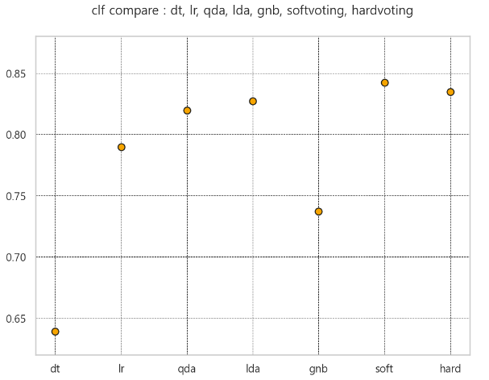

#### 모형별 성능의 분산 그래프
- boxplot
- Voting 모델의 성능 분산이 개별 모형의 성능 분산보다 작다.
    - 과최적화가 방지된다.

```python
std_score = np.std(cv_scores, axis=1)

plt.figure(figsize=(8, 6))
plt.boxplot(cv_scores)
plt.xticks(np.arange(1, 8), model_names)
plt.show() ;
```
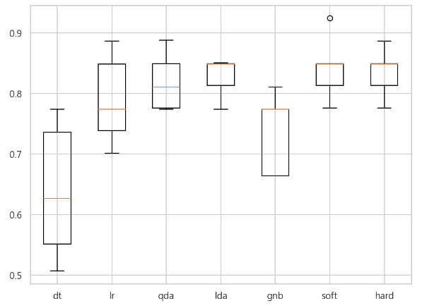

### 5. 취합 방법 : 배깅
- 취합 방법 aggregation, 배깅 bagging

### 5-1. DT 개별모형과 배깅모형의 분류 결과 비교

```python
from sklearn.datasets import load_iris
from sklearn.tree import DecisionTreeClassifier
from sklearn.ensemble import BaggingClassifier

iris = load_iris()
X, y = iris.data[:, [0, 2]], iris.target

model1 = DecisionTreeClassifier(max_depth=10, random_state=10).fit(X, y)
## n_estimators : 모형의 갯수
model2 = BaggingClassifier(DecisionTreeClassifier(max_depth=2),
                          n_estimators=100, random_state=0).fit(X, y)

x_min, x_max = X[:, 0].min() - 1, X[:, 0].max() + 1
y_min, y_max = X[:, 1].min() - 1, X[:, 1].max() + 1
xx, yy = np.meshgrid(np.arange(x_min, x_max, 0.1),
                    np.arange(y_min, y_max, 0.1))

plt.figure(figsize=(8, 5))
plt.subplot(121)
Z1 = model1.predict(np.c_[xx.ravel(), yy.ravel()]).reshape(xx.shape)
plt.contourf(xx, yy, Z1, alpah=0.6, cmap=mpl.cm.jet)
plt.scatter(X[:, 0], X[:, 1], c=y, alpha=1, s=50, cmap=mpl.cm.jet, edgecolors="k")
plt.title("개별모형")

plt.subplot(122)
Z2 = model2.predict(np.c_[xx.ravel(), yy.ravel()]).reshape(xx.shape)
plt.contourf(xx, yy, Z2, alpha=0.6, cmap=mpl.cm.jet)
plt.scatter(X[:, 0], X[:, 1], c=y, alpha=1, s=50, cmap=mpl.cm.jet, edgecolors="k")
plt.title("배깅모형")

plt.suptitle("붓꽃 데이터의 분류 결과")
plt.tight_layout()
plt.show() ;
```
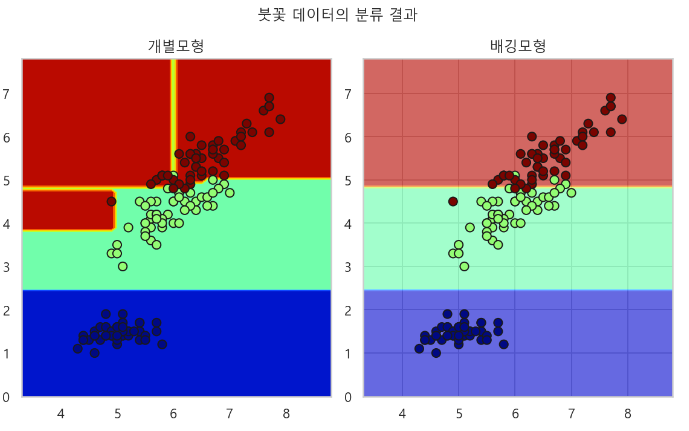


### 5-2. 개별모형과 bagging 모형의 breast cancer 데이터 분류 성능 비교

```python
from sklearn.tree import DecisionTreeClassifier
from sklearn.linear_model import LogisticRegression
from sklearn.discriminant_analysis import QuadraticDiscriminantAnalysis
from sklearn.discriminant_analysis import LinearDiscriminantAnalysis
from sklearn.naive_bayes import GaussianNB
## C-서포트 벡터 머신
from sklearn.svm import SVC
from sklearn.ensemble import VotingClassifier
from sklearn.ensemble import BaggingClassifier
from sklearn.model_selection import cross_val_score

model1 = DecisionTreeClassifier(max_depth=1)
model2 = LogisticRegression(solver="liblinear")
model3 = QuadraticDiscriminantAnalysis()
model4 = LinearDiscriminantAnalysis(solver="eigen")
model5 = GaussianNB()
model6 = SVC()

estimators = [("dt", model1), ("lr", model2), ("qda", model3), 
              ("lda", model4), ("gnb", model5), ("svc", model6)]

## SVC는 soft_voting 모형에서 적용 안됨
soft2_vc = VotingClassifier(estimators=estimators[:5], voting="soft")
hard_vc = VotingClassifier(estimators=estimators)

## 모형 객체 저장
models = [model1, model2, model3, model4,
          model5, model6, soft2_vc, hard_vc]	  
```

#### 배깅 모형에 개별 모형을 적용하려면 각각 생성해 주어야 한다.
- n_estimators : 개별 모형의 갯수
    - DT 모델을 개별 모델로 사용하고 n_estimators=100으로 하면, DT 모델 100개를 모형 결합한 것과 같은 의미이다.

```python
bagging = [BaggingClassifier(clf, n_estimators=100) for clf in models[:6]]
bagging

>>> print

[BaggingClassifier(base_estimator=DecisionTreeClassifier(max_depth=1),n_estimators=100),
 BaggingClassifier(base_estimator=LogisticRegression(solver='liblinear'),n_estimators=100),
 BaggingClassifier(base_estimator=QuadraticDiscriminantAnalysis(),n_estimators=100),
 BaggingClassifier(base_estimator=LinearDiscriminantAnalysis(solver='eigen'),n_estimators=100),
 BaggingClassifier(base_estimator=GaussianNB(), n_estimators=100),
 BaggingClassifier(base_estimator=SVC(), n_estimators=100)]
```

#### 모형 객체 합하기
```python
total_models = models + bagging
total_models

>>> print

[DecisionTreeClassifier(max_depth=1),
 LogisticRegression(solver='liblinear'),
 QuadraticDiscriminantAnalysis(),
 LinearDiscriminantAnalysis(solver='eigen'),
 GaussianNB(),
 SVC(),
 VotingClassifier(estimators=[('dt', DecisionTreeClassifier(max_depth=1)),
                              ('lr', LogisticRegression(solver='liblinear')),
                              ('qda', QuadraticDiscriminantAnalysis()),
                              ('lda',
                               LinearDiscriminantAnalysis(solver='eigen')),
                              ('gnb', GaussianNB())],
                  voting='soft'),
 VotingClassifier(estimators=[('dt', DecisionTreeClassifier(max_depth=1)),
                              ('lr', LogisticRegression(solver='liblinear')),
                              ('qda', QuadraticDiscriminantAnalysis()),
                              ('lda',
                               LinearDiscriminantAnalysis(solver='eigen')),
                              ('gnb', GaussianNB()), ('svc', SVC())]),
 BaggingClassifier(base_estimator=DecisionTreeClassifier(max_depth=1),
                   n_estimators=100),
 BaggingClassifier(base_estimator=LogisticRegression(solver='liblinear'),
                   n_estimators=100),
 BaggingClassifier(base_estimator=QuadraticDiscriminantAnalysis(),
                   n_estimators=100),
 BaggingClassifier(base_estimator=LinearDiscriminantAnalysis(solver='eigen'),
                   n_estimators=100),
 BaggingClassifier(base_estimator=GaussianNB(), n_estimators=100),
 BaggingClassifier(base_estimator=SVC(), n_estimators=100)]
```

#### R2 스코어 비교
- 취합 모형의 성능이 개별 모형의 성능보다 항상 좋은 것은 아니다.

```python
from sklearn.datasets import load_breast_cancer

bc = load_breast_cancer()
X, y = bc.data, bc.target

test_scores = []

for i, clf in enumerate(total_models) :
    test_scores.append(cross_val_score(clf, X, y, cv=5, scoring="r2"))

model_names = ["dt", "lr", "qda", "lda", "gnb", "svc", "soft2_vc", "hard_vc"]
bagging_names = ["bc_"+str(name) for name in model_names[:6]]
## 개별모형과 배깅모형의 객체 이름 합하기
total_names = model_names + bagging_names
## 모형별 성능의 평균값
mean_score = np.mean(test_scores, axis=1)

plt.figure(figsize=(8, 6))
plt.scatter(total_names, mean_score, c="orange", s=50, edgecolor="k")
plt.title("clf test score compare", y=1.05, fontsize=13)
plt.xticks(np.arange(0, 14), total_names, rotation=-45)
plt.ylim(0.60, 0.88)
plt.grid(c="k", ls="--", lw=0.5)
plt.show() ;
```
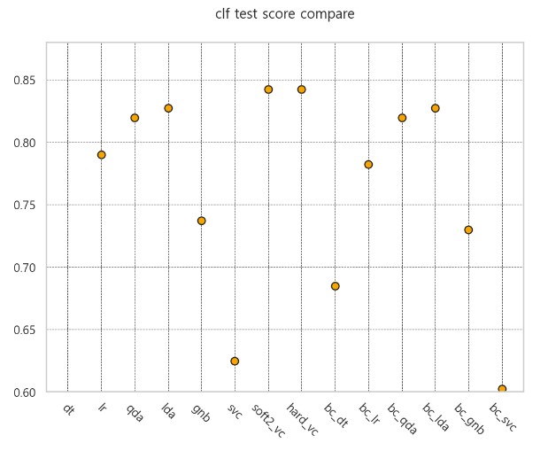

#### 모형별 교차검증 성능 분산 비교

```python
std_score = np.std(test_scores, axis=1)

plt.figure(figsize=(10, 8))
plt.boxplot(test_scores)
plt.xticks(np.arange(1, 15), total_names, rotation=-45)
plt.show() ;
```
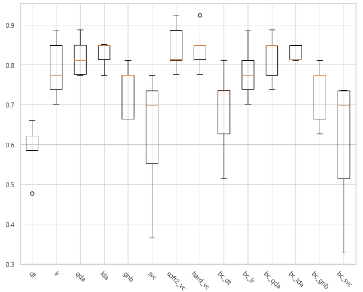


#### Accuracy score 비교
- voting 모형의 성능이 가장 좋다.
- bagging 모형의 성능은 개별 모형의 성능과 비슷하다.

```python
from sklearn.datasets import load_breast_cancer

bc = load_breast_cancer()
X, y = bc.data, bc.target

model1 = DecisionTreeClassifier(max_depth=1)
model2 = LogisticRegression(solver="liblinear")
model3 = QuadraticDiscriminantAnalysis()
model4 = LinearDiscriminantAnalysis(solver="eigen")
model5 = GaussianNB()
model6 = SVC()
estimators = [("dt", model1), ("lr", model2), ("qda", model3),
              ("lda", model4), ("gnb", model5), ("svc", model6)]
## SVC는 soft_voting 모형에서 적용이 안됨
soft2_vc = VotingClassifier(estimators=estimators[:5], voting="soft")
hard_vc = VotingClassifier(estimators=estimators)
bagging = [BaggingClassifier(clf, n_estimators=100) for clf in models[:6]]

models = [model1, model2, model3, model4, model5, model6, soft2_vc, hard_vc]
total_models = models + bagging

model_names = ["dt", "lr", "qda", "lda", "gnb", "svc", "soft2_vc", "hard_vc"]
bagging_names = ["bc_"+str(name) for name in model_names[:6]]
total_names = model_names + bagging_names

acc_test_scores = []

for i, clf in enumerate(total_models) :
    acc_test_scores.append(cross_val_score(clf, X, y, cv=5, scoring="accuracy"))

mean_acc = np.mean(acc_test_scores, axis=1)

plt.figure(figsize=(8, 6))
plt.scatter(total_names, mean_acc, c="orange", s=50, edgecolor="k")
plt.title("clf test score compare : Accuracy", y=1.05, fontsize=13)
plt.xticks(np.arange(0, 14), total_names, rotation=-45)
plt.grid(c="k", ls="--", lw=0.5)
plt.show() ;
```
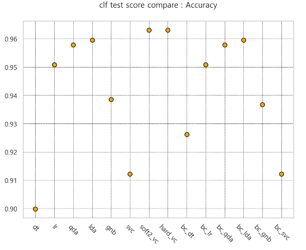

#### Accuracy score의 분산 비교
- voting 모형의 분산이 작다. 
    - 모형이 안정적이다.
- bagging 모형의 분산은 큰 편이다.
    - 개별모형의 분산과 유사하다.

```python
std_acc = np.std(acc_test_scores, axis=1)

plt.figure(figsize=(10, 8))
plt.boxplot(acc_test_scores)
plt.xticks(np.arange(1, 15), total_names, rotation=-45)
plt.show() ;
```
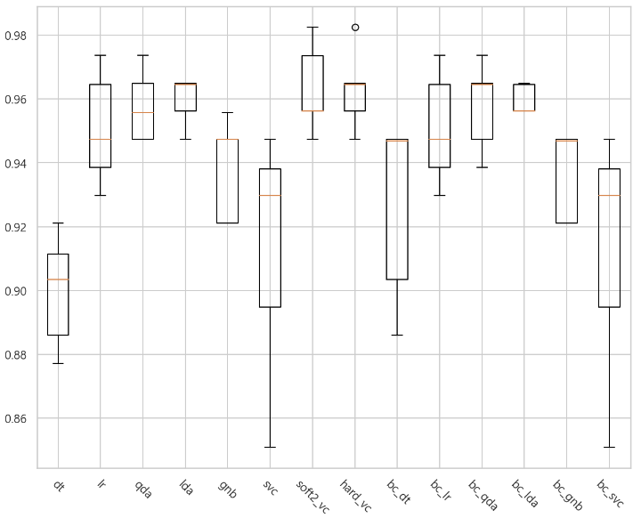


### 6. Random Forest

### 6-1. DT 개별모형과 RF 모형의 뷴류 결과 비교

```python
from sklearn.datasets import load_iris
from sklearn.tree import DecisionTreeClassifier
from sklearn.ensemble import RandomForestClassifier

iris = load_iris()
X, y = iris.data[:, [0, 2]], iris.target

model1 = DecisionTreeClassifier(max_depth=10, random_state=0).fit(X, y)
model2 = RandomForestClassifier(max_depth=2, n_estimators=100, random_state=0).fit(X, y)

x_min, x_max = X[:, 0].min() - 1, X[:, 0].max() + 1
y_min, y_max = X[:, 1].min() - 1, X[:, 1].max() + 1
xx, yy = np.meshgrid(np.arange(x_min, x_max, 0.1),
                    np.arange(y_min, y_max, 0.1))

plt.figure(figsize=(8, 5))
plt.subplot(121)
Z1 = model1.predict(np.c_[xx.ravel(), yy.ravel()]).reshape(xx.shape)
plt.contourf(xx, yy, Z1, alpha=0.5, cmap=mpl.cm.jet)
plt.scatter(X[:, 0], X[:, 1], c=y, s=20, edgecolors="k", alpha=0.9)
plt.title("개별모형")

plt.subplot(122)
Z2 = model2.predict(np.c_[xx.ravel(), yy.ravel()]).reshape(xx.shape)
plt.contourf(xx, yy, Z2, alpha=0.5, cmap=mpl.cm.jet)
plt.scatter(X[:, 0], X[:, 1], c=y, s=20, edgecolors="k", alpha=0.9)
plt.title("배깅모형")

plt.suptitle("붓꽃 데이터의 분류 결과")
plt.tight_layout()
plt.show() ;
```
### 6-2. Exgtra RF 모형 
- ExtraTreesClassifier 모형
    - 독립변수의 차원을 랜던함게 선택하고, 노드마다 독립변수를 다르게 선택하는 방식

```python
from sklearn.datasets import make_classification
from sklearn.ensemble import ExtraTreesClassifier

X, y = make_classification(n_samples=1000, n_features=10, n_informative=3,
                      n_redundant=0, n_classes=2, random_state=0, shuffle=False)
X.shape, y.shape

>>> print

((1000, 10), (1000,))
```

### 6-3. 변수 중요도 값 측정
- extra rf 모형의 속성값
    - 노드를 분할 할 때 사용된 변수의 중요도
    - 각 독립변수 10개의 중요도 측정값이 반환된다.

```python
forest = ExtraTreesClassifier(n_estimators=250, random_state=0).fit(X, y)
importances = forest.feature_importances_
importances

>>> print

array([0.17763201, 0.29590176, 0.20835127, 0.04712087, 0.04461413,
       0.04391181, 0.04630262, 0.04557492, 0.04601349, 0.04457711])
```

### 6-4. 변수 중요도 그래프

```python
std = np.std([tree.feature_importances_ for tree in forest.estimators_], axis=0)
indices = np.argsort(importances)[::-1]

plt.figure(figsize=(8, 6))
plt.bar(range(X.shape[1]), importances[indices], color="r",
        yerr=std[indices], align="center")
plt.xticks(range(X.shape[1]), indices)
plt.title("특성 중요도")
plt.xlim([-1, X.shape[1]])
plt.show() ;
```
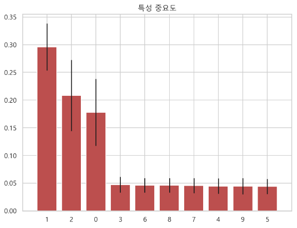

### 6-5. extra rf 모형을 사용하여 올리베티 이미지 분류 
- 이미지를 분류할 때 사용되는 독립변수는 픽셀이다.
- 특성 중요도를 이미지로 나타내면 픽셀의 중요도를 볼 수 있다.
    - 얼굴 부위의 어떤 부분에 중요도가 높고 낮은지 대략적으로 시각화 해 볼 수 있다.
- 눈썹, 눈 주위, 입 주변의 중요도가 상대적으로 높은 것으로 알 수 있다.

```python
from sklearn.datasets import fetch_olivetti_faces
from sklearn.ensemble import ExtraTreesClassifier

oli = fetch_olivetti_faces()
X, y = oli.data, oli.target

forest = ExtraTreesClassifier(n_estimators=1000, random_state=0).fit(X, y)
importances = forest.feature_importances_
importances = importances.reshape(oli.images[0].shape)

plt.figure(figsize=(8, 8))
plt.imshow(importances, cmap=plt.cm.bone_r)
plt.grid(False)
plt.title("픽셀 중요도 pixel importance")
plt.show();
```
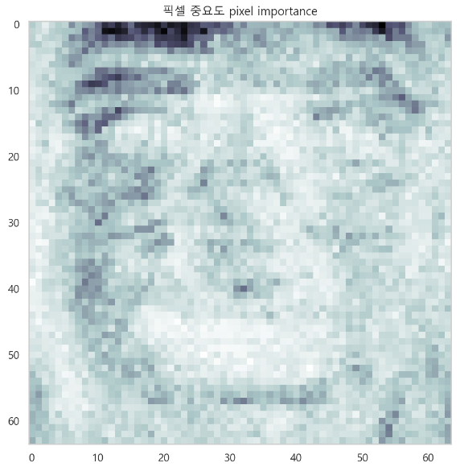


### 6-6. extra rf 모형을 사용하여 breast cancer 데이터 분류
- 500개의 tree를 사용한 extra rf

#### 교차 검증 후 acc 성능 측정

```python
from sklearn.datasets import load_breast_cancer
from sklearn.ensemble import ExtraTreesClassifier
from sklearn.model_selection import KFold, cross_val_score

bc = load_breast_cancer()
X, y = bc.data, bc.target

forest = ExtraTreesClassifier(n_estimators=500, random_state=0).fit(X, y)
cv = KFold(5, shuffle=True, random_state=0)
accuracy = cross_val_score(forest, X, y, scoring="accuracy", cv=cv)
mean_acc = accuracy.mean()
mean_acc

>>> print

0.9701754385964911
```

#### 변수 중요도 측정

```python
importances = forest.feature_importances_
indices = np.argsort(importances)
names = bc.feature_names[indices]
values = importances[indices]

plt.figure(figsize=(10, 10))
plt.barh(names, values)
plt.title("Brest Cancer Feature Importances")
plt.show() ;
```
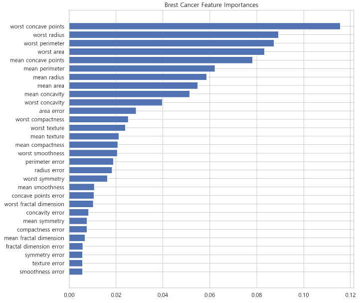


### 6-7. 그리드 서치를 사용하여 extra rf 모형 측정
- 시간 오래걸림

```python
from sklearn.pipeline import Pipeline
from sklearn.model_selection import GridSearchCV

estimators = [("clf", ExtraTreesClassifier())]
pipe = Pipeline(estimators)

param_grid = [{"clf__max_depth" : [1, 3, 5, 7, 9, 10, 11, 13]},
             {"clf__n_estimators" : [100, 200, 300, 400, 500, 600]},
             {"clf__random_state" : [0, 5, 7, 10, 13, 15]}]

gridcv = GridSearchCV(estimator=pipe, param_grid=param_grid, cv=5)
gridcv.fit(X, y)

>>> print

GridSearchCV(cv=5, estimator=Pipeline(steps=[('clf', ExtraTreesClassifier())]),
             param_grid=[{'clf__max_depth': [1, 3, 5, 7, 9, 10, 11, 13]},
                         {'clf__n_estimators': [100, 200, 300, 400, 500, 600]},
                         {'clf__random_state': [0, 5, 7, 10, 13, 15]}])
```


#### 가장 좋은 모형
- max_depth가 10인 모형의 성능이 가장 좋은 것으로 측정된다.

```python
gridcv.best_estimator_["clf"]

>>> print

ExtraTreesClassifier(max_depth=10)
```

#### 가장 높은 성능값

```python
gridcv.best_score_

>>> print

0.9701599130569788
```

#### 그리드 서치 결과

```python
gridcv_df = pd.DataFrame(gridcv.cv_results_)
gridcv_df[["params", "mean_test_score", "rank_test_score"]]\
.sort_values("rank_test_score", ascending=True)
```
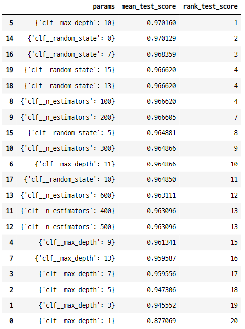


#### 변수 중요도 그래프

```python
best_ex_forest = gridcv.best_estimator_["clf"]
importance = best_ex_forest.feature_importances_
idx = np.argsort(importance)

names = bc.feature_names[idx]
values = importance[idx]

plt.figure(figsize=(10, 8))
plt.barh(names, values)
plt.show() ;
```
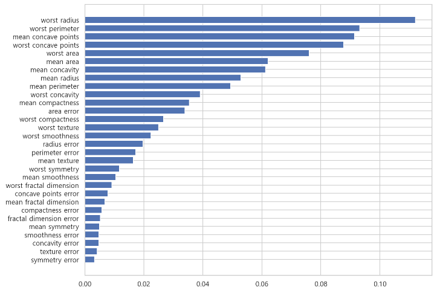


### 7. DT, RF, Extra RF 모형을 사용한 HAR 데이터 분류

### 7-1. 데이터 임포트

```python
## 독립변수의 이름 데이터
feature_name = pd.read_csv("../../04_machine_learning/ML_tutorial-master/ML_tutorial-master/dataset/HAR_dataset/features.txt", sep="\s+", header=None)

## train 데이터 임포트
X_train = pd.read_csv("../../04_machine_learning/ML_tutorial-master/ML_tutorial-master/dataset/HAR_dataset/train/X_train.txt", sep="\s+", header=None)
y_train = pd.read_csv("../../04_machine_learning/ML_tutorial-master/ML_tutorial-master/dataset/HAR_dataset/train/y_train.txt", sep="\s+", header=None)
## train 데이터의 독립변수 이름 변경
X_train.columns = feature_name[1].values

## test 데이터 임포트
X_test = pd.read_csv("../../04_machine_learning/ML_tutorial-master/ML_tutorial-master/dataset/HAR_dataset/test/X_test.txt", sep="\s+", header=None)
y_test = pd.read_csv("../../04_machine_learning/ML_tutorial-master/ML_tutorial-master/dataset/HAR_dataset/test/y_test.txt", sep="\s+", header=None)
## test 데이터의 독립변수 이름 변경
X_test.columns = feature_name[1].values
```

### 7-2. DT 모형의 성능

```python
from sklearn.tree import DecisionTreeClassifier
from sklearn.metrics import accuracy_score

tree = DecisionTreeClassifier(max_depth=4, random_state=3)
tree.fit(X_train, y_train)
pred = tree.predict(X_test)

print("acc test : {}".format(accuracy_score(y_test, pred)))

>>> print

acc test : 0.8096369189005769
```

### 7-3. DT + gridsearchcv
- max depth 값 실험

```python
from sklearn.model_selection import GridSearchCV

params = {"max_depth" : range(5, 26)}
grid_cv = GridSearchCV(estimator=tree, param_grid=params, scoring="accuracy",
                      cv=5, return_train_score=True)
grid_cv.fit(X_train, y_train)

cv_result_df = pd.DataFrame(grid_cv.cv_results_)
cv_result_df1 = cv_result_df[["params", "mean_test_score", "std_test_score", "mean_train_score", "std_train_score"]]\
.sort_values("mean_test_score", ascending=False)

cv_result_df1
```
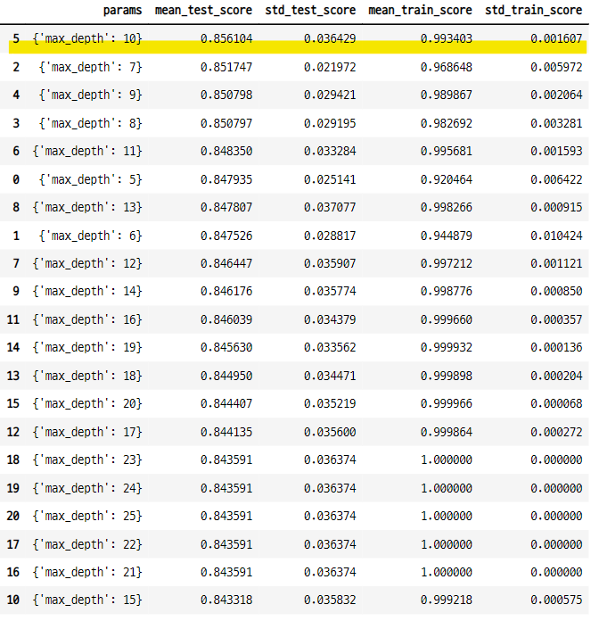

### 7-4. min samples leaf 값 실험
- 분할된 노드의 데이터 집합의 최소 수
- 이 파라미터는 현재 데이터 분류 성능에 영향을 주지 않는다.

```python
params2 = {"min_samples_leaf" : range(2, 11)}
grid_cv2 = GridSearchCV(estimator=tree, param_grid=params2, scoring="accuracy",
                       cv=5, return_train_score=True)
grid_cv2.fit(X_train, y_train)

cv_result_df2 = pd.DataFrame(grid_cv2.cv_results_)
cv_result_df2 = cv_result_df2[["params", "mean_test_score", "std_test_score", "mean_train_score", "std_train_score"]]\
.sort_values("mean_test_score", ascending=False)

cv_result_df2
```

### 7-5. random state 값 실험
- random state의 값을 10씩 증가시켜서 실험

```python
params3 = {"random_state" : range(0, 150, 10)}
grid_cv3 = GridSearchCV(estimator=tree, param_grid=params3, scoring="accuracy", cv=5, return_train_score=True)
grid_cv3.fit(X_train, y_train)

cv_result_df3 = pd.DataFrame(grid_cv3.cv_results_)
cv_result_df3 = cv_result_df3[["params", "mean_test_score", "std_test_score", "mean_train_score", "std_train_score"]]\
.sort_values("mean_test_score", ascending=False)

cv_result_df3
```
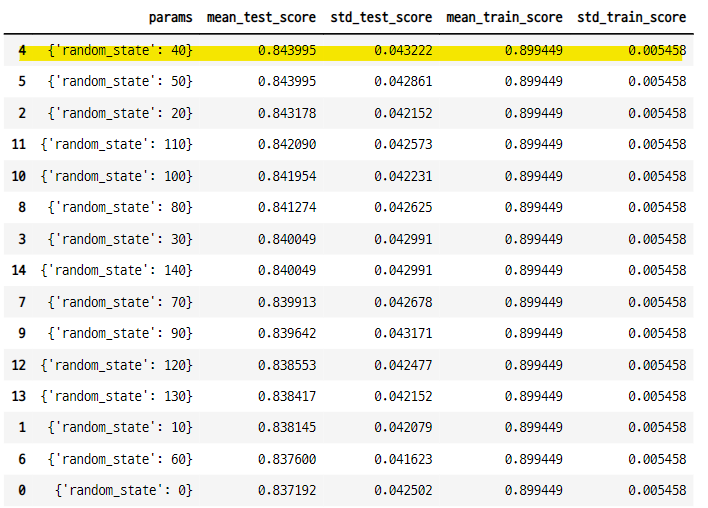

### 7-6. 높은 파라미터 값을 사용하여 모델링
- max_depth=10 만 사용한 모형보다 성능이 높아 졌다.
    - max_depth : 10
    - min_samples_leaf : 2
    - random_state : 40

```python
tree2 = DecisionTreeClassifier(max_depth=10, min_samples_leaf=2, random_state=40)
tree2.fit(X_train, y_train)
pred = tree2.predict(X_test)
accuracy_score(y_test, pred)

>>> print

0.8703766542246352
```

### 7-6. random state 값 실험 2
- 0부터 200까지 random state 값을 실험
- 파라미터를 어떻게 조합하여 사용하느냐에 따라서 모형의 성능이 달라진다.

```python
from tqdm import tqdm

rs_range = range(0, 201)
acc_test = []

for i in tqdm(rs_range, desc="test DT ", mininterval=0.01) :
    test_tree = DecisionTreeClassifier(max_depth=10, min_samples_leaf=2, random_state=i)
    test_tree.fit(X_train, y_train)
    pred = test_tree.predict(X_test)
    acc_test.append(accuracy_score(y_test, pred))

test DT : 100%|██████████| 201/201 [09:14<00:00,  2.76s/it]    
```

#### random state 값에 따른 성능 그래프

```python
plt.figure(figsize=(12, 5))
plt.plot(acc_test)
plt.show() ;
```
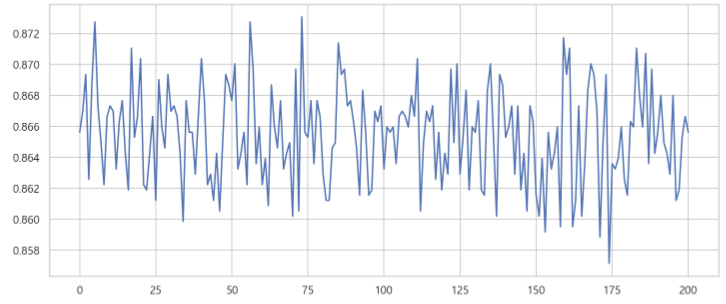

#### 가장 성능이 높은 random state

```python
top_idx = np.array(acc_test).argmax()
top_idx 

>>> print

73

acc_test[top_idx]

>>> print

0.8730912792670512
```

### 7-7. 성능이 높은 파라미터를 조합하여 성능 측정
- max_depth=10, min_samples_leaf=2, random_state=40 모형보다 성능이 조금 향상 되었다.
    - max_depth=10
    - min_samples_leaf=2
    - random_sate=73

```python
new_tree = DecisionTreeClassifier(max_depth=10, random_state=73, min_samples_leaf=2)
new_tree.fit(X_train, y_train)
pred = new_tree.predict(X_test)
accuracy_score(y_test, pred)

>>> print

0.8730912792670512
```

### 7-8. 특성 중요도 그래프

```python
top_feature_df = pd.DataFrame({"features" : X_test.columns, "val" : new_tree.feature_importances_}, columns=["features", "val"])
top_feature_df = top_feature_df.sort_values("val", ascending=False)[:20]

plt.figure(figsize=(8, 6))
sns.barplot(x=top_feature_df["val"], y=top_feature_df["features"])
plt.show() ;
```
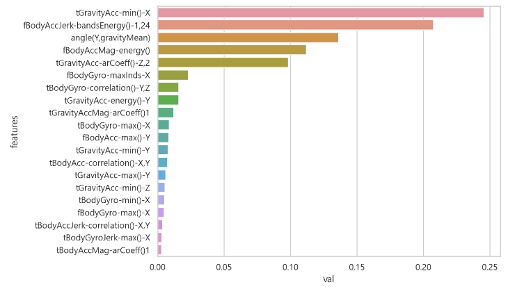


### 7-9. RF 모형 실험
- pipeline 과 그리드서치 사용하여 파라미터 값 실험
    - 파라미터 값들을 조합하여 성능을 측정한다.
- DT 개별모형 보다 RF 취합 모형의 성능이 더 높은 것을 알 수 있다.

```python
from sklearn.ensemble import RandomForestClassifier
from sklearn.pipeline import Pipeline

params = {"max_depth" : [10, 15, 20],
         "n_estimators" : [50, 100, 150, 200],
         "min_samples_leaf" : [4, 8, 10]}

rf = RandomForestClassifier()
grid_cv_rf = GridSearchCV(estimator=rf, param_grid=params, cv=5, n_jobs=2)
grid_cv_rf.fit(X_train, y_train)

>>> print

GridSearchCV(cv=5, estimator=RandomForestClassifier(), n_jobs=2,
             param_grid={'max_depth': [10, 15, 20],
                         'min_samples_leaf': [4, 8, 10],
                         'n_estimators': [50, 100, 150, 200]})
```

#### 모형 결과
- 성능이 높은 20개의 모형

```python
rf_cv_result_df = pd.DataFrame(grid_cv_rf.cv_results_).sort_values("mean_test_score", ascending=False
rf_top_df = rf_cv_result_df[["rank_test_score", "param_max_depth", "param_min_samples_leaf", "param_n_estimators", "mean_test_score", "std_test_score"]][:20]
rf_top_df
```
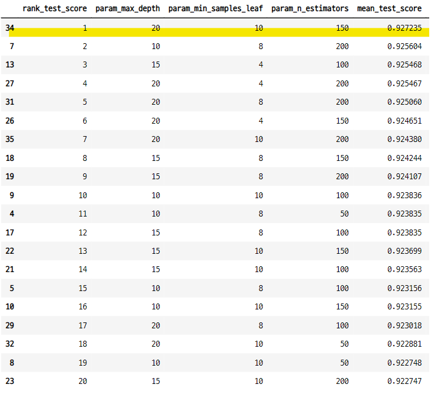


#### 검증 데이터 성능

```python
pred = grid_cv_rf.best_estimator_.predict(X_test)
accuracy_score(y_test, pred)

>>> print

0.9202578893790295
```

#### 특성 중요도 그래프
- 모형 마다 특성 중요도는 바뀐다.

```python
best_f_impor = grid_cv_rf.best_estimator_.feature_importances_
rf_top_idx = best_f_impor.argsort()[::-1][:20]
f_names = X_train.columns[rf_top_idx]
values = best_f_impor[rf_top_idx]

plt.figure(figsize=(10, 10))
plt.barh(f_names, values[::-1])
plt.title("RF : {}".format(grid_cv_rf.best_params_), fontsize=15, y=1.03)
plt.show() ; 
```
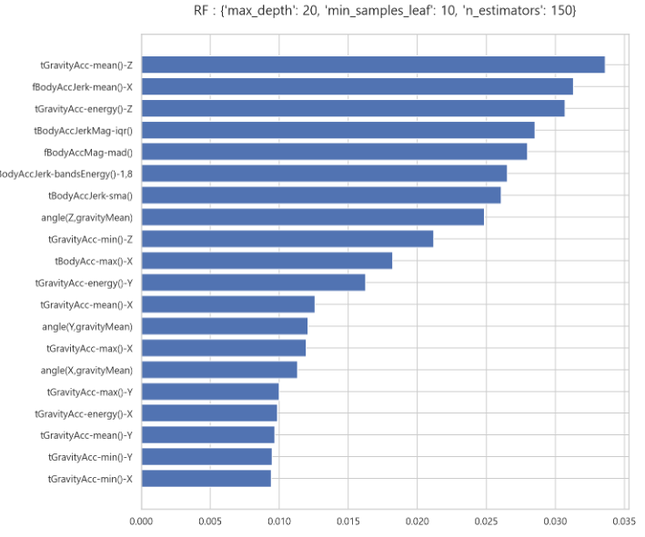

### 7-10. RF pipeline에 random state 파라미터 추가하여 실험
- random state를 0으로 한 모형 실험과 성능이 크게 달라지지 않는다.

```python
params2 = {"max_depth" : [10, 15, 20],
         "n_estimators" : [50, 100, 150, 200],
         "min_samples_leaf" : [4, 8, 10],
         "random_state" : [3, 8, 13]}

rf2 = RandomForestClassifier(n_jobs=1)
grid_cv_rf_2 = GridSearchCV(rf2, param_grid=params2, cv=5, n_jobs=1,
                            return_train_score=True)
grid_cv_rf_2.fit(X_train, y_train)

>>> print

GridSearchCV(cv=5, estimator=RandomForestClassifier(n_jobs=1), n_jobs=1,
             param_grid={'max_depth': [10, 15, 20],
                         'min_samples_leaf': [4, 8, 10],
                         'n_estimators': [50, 100, 150, 200],
                         'random_state': [3, 8, 13]},
             return_train_score=True)
```

#### 모형 결과

```python
grid_cv_rf_2_result_df = pd.DataFrame(grid_cv_rf_2.cv_results_).sort_values("mean_test_score", ascending=False)
rf_top_df_2 = grid_cv_rf_2_result_df[["rank_test_score", "param_max_depth", "param_min_samples_leaf", "param_n_estimators", "param_random_state", "mean_test_score", "std_test_score", "mean_train_score", "std_train_score"]][:20]
rf_top_df_2
```
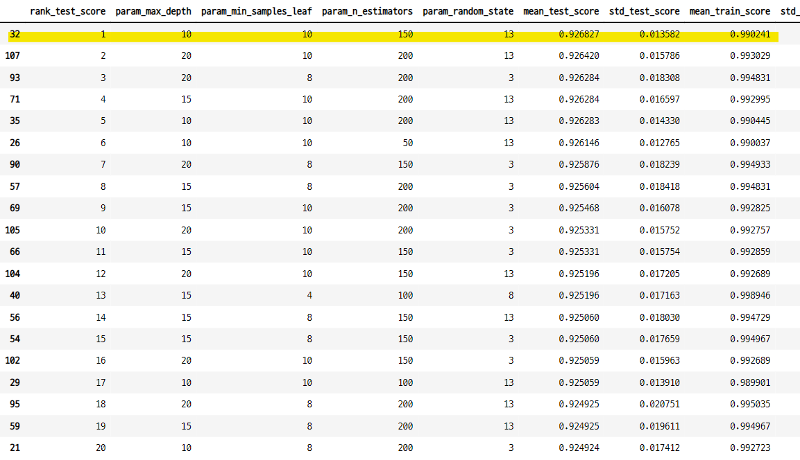

#### 검증 데이터 성능

```python
accuracy_score(y_test, grid_cv_rf_2.predict(X_test))

>>> print

0.9202578893790295
```

### 7-11. Extra randomstate 실험
- RF 모형보다 성능이 더 좋다.

```python
from sklearn.ensemble import ExtraTreesClassifier

ex_rf = ExtraTreesClassifier(n_estimators=1000, random_state=0)
ex_rf.fit(X_train, y_train)

accuracy_score(y_test, ex_rf.predict(X_test))

>>> print

0.9423142178486597
```

### 7-12. 그리드 서치를 적용한 Extra RF 모형 실험
- n_estimators=1000, random_state=0 모형 보다 성능이 떨어진다.
    - 그리드서치는 파라미터의 범위를 어떻게 설정하는지가 중요함.
- 시간 오래 걸림

```python
params = {"min_samples_leaf" : [1, 2, 3, 4, 5],
           "random_state" : [0, 3, 5, 8],
           "n_estimators" : [100, 250, 500, 750, 1000],
           "max_depth" : [10, 15, 20]}

ex_rf_2 = ExtraTreesClassifier()
grid_cv_ex_rf = GridSearchCV(ex_rf_2, param_grid=params, cv=5, return_train_score=True, n_jobs=2)
grid_cv_ex_rf.fit(X_train, y_train)

>>> print

GridSearchCV(cv=5, estimator=ExtraTreesClassifier(), n_jobs=2,
             param_grid={'max_depth': [10, 15, 20],
                         'min_samples_leaf': [1, 2, 3, 4, 5],
                         'n_estimators': [100, 250, 500, 750, 1000],
                         'random_state': [0, 3, 5, 8]},
             return_train_score=True)
```

#### 가장 성능이 좋은 모형의 파라미터

```python
grid_cv_ex_rf.best_estimator_

>>> print

ExtraTreesClassifier(max_depth=20, min_samples_leaf=3, n_estimators=250,
                     random_state=8)
```

#### 모형 결과

```python
grid_cv_ex_rf_result_df = pd.DataFrame(grid_cv_ex_rf.cv_results_).sort_values("mean_test_score", ascending=False)
grid_cv_ex_rf_result_df = grid_cv_ex_rf_result_df[["rank_test_score", "param_max_depth", "param_min_samples_leaf", "param_n_estimators", "param_random_state", "mean_test_score", "std_test_score", "mean_train_score", "std_train_score"]][:20]
grid_cv_ex_rf_result_df
```
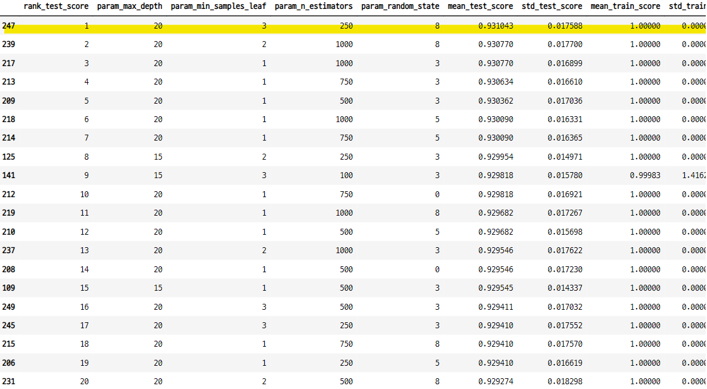


#### 검증 데이터 성능

```python
accuracy_score(y_test, grid_cv_ex_rf.best_estimator_.predict(X_test))

>>> print

0.9379029521547336
```

#### n_estimators=1500 인 모형의 성능

```python
ex_rf3 = ExtraTreesClassifier(n_estimators=1500, random_state=0)
ex_rf3.fit(X_train, y_train)

accuracy_score(y_test, ex_rf3.predict(X_test))

>>> print

0.9423142178486597
```
