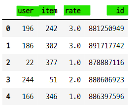
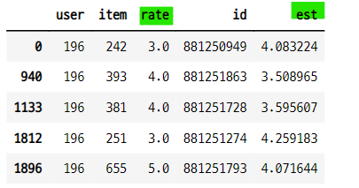
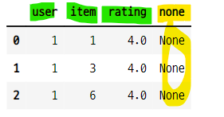
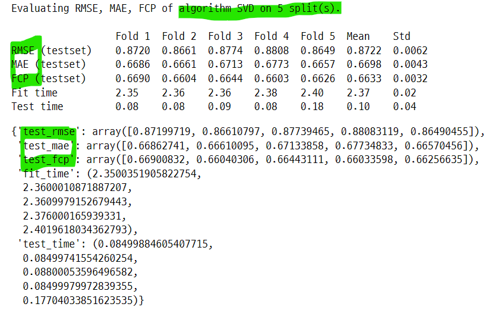
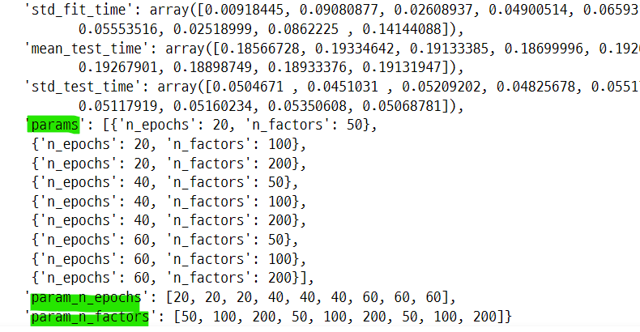
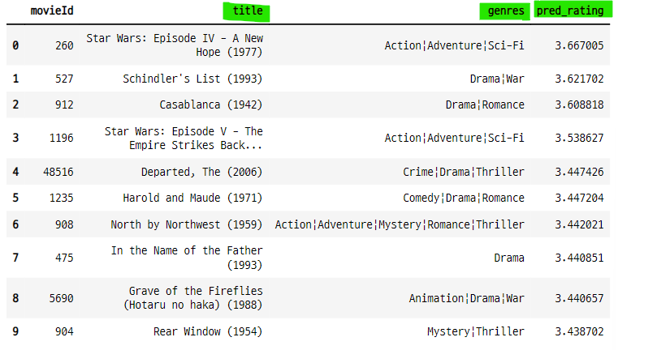
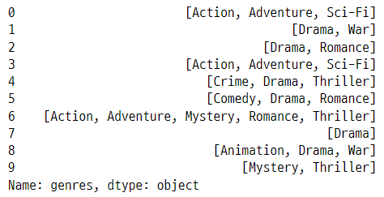
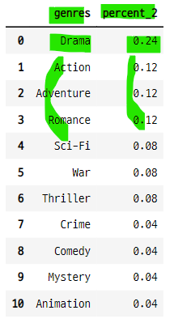
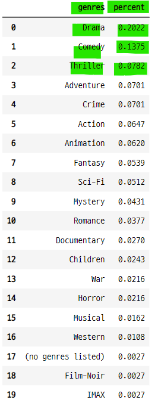
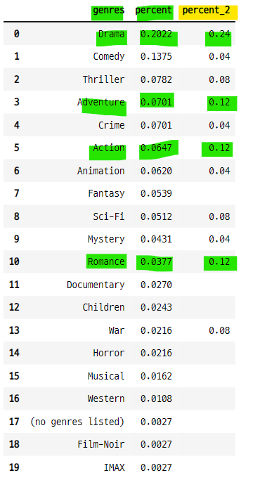

# 추천 시스템 : surprise 패키지를 사용한 추천 시스템

### 1. 데이터 임포트

### 1-1. 패키지 임포트
- Dataset 패키지는 내장 파일을 불러오거나 외부 파일을 읽을 때 사용
    - 인덱스, 헤더값이 없는 데이터, 데이터 프레임 등을 읽어 올 수 있다.

```python
import surprise
from surprise import Dataset
```

### 1-2. 데이터 임포트
- surprise 패키지에 내장 된 평점 데이터 사용

```python
data = Dataset.load_builtin("ml-100k")
df = pd.DataFrame(data.raw_ratings, columns=["user", "item", "rate", "id"])
df.head()
```


### 2. 훈련, 검증 데이터 분리
- surprise 패키지의 서브 패키지로 데이터 분리 패키지를 사용
    - 학습, 검증 데이터를 분리하지 않고 전체 데이터를 학습 데이터로 사용할 수도 있다.
    - Dataset 패키지 사용

```python
from surprise.model_selection import train_test_split

train_set, test_set = train_test_split(data, test_size=.25, random_state=0)
```

### 3. SVD 를 이용한 잠재 요인 협업 필터링 수행
- SVD 모델은 추천 시스템의 한 방법으로 잠재 요인 모델 (Latent Factorization Model) 에 속한다.
    - 평점 데이터를 특잇값 분해하여 유사한 행렬을 구하는 방식

```python
from surprise import SVD

algo = SVD(n_factors=100)
algo.fit(train_set)

>>> print

<surprise.prediction_algorithms.matrix_factorization.SVD at 0x277ec1d2048>
```

### 4. test 매서드의 기능
- 사용자-아이템 평점 데이터 세트 전체에 대해서 추천을 수행함
    - 비어 있는 평점 뿐만 아니라 이미 채워져 있는 평점도 예측값을 계산한다.

```python
predictions = algo.test(test_set)
print("prediction type : ", type(predictions), "// size : ", len(predictions))
print("===prediction 결과의 최초 5개 추출===")
predictions[:5]

>>> print

prediction type :  <class 'list'> // size :  25000
===prediction 결과의 최초 5개 추출===
[Prediction(uid='120', iid='282', r_ui=4.0, est=3.4442572603282544, details={'was_impossible': False}),
 Prediction(uid='882', iid='291', r_ui=4.0, est=3.6025908125948827, details={'was_impossible': False}),
 Prediction(uid='535', iid='507', r_ui=5.0, est=4.19022549825747, details={'was_impossible': False}),
 Prediction(uid='697', iid='244', r_ui=5.0, est=3.451143911147392, details={'was_impossible': False}),
 Prediction(uid='751', iid='385', r_ui=4.0, est=3.2225600934092125, details={'was_impossible': False})]
```

- user_id : 120, item_id : 282 의 실제 평점
    - 예측 평점 est=3.4442572603282544 와 차이가 있다.

```python
df[(df["user"]=="120") & (df["item"]=="282")]
```


### 5. 예측결과의 요소들 확인
- uid : 유저 아이디
- iid : 아이템 아이디
- r_ui : 실제 평점
- est : 예측 평점

#### 첫 번째 예측 데이터 조회

```python
predictions[0]

>>> print

Prediction(uid='120', iid='282', r_ui=4.0, est=3.4442572603282544, details={'was_impossible': False})
```

#### 예측 데이터의 인수를 사용하여 데이터 조회
- (유저 아이디, 아이템 아이디, 예측 평점)

```python
[(pred.uid, pred.iid, pred.est) for pred in predictions[:30]]

>>> print

[('120', '282', 3.4442572603282544),
 ('882', '291', 3.6025908125948827),
 ('535', '507', 4.19022549825747),
 ('697', '244', 3.451143911147392),
 ('751', '385', 3.2225600934092125),
 ('219', '82', 3.73818813116476),
 ('279', '571', 2.6213033215562036),
 ('429', '568', 3.2082817388761695),
 ('456', '100', 4.027618581453602),
 ('249', '23', 4.467341006562466),
 ('493', '183', 4.4301003838868995),
 ('325', '469', 3.3971717980138014),
 ('631', '682', 3.248872470335579),
 ('276', '121', 2.8066185409829547),
 ('269', '405', 1.3312471416795366),
 ('159', '1095', 3.3983091673017363),
 ('385', '965', 3.3134425402065233),
 ('21', '358', 2.1722506264475188),
 ('181', '1359', 1.7279635836437952),
 ('561', '124', 3.9779876160949295),
 ('658', '1079', 2.47162567853869),
 ('354', '269', 4.054684938345977),
 ('325', '483', 3.7504559215494906),
 ('601', '241', 2.812135884033849),
 ('409', '1020', 3.7101803880023017),
 ('801', '300', 4.44116453745419),
 ('289', '21', 2.6109246339608374),
 ('378', '896', 3.6179951088404465),
 ('609', '294', 1.8035880798527524),
 ('442', '452', 2.313046849952097)]
```

### 6. predict 매서드의 기능
- 새로운 데이터인 개별 사용자와 개별 영화에 대한 추천 평점을 반환한다.
    - uid와 iid는 문자열 타입으로 입력한다.
- user 196은 302 아이템에 대해서 평점을 매기지 않았다.
    - 이것을 예측해준다.

#### 비어 있는 평점 조회
- 유저 아이디 196은 아이템 아이디 302에 대해서 평점을 매기지 않았다.

```python
df[(df["user"]=="196") & (df["item"]=="302")]
```

#### predict 매서드를 사용하여 평점 예측

```python
uid = str(196)
iid = str(302)
pred = algo.predict(uid, iid)

print(pred)

>>> print

user: 196        item: 302        r_ui = None   est = 4.44   {'was_impossible': False}
```

### 7. 196 유저의 평점과 예측 평점 비교
- 유저 196이 평가한 영화의 아이디에 대해서 예측 평점 측정
    - 실제 평점과 예측 평점의 차이가 크다.


```python
df_196 = df[df["user"]=="196"]

uid = 196
est_list = []

for iid in df_196["item"].values :
    pred = algo.predict(uid, iid)
    est_list.append(pred.est)

df_196["est"] = est_list
df_196.head()    
```


### 8. 모델 성능
- surprise 패키지의 accuracy 서브 패키지를 사용
    - rmse, mae, fcp 의 성능 측정 매서드를 사용할 수 있다.
- 성능 지표에 따라서 모델의 성능 값이 차이가 난다.
    - rmse : 실제 평점과 예측 평점의 차이의 제곱합을 데이터셋 크기값으로 나누고 루트 변환한 값
    - mae : 실제 평점과 예측 평점의 차이의 절대값을 합하고 데이터셋 크기값으로 나눈 값
    - fcp : 실제 평점의 증가 방향과 예측 평점의 증가 방향을 측정하고 같은 것과 다른 것의 갯수의 비율 값
- **어떤 지표가 더 적합한지에 대해서 알아 볼 것**

```python
from surprise import accuracy

accuracy.rmse(predictions)

>>> print

RMSE: 0.9487
0.9486951242282712

accuracy.mae(predictions)

>>> print

MAE:  0.7462
0.7462487965308544

accuracy.fcp(predictions)

>>> print

FCP:  0.7002
0.7002312658293754
```

### 9. 교차 검증 패키지 사용
- surprise 패키지의 cross_validate 서브 패키지 사용
    - 학습, 검증 데이터를 여러 조합으로 나누어 모델을 훈련 시켜준다.

```python
from surprise.model_selection import cross_validate

cross_val_svd = cross_validate(algo, data, measures=["rmse", "mae", "fcp"])

print(cross_val_svd["test_rmse"].mean())
print(cross_val_svd["test_mae"].mean())
print(cross_val_svd["test_fcp"].mean())

>>> print

0.9359656665635349
0.7377494191073741
0.6990342154748403
```

### 10. surprise 패키지로 여러가지 데이터 사용하기
- 인덱스와 헤더값이 없는 파일이나, 데이터 프레임을 사용할 수 있다.
    - 사용 방식이 다름
- **Reader 패키지로 파일을 읽는 방식을 설정한다.**
    - from surprise import Reader
    - Reader(rating_scale=(0.5, 5))
- **인덱스와 헤더값이 없는 파일을 임포트한다.**
    - Dataset.load_from_file(file_path, reader)
- **데이터 프레임을 임포트 한다.**
    - Dataset.load_from_df(df[["col1", "col1"]], reader)    


### 10-1. 평점 데이터를 인덱스와 헤더값을 없애고 저장

```python
ratings.to_csv("./ratings_2.csv", index=False, header=False)

!ls

>>> print

01_recommendation_system.ipynb
02_recommendation_cosine_similarity_movie.ipynb
ratings_2.csv
```

### 10-2. Reader 패키지로 파일 임포트
- Reader 패키지로 인덱스와 헤더값이 없는 파일을 읽는다.
    - rating_scale : 평점의 최대-최소값 설정
- **Dataset.load_from_file(file_path, reader)**
    - 패키지의 reader 인수의 값으로 설정한다.   
- 파일의 컬럼이 userid, movieid, rate 이므로 Reader에서 line_format에 이 값을 설정한다.

```python
from surprise import Reader

reader = Reader(line_format="user item rating", sep=",", rating_scale=(0.5, 5))
new_data = Dataset.load_from_file("./ratings_2.csv", reader=reader)
new_data_df = pd.DataFrame(new_data.raw_ratings, columns=["user", "item", "rating", "none"])

new_data_df.head(3)
```



### 10-3. SVD(singular value decomposition)
- 모델 훈련, 예측

```python
trainset, testset = train_test_split(new_data, test_size=0.25, random_state=0)
algo = SVD(n_factors=50, random_state=13)

algo.fit(trainset)
predictions = algo.test(testset)

len(predictions)

>>> print

25209
```

### 10-4. 성능 값 확인

```python
accuracy.rmse(predictions)

>>> print

RMSE: 0.8671
0.8671265529441645

accuracy.mae(predictions)

>>> print

MAE:  0.6668
0.6668415050477821

accuracy.fcp(predictions)

>>> print

FCP:  0.6710
0.6709544343009973
```

### 10-5. ratings 데이터 프레임을 바로 사용할 수 있다.
- Reader 값 설정 후 Dataset.load_from_df() 패키지를 사용하여 임포트 할 수 있다.

```python
reader2 = Reader(rating_scale=(0.5, 5))
new_data_3 = Dataset.load_from_df(ratings[["userId", "movieId", "rating"]], reader=reader2)

trainset, testset = train_test_split(new_data_3, test_size=0.25, random_state=0)

algo = SVD(n_factors=50, random_state=13)
algo.fit(trainset)
predictions = algo.test(testset)

accuracy.rmse(predictions)

>>> print

RMSE: 0.8671
0.8671265529441645
```

### 10-6. surprise 패키지의 crossvalidation 사용

```python
from surprise.model_selection import cross_validate

cross_validate(algo, new_data_3, measures=["rmse", "mae", "fcp"], cv=5, verbose=True)
```



### 10-7. surprise 패키지의 gridsearchCV 사용
- surprise 패키지의 GridSearchCV 서프 패키지를 사용
    - SVD의 n_epochs와 n_factors 파라미터 값을 여러가지로 변경하여 테스트 

```python
from surprise.model_selection import GridSearchCV

## 하이퍼파라미터 테스트 값 설정 : 딕셔너리
param_grid = {"n_epochs" : [20, 40, 60], "n_factors" : [50, 100, 200]}

## param_grid 인수의 값으로 설정
gs = GridSearchCV(SVD, param_grid, measures=["rmse", "mae", "fcp"], cv=3)

## 모델 훈련
gs.fit(new_data_3)
```

#### GridSearchCV의 여러가지 값 확인
- 베스트 스코어와 베스트 파람스를 확인 할 수 있다.
    - 이 외에도 여러가지 값 확인 가능
- 이 모델의 최적의 하이퍼 파라미터는 n_epochs=20, n_factors=50 이라는 것을 알 수 있다.

```python
gs.best_score["rmse"], gs.best_params["rmse"]

>>> print

(0.8772543523342748, {'n_epochs': 20, 'n_factors': 50})

gs.best_score["mae"], gs.best_params["mae"]

>>> print

(0.674212541512958, {'n_epochs': 20, 'n_factors': 50})

gs.best_score["fcp"], gs.best_params["fcp"]

>>> print

(0.6610759791726603, {'n_epochs': 20, 'n_factors': 50})
```
- GridSearchCV 결과값 전체 확인

```python
gs.cv_results
```


### 11. 영화 추천 시스템
- surprise 패키지에 파일 임포트
- 모델 생성, 학습
    - 어떤 모델을 사용할 것인가? : SVD 모델 사용
    - 어떤 파라미터를 사용할 것인가? : GridSearchCV의 best_params 사용
- 모델 예측
    - 어떤 유저를 입력하면, 유저가 평가한 영화가 아닌 다른 영화들에 대한 평점 예측치를 계산한다.
- 이 예측치 값들 중 높은 것을 추천 해준다.

### 11-1. 데이터 임포트

```python
ratings_df = pd.read_csv("../../04_machine_learning/ml-latest-small/ml-latest-small/ratings.csv")
movies_df = pd.read_csv("../../04_machine_learning/ml-latest-small/ml-latest-small/movies.csv")
```

### 11-2. Reader 패키지 셋팅
- DatsetAutoFolds()는 인덱스와 헤더값이 없는 데이터를 사용해야한다.
- 따라서 reader에서 이 파일의 헤더값을 셋팅해주어야 한다.

```python
from surprise.dataset import Reader
from surprise.dataset import Dataset
import surprise

reader = Reader(line_format="user item rating", sep=",", rating_scale=(0.5, 5))
```

### 11-3 전체 데이터를 학습데이터로 사용하기
- 인덱스와 헤더값이 없는 데이터를 사용
    - from surprise.dataset import DatasetAutoFolds(file_path, reader)

```python
from surprise.dataset import DatasetAutoFolds

data_folds = DatasetAutoFolds(ratings_file="./ratings_2.csv", reader=reader)
```

### 11-4. 학습데이터 생성
- DatasetAutoFolds() 변수의 build_full_trainset() 매서드를 사용하여 학습 데이터를 생성한다.
    - ratings 데이터를 학습, 검증 데이터 구분없이 전체를 학습 데이터로 사용하기 위함

```python
train_set = data_folds.build_full_trainset()
```

### 11-5. surprise 패키지의 SVD 모델 생성
- SVD 모델 생성
    - 파라미터는 GridSearchCV의 best_params를 사용
    - n_epochs=20, n_factors=50


```python
from surprise import SVD

algo = SVD(n_epochs=20, n_factors=50, random_state=13)
```

### 11-5. SVD 모델 학습
- DatasetAutoFolds() 로 만든 전체 학습 데이터를 사용하여 훈련

```python
algo.fit(train_set)
```

### 11-6. 유저별 평점 데이터 분석 함수
- 유저별 평점을 입력한 영화의 수 출력
    - count_user_T_mv
- 유저별 평점을 입력하지 않은 영화의 수 출력
    - count_user_F_mv
- 유저별 평점을 입력하지 않은 영화 아이디 반환 
    - user_F_mv_list

```python
def user_non_rating_mv(rat_df, mv_df, userid) :

    ## 평점 데이터(rat_df)와 영화 데이터(mv_df), userid(사용자 id)를 파라미터로 받는다.
    ## 유저의 평점 데이터 분석 결과를 반환한다.

    ## 유저가 평점을 매긴 영화의 수
    count_user_T_mv = rat_df.groupby("userId")["movieId"].count()[userid]
    ## 전체 영화의 수
    count_total_mv = mv_df.shape[0]
    ## 유저가 평점을 매기지 않은 영화의 수 : 전체 영화 수 - 평점 영화 수
    count_user_F_mv = count_total_mv - count_user_T_mv

    ## 유저가 평점을 매긴 영화의 아이디
    user_T_mv_list = rat_df[rat_df["userId"]==userid]["movieId"].values
    ## 유저가 평점을 매기지 않은 영화의 아이디
    user_F_mv_list = mv_df[~mv_df["movieId"].isin(user_T_mv_list)]["movieId"].values

    print("{0} 유저가 평점을 준 영화의 수 : {1}, 평점을 주지 않은 영화의 수 : {2}".format(userid, count_user_T_mv, count_user_F_mv))

    return user_T_mv_list, user_F_mv_list
```

- 유저 아이디 설정 후 함수 호출

```python
user_id = 50
user_T_mv, user_F_mv = user_non_rating_mv(ratings_df, movies_df, user_id)

>>> print

50 유저가 평점을 준 영화의 수 : 310, 평점을 주지 않은 영화의 수 : 9432
```

- user가 평가한 영화의 아이디와 평가하지 않은 영화의 아이디
    - user_non_rating_mv() 함수의 결과 값

```python
user_T_mv.shape, user_F_mv.shape

>>> print

((310,), (9432,))
```

### 11-7. 아이템 기반으로 추천 된 영화리스트를 반환하는 함수
- 50 user가 평가하지 않은 영화 리스트에 대한 예측 평점 측정
- 영화 아이디와 예측 평점으로 이루어진 데이터 프레임 생성
- 영화 데이터와 예측 평점 데이터를 병합하여 영화 제목과 예측 평점으로 이루어진 데이터 프레임 생성 후 반환
    

```python
def recommend_mv_surprise(f_lst, mv_df, userid) :

    ## 유저가 평점을 매기지 않은 영화 리스트를 파라미터로 받는다. : f_lst
    ## SVD 모델로 user의 영화 평점 예측
    u_id = str(userid)
    est_lst = [algo.predict(u_id, str(itemid)).est for itemid in f_lst]
    ## 영화별 예측 평점 데이터 프레임
    temp_df = pd.DataFrame({"movieId" : f_lst, "pred_rating" : est_lst}, columns=["movieId", "pred_rating"])

    ## 예측 평점 데이터와 영화 데이터를 병합
    ## 예측 평점이 높은 10개의 영화 데이터를 반환한다.
    recommend_df = pd.merge(temp_df, movies_df, on="movieId")[["movieId", "title", "genres", "pred_rating"]]
    recommend_df = recommend_df.sort_values("pred_rating", ascending=False).reset_index(drop=True)[:10]

    return recommend_df
```

- 함수 호출

```python
result_recommend = recommend_mv_surprise(user_F_mv, movies_df, user_id)
result_recommend
```


### 11-8. SVD 모델의 결과와 장르 데이터 비교를 위한 함수 생성
- SVD 모델은 평점 데이터에서 예측 평점을 측정한다.
- 이 예측 결과를 user id 50이 높게 평가한 영화들의 장르와 비교 해본다.

#### 영화 데이터에서 장르 데이터를 전처리 하는 함수
- user 50의 예층 평점 데이터에서 장르를 전처리 함
- "a|b|c" -> ["a", "b", "c"] 로 변환


```python
def trans_word(data) :

    ## "|" 으로 구분 된 장르 데이터를 말뭉치화 하고 하나로 합쳐준다.
    word_lst = []
    non_char = ""
    for char in data :
        if char != "|" :
            non_char += char
        else :
            word_lst.append(non_char)
            non_char = ""

    ## 단어가 하나인 경우 리스트에 넣는다.
    if len(word_lst) == 0 :
        word_lst.append(non_char)

    ## 전체 문장의 마지막에는 "|" 없으므로, 마지막 단어를 리스트에 넣는다.
    else :
        word_lst.append(non_char)

    return word_lst
```

- 함수 호출

```python
result_genres = result_recommend["genres"].apply(lambda x : trans_word(x))
result_genres
```



#### 장르 단어 별 비중을 계산하는 함수
- 예측 평점 데이터에서 장르의 비중을 계한한다.

```python
def calc_genres_per(data) :

    ## 영화 별(행 별) 장르 데이터를 하나의 리스트로 합쳐준다.
    def sum_word(genres_series) :
        lst = []
        for i in range(len(genres_series)-1) :
            lst += genres_series[i]
        return lst

    word_lst = sum_word(data)

    ## 장르 단어별로 갯수를 계산한다.
    count_word = Counter(word_lst)

    ## 장르 단어와 갯수를 데이터 프레임으로 만들고, 비중을 구한다.
    genres_per_df = pd.DataFrame({"genres" : count_word.keys(), "percent" : count_word.values()})
    genres_per_df["percent"] = round(genres_per_df["percent"] / genres_per_df["percent"].sum(), 4)
    genres_per_df = genres_per_df.sort_values("percent", ascending=False).reset_index(drop=True)

    #len_word_lst = len(word_lst)
    #for k, v in enumerate(count_word) :
        #print("{} : {}".format(v, round(count_word[v] / len_word_lst, 3)))

    return genres_per_df
```

- 함수 호출

```python
result_genres_per = calc_genres_per(result_genres)
result_genres_per = result_genres_per.rename(columns={"percent":"percent_2"})
result_genres_per
```


#### user가 평가한 기존 데이터에서 높은 평점 영화의 장르 비중 계산

```python
def user_rating_genres_percent(rat_df, mv_df, t_mv, userid) :

    ## 유저가 평가한 영화 데이터
    user_t_mv_df = mv_df[mv_df["movieId"].isin(t_mv)]
    ## 유저의 평점 데이터
    userid = int(userid)
    user_t_rating = rat_df[rat_df["userId"]==userid][["movieId", "rating"]]
    ## 유저의 평가 영화 데이터와 평점 데이터를 병합
    user_t_mv_df = pd.merge(user_t_mv_df, user_t_rating, on="movieId")
    ## 유저가 평가 점수를 높게 준 영화 150개
    user_t_mv_df = user_t_mv_df.sort_values("rating", ascending=False)[:150]

    ## 영화 데이터에서 genres 들을 말뭉치화하고 인덱스 재정렬
    ## trans_word() 함수를 사용하여 genres 데이터 전처리 : Adventure|Animation -> ["Adventure", "Animation"]
    user_t_genres = user_t_mv_df["genres"].apply(lambda x : trans_word(x))
    user_t_genres = user_t_genres.reset_index(drop=True)

    ## 장르의 단어별 비중을 데이터 프레임으로 반환한다.
    ## calc_genres_per() 함수
    df = calc_genres_per(user_t_genres)

    return df
```

- 함수 호출

```python
result_user_t_genres = user_rating_genres_percent(ratings_df, movies_df, user_T_mv, user_id)
result_user_t_genres
```



#### SVD 모델의 예측 평점 영화(user가 평가하지 않은 영화)와 user 가 평가한 영화의 장르 비증 비교
- SVD 모델의 평점 예측은 장르의 유사도로 측정되는 것이 아니지만, user 50이 평가한 영화들 중 평점을 높게 준 영화들의 장르의 비중과 어느정도 비슷한 것을 알 수 있다.
    - 오히려 장르간의 비교는 장르의 유사도를 측정한 결과와 비교해야 예측이 정확한지 비교할 수 있다.

```python
compered_result = pd.merge(result_user_t_genres, result_genres_per, how="outer")
compered_result.fillna("")
```



### 12. SVD 를 사용한 평점 예측 다른 접근 방법
- 다른 사람이 만든 SVD 추천 시스템
- 데이터 전처리 과정이 간결하다.

### 12-1. user 9의 평점 영화 아이디 조회
- 인덱스와 영화 아이디

```python
movieIds = ratings_df[ratings_df["userId"]==9]["movieId"]
movieIds

>>> print

1073      41
1074     187
1075     223
1076     371
1077     627
1078     922
1079     923
1080    1037
1081    1095
1082    1198
1083    1270
1084    1674
...
```

### 12-2. user 9가 movie 42를 평가했는지 확인

```python
if movieIds[movieIds==42].count() == 0 :
    print("user id=9 인 사람은 movie id=42에 대한 평점이 없음")

>>> print

user id=9 인 사람은 movie id=42에 대한 평점이 없음
```

### 12-3. movie 42의 데이터 확인

```python
print(movies_df[movies_df["movieId"]==41])

>>> print

    movieId               title     genres
37       41  Richard III (1995)  Drama|War
```

### 12-4. 유저간 본 영화의 아이디 리스트
- 유저가 본 영화 = 유저가 평가한 영화
- tolist() : 시리즈 데이터에서 value 만 리스트에 담을 수 있다.

```python
user_id = 9
seen_movies = ratings_df[ratings_df["userId"]==user_id]["movieId"].tolist()
seen_movies

>>> print

[41,
 187,
 223,
 371,
 627,
 922,
 923,
 1037,
 1095,
 1198,
 1270,
 1674,
 1987,
 2011,
...]
```

### 12-5. 전체 영화 아이디 리스트

```python
total_movies = movies_df["movieId"].tolist()
total_movies

>>> print

[1,
 2,
 3,
 4,
 5,
 6,
 7,
 8,
 9,
 10,
 11,
 12,
 13,
 14,
 15,
 16,
 ...]
```

### 12-6. 안 본 영화 아이디 리스트
- 안 본 영화 = 평가 하지 않은 영화
- not in 명령어를 사용하여 전체 영화 리스트에서 본 영화 리스트를 제외 한다.

```python
unseen_movies = [movie for movie in total_movies if movie not in seen_movies]
unseen_movies

>>> print

[1,
 2,
 3,
 4,
 5,
 6,
 7,
 8,
 9,
 10,
 11,
 12,
 13,
 14,
 15,
 16,
 ...]
```

#### user 9가 본 영화와 안 본 영화의 갯수 확인

```python
print(f"특정 {user_id} 번 유저가 본 영화 수 : {len(seen_movies)} \n추천한 영화 개수 : {len(unseen_movies)} \n전체 영화 개수 : {len(total_movies)}")

>>> print

특정 9 번 유저가 본 영화 수 : 46
추천한 영화 개수 : 9696
전체 영화 개수 : 9742
```

### 12-7. SVD 모델을 사용하여 안 본 영화에 대한 유저의 평점 예측

```python
predictions = [algo.predict(str(user_id), str(movieid)) for movieid in unseen_movies]
predictions

>>> print

[Prediction(uid='9', iid='1', r_ui=None, est=3.7274017589240866, details={'was_impossible': False}),
 Prediction(uid='9', iid='2', r_ui=None, est=3.3175046275499094, details={'was_impossible': False}),
 Prediction(uid='9', iid='3', r_ui=None, est=3.031871253227389, details={'was_impossible': False}),
 Prediction(uid='9', iid='4', r_ui=None, est=2.558235328308027, details={'was_impossible': False}),
 ...]
```

### 12-8. 예측 데이터에서 평점 예측값 만을 선택하는 함수

```python
def sortkey_est(pred) :
    return pred.est    
```

- 함수 호출

```python
sortkey_est(predictions[0])

>>> print

3.7274017589240866
```

### 12-9. 예측 데이터를 정렬하면서 함수를 적용하는 방법
- sort() 함수의 인수를 사용하여, 특정값 기준으로 정렬을 할 수 있다.
- 예측 평점 값이 est 가 큰 순서데로 정렬 해준다.
- **prediction 데이터에서 est를 꺼내고 다시 정렬하고 uesr id, item id와 병합하는 과정을 줄일 수 있다.**

```python
predictions.sort(key=sortkey_est, reverse=True)
predictions

>>> print

[Prediction(uid='9', iid='58559', r_ui=None, est=4.145334900286058, details={'was_impossible': False}),
 Prediction(uid='9', iid='720', r_ui=None, est=4.107206216213534, details={'was_impossible': False}),
 Prediction(uid='9', iid='50', r_ui=None, est=4.103412145894, details={'was_impossible': False}),
 Prediction(uid='9', iid='1104', r_ui=None, est=4.086215804990953, details={'was_impossible': False}),
 ...]
```

### 12-10. 예측 평점값이 높은 영화 10개

```python
top_predictions = predictions[:10]
top_predictions

>>> print

[Prediction(uid='9', iid='58559', r_ui=None, est=4.145334900286058, details={'was_impossible': False}),
 Prediction(uid='9', iid='720', r_ui=None, est=4.107206216213534, details={'was_impossible': False}),
 Prediction(uid='9', iid='50', r_ui=None, est=4.103412145894, details={'was_impossible': False}),
 Prediction(uid='9', iid='1104', r_ui=None, est=4.086215804990953, details={'was_impossible': False}),
 Prediction(uid='9', iid='78499', r_ui=None, est=4.080107919919996, details={'was_impossible': False}),
 Prediction(uid='9', iid='1219', r_ui=None, est=4.076452047465342, details={'was_impossible': False}),
 Prediction(uid='9', iid='8368', r_ui=None, est=4.06964879436198, details={'was_impossible': False}),
 Prediction(uid='9', iid='246', r_ui=None, est=4.066860202700719, details={'was_impossible': False}),
 Prediction(uid='9', iid='1261', r_ui=None, est=4.059123046425133, details={'was_impossible': False}),
 Prediction(uid='9', iid='318', r_ui=None, est=4.057630154572263, details={'was_impossible': False})]
```

### 12-11. 예측 평점이 높은 영화의 아이디

```python
top_movie_ids = [int(pred.iid) for pred in top_predictions]
top_movie_ids

>>> print

[58559, 720, 50, 1104, 78499, 1219, 8368, 246, 1261, 318]
```

### 12-12. 높은 예측 평점 10개

```python
top_movie_ratings = [pred.est for pred in top_predictions]
top_movie_ratings

>>> print

[4.145334900286058,
 4.107206216213534,
 4.103412145894,
 4.086215804990953,
 4.080107919919996,
 4.076452047465342,
 4.06964879436198,
 4.066860202700719,
 4.059123046425133,
 4.057630154572263]
```

### 12-13. 예측 평점이 높은 영화의 제목

```python
top_movie_titles = movies_df[movies_df["movieId"].isin(top_movie_ids)]["title"]
top_movie_titles

>>> print

46                             Usual Suspects, The (1995)
210                                    Hoop Dreams (1994)
277                      Shawshank Redemption, The (1994)
585     Wallace & Gromit: The Best of Aardman Animatio...
841                      Streetcar Named Desire, A (1951)
920                                         Psycho (1960)
960                    Evil Dead II (Dead by Dawn) (1987)
5166      Harry Potter and the Prisoner of Azkaban (2004)
6710                              Dark Knight, The (2008)
7355                                   Toy Story 3 (2010)
Name: title, dtype: object
```

### 12-14. 예측 평점이 높은 영화 아이디, 평점, 제목을 list(tuple) 에 담기
- 서로 다른 데이터 프레임에 있는 데이터를 함께 사용해야 하는 경우 list(tuple)에 저장하면 간편하게 사용할 수 있다.

```python
top_movie_preds = [(ids, rating, title) for ids, rating, title in \
                   zip(top_movie_ids, top_movie_ratings, top_movie_titles)]
top_movie_preds

>>> print

[(58559, 4.145334900286058, 'Usual Suspects, The (1995)'),
 (720, 4.107206216213534, 'Hoop Dreams (1994)'),
 (50, 4.103412145894, 'Shawshank Redemption, The (1994)'),
 (1104,
  4.086215804990953,
  'Wallace & Gromit: The Best of Aardman Animation (1996)'),
 (78499, 4.080107919919996, 'Streetcar Named Desire, A (1951)'),
 (1219, 4.076452047465342, 'Psycho (1960)'),
 (8368, 4.06964879436198, 'Evil Dead II (Dead by Dawn) (1987)'),
 (246, 4.066860202700719, 'Harry Potter and the Prisoner of Azkaban (2004)'),
 (1261, 4.059123046425133, 'Dark Knight, The (2008)'),
 (318, 4.057630154572263, 'Toy Story 3 (2010)')]
```

### 12-15. user 9에 대한 추천 영화 확인

```python
print("#"*8, "Top-10 추천 영화 리스트", "#"*8)
print()
for top_movie in top_movie_preds :
    print("* 추천 영화 이름 : ", top_movie[2])
    print("* 해당 영화의 예측평점 : ", top_movie[1])
    print()

>>> print

######## Top-10 추천 영화 리스트 ########

* 추천 영화 이름 :  Usual Suspects, The (1995)
* 해당 영화의 예측평점 :  4.145334900286058

* 추천 영화 이름 :  Hoop Dreams (1994)
* 해당 영화의 예측평점 :  4.107206216213534

* 추천 영화 이름 :  Shawshank Redemption, The (1994)
* 해당 영화의 예측평점 :  4.103412145894

* 추천 영화 이름 :  Wallace & Gromit: The Best of Aardman Animation (1996)
* 해당 영화의 예측평점 :  4.086215804990953

* 추천 영화 이름 :  Streetcar Named Desire, A (1951)
* 해당 영화의 예측평점 :  4.080107919919996

* 추천 영화 이름 :  Psycho (1960)
* 해당 영화의 예측평점 :  4.076452047465342

* 추천 영화 이름 :  Evil Dead II (Dead by Dawn) (1987)
* 해당 영화의 예측평점 :  4.06964879436198

* 추천 영화 이름 :  Harry Potter and the Prisoner of Azkaban (2004)
* 해당 영화의 예측평점 :  4.066860202700719

* 추천 영화 이름 :  Dark Knight, The (2008)
* 해당 영화의 예측평점 :  4.059123046425133

* 추천 영화 이름 :  Toy Story 3 (2010)
* 해당 영화의 예측평점 :  4.057630154572263
```

